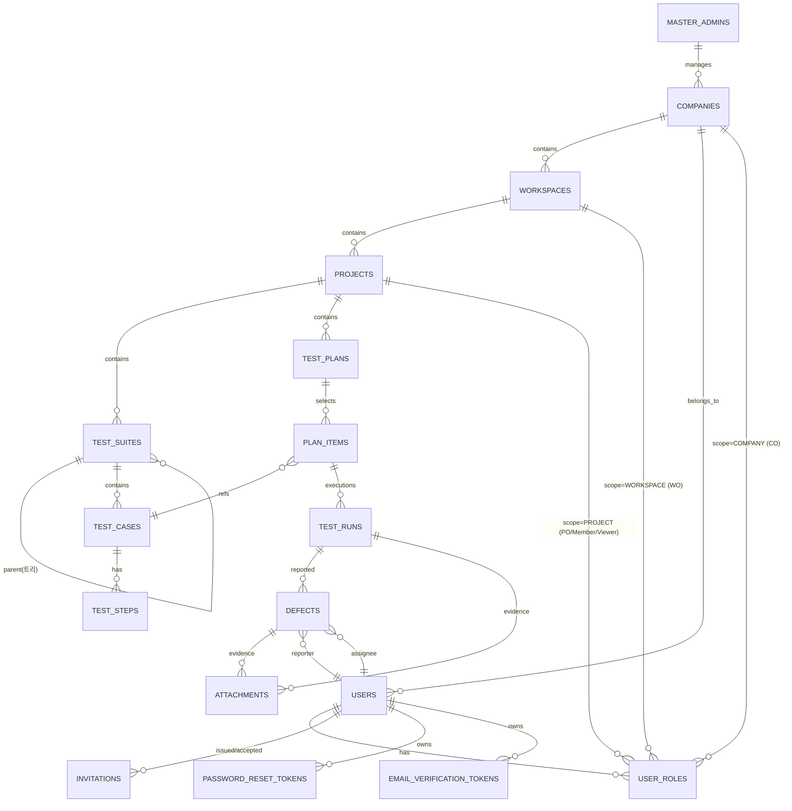
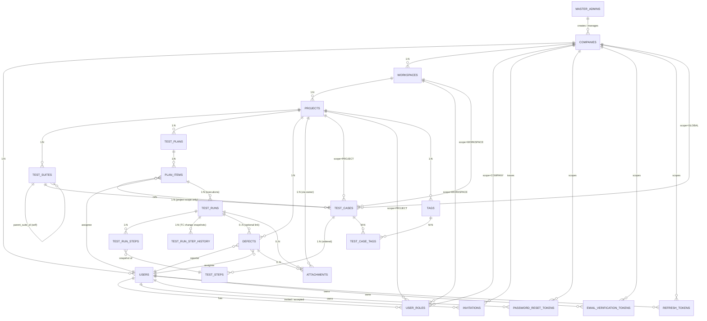

# TMS 명세 합본 (All Specs Bundle)

| 항목 | 내용 |
| --- | --- |
| 합본 생성일 | 2026-06-09 |
| 포함 문서 | 23개 (README, SRS, glossary, permissions, ERD, 디자인 시스템, Figma 마스터, Codes 통합, 12 features, 2 UX) |
| 정본 위치 | 각 원본 파일 — 본 합본은 검토·공유용 스냅샷 |
| 생성 도구 | `scripts/gen-all-specs.sh` (수동 편집 금지) |

> 본 문서는 `docs/` 하위 명세를 단일 파일로 합친 스냅샷이다. **편집 금지** — 변경은 원본에서 수행하고 `./scripts/gen-all-specs.sh` 재실행.

## 📑 목차

1. [features/README.md — 백로그·MVP 락 v2.2](#1-readme)
2. [srs.md — 시스템 요구사항 명세 v0.2](#2-srs)
3. [glossary.md — 용어 사전 v1.2](#3-glossary)
4. [permissions.md — 권한 매트릭스](#4-permissions)
5. [dba/erd.md — ERD 정본 (물리 스키마 P1)](#5-erd)
6. [design/00_design_system_v3.md — 디자인 시스템 v3 (정본)](#6-design)
7. [design/figma-master.md — Figma 마스터 매핑 (UI P1)](#7-figma)
8. [integration/codes.md — Codes/Metadata 통합 정본 (락 v2.4)](#8-codes)
9. [integration/error-code-mapping.md — BE ErrorCode ↔ FE i18n 키 매핑](#9-error-code-mapping)
10. [01-company.md — F-COMPANY](#10-company)
11. [02-workspace.md — F-WS](#11-workspace)
12. [03-authentication.md — F-AUTH](#12-auth)
13. [04-user.md — F-USER](#13-user)
14. [05-project.md — F-PROJ](#14-project)
15. [06-test-suite.md — F-TS](#15-suite)
16. [07-test-case.md — F-TC](#16-case)
17. [08-test-plan.md — F-PLAN](#17-plan)
18. [09-test-run.md — F-RUN](#18-run)
19. [10-defect.md — F-DEF](#19-defect)
20. [11-attachment.md — F-ATTACH](#20-attachment)
21. [12-report.md — F-REPORT](#21-report)
22. [_ux-user-detail.md — UX 회원관리 화면](#22-uxuser)
23. [_ux-role-matrix.md — UX Role 매트릭스 탭](#23-uxrole)


---

<a id="1-readme"></a>

# 1. 📄 README.md

_원본: `docs/features/README.md`_

# TMS 기능 정의서 (Functional Specifications)

TMS(Test Management System) 사이트의 **기능을 하나씩 정의·정리**하는 제품 사양 문서 모음입니다.
기능 정의서는 "무엇을/왜"(제품 관점)를 다루며, 구현 세부("어떻게")는 `docs/standards`의 backend/frontend/dba 정의서에 위임합니다.

- 작성 주체: **기능 기획자(Feature Planner) 에이전트** (`.claude/feature-planner/CLAUDE.md`)
- 시스템 전역 요구사항(NFR·ERD·IA·공통패턴): [`../srs.md`](../srs.md) — **기능 명세 횡단 규칙 정본**
- 용어 정본: [`../glossary.md`](../glossary.md) — 모든 기능 서술은 glossary 용어 사용
- 표준 정합: [`../standards/development-standard.md`](../standards/development-standard.md), backend(에러 코드·GET/POST·인증), test(수용 기준→테스트)
- 한 기능 = 한 파일, 템플릿: [`_template.md`](_template.md)
- 합본 스냅샷: [`../all-specs.md`](../all-specs.md) — 재생성 `./scripts/gen-all-specs.sh` (수동 편집 금지, pre-commit hook이 자동 갱신)

---

## 🎯 MVP 스코프 v2 (PM 락 2026-06-05 · 본문 락 2026-06-08)

- **대상**: 온프레미스 배포 + 멀티 Company 멀티테넌트 데이터 격리. 사내 1팀 데모 + 향후 다 고객사 확장 대비 (고객사별 온프레미스 인스턴스)
- **가치**: 엑셀 TC 관리 대체 + 경량 결함 트래킹 + 조직·권한 분리
- **시한**: 2026-07-31 데모 목표 (풀 스코프 추정 11~12주, 1~2주 이월 가능성 ⚠️)
- **인력**: BE 1, FE 1
- **목적**: 데모 시연 → Phase 2 운영 확장

### 3-tier 조직 격리 (정본)

```
Company (고객사, Master 관리)
  └─ Workspace (WO 관리, Company 내부 격리 단위)
       └─ Project (PO 관리, 테스트 자산 단위)
            └─ TestSuite / TestCase / TestPlan / TestRun / Defect / Attachment
```

- 데이터 격리키: `company_id`, `workspace_id`, `project_id` (테이블별 적용 범위는 dba-standard·SRS §4 참조)

### Role 6단 (정본)

| Role | Scope | 핵심 권한 |
|---|---|---|
| Master | 시스템 전역 | Company 생성·비활성, 전역 조회 |
| CO (Company Owner) | Company 1 | 사용자 초대·탈퇴·비번리셋·전체조회, WS 조회·비활성·소유자 이관, 사용자 Role 승격 (Company당 N명 가능) |
| WO (Workspace Owner) | Workspace N | WS 생성(무제한), CO가 Company 등록한 사용자를 WS에 초대, **본인 소유/멤버 WS 내 Project 생성·정보 수정·비활성** (컨테이너 한정, 내부 자산·멤버 초대는 별도 Role 필요 — permissions ★15) |
| PO (Project Owner) | Project N | 프로젝트 멤버 초대, Project·TC·TestRun CRUD |
| Member | Project N | Project·TC·TestRun 생성 (직접 생성해도 Member 유지) |
| Viewer | Project N | read-only (CO/PO가 Project 초대 시 기본 Role) |

> Role 부여 모델 = **(User × Scope) 다중 부여**. 한 사용자가 여러 WS/Project에서 서로 다른 Role 보유 가능.

### 회원가입 2경로 (정본)

| 경로 | 흐름 | 결과 |
|---|---|---|
| A. Master 등록 | Master가 Company + CO 동시 생성 → 임시비번 메일 발송 | CO 첫 로그인 시 비번 변경 강제 |
| B. CO 셀프 가입 | 가입 화면에서 이메일·비번·**회사명** 입력 → 이메일 인증 링크 클릭 | **신규 Company 자동 생성, 본인이 첫 CO** |
| C. 일반 사용자 초대 | CO/WO/PO가 이메일로 초대(1회용 토큰) → 초대 링크 → 비번 설정 → 가입 완료 | 초대 시점 Role + Scope 결정 |

> 인증 인프라: **SMTP 도입 필수**. 이메일 인증·초대 토큰·임시비번·비번리셋 모두 SMTP 의존.

## 📋 기능 백로그 v2 (Feature Backlog)

### MVP (12기능, 2026-07-31 목표)

| 순서 | ID | 기능 | 핵심 도메인(glossary) | 상태 | 문서 |
|----|----|------|------|------|------|
| 1 | F-COMPANY | 회사(Company) 관리 (Master·CO) | Company, Master | 확정 | [01-company.md](01-company.md) |
| 2 | F-WS | 워크스페이스 관리 (WO 생성·CO 비활성·소유자 이관·멤버 초대) | Workspace | 확정 | [02-workspace.md](02-workspace.md) |
| 3 | F-AUTH | 인증 (회원가입 2경로·로그인·초대 토큰·비번리셋) | User, Role | 확정 | [03-authentication.md](03-authentication.md) |
| 4 | F-USER | Company 사용자 관리 + Scope별 Role 부여 매트릭스 | User, Role, Permission | 확정 | [04-user.md](04-user.md) |
| 5 | F-PROJ | 프로젝트 관리 | Project | 확정 | [05-project.md](05-project.md) |
| 6 | F-TS | 테스트 스위트/폴더 트리 | TestSuite | 확정 | [06-test-suite.md](06-test-suite.md) |
| 7 | F-TC | 테스트 케이스 CRUD (스텝/기대결과/우선순위/태그) | TestCase, TestStep | 확정 | [07-test-case.md](07-test-case.md) |
| 8 | F-PLAN | 테스트 계획 (TC 선택·묶기·할당) | TestPlan, TestCycle | 확정 | [08-test-plan.md](08-test-plan.md) |
| 9 | F-RUN | 테스트 실행 결과 (Pass/Fail/Block/Skip) | TestRun, ExecutionResult | 확정 | [09-test-run.md](09-test-run.md) |
| 10 | F-DEF | 결함 관리 (리스트 + 상태 4종 + 담당자) | Defect, DefectStatus | 확정 | [10-defect.md](10-defect.md) |
| 11 | F-ATTACH | 첨부 (이미지 단일, 로컬 디스크) | Attachment | 확정 | [11-attachment.md](11-attachment.md) |
| 12 | F-REPORT | 최소 리포트 (Pass율, 결함카운트) | TestReport, PassRate | 확정 | [12-report.md](12-report.md) |

### 부속 UX 명세
| 문서 | 부속 기능 | 상태 |
|---|---|---|
| [_ux-user-detail.md](_ux-user-detail.md) | F-USER §5 전반 (회원 목록 + 사이드바 상세 + 초대 모달 + 액션 다이얼로그) | 확정 |
| [_ux-role-matrix.md](_ux-role-matrix.md) | F-USER §5.3 (CO Role 매트릭스 탭 — 사이드바 내부) | 확정 |

### Phase 2 (8월 이후, MVP 검증 후)

| ID | 기능 | 사유 |
|----|------|------|
| F-TC-VER | TC 버전·이력 | MVP에서는 단순 수정 추적만 |
| F-RELEASE | 릴리즈/버전 관리 | Project 내 단일 버전 필드로 대체 |
| F-SCN | 테스트 시나리오 | TC+Plan으로 우선 커버 |
| F-TRACE | 요구사항 추적성 (RTM) | 데모 범위 외 |
| F-COMMON | 댓글 · 태그 · 멘션 | Phase 2 |
| F-IMPORT | 엑셀 import/export | 초기 마이그 1회성 스크립트 대체 |
| F-NOTIFY | 알림 (메일/인앱) | MVP는 이메일 인증/초대 발송에 한정 |
| F-AUDIT | 감사 로그 | 운영 단계 필요 |
| F-SEARCH | 통합 검색 | 기본 목록 필터로 대체 |
| F-AUTOMATION | CI 자동화 결과 수집 | Phase 2 |
| F-DEFECT-LINK | Jira 등 외부 이슈 연동 | Phase 2 |
| F-BILLING | 회사 단위 과금/플랜 | 운영 단계 |
| F-CO-DASHBOARD | CO 전용 사용량/활동 대시보드 | 운영 단계 |

> 백로그는 PM 합의로 확장/조정. 기능 확정 시 상태·문서 링크·추적성(Requirement ID) 갱신.

## 🧭 상태 정의

| 상태 | 의미 |
|------|------|
| 정의 전 | 백로그 등록만 됨 |
| 정의 중 | 기능 정의서 작성 진행 중 |
| 검토 | 초안 완료, PM/관련 에이전트 리뷰 대기 |
| 확정 | 합의 완료, 구현/테스트 착수 가능 |
| 재작성 필요 | 이전 락(v1) 기반 작성 → v2 락 반영 필요 |

---

## 🔗 다운스트림 연계
- **QA**: 각 기능의 **수용 기준(AC)** → `test-standard` 규칙에 따라 TestCase로 전환
- **Backend/Frontend**: 흐름·입출력·규칙 → API(GET/POST)·화면 구현
- **DBA**: 3-tier 격리키(`company_id`/`workspace_id`/`project_id`)·인덱스·복합 유니크
- **추적성**: `REQ-<도메인>-NNN` → 기능 ↔ TestCase ↔ Defect (glossary §5 TraceabilityMatrix)

## 🗂 락 변경 이력

| 버전 | 일자 | 핵심 변경 |
|------|------|------|
| v1 | 2026-06-05 | 단일 조직 / Admin·Tester 2단 / Workspace Phase 2 / MVP 10기능 |
| v2 | 2026-06-05 | **3-tier 격리(Company→WS→Project) / Role 6단(Master·CO·WO·PO·Member·Viewer) / 회원가입 2경로 / SMTP 도입 / MVP 12기능 (F-COMPANY·F-WS 부활)** |
| v2.1 | 2026-06-08 | **WO Project 컨테이너 권한(★15) / Project `code` 도입(불변·Company unique) / `roles/sync` 단일 트랜잭션 / Figma 마스터·메타 retrofit / UI 표현 패턴 락(모달/사이드바/새화면) / F-USER 회원관리 UX 명세** |
| v2.2 | 2026-06-08 | **테스트 도메인 5룰 추가** — (1) 삭제 작성자 한정(Rule 1·★16) (2) TestRun 단계별 결과 + 자동 종료 + 소요시간(Rule 2) (3) TestCase Scope 3종(Global/Workspace/Project, Rule 3) (4·5) TC 변경 시 영향 Run UNTESTED + step 이력 + duration 보존. ExecutionResult 5종(UNTESTED 활성). TestRun status enum (IN_PROGRESS/COMPLETED). |
| v2.4 | 2026-06-08 | **Soft Enum 정책 + 디자이너 정본 통합**. (a) 모든 도메인 enum을 외부 metadata-service 진실원으로 전환(ERD CHECK 제거, `varchar(50)` + Code SDK validator). 정본 `docs/integration/codes.md`. (b) ExecutionResult **6종** (+ PENDING 활성). (c) Priority **3종** (Urgent 제거, 옵션 A). (d) 디자인 시스템 정본 `docs/design/00_design_system_v3.md` 채택 — 컬러/타이포/간격/레이아웃/앱 셸/Auth Layout/컴포넌트. (e) 모바일 지원 추가 (mobile <768 활성화). (f) z-index 토큰 스케일 정본화(`--z-modal` 200 / `--z-drawer` 150). (g) 라우트 `/bugs` → `/defects`, 토큰 `--bug-*` → `--defect-*`. (h) 디자이너 파일 TestFlow → TMS, Next.js 가정 제거. |
| v2.5 | 2026-06-08 | **본문 사인오프(Lock Confirmed)** — 12 feature + 2 UX 명세 본문 PM 검토 완료 → 상태 `검토 → 확정` 일괄 전환. 락 후 변경은 **RFC 절차** 필수 (이슈 → PM 승인 → PR → 다운스트림 알림). BE/FE/QA 구현 착수 가능. Figma 마스터의 node-id 91건 TBD는 별도 디자이너 작업 트랙. |
| v2.6 | 2026-06-08 | **성능 가드 보강** (P1 후속). (a) **Rule 4·5 비동기 큐 강제** — `@Async` 단순 호출 → **영속 작업 큐** + jobId 응답 + 진행 상태 조회 + 재시도/DLQ. SLO: TC update p95 < 300ms, 1000 Run / 5분 처리. (`docs/features/07-test-case.md` §5.4). (b) **N+1 가드 검증 의무화** — 모든 목록 API 통합 테스트에 쿼리 카운트 어설션 + p6spy 로컬 + CI 머지 차단 (`backend-coding-standard.md` §7.2). (c) **Cursor 페이지네이션 룰 신설** — TC/Run/Defect/Attachment/StepHistory는 cursor 전환, 작은 컬렉션(WS/Project/Suite tree 등)은 offset 유지. `size ≤ 100`, offset 상한 10000, OpenAPI 공통 파라미터·스키마 추가 (`backend-coding-standard.md` §4.7). |
| v2.7 | 2026-06-09 | **WS·Project 초대 정책 갱신**. (a) WO의 WS 초대 / PO의 Project 초대 시 신규 `user_roles` 행 **기본 Role = Member** (기존 Viewer 폐기). 단 `(user_id, scope_type, scope_id)` 행 이미 존재 시 **기존 Role 유지(INSERT ON CONFLICT DO NOTHING)** — CO 사전 부여 Role 보존. (b) Member·Viewer enum 적용 Scope 확장 — `WORKSPACE` + `PROJECT` 양쪽 부여 가능 (기존 PROJECT만). WS Scope Member는 진입·메뉴 가시까지(★19·★23), Project Scope Member는 자산 작업까지(★19). (c) Project Scope 사용자의 상위 WS 자동 가시(★22) / WS Scope Member의 하위 Project 자동 가시(★23). (d) ERD `user_roles` 변경 — CHECK 제약 확장, UNIQUE를 `(user_id, scope_type, scope_id)`로 강화(라디오 모델, _ux-role-matrix §3.2). (e) Role 카운트 표기 Scope suffix `(W)`/`(P)` 필수 (UX-USER §2.3, openapi.yaml UserListItem). |
| v2.8 | 2026-06-09 | **배포 형태 표현 통일 (온프레미스 정합)**. (a) `srs.md` §1.1 / `features/README.md` 본문의 "멀티 Company SaaS형" 표현 폐기 → **"온프레미스 배포 + 멀티 Company 멀티테넌트 데이터 격리"** 로 통일. 배포 형태(Docker Compose 단일 호스트, 단일 노드 HA X)와 데이터 모델(멀티테넌트)을 분리 명시. (b) 외부 SaaS 서비스가 아님을 명시 — 고객사 자체 인프라 설치, 고객사별 인스턴스 분리 운영. (c) 디자인 정본(`design/00_design_system_v3.md`: "한국형 온프레미스") 표현과 정합. 기능·권한·도메인 모델 변경 없음 (배포/대상 표기만 정정). (d) 메모리 `project_menu_rbac.md`(RBAC 하드코딩·설정 UI 없음 — 온프레미스) 와 정합 확인. (e) 루트 `/README.md` 신규 (공유용 1-pager) + `docs/{design,api,dba,integration}/README.md` 신규. |


---

<a id="2-srs"></a>

# 2. 📄 srs.md

_원본: `docs/srs.md`_

# TMS 시스템 요구사항 명세서 (SRS, Mini)

| 항목 | 내용 |
| --- | --- |
| 문서명 | TMS 시스템 요구사항 명세서 (Mini SRS) |
| 문서 버전 | v0.3 (PM 락 v2.8 반영 — 온프레미스 표현 통일) |
| 최초 작성일 | 2026-06-05 |
| 최종 개정일 | 2026-06-09 |
| 작성 주체 | PM (Project Manager) |
| 문서 등급 | 정본(正本) — 시스템 전역 요구사항(NFR·데이터모델 개요·IA·공통패턴)의 단일 출처 |
| 적용 범위 | Backend / Frontend / DBA / QA 전 영역 |
| 관련 문서 | [`glossary.md`](glossary.md) · [`standards/`](standards/README.md) · [`features/`](features/README.md) · [`permissions.md`](permissions.md) (권한 매트릭스 부록) |

> 본 문서는 풀 IEEE 830 SRS가 아닌 **MVP 한정 미니 SRS**다. 기능 명세(`docs/features/*`)에 반복되는 횡단 관심사(NFR·공통 데이터 모델·IA·공통 UX 패턴)를 한곳에 모아 **명세 중복·드리프트를 막는다.**
> 본 문서와 기능 명세가 충돌하면 **본 문서가 횡단 규칙에 한해 우선**한다. 기능별 규칙은 각 기능 명세가 우선한다.

---

## 1. 시스템 개요

### 1.1 목적
TMS(Test Management System) — **온프레미스 배포** 멀티 Company 멀티테넌트 테스트 관리 도구.
- 엑셀 기반 TC 관리 대체.
- 경량 결함 트래킹 (Jira 대체 최소 깊이).
- **3-tier 조직 격리(Company → Workspace → Project)** 와 **Role 6단(Master/CO/WO/PO/Member/Viewer)** 기반 멀티테넌트 권한 모델.
- **배포 형태**: 고객사 자체 인프라(Docker Compose 단일 호스트). 멀티 Company는 데이터 격리 모델이며 외부 SaaS 서비스가 아니다.

### 1.2 범위
- **MVP (12기능)**: F-COMPANY, F-WS, F-AUTH, F-USER, F-PROJ, F-TS, F-TC, F-PLAN, F-RUN, F-DEF, F-ATTACH, F-REPORT
- **제외(Phase 2)**: F-TC-VER, F-RELEASE, F-SCN, F-TRACE, F-COMMON, F-IMPORT, F-NOTIFY, F-AUDIT, F-SEARCH, F-AUTOMATION, F-DEFECT-LINK, F-BILLING, F-CO-DASHBOARD
- 상세 백로그: [`features/README.md`](features/README.md)

### 1.3 액터 (Role 6단)

| 액터 | Scope | 핵심 권한 |
| --- | --- | --- |
| Master | 시스템 전역 | Company 생성·비활성, 전역 조회, 시드 계정 |
| CO (Company Owner) | Company 1 | 사용자 초대·탈퇴·비번리셋·전체조회, WS 조회·비활성·소유자 이관, **사용자 Role 승격 권한(유일)** |
| WO (Workspace Owner) | Workspace N | WS 생성(무제한), 사용자를 WS에 초대, **본인 소유/멤버 WS 내 Project 생성·정보 수정·비활성** (컨테이너 한정, 내부 자산·멤버 초대는 별도 Role — `permissions.md` §4.3 ★15) |
| PO (Project Owner) | Project N | Project 멤버 초대, Project·TC·TestRun CRUD |
| Member | WS N + Project N | **WS·Project 초대 시 기본 Role** (락 v2.7). WS Scope = 진입·메뉴 가시·하위 Project 자동 가시(★23). Project Scope = TC·TestRun 생성 (Project 생성해도 Member 유지) |
| Viewer | WS N + Project N | read-only. **CO 강등 전용** (초대 기본 Role 아님). 해당 Scope 가시만 |

> Role 부여 모델 = **(User × Scope) 다중 부여**. 1 사용자가 여러 Scope에서 서로 다른 Role 보유 가능. 상세 매트릭스는 [`permissions.md`](permissions.md) 참조.

### 1.4 일정·인력
- **데드라인**: 2026-07-31 데모 시연 (오늘 2026-06-05 기준 ~8주)
- **인력**: BE 1, FE 1
- **추정 일정**: 풀 스코프 11~12주 ⚠️ **1~2주 이월 가능성 명시**. 명세 락 후 구현 일정 재산정.

---

## 2. 시스템 컨텍스트

### 2.1 외부 시스템
| 외부 시스템 | 용도 | 비고 |
| --- | --- | --- |
| SMTP | 이메일 인증·초대 토큰·임시비번·비번리셋 발송 | **필수 도입** (Mailtrap/Mailhog 데모, SendGrid 운영) |

> Jira·Slack·CI 등 그 외 연동은 Phase 2.

### 2.2 의존 인프라
| 구성요소 | 버전·선택 | 비고 |
| --- | --- | --- |
| Backend | Spring Boot 3.x / Java 21 (Corretto) | backend-standard §0 |
| Database | PostgreSQL 17 | 단일 인스턴스 |
| 캐시·세션 | **Redis** | F-AUTH Refresh Token 저장, 초대/리셋 토큰 1회용 키, Rate Limit 카운터 |
| Frontend | React + TypeScript | SPA |
| 첨부 저장소 | 로컬 디스크 (MVP) | S3는 Phase 2 |
| 배포 | Docker Compose 단일 호스트 | dev=demo 단일 환경 |
| SAST | Sparrow | backend §0/§10 |
| 메일 | SMTP(Mailtrap) | 데모용 캡처. 운영은 SendGrid/SES |

### 2.3 클라이언트 환경
| 항목 | 기준 |
| --- | --- |
| 브라우저 | Chrome 최신 1종 (데모 한정) |
| 화면 폭 | 1280px+ 데스크톱 (반응형 미지원) |
| 언어 | 한국어 단일 |

---

## 3. 비기능 요구사항 (NFR)

### 3.1 성능
| 항목 | 목표 |
| --- | --- |
| 동시 사용자 | 데모 최대 20명 (운영 확장 시 재산정) |
| API 응답(p95, 조회) | < 500ms (목록·상세) |
| API 응답(p95, 쓰기) | < 800ms |
| 첨부 업로드 | ≤ 10MB, 응답 < 3s |
| 이메일 발송 | 비동기, 응답에 영향 없음(큐/스레드) |
| 목록 페이지네이션 | 기본 size=20, max=100 |
| DB 인덱싱 | 격리키(`company_id`/`workspace_id`/`project_id`)·검색키·정렬키 필수 (dba-standard) |

### 3.2 보안
| 항목 | 정책 |
| --- | --- |
| 인증 | JWT **Access 30분 / Refresh 30일** (backend §8.2 풀스코프 복귀, 데모 자동 로그인 정책으로 7일 → 30일 연장) |
| 인가 | (User × Scope) 다중 Role 매칭. 요청 컨텍스트에서 현재 `companyId/workspaceId/projectId` 결정 후 권한 매트릭스 조회 ([`permissions.md`](permissions.md)) |
| 비밀번호 저장 | BCrypt 단방향 해시 (backend §8.3) |
| 비밀번호 정책 | 최소 8자, 영문+숫자+특수문자 1종 이상 |
| 전송 | TLS 권장 (사내 망 HTTP 허용, 운영 시 강제) |
| 민감정보 마스킹 | `passwordHash` 응답 직렬화 금지, 토큰 로그 마스킹 (backend §6.4) |
| 격리 (3-tier) | `company_id` → `workspace_id` → `project_id` 컬럼 보유 (각 테이블 범위는 §4.1). 교차 접근 차단(404 은닉) |
| 초대/리셋 토큰 | 1회용, 만료(24h), Redis 키 + 사용 시 즉시 삭제 |
| 이메일 인증 | 회원가입(셀프 경로 B) 시 필수. 미인증 계정 로그인 차단 |
| SAST | Sparrow 게이트 (backend §10) |
| 시크릿 | `.env` 파일 관리. SMTP 인증/JWT 시크릿 KMS는 Phase 2 |
| Rate Limit (로그인) | IP 기준 분당 10회 + 계정 기준 10회. 초과 시 429 |
| Rate Limit (메일 발송) | 동일 계정 5분당 3회 (재전송 남용 방지) |

### 3.3 가용성·백업
| 항목 | 정책 |
| --- | --- |
| 가용성 목표 | 데모 한정, SLA 없음 |
| 배포 토폴로지 | 단일 노드 (HA X) |
| DB 백업 | 데모 기간 일 1회 수동 `pg_dump` |
| 복구 목표 (RTO/RPO) | 비목표 (수동 복구) |
| 데이터 보존 | 데모 종료 시 일괄 삭제 가능 |

### 3.4 UX·접근성
| 항목 | 정책 |
| --- | --- |
| 디자인 시스템 | 기성 컴포넌트 1종 (FE 결정, W1 락) |
| 반응형 | 미지원 (데스크톱 1280+ 단일) |
| 접근성 | WCAG 미준수 (데모 한정) |
| 다국어 | 미지원 (한국어) |
| 다크모드 | 미지원 |
| 컨텍스트 스위처 | 헤더 좌측에 **Company / Workspace / Project 3단 셀렉터** (사용자가 속한 Scope만 표시) |

### 3.5 운영·배포
| 항목 | 정책 |
| --- | --- |
| 환경 | 단일 환경 (dev=demo) |
| 배포 방식 | Docker Compose (DB·Redis·SMTP·BE·FE) |
| 로깅 | 콘솔 + 파일 회전 (외부 수집 X), CorrelationId 포함 (backend §6.3) |
| 모니터링 | 없음 (데모) |
| CI/CD | 기본 빌드·테스트 파이프라인 1종 |
| 비동기 작업 | Spring `@Async` + 단일 스레드 풀 (이메일·집계). 큐 외부 도입은 Phase 2 |

---

## 4. 데이터 모델 개요

상세 스키마·인덱스는 `dba-standard.md`와 각 기능 명세를 따른다. 본 절은 **엔티티 관계 개요**, **공통 컬럼 정책**, **격리키 적용 범위**만 정의한다.

### 4.1 공통 컬럼 정책 + 격리키 적용 범위

| 컬럼 | 타입 | 정책 | 적용 |
| --- | --- | --- | --- |
| `id` | `bigint` | PK, sequence | 전 테이블 |
| `company_id` | `bigint` | NOT NULL, 인덱스 필수 | **Company를 제외한 모든 도메인 테이블** (Company는 본인 PK) |
| `workspace_id` | `bigint` | NOT NULL, 인덱스 필수 | Workspace 자체 + **Workspace 하위 도메인** (Project/Suite/TC/Plan/Run/Defect/Attachment) |
| `project_id` | `bigint` | NOT NULL, 인덱스 필수 | Project 자체 + **Project 하위 도메인** (Suite/TC/Plan/Run/Defect/Attachment) |
| `created_at` | `timestamp` | NOT NULL, JPA Auditing | 전 테이블 |
| `updated_at` | `timestamp` | NOT NULL, JPA Auditing | 전 테이블 |
| `created_by` | `bigint` | nullable, `users.id` 의미 FK | 전 테이블 |
| `updated_by` | `bigint` | nullable, `users.id` 의미 FK | 전 테이블 |
| `is_deleted` | `boolean` | DEFAULT FALSE, **물리삭제 금지/soft delete** (backend §7.3) | 전 도메인 테이블 |

> 전역 테이블 예외: `users`(자체 PK), `companies`(자체 PK), `master_admins`(시스템 시드) 등은 격리키 적용 X. backend §7.5 참조.
> `users.is_active`, `companies.is_active`, `workspaces.is_active`는 비활성화 플래그(별도 의미).
> 격리키 복합 인덱스 권장: `(company_id, workspace_id)`, `(workspace_id, project_id)`, 검색·정렬용 컬럼은 격리키 선두로 복합.

### 4.2 ERD 개요 (Mermaid)



### 4.3 엔티티 요약 (MVP)

| 엔티티 | 설명 | 본 SRS 키 필드(개요) | 격리키 |
| --- | --- | --- | --- |
| `master_admins` | 시스템 전역 관리자 (Master) | email, name, password_hash, is_active | 없음 |
| `companies` | 고객사(테넌트) | name, slug(unique), is_active, owner_user_id(주 CO, 이관 가능) | 본인 PK |
| `users` | 사용자 (Company에 1:N 소속) | company_id, email(`UNIQUE(company_id, email)`), name, password_hash, is_email_verified, is_active | company_id |
| `user_roles` | (User × Scope) Role 다중 부여 | user_id, scope_type(`COMPANY`/`WORKSPACE`/`PROJECT`), scope_id, role(`CO`/`WO`/`PO`/`MEMBER`/`VIEWER`), granted_by_user_id | company_id |
| `workspaces` | 워크스페이스 | name, owner_user_id(주 WO), is_active | company_id |
| `projects` | 프로젝트 | name, description, owner_user_id(주 PO), is_active | company_id, workspace_id |
| `test_suites` | 스위트 트리 | project_id, parent_suite_id, name, sort_order | company_id, workspace_id, project_id |
| `test_cases` | TC | **scope_type(`GLOBAL`/`WORKSPACE`/`PROJECT`)**, suite_id(Project Scope 전용·nullable), code(자동/수동), title, priority, precondition, expected_result | company_id 필수. workspace_id는 WS/PROJECT Scope, project_id는 PROJECT Scope만 NOT NULL |
| `test_steps` | TC 스텝 | test_case_id, step_order, action, expected_result | test_cases와 동일 격리 (상위 TC의 scope 따름) |
| `test_plans` | 테스트 계획 | project_id, name, milestone, status | company_id, workspace_id, project_id |
| `plan_items` | 플랜 ↔ TC | plan_id, test_case_id, assignee_user_id | company_id, workspace_id, project_id |
| `test_runs` | 실행 헤더 | plan_item_id, executed_by_user_id, **started_at**, **completed_at**(nullable), **duration_ms**, **status(`IN_PROGRESS`/`COMPLETED`)**, **result(집계 enum)**, environment | company_id, workspace_id, project_id |
| `test_run_steps` | 실행 단계별 결과 | run_id, test_step_id, result(`PASS`/`FAIL`/`BLOCKED`/`SKIPPED`/`UNTESTED`), actual_result, updated_at, updated_by_user_id | test_runs와 동일 격리 |
| `test_run_step_history` | TC 변경 이력 (Rule 4·5) | run_id, test_step_id, snapshot_action, snapshot_expected_result, changed_at, changed_by_user_id, reason | test_runs와 동일 격리 |
| `defects` | 결함 | test_run_id(nullable), project_id, title, description, status(enum), severity, priority, reporter_user_id, assignee_user_id | company_id, workspace_id, project_id |
| `attachments` | 첨부 | owner_type(`TEST_RUN`/`DEFECT`), owner_id, file_name, mime_type, size, storage_path | company_id, workspace_id, project_id |
| `invitations` | 초대 토큰 (CO/WO/PO 발급) | token(hash), email, scope_type, scope_id, role, expires_at, accepted_at | company_id |
| `password_reset_tokens` | 비번 리셋 토큰 | user_id, token(hash), expires_at, used_at | company_id |
| `email_verification_tokens` | 이메일 인증 토큰 (셀프 가입) | user_id, token(hash), expires_at, used_at | company_id |
| `refresh_tokens` | Refresh Token (Redis 권장, RDB 백업 선택) | user_id, token(hash), expires_at, revoked_at | company_id |

> `user_roles` 인덱스: `(user_id, scope_type, scope_id)`, `(scope_type, scope_id, role)`. 권한 매칭 핵심 경로.
> Enum 축약 (MVP):
> - `ExecutionResult` (glossary §3.1) 6종 중 MVP는 **5종**(`PASS/FAIL/BLOCKED/SKIPPED/UNTESTED`) — `UNTESTED`는 단계 미입력 초기 상태 + TestCase 변경 시 자동 재설정 상태. (`Retest` Phase 2)
> - **TestRun 자체 상태(집계) enum 신규**: `IN_PROGRESS`(모든 step 결과 미완) / `COMPLETED`(모든 step 결과 입력 완료, 자동 종료 시 `completed_at` 기록 — F-RUN 정본)
> - `DefectStatus` (glossary §4.3) 8종 중 MVP는 4종(`OPEN/IN_PROGRESS/RESOLVED/CLOSED`)
> - 위 축약은 각 기능 명세 §11 오픈이슈에 명시

### 4.4 격리 매칭 규칙

요청 처리 시 격리 검증 순서:

1. JWT 인증 → `userId` 확정
2. 요청 컨텍스트의 `companyId/workspaceId/projectId` 추출 (Path·헤더·세션)
3. `users.company_id == 요청 companyId` 검증 (불일치 시 404 은닉)
4. `user_roles` 조회로 해당 Scope의 Role 결정 (없으면 403)
5. 권한 매트릭스([`permissions.md`](permissions.md))로 액션 허용 여부 판정
6. 도메인 데이터는 격리키 자동 필터링(backend §7.5)

---

## 5. 정보 아키텍처 (IA)

### 5.0 디자인 정본 (Figma)
- **마스터 파일**: https://www.figma.com/design/5G8kNWGjSSPaG3OepCfU55/TMS?node-id=0-1&p=f&m=dev
- 각 기능 명세 §1 메타 표의 **Figma** 행에 frame node-id로 깊은 링크 추가(작업 진행 시).
- 디자인과 명세가 충돌 시 **명세가 권한·격리·에러·AC에 한해 우선**, **Figma는 시각·인터랙션·레이아웃에 한해 우선**.

### 5.1 사이트맵

```
공개(미인증)
├─ /login                          (F-AUTH 로그인)
├─ /signup                         (F-AUTH 셀프 가입: 회사명·이메일·비번)
├─ /verify-email?token=...         (F-AUTH 이메일 인증)
├─ /accept-invite?token=...        (F-AUTH 초대 수락: 비번 설정)
├─ /forgot-password                (F-AUTH 비번 리셋 요청)
└─ /reset-password?token=...       (F-AUTH 새 비번 설정)

Master 전용
└─ /master
   ├─ /companies                   (F-COMPANY 목록·생성·비활성)
   └─ /companies/:companyId        (F-COMPANY 상세)

인증 후 (Company 컨텍스트)
├─ /                               (대시보드 — Workspace 리스트)
├─ /workspaces                     (F-WS 목록·생성[WO])
│  └─ /workspaces/:workspaceId
│     ├─ /projects                 (F-PROJ 목록·생성[PO])
│     │  └─ /projects/:projectId
│     │     ├─ /suites             (F-TS 트리)
│     │     ├─ /test-cases         (F-TC 목록)
│     │     │  └─ /test-cases/:id  (F-TC 상세·편집)
│     │     ├─ /plans              (F-PLAN 목록)
│     │     │  └─ /plans/:planId   (F-PLAN 상세)
│     │     │     └─ /runs/:runId  (F-RUN 실행)
│     │     ├─ /defects            (F-DEF 목록·등록)
│     │     │  └─ /defects/:id     (F-DEF 상세)
│     │     ├─ /report             (F-REPORT)
│     │     └─ /members            (F-USER Project 멤버·Role 부여[PO])
│     └─ /members                  (F-USER Workspace 멤버 초대[WO])
├─ /company
│  ├─ /users                       (F-USER Company 사용자 목록 [CO])
│  │  └─ /users/:userId            (F-USER 사용자 상세 + Scope×Role 매트릭스 부여[CO])
│  └─ /settings                    (F-COMPANY 회사 정보, 소유자 이관[CO])
└─ /me                             (F-USER 본인 프로필·비번 변경)
```

### 5.2 화면 ↔ 기능 매핑

| 화면 | 주요 기능 | 접근 Role |
| --- | --- | --- |
| /login, /signup, /verify-email, /accept-invite, /forgot-password, /reset-password | F-AUTH | 미인증 |
| /master/companies | F-COMPANY | Master |
| / (대시보드) | F-WS(요약) + F-REPORT(요약) | 인증 모든 Role |
| /workspaces | F-WS | CO(목록·비활성), WO(생성) |
| /workspaces/:id/members | F-USER (WS 멤버 초대) | WO |
| /workspaces/:id/projects | F-PROJ | WO·PO(생성), 그 외(목록) |
| /projects/:id/suites | F-TS | PO/Member(편집), Viewer(read) |
| /projects/:id/test-cases | F-TC | PO/Member(편집), Viewer(read) |
| /projects/:id/plans | F-PLAN | PO(생성·할당), Member(생성), Viewer(read) |
| /projects/:id/runs/:runId | F-RUN, F-ATTACH | PO/Member(기록), Viewer(read) |
| /projects/:id/defects | F-DEF, F-ATTACH | PO/Member(등록·수정), Viewer(read) |
| /projects/:id/report | F-REPORT | 인증 모든 Role |
| /projects/:id/members | F-USER (Project 멤버 Role) | PO |
| /company/users | F-USER (Company 사용자 + Scope×Role 매트릭스) | CO |
| /company/settings | F-COMPANY (소유자 이관, 회사 정보) | CO |
| /me | F-USER (본인 프로필·비번) | 인증된 모든 Role |

### 5.3 네비게이션
- **전역 헤더**: 좌측 **Company / Workspace / Project 3단 셀렉터** (사용자가 멤버인 Scope만 노출). 우측 알림·사용자 메뉴(프로필/로그아웃, CO는 /company/users 진입, Master는 /master 진입)
- **좌측 사이드바(프로젝트 컨텍스트)**: Suites / TestCases / Plans / Defects / Report / Members
- **브레드크럼**: Company > Workspace > Project > 영역 > 상세
- **컨텍스트 강제 전환**: URL 직접 진입 시 헤더 셀렉터 자동 동기화

---

## 6. 공통 패턴 (Cross-cutting Patterns)

### 6.1 API 공통
| 항목 | 규칙 |
| --- | --- |
| HTTP 메서드 | **GET / POST 전용** (backend §4.2) |
| URI 명명 | kebab-case 복수형, `/api/v1/{resource}` (backend §1.8) |
| Scope 표현 | Path에 Scope 포함 권장: `/api/v1/workspaces/{wsId}/projects/{projId}/test-cases` |
| 응답 래퍼 | `success/code/message/data` (backend §4.5) |
| 에러 코드 | `{DOMAIN}_{상황}` UPPER_SNAKE_CASE (backend §5.2) |
| 페이지네이션 | `?page=0&size=20&sort=field,asc\|desc` (size max 100) |
| 검색 | `?q=keyword` (부분일치, 대상 필드는 기능별 명시) |
| 필터 | `?status=X&role=Y` (필드명=값, 다중은 콤마) |
| 날짜 | ISO 8601 + `Asia/Seoul` |

### 6.2 인증·인가 헤더
| 항목 | 규칙 |
| --- | --- |
| Authorization | `Bearer <AccessToken>` |
| 토큰 컨텍스트 | JWT 클레임에 `userId`, `companyId`, 그리고 컨텍스트 캐시(다중 Scope Role) 미포함. 서버가 매 요청 `user_roles` 조회 |
| 컨텍스트 전환 | 클라이언트가 명시적 Path/Query로 전달(`workspaceId`·`projectId`). 토큰 변경 없음 |
| Refresh | `POST /api/v1/auth/refresh` (Refresh Token) |

### 6.3 UI 공통
| 패턴 | 정책 |
| --- | --- |
| 에러 표시 | (1) 토스트(단순 메시지) (2) 인라인 필드 에러(검증 실패) |
| 로딩 | 영역별 스피너(전역 차단형 X) |
| 빈 상태 | 안내 텍스트 + 1차 CTA |
| 확인 다이얼로그 | 삭제·비활성화·리셋·실행 종료·소유자 이관 시 필수 |
| 폼 검증 | 클라이언트 즉시 검증 + 서버 검증 결과 인라인 매핑 |
| 날짜 표시 | `YYYY-MM-DD HH:mm` (Asia/Seoul) |
| 텍스트 길이 | 긴 텍스트는 말줄임 + 상세에서 전체 |
| 권한 미보유 화면 | 메뉴 자체 숨김 + URL 직접 진입 시 403 토스트 + 안전한 상위로 리다이렉트 |
| 초대 흐름 | 초대 발송 → "초대 메일 발송됨" 토스트. 초대 목록에서 재발송·취소 가능 |

#### 6.3.1 UI 표현 패턴 (Presentation Pattern, MVP 정본)

| 액션 | 표현 방식 | 적용 기능(예) |
| --- | --- | --- |
| 일반 CRUD (생성·상세·수정) | **모달 팝업** | F-COMPANY/WS/PROJ/PLAN/TC/DEF 등 |
| 테스트 실행 화면의 TC 상세·수정 | **사이드바(Drawer, 우측 슬라이드인)** | F-RUN |
| 회원가입 / 비밀번호 찾기·재설정 / 초대 수락 / 이메일 인증 | **새 화면(전체 페이지 라우팅)** | F-AUTH (`/signup`·`/forgot-password`·`/reset-password`·`/accept-invite`·`/verify-email`) |
| 회원관리(CO) — 회원 상세·수정·권한 매트릭스 | **사이드바(Drawer)** | F-USER (`_ux-role-matrix.md` 매트릭스 탭은 사이드바 내부에서 탭 전환) |
| 알림(알람) 내역 조회 | **사이드바(Drawer)** | (Phase 2 F-NOTIFY 도입 전 데모는 placeholder 사이드바) |

추가 룰:
- 모달 닫기 시 **변경 손실 경고** (편집 모드인 경우)
- 사이드바 폭 480~640px. 본문 dimming 없음(컨텍스트 유지)
- 모달·사이드바 **동시 열림 금지** (새 모달 열리면 기존 닫힘)
- 키보드 접근성: `Esc` 닫기, 포커스 트랩
- URL 직접 진입 호환: 모달 `?modal=...`, 사이드바 `?drawer=...&id=...` (새로고침 시 복원)
- 본 규칙과 충돌하는 기능 명세는 본 SRS 규칙이 우선. 충돌 발견 시 명세 갱신.

### 6.4 이메일 발송 패턴
| 항목 | 정책 |
| --- | --- |
| 발송 방식 | Spring `@Async` 비동기. 응답에 영향 없음 |
| 템플릿 | 단순 HTML 텍스트. 로고·이미지 없음(MVP) |
| 발신 주소 | `no-reply@<domain>` (데모 더미) |
| 재전송 | 사용자 액션 기반 (자동 재시도 X). Rate Limit 적용 |
| 데모 캡처 | Mailtrap/Mailhog로 캡처해 시연 |

### 6.5 검증·에러 매핑
- 입력 검증: 클라이언트(즉시) + 서버(권위) **이중**
- 서버 검증 실패 → 400 `COMMON_INVALID_INPUT` + 필드 오류 배열 → 클라이언트가 필드별 인라인 표시
- 도메인 규칙 위반(상태 전이·중복·잠금 방지 등) → 4xx + 기능별 `{DOMAIN}_*` 코드
- 권한 거부 → 403 `AUTH_FORBIDDEN` 또는 도메인 특화 코드(`USER_LAST_OWNER_FORBIDDEN` 등)

---

## 7. 추적성 (Traceability)

### 7.1 ID 명명
| 종류 | 형식 | 예 |
| --- | --- | --- |
| Requirement ID | `REQ-{DOMAIN}-NNN` | `REQ-USER-001` |
| Feature ID | `F-{DOMAIN}` | `F-USER` |
| Error Code | `{DOMAIN}_{상황}` | `USER_INVITE_TOKEN_EXPIRED` |
| Test Case ID | (QA 정의, test-standard) | — |

DOMAIN 표준값(MVP): `MASTER`, `COMPANY`, `WS`, `AUTH`, `USER`, `PROJ`, `TS`, `TC`, `PLAN`, `RUN`, `DEF`, `ATTACH`, `REPORT`. 공통은 `COMMON`.

### 7.2 추적 매트릭스
- 각 기능 명세 §10 "추적성" 표가 `REQ-*` ↔ 화면/API ↔ TestCase 1차 매핑
- QA가 `test-standard`에 따라 AC를 TestCase로 전환하며 ID를 채움
- 결함은 발견 시 TestRun을 통해 TestCase로 거꾸로 연결 (`Defects → TestRuns → PlanItems → TestCases`)

---

## 8. 가정·제약·리스크

### 8.1 가정
- 회원가입 경로 2종(Master 등록 / CO 셀프) 동시 운영. CO 셀프 가입 시 신규 Company 자동 생성, 본인이 첫 CO
- 1 Company - N CO 가능. 기존 CO가 다른 사용자 CO 승격 가능
- 1 사용자 - N Workspace 멤버 가능. WS·Project마다 서로 다른 Role 보유 가능
- Member가 Project 생성해도 Member 유지 (PO 자동 승격 X)
- SMTP 발송 인프라 가용 (데모: Mailtrap/Mailhog)

### 8.2 제약
- 8주 일정 + 인력 2명 → 풀스코프 추정 **11~12주**. 1~2주 이월 가능성
- 상용 디자인 시스템 사용 (자체 디자인 X). W1 1종 락
- 데모용 SMTP는 캡처 도구 사용. 운영 SMTP는 Phase 2

### 8.3 리스크
| 리스크 | 영향 | 대응 |
| --- | --- | --- |
| 인프라 셋업 지연(DB/Redis/SMTP) | 일정 전체 지연 | Docker Compose 템플릿 W1 내 락 |
| FE 컴포넌트 라이브러리 결정 지연 | UI 일관성·속도 저하 | W1 내 1종 확정 |
| 권한 매트릭스 누락·오류 | 전 기능에 보안/회귀 위험 | [`permissions.md`](permissions.md) 락 후 변경 시 매트릭스 우선 갱신 |
| 셀프 가입 시 회사명 충돌 | UX 혼란/스팸 가입 | `companies.slug` UNIQUE + 이메일 인증 게이트 |
| 토큰 보안(초대·리셋) 누수 | 계정 탈취 | 1회용·만료·해시 저장·Redis 즉시 폐기 |
| 일정 이월 | 데모 시점 위험 | 명세 락 후 구현 일정 재산정, 컷 후보 사전 합의 |

### 8.4 컷 후보 (일정 압박 시)
- F-REPORT를 정적 차트 2종으로 컷
- F-ATTACH를 1파일 1KB 제한 + 이미지만으로 컷
- F-DEF 상태 4종 유지(이미 컷)
- TC import/export 미도입 유지
- 권한 매트릭스 UI는 CO 단일 화면 1개로 컷(다중 화면 X)

---

## 9. 변경 이력

| 버전 | 일자 | 변경 내용 | 작성자 |
| --- | --- | --- | --- |
| v0.1 | 2026-06-05 | 최초 초안. 단일 조직/Admin·Tester 2단/Workspace Phase 2 | PM 에이전트 |
| v0.2 | 2026-06-05 | **PM 락 v2 반영**. ① 3-tier 격리(Company→WS→Project) 도입 ② Role 6단(Master/CO/WO/PO/Member/Viewer)·(User×Scope) 다중 부여 모델 ③ 회원가입 2경로(Master 등록 / CO 셀프) + SMTP 인증 인프라 ④ 인증 풀스코프(JWT Access/Refresh + Redis + 초대·리셋·이메일 인증 토큰) ⑤ 공통 컬럼·격리키 (`company_id`/`workspace_id`/`project_id`) ⑥ ERD 확장(users/user_roles/companies/workspaces/invitations/*_tokens 추가) ⑦ IA 갱신(컨텍스트 스위처·Master/공개 화면) ⑧ DOMAIN 표준값에 `MASTER`/`COMPANY`/`WS` 추가 ⑨ 일정 추정 11~12주, 1~2주 이월 가능성 명시 ⑩ MVP 12기능으로 갱신 | PM 에이전트 |


---

<a id="3-glossary"></a>

# 3. 📄 glossary.md

_원본: `docs/glossary.md`_

# TMS 공통 용어 사전 (Glossary / Ubiquitous Language)

| 항목 | 내용 |
| --- | --- |
| 문서명 | TMS 공통 용어 사전 (Glossary / Ubiquitous Language) |
| 문서 버전 | v1.2 |
| 최초 작성일 | 2026-06-02 |
| 최종 개정일 | 2026-06-05 |
| 작성 주체 | PM (Project Manager) 에이전트 |
| 문서 등급 | 정본(正本, Single Source of Truth) — 도메인 용어 표준 |
| 적용 범위 | Backend / Frontend / QA 전 영역 |
| 관리 원칙 | 한/영 1:1 매핑, 영어 표준은 PascalCase 명사 정본, 변형 표기는 각 L1 정의서의 변환 규칙을 따름 |

> 본 문서는 TMS(Test Management System, **테스트 관리 도구**) 프로젝트의 **도메인 공통 용어 사전(Ubiquitous Language)의 정본**입니다.
> 백엔드 클래스명/DB 식별자/API 경로, 프론트엔드 컴포넌트명/모델명, QA 테스트 명세가 **모두 동일한 용어**를 사용하도록 통일하는 것이 목적입니다.
> 본 문서는 코드 구현을 포함하지 않으며, 용어의 한국어·영어 표준·약어·정의만을 규정합니다.

---

## 1. 거버넌스 및 관계 (Governance & Relationship)

### 1.1 development-standard.md 3.3과의 관계

- `docs/standards/development-standard.md`의 **3.3 공통 용어 사전(Ubiquitous Language)** 절은 시드(seed) 용어(TestCase, TestSuite, TestRun, Defect, User)만 제시하며, **전체 용어의 정본은 본 문서(`docs/glossary.md`)**임을 명시합니다.
- 두 문서 사이에 불일치가 발생하면 **본 문서(glossary.md)가 도메인 용어에 한하여 우선**합니다. (개발 표준의 다른 절은 그대로 L0 기준 문서가 우선합니다.)
- L1 정의서(backend / frontend / qa)의 도메인 용어는 모두 본 문서를 참조해야 합니다.

### 1.2 용어 추가/변경 거버넌스

| 원칙 | 내용 |
| --- | --- |
| PM 합의 필수 | 신규 용어 추가, 기존 용어의 한/영 매핑 변경, 약어 신설/폐지는 **반드시 PM 합의를 거친다.** 임의 추가 금지 |
| 변경 절차 | L1 작성 중 누락/모호 용어 발견 시 임의 정의하지 말고 PM에게 등록/명확화를 요청한다 |
| 1:1 매핑 | 하나의 한국어 개념은 하나의 영어 표준에만 매핑한다. 동의어 난립을 금지한다 |
| 약어 정책 | 약어는 본 사전에 등록된 것만 사용한다. 임의 축약 금지 (development-standard.md 3.2 준수) |
| 변경 이력 | 모든 변경은 본 문서 말미의 변경 이력 표에 기록한다 |

### 1.3 표기 변환 규칙 (정본 → 영역별 변형)

본 문서의 영어 표준 용어는 **PascalCase 명사**를 정본으로 삼습니다. 영역별 실제 표기 변형(snake_case, kebab-case, camelCase 등)은 **각 L1 정의서의 변환 규칙**을 따릅니다. 아래는 원칙 예시이며 최종 규칙은 L1에서 확정합니다.

| 사용 위치 | 표기 규칙(예시) | `TestCase` 적용 예 |
| --- | --- | --- |
| 정본(본 문서) | PascalCase 명사 | `TestCase` |
| 백엔드 클래스/타입 | PascalCase | `TestCase` |
| 백엔드 변수/필드 | camelCase | `testCase` |
| DB 테이블/컬럼 | snake_case | `test_case` |
| API 경로(URI) | kebab-case 복수형 | `/test-cases` |
| 프론트 컴포넌트 | PascalCase | `TestCaseList` |
| QA 테스트 명세 | 정본 용어 그대로 참조 | `TestCase` |

> 위 변환 규칙의 구체 확정(예: 식별자 접미어 `Id` vs `ID`, 복수형 처리)은 각 L1 정의서가 정합니다. 본 문서는 **의미 단위 용어**만 정본으로 제공합니다.

---

## 2. 테스트 설계 (Test Design)

| 한국어 | 영어 표준 | 약어 | 정의/설명 |
| --- | --- | --- | --- |
| 테스트 케이스 | TestCase | TC | 특정 기능/조건을 검증하기 위한 최소 단위 명세. 사전조건, 테스트 스텝, 기대 결과로 구성된다. 테스트 자산의 기본 단위 |
| 테스트 스위트 | TestSuite | - | 관련 테스트 케이스를 논리적으로 묶은 그룹. 폴더/모듈 단위로 케이스를 조직화한다 |
| 테스트 시나리오 | TestScenario | - | 하나 이상의 테스트 케이스를 사용자 흐름/업무 흐름 순서로 엮은 검증 흐름. 케이스보다 상위의 행위 단위 |
| 테스트 스텝 | TestStep | - | 테스트 케이스를 구성하는 개별 실행 단계. 순번(order), 수행 동작(action), 단계별 기대 결과를 가진다 |
| 사전조건 | Precondition | - | 테스트 케이스를 실행하기 전에 충족되어야 하는 상태/조건 (예: 로그인 상태, 특정 데이터 존재) |
| 기대 결과 | ExpectedResult | - | 테스트 스텝/케이스 수행 후 나타나야 하는 정상 결과. 실제 결과(ActualResult)와 비교하여 Pass/Fail을 판정한다 |
| 실제 결과 | ActualResult | - | 테스트 실행 시 실제로 관측된 결과. 기대 결과와의 차이가 결함 후보가 된다 |
| 테스트 데이터 | TestData | - | 테스트 실행에 필요한 입력값/데이터 셋. 케이스나 스텝에 연결되어 재현성을 보장한다 |

---

## 3. 테스트 계획 / 실행 (Test Planning & Execution)

| 한국어 | 영어 표준 | 약어 | 정의/설명 |
| --- | --- | --- | --- |
| 테스트 계획 | TestPlan | - | 특정 릴리스/스프린트의 테스트 범위, 일정, 대상 스위트, 담당자, 목표를 정의하는 상위 계획 문서 |
| 테스트 사이클 | TestCycle | - | 테스트 계획 내에서 한 회차의 실행 주기. 동일 케이스 집합을 회귀(regression) 등으로 반복 실행하는 단위 |
| 테스트 실행(런) | TestRun | - | 테스트 케이스(또는 스위트)를 실제로 한 번 수행한 실행 기록. 실행 결과/실행자/실행 시각/환경을 포함한다 |
| 실행 결과 | ExecutionResult | - | 단일 테스트 실행의 판정 상태. 허용 값은 아래 [3.1 ExecutionResult 상태값] 참조 |
| 테스트 환경 | TestEnvironment | ENV | 테스트가 수행되는 대상 환경(예: dev, staging, prod, 브라우저/OS 조합). 결과 해석의 맥락을 제공한다 |
| 마일스톤 | Milestone | - | 테스트 활동이 연계되는 릴리스/일정 기준점 (예: 릴리스 버전, 스프린트 종료일) |

### 3.1 ExecutionResult 상태값 (enum)

| 상태값 | 한국어 | 의미 |
| --- | --- | --- |
| Pass | 통과 | 기대 결과와 실제 결과가 일치하여 검증에 성공함 |
| Fail | 실패 | 기대 결과와 실제 결과가 불일치함 (결함 등록 대상) |
| Blocked | 차단됨 | 사전조건 미충족/선행 결함 등으로 실행 자체가 불가함 |
| Skipped | 건너뜀 | 범위 제외/비해당으로 의도적으로 실행하지 않음 |
| Untested | 미실행 | 아직 실행되지 않은 초기 상태. **MVP 활성** (단계 미입력 초기 + TestCase 변경 시 자동 재설정) |
| Retest | 재테스트 | 결함 수정 등으로 재실행이 필요한 상태. (Phase 2) |

---

## 4. 결함 관리 (Defect Management)

| 한국어 | 영어 표준 | 약어 | 정의/설명 |
| --- | --- | --- | --- |
| 결함 | Defect | - | 테스트 실행 중 발견된 기대 동작과의 불일치(버그). `Bug`와 동의이나 정본 용어는 `Defect`로 통일한다 |
| 심각도 | Severity | - | 결함이 시스템/품질에 미치는 영향의 크기. 허용 값은 아래 [4.1 Severity 상태값] 참조 |
| 우선순위 | Priority | - | 결함을 처리해야 하는 시급성. 허용 값은 아래 [4.2 Priority 상태값] 참조 |
| 결함 상태 | DefectStatus | - | 결함 처리 진행 상태. 허용 값은 아래 [4.3 DefectStatus 상태값] 참조 |
| 재현 절차 | ReproductionSteps | - | 결함을 동일하게 재현하기 위한 단계별 절차. 환경/테스트 데이터/입력을 포함한다 |
| 결함 보고자 | Reporter | - | 결함을 등록한 사용자 |
| 결함 담당자 | Assignee | - | 결함 수정을 배정받은 사용자 |
| 해결 방법 | Resolution | - | 결함의 종결 방식 (예: Fixed, Won't Fix, Duplicate, Cannot Reproduce, As Designed) |

### 4.1 Severity 상태값 (enum)

| 상태값 | 한국어 | 의미 |
| --- | --- | --- |
| Critical | 치명적 | 시스템 중단/데이터 손실 등 핵심 기능 사용 불가 |
| Major | 중대 | 주요 기능 장애이나 우회 방법이 제한적 |
| Minor | 경미 | 부가 기능 결함, 우회 가능 |
| Trivial | 사소 | 오타/UI 정렬 등 영향이 미미함 |

### 4.2 Priority 상태값 (enum)

| 상태값 | 한국어 | 의미 |
| --- | --- | --- |
| Urgent | 긴급 | 즉시 처리 필요 |
| High | 높음 | 우선 처리 대상 |
| Medium | 보통 | 일반 처리 |
| Low | 낮음 | 여유 시 처리 |

### 4.3 DefectStatus 상태값 (enum)

| 상태값 | 한국어 | 의미 |
| --- | --- | --- |
| New | 신규 | 등록되었으나 아직 검토되지 않음 |
| Open | 열림 | 검토 완료, 처리 대상으로 확정됨 |
| InProgress | 진행 중 | 담당자가 수정 작업 중 |
| Fixed | 수정됨 | 수정 완료, 검증 대기 |
| Verified | 검증됨 | 재테스트로 수정이 확인됨 |
| Closed | 종료 | 처리가 완전히 종결됨 |
| Reopened | 재오픈 | 종결되었으나 재발하여 다시 열림 |
| Rejected | 반려 | 결함이 아님/중복 등으로 처리하지 않음 |

---

## 5. 추적성 / 리포팅 (Traceability & Reporting)

| 한국어 | 영어 표준 | 약어 | 정의/설명 |
| --- | --- | --- | --- |
| 요구사항 | Requirement | REQ | 테스트가 검증해야 하는 기능/품질 요구사항. 테스트 케이스와 연결되어 추적성을 형성한다 |
| 추적성 매트릭스 | TraceabilityMatrix | RTM | 요구사항 ↔ 테스트 케이스 ↔ 결함 간 연결 관계를 행렬로 표현한 추적 자료 (Requirement Traceability Matrix) |
| 커버리지 | Coverage | - | 요구사항/기능 대비 테스트가 얼마나 검증하고 있는지의 비율. 요구사항 커버리지, 테스트 실행 커버리지 등을 포함 |
| 테스트 리포트 | TestReport | - | 테스트 계획/사이클의 실행 현황·결과·결함 통계를 집계한 보고 산출물 |
| 대시보드 | Dashboard | - | 테스트 진척/통과율/결함 추이 등 핵심 지표를 시각화한 화면 |
| 통과율 | PassRate | - | 전체 실행 대비 Pass 결과의 비율. 품질 지표의 핵심 값 |

---

## 6. 조직 / 공통 (Organization & Common)

| 한국어 | 영어 표준 | 약어 | 정의/설명 |
| --- | --- | --- | --- |
| 회사 | Company | - | **데이터 격리의 최상위 경계(테넌트)**. 하나의 Company는 여러 Workspace를 포함하며, 모든 도메인 데이터는 Company 단위로 1차 분리된다(공유 스키마 + `company_id`). 서로 다른 Company 간 데이터 접근은 금지된다 |
| 워크스페이스 | Workspace | WS | **Company 내부의 격리 중간 단위**. 하나의 Workspace는 여러 Project를 포함하며, 공유 스키마 + `workspace_id`로 격리된다 |
| 프로젝트 | Project | - | Workspace에 속하며, 테스트 자산(스위트/케이스/계획/결함)을 담는 작업 공간 단위. `project_id`로 격리 |
| 사용자 | User | - | 시스템에 인증되어 활동하는 주체. Company에 1:N 소속. 역할(Role)에 따라 권한이 달라진다 |
| 마스터 | Master | - | **시스템 전역 관리자**. Company 생성·비활성 권한 보유. `master_admins` 별도 테이블로 관리 |
| 역할 | Role | - | 사용자에게 부여되는 권한 집합. (User × Scope) 다중 부여 모델. 인가의 기준 |
| 권한 | Permission | - | 특정 기능/리소스에 대한 수행 가능 행위. 역할에 묶여 부여된다. 매트릭스 정본은 [`permissions.md`](permissions.md) |
| 라벨/태그 | Tag | - | 테스트 자산을 분류/필터링하기 위한 자유 키워드. 다대다로 부여 가능 |
| 첨부 | Attachment | - | 케이스/결함/실행 기록에 연결되는 파일(스크린샷, 로그 등) |
| 댓글 | Comment | - | 케이스/결함 등에 대한 협업용 의견/논의 기록 |
| 식별자 | Id | - | 엔티티를 유일하게 식별하는 값. 표기 변형(`~Id` 접미어 등)은 L1 규칙을 따른다 |

### 6.1 Role 표준값 (enum, v1.2)

3-tier 격리(Company → Workspace → Project)에 대응하는 6단 Role. **(User × Scope) 다중 부여** 모델.

| 상태값 | 한국어 | Scope | 의미 |
| --- | --- | --- | --- |
| Master | 마스터 | SYSTEM | 시스템 전역 관리자. Company 생성·비활성 |
| CO | 회사 관리자 | COMPANY | Company 1개의 관리자(Company Owner). 사용자 초대·탈퇴·비번리셋·전체조회, WS 비활성·소유자 이관, **사용자 Role 승격 권한(유일)**. Company당 N명 가능 |
| WO | 워크스페이스 관리자 | WORKSPACE | Workspace Owner. WS 생성(무제한), CO가 등록한 사용자를 WS에 초대, **본인 소유/멤버 WS 내 Project 생성·정보 수정·비활성** (컨테이너 한정, 내부 자산·멤버 초대는 별도 PO/Member Role 필요 — `permissions.md` §4.3 ★15) |
| PO | 프로젝트 관리자 | PROJECT | Project Owner. Project 멤버 초대, Project·TC·TestRun CRUD |
| Member | 멤버 | WORKSPACE + PROJECT | WS·Project 초대 시 기본 Role. WS Scope = 진입·메뉴 가시, Project Scope = 자산 생성·편집(생성해도 Member 유지) |
| Viewer | 뷰어 | WORKSPACE + PROJECT | CO 강등 전용 (초대 기본 Role 아님). 해당 Scope read-only |

> 권한 매트릭스(Action × Role)의 정본은 [`permissions.md`](permissions.md)이며, 본 표는 **용어와 Scope 매핑**만 정의한다. `user_roles` 테이블은 다형성 `(user_id, scope_type, scope_id)` 단일 행 라디오 모델 (락 v2.7).

---

## 부록 A. 동의어/금지어 정리

용어 난립을 막기 위해 동일 개념의 대체 표현을 정본으로 통일한다.

| 정본(사용) | 금지/대체될 표현 | 비고 |
| --- | --- | --- |
| Defect | Bug, Issue, Error | 결함의 정본은 `Defect`. 코드/UI/명세에서 통일 |
| TestRun | Execution, RunResult | 단일 실행 기록은 `TestRun` |
| TestCase | Testcase, Case, TC(축약 단독 사용) | 정본은 `TestCase`, 약어 `TC`는 등록된 맥락에서만 |
| ExpectedResult | Expected, Result(단독) | 기대 결과는 `ExpectedResult` |
| Assignee | Owner, Handler | 결함 담당자는 `Assignee` |

## 부록 B. 카테고리 요약

| 카테고리 | 정의된 용어 수 | 비고 |
| --- | --- | --- |
| 2. 테스트 설계 | 8 | TestCase, TestSuite, TestScenario, TestStep, Precondition, ExpectedResult, ActualResult, TestData |
| 3. 테스트 계획/실행 | 6 (+ ExecutionResult enum 6) | TestPlan, TestCycle, TestRun, ExecutionResult, TestEnvironment, Milestone |
| 4. 결함 관리 | 8 (+ Severity 4 / Priority 4 / DefectStatus 8 enum) | Defect, Severity, Priority, DefectStatus, ReproductionSteps, Reporter, Assignee, Resolution |
| 5. 추적성/리포팅 | 6 | Requirement, TraceabilityMatrix, Coverage, TestReport, Dashboard, PassRate |
| 6. 조직/공통 | 9 (+ Role enum 4) | Workspace, Project, User, Role, Permission, Tag, Attachment, Comment, Id |

## 부록 C. 문서 변경 이력

| 버전 | 일자 | 변경 내용 | 작성자 |
| --- | --- | --- | --- |
| v1.0 | 2026-06-02 | 최초 작성. 5개 카테고리 36개 용어 + 상태값 enum(ExecutionResult/Severity/Priority/DefectStatus/Role) 정의 | PM 에이전트 |
| v1.1 | 2026-06-03 | §6 조직/공통에 **Workspace(워크스페이스)** 용어 추가 — 데이터 격리 최상위 경계(공유 스키마 + `workspace_id`), Project는 Workspace에 속하도록 정의 수정 | PM 에이전트 |
| v1.2 | 2026-06-05 | **PM 락 v2 반영(3-tier 격리)**. ① §6에 **Company(회사)** 신규 추가 — 데이터 격리 최상위 경계(테넌트). Workspace는 Company 하위로 격하. ② §6에 **Master(마스터)** 추가 — 시스템 전역 관리자. ③ §6.1 **Role enum 6단으로 전면 교체** (Admin/Manager/Tester/Viewer → Master/CO/WO/PO/Member/Viewer), Scope 매핑 표 추가, (User × Scope) 다중 부여 모델 명시. ④ Role/Permission 정의에 `permissions.md` 매트릭스 정본 링크. 부록 B 카테고리 요약 갱신 필요(차기 갱신) | PM 에이전트 |


---

<a id="4-permissions"></a>

# 4. 📄 permissions.md

_원본: `docs/permissions.md`_

# TMS 권한 매트릭스 (Permission Matrix)

| 항목 | 내용 |
| --- | --- |
| 문서명 | TMS 권한 매트릭스 부록 |
| 문서 버전 | v0.2 |
| 작성일 | 2026-06-05 (최종 갱신 2026-06-09) |
| 작성 주체 | PM |
| 문서 등급 | 정본 — Role × Action × Scope 권한 정본 |
| 적용 범위 | Backend(`@PreAuthorize`/서비스 권한 분기), Frontend(메뉴/버튼 표시), QA(AC 권한 케이스) |
| Figma | https://www.figma.com/design/5G8kNWGjSSPaG3OepCfU55/TMS?node-id=0-1&p=f&m=dev |
| 부모 문서 | [`srs.md`](srs.md) §1.3, §3.2, §4.4 |

> 본 문서는 SRS의 권한 모델을 **Action 단위 매트릭스**로 구체화한다. 기능 명세(`features/*`)와 충돌 시 본 문서가 권한 정의에 한해 우선한다.

---

## 1. 권한 부여 모델

- **(User × Scope) 다중 부여**. 한 사용자는 여러 Scope에서 서로 다른 Role을 동시 보유한다.
- **부여자 단일**: 일반 사용자(WO/PO/Member/Viewer)의 Role 부여·승격은 **CO만 가능**. WO/PO는 멤버 초대(Scope 진입)만 가능하며, CO가 부여한 Role이 있으면 그대로 유지된다.
  - WO의 WS 멤버 초대 시 기본 Role은 **Member** (CO가 해당 Scope에 사전 부여한 Role이 없을 때). CO가 이미 부여한 Role이 있으면 그 Role 유지.
  - PO의 Project 멤버 초대 시 기본 Role은 **Member** (CO가 해당 Scope에 사전 부여한 Role이 없을 때). CO가 이미 부여한 Role이 있으면 그 Role 유지.
- **Master는 사용자 Role 부여 불가**. 시스템 전역 작업(Company 생성/비활성)만 가능.

## 2. Scope 정의

| Scope | 부여 단위 | 식별 |
| --- | --- | --- |
| SYSTEM | 시스템 전역 | (없음) |
| COMPANY | 단일 Company | `company_id` |
| WORKSPACE | 단일 Workspace | `(company_id, workspace_id)` |
| PROJECT | 단일 Project | `(company_id, workspace_id, project_id)` |

> `user_roles.scope_type` enum: `COMPANY`/`WORKSPACE`/`PROJECT`. `SYSTEM`은 `master_admins` 테이블 소속으로 표현(별도 `user_roles` 행 없음).

## 3. Role 정의

| Role | 적용 Scope | 한 사용자가 동시 보유 개수 | 비고 |
| --- | --- | --- | --- |
| Master | SYSTEM | 1 (시스템 전역) | `master_admins` 테이블 |
| CO | COMPANY | 1 (본인 소속 Company) | Company당 N명 |
| WO | WORKSPACE | N (여러 WS에서 각각 WO 가능) | CO 승격으로만 부여 |
| PO | PROJECT | N | CO 승격으로만 부여 |
| Member | WORKSPACE + PROJECT | N | WS·Project 초대 시 기본 Role. Project 생성해도 Member 유지 |
| Viewer | WORKSPACE + PROJECT | N | CO 부여 전용 (Member에서 강등 시). 초대 기본 Role 아님 |

> **상위 Scope의 Role은 하위 Scope의 권한을 포함하지 않는다.** 예: CO는 자동으로 WO·PO가 아니다(별도 `user_roles` 행 필요). 단, CO는 Role **부여 권한**과 **조회 권한**을 가진다(§4 매트릭스).

## 4. 권한 매트릭스 (Action × Role)

`✓` = 허용 / `-` = 불가 / `★` = 조건부 (조건은 §5 명시)

### 4.1 시스템 / Company

| Action | Master | CO | WO | PO | Member | Viewer |
| --- | --- | --- | --- | --- | --- | --- |
| Company 생성 (Master 등록 경로) | ✓ | - | - | - | - | - |
| Company 생성 (셀프 가입 경로) | - | ★1 | - | - | - | - |
| Company 비활성/활성 | ✓ | - | - | - | - | - |
| 전역 Company 목록 조회 | ✓ | - | - | - | - | - |
| 본인 Company 정보 조회 | ✓ | ✓ | ✓ | ✓ | ✓ | ✓ |
| 본인 Company 정보 수정(이름·slug 등) | - | ✓ | - | - | - | - |
| Company 소유자 이관(주 CO 변경) | - | ✓ ★2 | - | - | - | - |
| 다른 사용자에게 CO 권한 부여 | - | ✓ | - | - | - | - |
| 본인 Company 내 사용자 전체 조회 | - | ✓ | - | - | - | - |

★1: 셀프 가입 시 신규 Company 자동 생성, 본인이 첫 CO. 회원가입 동작이므로 "권한"이라기보다 흐름.
★2: 자기 자신이 마지막 CO인 경우 이관 후에야 본인 CO 권한 해제 가능. **마지막 CO 비활성/탈퇴 불가**.

### 4.2 Workspace

> **본 절 Member·Viewer 컬럼 = WORKSPACE Scope 부여 기준** (`(userId, WORKSPACE, wsId, Member|Viewer)` 행 보유자). Project Scope만 보유한 사용자(PO/Member(Proj)/Viewer(Proj))의 상위 WS 가시는 ★22 참조.

| Action | Master | CO | WO | Member(WS) | Viewer(WS) |
| --- | --- | --- | --- | --- | --- |
| WS 생성 | - | - | ✓ | - | - |
| Company 내 WS 목록 조회 | ✓ ★3 | ✓ | ✓ ★4 | ✓ ★4 | ✓ ★4 |
| WS 정보 수정(이름 등) | - | ✓ | ✓ ★5 | - | - |
| WS 비활성/활성 | - | ✓ | - | - | - |
| WS 소유자 이관(주 WO 변경) | - | ✓ | - | - | - |
| WS 멤버 초대 | - | - | ✓ ★5 | - | - |
| WS 멤버 목록 조회 | - | ✓ | ✓ ★5 | ✓ ★6 | ✓ ★6 |
| WS 멤버 제거 | - | ✓ | ✓ ★5 | - | - |

★3: 전체 Company의 모든 WS를 본다는 의미가 아니라, 시스템 관리상 필요한 메타 조회만(데모에서는 미구현 가능).
★4: 본인이 WS Scope user_roles 행 보유한 WS만 노출. ★22 자동 가시도 포함.
★5: WO는 본인이 소유 또는 멤버인 WS에 한정.
★6: 본인이 WS Scope user_roles 행 보유한 WS 한정.

### 4.3 Project

> **본 절 Member·Viewer 컬럼 = PROJECT Scope 부여 기준** (`(userId, PROJECT, projId, Member|Viewer)` 행 보유자). WS Scope만 보유한 사용자(Member(WS)/Viewer(WS))의 하위 Project 가시는 ★23 참조.

| Action | Master | CO | WO | PO | Member(Proj) | Viewer(Proj) |
| --- | --- | --- | --- | --- | --- | --- |
| Project 생성 | - | - | ✓ ★15 | ✓ ★7 | ✓ ★8 | - |
| Project 목록 조회 | - | ✓ | ✓ ★5 | ✓ ★9 | ✓ ★9 | ✓ ★9 |
| Project 정보 수정(이름·설명) | - | ✓ | ✓ ★15 | ✓ ★9 | - | - |
| Project 비활성/활성 | - | ✓ | ✓ ★15 | ✓ ★9 | - | - |
| Project 멤버 초대 | - | - | - | ✓ ★9 | - | - |
| Project 멤버 목록 조회 | - | ✓ | ✓ ★5 | ✓ ★9 | ✓ ★9 | ✓ ★9 |
| Project 멤버 제거 | - | - | - | ✓ ★9 | - | - |

★7: PO는 본인이 PO인 Project가 속한 WS에서 신규 Project 생성 가능. WS 진입은 WO 초대로.
★8: Member는 본인이 멤버인 WS에서 신규 Project 생성 가능. **Member가 생성한 Project에서도 Role은 Member 유지** (PO 자동 승격 X). Member의 Project 생성은 무제한 (제한 룰 없음 — 답 7 확정).
★9: 본인이 멤버인 Project 한정.
★15: **WO 한정 — 본인이 WO 또는 멤버 Role을 보유한 WS의 Project**. Project 자체에 별도 Scope Role 부여 없이도 Project 컨테이너 수준(생성·이름·설명·활성) 관리 가능. 단 Project 내부 자산(Suite/TC/Plan/Run/Defect/Attachment) 작업·멤버 초대는 별도 PO/Member Role 필요. WO는 자산 트리만 자동 가시(read).

> **WO ★9 셀(Suite/Plan/Attachment 쓰기)의 의미** — WO 컬럼에 `★9`가 표기된 액션은 "WO이면서 동시에 해당 Project Scope Role(PO/Member)을 보유한 경우"에만 허용된다. 순수 WO(Project Scope Role 없음)는 ★15에 따라 read 한정. 이중 Role 보유 시 WO 권한과 Project 멤버 권한이 합집합으로 적용된다.

### 4.4 TestSuite / TestCase / TestPlan / TestRun / Defect / Attachment / Report

> **본 절 Member·Viewer 컬럼 = PROJECT Scope 부여 기준** (자산 작업은 모두 Project Scope). WS Scope Member·Viewer는 자산 작업 불가(★19). TC 생성 Workspace Scope 행은 작업 Scope를 의미하며 컬럼은 사용자 Role 기준.

| Action | Master | CO | WO | PO | Member(Proj) | Viewer(Proj) |
| --- | --- | --- | --- | --- | --- | --- |
| Suite 트리 조회 | - | - | ✓ ★15 (read) | ✓ ★9 | ✓ ★9 | ✓ ★9 |
| Suite 생성·수정·이동 | - | - | ✓ ★9 | ✓ ★9 | ✓ ★9 | - |
| Suite 삭제 (Soft) | - | - | ✓ ★9 | ✓ ★16 | ✓ ★16 | - |
| TestCase 조회 | - | - | ✓ ★15 (read) | ✓ ★9·★17 | ✓ ★9·★17 | ✓ ★9·★17 |
| **TC 생성 — Global Scope** | ✓ | - | ✓ | ✓ | ✓ | ✓ ★18 |
| **TC 생성 — Workspace Scope** | - | - | ✓ ★5 | ✓ ★5 | ✓ ★5 | ✓ ★5·★18 |
| **TC 생성 — Project Scope** | - | - | - | ✓ ★9 | ✓ ★9 | - |
| TC 수정 | - | - | - | ✓ ★17 | ✓ ★17 | - |
| TC 삭제 (Soft) | - | - | - | ✓ ★16·★17 | ✓ ★16·★17 | - |
| TestPlan 조회 | - | - | ✓ ★9 | ✓ ★9 | ✓ ★9 | ✓ ★9 |
| TestPlan 생성·수정 | - | - | ✓ ★9 | ✓ ★9 | ✓ ★9 | - |
| TestPlan 삭제 (Soft) | - | - | ✓ ★16 | ✓ ★16 | ✓ ★16 | - |
| PlanItem 할당(담당자 지정) | - | - | ✓ ★9 | ✓ ★9 | ✓ ★9 | - |
| TestRun 기록(단계별 결과 입력) | - | - | - | ✓ ★9 | ✓ ★9 ★10 | - |
| TestRun 조회 | - | - | - | ✓ ★9 | ✓ ★9 | ✓ ★9 |
| TestRun 삭제 (Soft) | - | - | - | ✓ ★16 | ✓ ★16 | - |
| Defect 등록 | - | - | - | ✓ ★9 | ✓ ★9 | - |
| Defect 조회 | - | - | - | ✓ ★9 | ✓ ★9 | ✓ ★9 |
| Defect 상태 변경 | - | - | - | ✓ ★9 | ✓ ★9 ★11 | - |
| Defect 담당자 변경 | - | - | - | ✓ ★9 | - | - |
| Defect 삭제 (Soft) | - | - | - | ✓ ★16 | ✓ ★16 | - |
| Attachment 업로드 | - | - | ✓ ★9 | ✓ ★9 | ✓ ★9 | - |
| Attachment 조회·다운로드 | - | - | ✓ ★9 | ✓ ★9 | ✓ ★9 | ✓ ★9 |
| Attachment 삭제 (Soft) | - | - | ✓ ★16 | ✓ ★16 | ✓ ★16 | ✓ ★9 |
| Report 조회 | - | - | ✓ ★9 | ✓ ★9 | ✓ ★9 | ✓ ★9 |

★10: Member는 본인이 할당받은 PlanItem만 결과 기록 가능. 비할당 PlanItem은 PO가 할당해야 기록 가능.
★11: Member는 본인이 등록 또는 담당자로 할당받은 Defect의 상태만 변경 가능.
★16: **소유자 한정 삭제(MVP)** — `created_by = 요청자`인 경우만 soft delete. 다른 Role(PO/CO/WO 등) 우회 권한 없음. Phase 2 승인 단계 도입 시 확장. (기획자 doc Rule 1)
★17: **TestCase Scope 가시·작업 범위** — Project Scope TC는 그 Project 멤버만, Workspace Scope TC는 그 WS 멤버만, Global Scope TC는 Company 내 모든 사용자. 수정은 작성자 외에도 같은 Scope 멤버 허용(MVP). 삭제는 ★16 작성자 한정.
★18: **Viewer의 TC 생성** — 답 3 확정: Global TC는 모든 권한 사용자 생성 가능 (Viewer 포함). Workspace TC도 동일하게 WS 멤버라면 누구나(Viewer 포함). Project TC만 Viewer 제외(기존 룰 유지). Phase 2 승인 단계로 거버넌스 강화 예정.

★19: **§4.4 Member 컬럼은 Project Scope 부여 기준**. WS Scope `Member`는 WS 진입·메뉴 가시·본인 멤버 WS의 Project 목록 조회까지만 허용한다. 자산 작업(Suite/TC/Plan/Run/Defect/Attachment)·Project 생성·Project 멤버 초대는 별도 Project Scope Role(Member/PO) 필요. WS Scope `Member`는 WO와 달리 WS 관리(이름 수정·멤버 초대·Project 생성) 권한 없음.

★20: **초대 기본 Role 정책 — Member**. WO의 WS 초대 / PO의 Project 초대 시 신규 `user_roles` 행의 기본 Role은 **Member**. 단 해당 `(user_id, scope_type, scope_id)` 행이 이미 존재하면(CO가 사전에 다른 Role 부여) 그 Role 유지(INSERT ON CONFLICT DO NOTHING). Role 승격은 CO만(§4.5).

★22: **Project Scope 사용자의 상위 WS 자동 가시** — PO/Member(Proj)/Viewer(Proj)는 본인이 멤버인 Project가 속한 WS의 정보·목록 자동 조회 가능(별도 WS Scope `user_roles` 행 없어도 OK). 단 WS 정보 수정·멤버 초대·소유자 이관 등 WS 관리 액션은 불가(WO/CO 한정).

★23: **WS Scope Member의 하위 Project 자동 가시** — Member(WS)/Viewer(WS)는 본인 WS 내 모든 Project 목록·상세 자동 조회 가능. 단 Project 내부 자산 작업·멤버 초대는 Project Scope Role 별도 필요(§4.4 ★19).

### 4.5 사용자 관리

| Action | Master | CO | WO | PO | Member | Viewer |
| --- | --- | --- | --- | --- | --- | --- |
| Company 사용자 초대(이메일 발송) | - | ✓ | - | - | - | - |
| Company 사용자 탈퇴(soft) | - | ✓ | - | - | - | - |
| 임시 비번 리셋(다른 사용자) | - | ✓ | - | - | - | - |
| Company 내 사용자 전체 조회 | - | ✓ | - | - | - | - |
| 다른 사용자의 Scope×Role 부여 | - | ✓ ★12 | - | - | - | - |
| 다른 사용자의 Scope×Role 회수 | - | ✓ ★12 | - | - | - | - |
| WS 멤버 초대(WS 진입) | - | - | ✓ ★5 | - | - | - |
| Project 멤버 초대(Project 진입) | - | - | - | ✓ ★9 | - | - |

★12: 부여 단위는 `(scope_type, scope_id, role)` 1행. CO는 본인 Company 내 모든 Scope에 대해 부여·회수 가능.

### 4.6 본인 (Self)

| Action | Master | CO | WO | PO | Member | Viewer |
| --- | --- | --- | --- | --- | --- | --- |
| 본인 프로필 조회 | ✓ | ✓ | ✓ | ✓ | ✓ | ✓ |
| 본인 정보 수정(이름) | ✓ | ✓ | ✓ | ✓ | ✓ | ✓ |
| 본인 비밀번호 변경 | ✓ | ✓ | ✓ | ✓ | ✓ | ✓ |
| 본인 활성/비활성 변경(차단) | - | ✓ | - | - | - | - |
| 본인 탈퇴 | - | ★2 | - | - | - | - |

---

## 5. 시스템 잠금 방지 규칙

| 규칙 | 사유 | 에러 코드(권장) |
| --- | --- | --- |
| 마지막 Master 비활성/삭제 불가 | 시스템 잠금 방지 | `MASTER_LAST_FORBIDDEN` |
| 마지막 CO 강등/비활성/탈퇴 불가 (소유자 이관 후에만 가능) | Company 잠금 방지 | `COMPANY_LAST_CO_FORBIDDEN` |
| CO 본인이 본인의 CO Role 회수 불가 (다른 CO가 회수해야 함) | 자기탈권 방지 | `USER_SELF_CO_REVOKE_FORBIDDEN` |
| 마지막 WO 강등 불가 (소유자 이관 후) | WS 잠금 방지 | `WS_LAST_WO_FORBIDDEN` |
| 마지막 PO 강등 불가 (소유자 이관 후) | Project 잠금 방지 | `PROJ_LAST_PO_FORBIDDEN` |
| 비활성 Company/WS/Project 하위 모든 액션 차단 (조회 외) | 격리 무결성 | `*_INACTIVE` |
| 다른 Company의 자원 접근 시도 | 격리 위반 | `404` 은닉 |

---

## 6. 구현 가이드

### 6.1 백엔드
- `user_roles` 조회 캐시는 요청 스코프 또는 짧은 TTL(예: 30초) Redis 캐시. Role 변경 시 즉시 무효화.
- `@PreAuthorize`로 Action 진입 전 1차 분기, 서비스 레이어에서 Scope 격리·상세 조건(★ 항목) 2차 검증.
- 격리 자동 필터(backend §7.5)는 `company_id/workspace_id/project_id`까지 적용. Role 매트릭스와 분리.

### 6.2 프론트엔드
- 컨텍스트(`companyId/workspaceId/projectId`) 변경 시 사용자의 현재 Scope Role을 서버에 재조회 → 메뉴/버튼 가시성 결정.
- 버튼은 권한 없으면 **숨김 우선** (회색 비활성 X — 노이즈 방지).
- URL 직접 진입으로 권한 미보유 화면 도달 시 403 토스트 + 상위 안전 경로 리다이렉트(SRS §6.3).

### 6.3 QA
- 각 ★ 조건별 AC 작성 필수 (특히 ★9 본인 멤버 한정, ★10/11 본인 할당/소유 한정).
- 시스템 잠금 방지 5종 각각 AC 1건 이상.
- 격리 위반(타 Company/WS/Project 자원 직접 접근) AC 각 도메인에 1건.

---

## 7. 변경 이력

| 버전 | 일자 | 변경 내용 | 작성자 |
| --- | --- | --- | --- |
| v0.1 | 2026-06-05 | 최초 작성. 6 Role × 4 Scope 매트릭스, 시스템 잠금 방지 7종, ★ 조건 12종 | PM 에이전트 |
| v0.2 | 2026-06-09 | `TMS_권한매트릭스_v2.xlsx` 동기화. **변경 셀:** (1) Project 정보 수정 CO=✓ 추가, (2) Suite 생성·수정·이동 WO=★9 추가, (3) Suite 삭제 WO=★9 추가, (4) TC 생성 Global Scope CO=— (CO 제외), (5) TC 생성 Workspace Scope CO=— (CO 제외), (6) TestPlan 조회 WO=★9 추가, (7) TestPlan 생성·수정 WO=★9·Member=★9 추가, (8) TestPlan 삭제 WO=★16 추가, (9) PlanItem 할당 WO=★9·Member=★9 추가, (10) Attachment 업로드 WO=★9 추가, (11) Attachment 조회·다운로드 WO=★9 추가, (12) Attachment 삭제 WO=★16·Viewer=★9 추가, (13) Report 조회 WO=★9 추가, (14) 본인 활성/비활성 CO=✓ 추가. ★15 보조 노트 추가(WO ★9 셀 = WO+Project Scope Role 합집합 의미). | PM 에이전트 |


---

<a id="5-erd"></a>

# 5. 📄 erd.md

_원본: `docs/dba/erd.md`_

# TMS ERD 정본 (Entity-Relationship Diagram, MVP v1.0)

| 항목 | 내용 |
| --- | --- |
| 문서명 | TMS ERD 정본 (MVP 12 feature 물리 스키마) |
| 문서 버전 | v1.0 |
| 최초 작성일 | 2026-06-08 |
| 작성 주체 | DBA 에이전트 |
| 문서 등급 | 정본 — 물리 스키마 단일 진실 원 |
| 적용 범위 | Backend (`docs/standards/backend-coding-standard.md` §7.6 ERD 정본 갱신 대상) / PM(OpenAPI) / QA |
| 상위 문서 | L0 [`development-standard.md`](../standards/development-standard.md) · L1 [`backend-coding-standard.md`](../standards/backend-coding-standard.md) |
| 부모 정본 | [`srs.md`](../srs.md) §4 (개요 ERD) · [`glossary.md`](../glossary.md) (용어) · [`permissions.md`](../permissions.md) (격리 매칭) · [`features/_lock-review.md`](../features/_lock-review.md) (락 v2.3 도메인 범위) |

> 본 문서는 **MVP 12 feature** (F-COMPANY · F-WS · F-AUTH · F-USER · F-PROJ · F-TS · F-TC · F-PLAN · F-RUN · F-DEF · F-ATTACH · F-REPORT) + 2 UX(`_ux-role-matrix`, `_ux-user-detail`) 도메인의 **PostgreSQL 17 물리 스키마**를 정의한다. SRS §4.2 Mermaid를 확장한 정본이며, **Backend §7.6의 "ERD 정본"은 본 파일로 갱신**된다.
>
> **중복 금지 원칙**(`.claude/dba/CLAUDE.md`): 명명 규칙·ORM 매핑·애플리케이션 쿼리는 **Backend-standard 정본**이며, 본 문서는 **참조만** 하고 재정의하지 않는다. L0 충돌 시 L0가 우선한다.
>
> **충돌 처리**: 본 문서가 SRS §4.3과 다른 부분은 feature 락 v2.3 (`_lock-review.md`)을 우선하여 작성하고, 본 문서 §7 검증 체크리스트에 해당 항목을 명시한다.

---

## 1. 명명 규칙 (Naming Convention) — 참조 전용

본 ERD가 사용하는 식별자 규칙은 모두 **Backend-standard §1.7** 정본을 따른다 (재정의 금지).

| 영역 | 규칙 출처 | 비고 |
| --- | --- | --- |
| 테이블/컬럼/PK/FK/인덱스/UNIQUE 명명 | backend §1.7 | snake_case, 테이블 복수형 |
| 공통 컬럼(`workspace_id`/감사/`is_deleted` 등) | backend §1.7 + SRS §4.1 | 본 문서 §3 적용 |
| 워크스페이스 격리 (자동 필터·복합 인덱스 선두) | backend §7.5 | 격리키 선두 원칙 |
| 영속성 모델(BaseEntity·낙관락·soft delete) | backend §7.3 | |
| ERD 동기화(스키마-ERD 단일 PR) | backend §7.6 | |

> 본 문서의 테이블·컬럼명은 backend §1.7 / glossary 용어와 1:1로 매핑된다 (§7 검증 체크리스트).

---

## 2. 다이어그램 (Mermaid ER)

SRS §4.2를 확장한 **MVP 12 feature 정본**. 인증/Master/조직/테스트 자산/결함/첨부/리포트(집계 뷰는 별도 객체 없음)·토큰 도메인 전부 포함.



> 다이어그램이 표현하지 못하는 격리키 (`company_id`/`workspace_id`/`project_id`)는 §3 적용 범위 정책 + §4 테이블 정의표에서 컬럼·인덱스·복합 UNIQUE로 강제한다.

---

## 3. 공통 컬럼 정책 + 격리키 적용 범위

SRS §4.1 + backend §7.3 정합. **모든 도메인 테이블**은 다음 공통 컬럼을 가진다.

| 컬럼 | 타입(PG17) | NULL | 기본값 | 설명 |
| --- | --- | --- | --- | --- |
| `id` | `bigint` | NOT NULL | identity / sequence | PK, surrogate key |
| `company_id` | `bigint` | NOT NULL | - | 테넌트 격리 최상위 (Company 자체 PK인 `companies` 제외) |
| `workspace_id` | `bigint` | NOT NULL/NULL | - | WS 종속 도메인 NOT NULL. Global Scope TC·전역 테이블 NULL 가능 |
| `project_id` | `bigint` | NOT NULL/NULL | - | Project 종속 도메인 NOT NULL. WS/Global Scope TC·상위 도메인은 NULL |
| `created_at` | `timestamptz` | NOT NULL | `now()` | JPA Auditing |
| `updated_at` | `timestamptz` | NOT NULL | `now()` | JPA Auditing |
| `created_by` | `bigint` | NULL | - | `users.id` 의미적 FK(감사). Master 액션은 NULL 허용 |
| `updated_by` | `bigint` | NULL | - | 동일 |
| `is_deleted` | `boolean` | NOT NULL | `false` | 논리 삭제 (물리 삭제 금지, backend §7.3) |

**격리키 적용 범위 (SRS §4.1 정합)**

| Scope 범위 | 적용 테이블 | 비고 |
| --- | --- | --- |
| 전역 (격리키 없음) | `master_admins`, `companies` | Company는 본인 PK |
| `company_id` only | `users`, `user_roles`, `invitations`, `password_reset_tokens`, `email_verification_tokens`, `refresh_tokens`, `test_cases (scope=GLOBAL)` | |
| `company_id` + `workspace_id` | `workspaces`, `test_cases (scope=WORKSPACE)` | |
| `company_id` + `workspace_id` + `project_id` | `projects`, `test_suites`, `test_cases (scope=PROJECT)`, `test_steps`, `test_plans`, `plan_items`, `test_runs`, `test_run_steps`, `test_run_step_history`, `defects`, `attachments`, `tags`, `test_case_tags` | 3종 격리키 전부 보유 |

**격리키 인덱스 원칙 (backend §7.5)**: 모든 격리키는 NOT NULL + 단일 인덱스 필수. 검색·정렬 인덱스는 격리키를 **선두**로 복합화한다 (예: `ix_test_cases_project_id_updated_at`).

**TestCase 격리 분기 (F-TC v2.3 Lock — Rule 3)**

| Scope enum | `company_id` | `workspace_id` | `project_id` | `suite_id` |
| --- | --- | --- | --- | --- |
| `GLOBAL` | NOT NULL | NULL | NULL | NULL |
| `WORKSPACE` | NOT NULL | NOT NULL | NULL | NULL |
| `PROJECT` | NOT NULL | NOT NULL | NOT NULL | NOT NULL |

> 이 분기는 SRS §4.3 "workspace_id는 WS/PROJECT Scope, project_id는 PROJECT Scope만 NOT NULL" 메모와 정합. 부분 NULL/부분 NOT NULL은 CHECK 제약으로 강제(§4.8).

---

## 4. 테이블 정의표

표기 약속:
- 타입은 PostgreSQL 17 기준.
- PK는 단일 surrogate `id bigint` (backend §1.7 / §7.3) — 별도 명시 없으면 동일.
- ON DELETE/UPDATE 정책: **모든 FK는 `ON UPDATE NO ACTION`** + **`ON DELETE NO ACTION`** (참조 무결성 + soft delete 원칙). 자기참조 트리(`test_suites.parent_suite_id`)도 동일.
- 인덱스 명명은 backend §1.7 (`ix_<table>_<col>[_<col>]`, `ux_<table>_<col>`, `fk_<table>_<ref>`, `pk_<table>`).
- 공통 컬럼은 §3 적용. 표에 별도 표기 생략 시 §3 정책 그대로 적용.

---

### 4.1 `master_admins` — 시스템 전역 관리자 (F-COMPANY / F-AUTH)

| 컬럼 | 타입 | NULL | 기본값 | 설명 |
| --- | --- | --- | --- | --- |
| `id` | `bigint` | NOT NULL | identity | PK |
| `email` | `text` | NOT NULL | - | 시스템 전역 unique |
| `name` | `text` | NOT NULL | - | 표시명 |
| `password_hash` | `text` | NOT NULL | - | BCrypt (backend §8.3) |
| `is_active` | `boolean` | NOT NULL | `true` | 시드 후 회수 시 false |
| `created_at` | `timestamptz` | NOT NULL | `now()` | |
| `updated_at` | `timestamptz` | NOT NULL | `now()` | |

- **PK**: `pk_master_admins` on `id`
- **UNIQUE**: `ux_master_admins_email` on `email`
- **격리키 적용**: 없음 (전역 테이블)
- **공통 컬럼 예외**: `is_deleted`/`created_by`/`updated_by` 없음 (시스템 시드, F-AUTH §11)
- **비고**: 시스템 최초 부팅 시 시드 1명 (F-AUTH §11 오픈이슈)

---

### 4.2 `companies` — 테넌트(고객사) (F-COMPANY)

| 컬럼 | 타입 | NULL | 기본값 | 설명 |
| --- | --- | --- | --- | --- |
| `id` | `bigint` | NOT NULL | identity | PK |
| `name` | `text` | NOT NULL | - | 1~100자 |
| `slug` | `text` | NOT NULL | - | kebab-case, 시스템 unique, 3~50자, **불변** |
| `is_active` | `boolean` | NOT NULL | `true` | 비활성 시 모든 하위 액션 차단(`COMPANY_INACTIVE`) |
| `owner_user_id` | `bigint` | NULL | - | 주 CO. `users.id` 참조 (지연 FK, 셀프 가입 시 부트스트랩 순환 해소) |
| `created_at` | `timestamptz` | NOT NULL | `now()` | |
| `updated_at` | `timestamptz` | NOT NULL | `now()` | |
| `created_by` | `bigint` | NULL | - | Master 액션 시 NULL 가능 |
| `updated_by` | `bigint` | NULL | - | |
| `is_deleted` | `boolean` | NOT NULL | `false` | 물리 삭제 금지 |

- **PK**: `pk_companies` on `id`
- **UNIQUE**: `ux_companies_slug` on `slug`
- **FK**: `fk_companies_owner_user` (`owner_user_id` → `users.id`, NO ACTION) — 셀프 가입 부트스트랩 위해 NULL 허용 + DEFERRABLE INITIALLY DEFERRED 권장
- **인덱스**: `ix_companies_owner_user_id`, `ix_companies_is_active`
- **격리키 적용**: 본인 PK (전역 테이블)

---

### 4.3 `users` — 사용자 (F-USER / F-AUTH)

| 컬럼 | 타입 | NULL | 기본값 | 설명 |
| --- | --- | --- | --- | --- |
| `id` | `bigint` | NOT NULL | identity | PK |
| `company_id` | `bigint` | NOT NULL | - | 격리키 |
| `email` | `text` | NOT NULL | - | 회사 내 unique |
| `name` | `text` | NOT NULL | - | 1~50자 |
| `password_hash` | `text` | NOT NULL | - | BCrypt |
| `is_email_verified` | `boolean` | NOT NULL | `false` | 셀프 가입(B)·초대(C) 분기 |
| `is_active` | `boolean` | NOT NULL | `true` | 비활성 시 로그인 차단 |
| `must_change_password` | `boolean` | NOT NULL | `false` | Master 등록(A) 임시비번 강제 변경 |
| `last_login_at` | `timestamptz` | NULL | - | F-USER 목록 표시용 |
| `created_at` | `timestamptz` | NOT NULL | `now()` | |
| `updated_at` | `timestamptz` | NOT NULL | `now()` | |
| `created_by` | `bigint` | NULL | - | |
| `updated_by` | `bigint` | NULL | - | |
| `is_deleted` | `boolean` | NOT NULL | `false` | 탈퇴 soft |

- **PK**: `pk_users` on `id`
- **UNIQUE**: `ux_users_company_id_email` on `(company_id, email)` — F-USER §7
- **FK**: `fk_users_company` (`company_id` → `companies.id`)
- **인덱스**: `ix_users_company_id`, `ix_users_company_id_is_active`, `ix_users_email` (전역 검색 보조)
- **격리키 적용**: `company_id`
- **비고**: `password_hash` 응답 직렬화 금지 (F-USER REQ-USER-009, backend §6.4)

---

### 4.4 `user_roles` — (User × Scope × Role) 다중 부여 (F-USER / permissions)

| 컬럼 | 타입 | NULL | 기본값 | 설명 |
| --- | --- | --- | --- | --- |
| `id` | `bigint` | NOT NULL | identity | PK |
| `company_id` | `bigint` | NOT NULL | - | 격리키 |
| `user_id` | `bigint` | NOT NULL | - | 사용자 |
| `scope_type` | `text` | NOT NULL | - | enum: `COMPANY`/`WORKSPACE`/`PROJECT` (§5) |
| `scope_id` | `bigint` | NOT NULL | - | scope_type별 식별자 (companies.id / workspaces.id / projects.id) — 다형성 |
| `role` | `text` | NOT NULL | - | enum: `CO`/`WO`/`PO`/`MEMBER`/`VIEWER` (§5) |
| `granted_by_user_id` | `bigint` | NULL | - | 부여자(감사). Master 시드는 NULL |
| `granted_at` | `timestamptz` | NOT NULL | `now()` | |
| `created_at` | `timestamptz` | NOT NULL | `now()` | |
| `updated_at` | `timestamptz` | NOT NULL | `now()` | |
| `created_by` | `bigint` | NULL | - | |
| `updated_by` | `bigint` | NULL | - | |
| `is_deleted` | `boolean` | NOT NULL | `false` | 회수 시 hard delete 또는 soft (MVP: hard, F-USER §7 sync 트랜잭션) |

- **PK**: `pk_user_roles` on `id`
- **UNIQUE**: `ux_user_roles_user_scope` on `(user_id, scope_type, scope_id)` — **한 Scope 당 단일 Role** (라디오 모델, _ux-role-matrix §3.2). 승격은 행 UPDATE. 초대는 `INSERT ON CONFLICT (user_id, scope_type, scope_id) DO NOTHING` (★20 정합).
- **FK**: `fk_user_roles_company` (`company_id` → `companies.id`), `fk_user_roles_user` (`user_id` → `users.id`), `fk_user_roles_granted_by` (`granted_by_user_id` → `users.id`)
- **인덱스**:
  - `ix_user_roles_user_scope` on `(user_id, scope_type, scope_id)` — 권한 매칭 핫패스 (UNIQUE 겸용)
  - `ix_user_roles_scope_role` on `(scope_type, scope_id, role)` — Scope 단위 멤버/Role 검색
  - `ix_user_roles_company_id`
- **CHECK 제약** `ck_user_roles_scope_role_match` (permissions.md §3 정합 — Member/Viewer는 WS+Project 양쪽 허용):
  - `(scope_type='COMPANY' AND role='CO')` OR
  - `(scope_type='WORKSPACE' AND role IN ('WO','MEMBER','VIEWER'))` OR
  - `(scope_type='PROJECT' AND role IN ('PO','MEMBER','VIEWER'))`
  > F-USER §7 Role-Scope 정합성 (`USER_INVALID_ROLE_SCOPE`)
- **격리키 적용**: `company_id`
- **비고**: scope_id는 다형성 외래키 — 물리 FK 없음(scope_type별 분기 검증은 서비스). 격리 무결성은 backend §7.5 자동 필터에서 보강

---

### 4.5 `workspaces` — Workspace (F-WS)

| 컬럼 | 타입 | NULL | 기본값 | 설명 |
| --- | --- | --- | --- | --- |
| `id` | `bigint` | NOT NULL | identity | PK |
| `company_id` | `bigint` | NOT NULL | - | 격리키 |
| `name` | `text` | NOT NULL | - | 1~100자 |
| `description` | `text` | NULL | - | 0~500자 |
| `owner_user_id` | `bigint` | NOT NULL | - | 주 WO |
| `is_active` | `boolean` | NOT NULL | `true` | 비활성 시 하위 차단(`WS_INACTIVE`) |
| `created_at` | `timestamptz` | NOT NULL | `now()` | |
| `updated_at` | `timestamptz` | NOT NULL | `now()` | |
| `created_by` | `bigint` | NULL | - | |
| `updated_by` | `bigint` | NULL | - | |
| `is_deleted` | `boolean` | NOT NULL | `false` | |

- **PK**: `pk_workspaces` on `id`
- **FK**: `fk_workspaces_company` (`company_id` → `companies.id`), `fk_workspaces_owner_user` (`owner_user_id` → `users.id`)
- **인덱스**: `ix_workspaces_company_id`, `ix_workspaces_company_id_is_active`, `ix_workspaces_owner_user_id`
- **UNIQUE 권장 (옵션)**: `ux_workspaces_company_id_name` on `(company_id, name)` — F-WS §11 권장 unique
- **격리키 적용**: `company_id`

---

### 4.6 `projects` — Project (F-PROJ)

| 컬럼 | 타입 | NULL | 기본값 | 설명 |
| --- | --- | --- | --- | --- |
| `id` | `bigint` | NOT NULL | identity | PK |
| `company_id` | `bigint` | NOT NULL | - | 격리키 |
| `workspace_id` | `bigint` | NOT NULL | - | 격리키 |
| `name` | `text` | NOT NULL | - | 1~100자 |
| `code` | `text` | NOT NULL | - | `^[A-Z][A-Z0-9]{1,9}$`, Company 내 unique, **불변** |
| `description` | `text` | NULL | - | 0~1000자 |
| `owner_user_id` | `bigint` | NULL | - | 주 PO. Member 생성 시 NULL 가능 (F-PROJ §5.1) |
| `is_active` | `boolean` | NOT NULL | `true` | |
| `created_at` | `timestamptz` | NOT NULL | `now()` | |
| `updated_at` | `timestamptz` | NOT NULL | `now()` | |
| `created_by` | `bigint` | NULL | - | |
| `updated_by` | `bigint` | NULL | - | |
| `is_deleted` | `boolean` | NOT NULL | `false` | |

- **PK**: `pk_projects` on `id`
- **UNIQUE**: `ux_projects_company_id_code` on `(company_id, code)` — F-PROJ §7 (`PROJ_CODE_DUPLICATE`)
- **FK**: `fk_projects_company` (`company_id` → `companies.id`), `fk_projects_workspace` (`workspace_id` → `workspaces.id`), `fk_projects_owner_user` (`owner_user_id` → `users.id`)
- **인덱스**: `ix_projects_company_id_workspace_id`, `ix_projects_workspace_id_is_active`, `ix_projects_owner_user_id`
- **CHECK 제약** `ck_projects_code_format`: `code ~ '^[A-Z][A-Z0-9]{1,9}$'`
- **격리키 적용**: `company_id` + `workspace_id`

---

### 4.7 `test_suites` — Suite 트리 (F-TS)

| 컬럼 | 타입 | NULL | 기본값 | 설명 |
| --- | --- | --- | --- | --- |
| `id` | `bigint` | NOT NULL | identity | PK |
| `company_id` | `bigint` | NOT NULL | - | 격리키 |
| `workspace_id` | `bigint` | NOT NULL | - | 격리키 |
| `project_id` | `bigint` | NOT NULL | - | 격리키 |
| `parent_suite_id` | `bigint` | NULL | - | 자기 참조. NULL=루트 |
| `name` | `text` | NOT NULL | - | 1~100자 |
| `sort_order` | `integer` | NOT NULL | `0` | 같은 부모 내 0-based 연속 |
| `created_at` | `timestamptz` | NOT NULL | `now()` | |
| `updated_at` | `timestamptz` | NOT NULL | `now()` | |
| `created_by` | `bigint` | NULL | - | ★16 삭제 권한 근거 |
| `updated_by` | `bigint` | NULL | - | |
| `is_deleted` | `boolean` | NOT NULL | `false` | |

- **PK**: `pk_test_suites` on `id`
- **FK**: `fk_test_suites_project` (`project_id` → `projects.id`), `fk_test_suites_parent` (`parent_suite_id` → `test_suites.id`, NO ACTION — 순환 방지는 서비스에서)
- **인덱스**: `ix_test_suites_project_id_parent` on `(project_id, parent_suite_id, sort_order)`, `ix_test_suites_company_id`, `ix_test_suites_workspace_id`
- **격리키 적용**: `company_id` + `workspace_id` + `project_id`

---

### 4.8 `test_cases` — TestCase (F-TC) — Scope 3종

| 컬럼 | 타입 | NULL | 기본값 | 설명 |
| --- | --- | --- | --- | --- |
| `id` | `bigint` | NOT NULL | identity | PK |
| `company_id` | `bigint` | NOT NULL | - | 격리키(모든 Scope 필수) |
| `workspace_id` | `bigint` | NULL | - | Scope=WORKSPACE/PROJECT일 때 NOT NULL (CHECK) |
| `project_id` | `bigint` | NULL | - | Scope=PROJECT일 때 NOT NULL (CHECK) |
| `scope_type` | `text` | NOT NULL | - | enum: `GLOBAL`/`WORKSPACE`/`PROJECT` (§5), **불변** |
| `suite_id` | `bigint` | NULL | - | Project Scope만 NOT NULL (CHECK) |
| `code` | `text` | NOT NULL | - | 자동 발급. Scope별 prefix (`TC-<proj.code>-N`/`TC-WS<wsId>-N`/`TC-GBL-N`) |
| `title` | `text` | NOT NULL | - | 1~200자 |
| `priority` | `text` | NOT NULL | `'Medium'` | enum: `Urgent`/`High`/`Medium`/`Low` (§5) |
| `precondition` | `text` | NULL | - | 0~2000자 |
| `expected_result` | `text` | NULL | - | 0~2000자 |
| `created_at` | `timestamptz` | NOT NULL | `now()` | |
| `updated_at` | `timestamptz` | NOT NULL | `now()` | |
| `created_by` | `bigint` | NULL | - | ★16 |
| `updated_by` | `bigint` | NULL | - | F-TC 변경 트리거(Rule 4·5) |
| `is_deleted` | `boolean` | NOT NULL | `false` | |

- **PK**: `pk_test_cases` on `id`
- **UNIQUE**: `ux_test_cases_company_id_code` on `(company_id, code)` — Scope 전반 unique (prefix가 Scope 식별)
- **FK**: `fk_test_cases_company`, `fk_test_cases_workspace` (NULL 허용), `fk_test_cases_project` (NULL 허용), `fk_test_cases_suite` (`suite_id` → `test_suites.id`, NULL 허용)
- **인덱스**:
  - Project: `ix_test_cases_project_id_suite_id` on `(project_id, suite_id, updated_at DESC)`
  - Workspace: `ix_test_cases_workspace_id_scope` on `(workspace_id, scope_type, updated_at DESC)`
  - Global/검색: `ix_test_cases_company_id_scope` on `(company_id, scope_type, updated_at DESC)`
  - 검색 보조: `ix_test_cases_company_id_priority`, `ix_test_cases_created_by`
- **CHECK 제약**:
  - `ck_test_cases_scope_keys`:
    - `(scope_type='GLOBAL' AND workspace_id IS NULL AND project_id IS NULL AND suite_id IS NULL)` OR
    - `(scope_type='WORKSPACE' AND workspace_id IS NOT NULL AND project_id IS NULL AND suite_id IS NULL)` OR
    - `(scope_type='PROJECT' AND workspace_id IS NOT NULL AND project_id IS NOT NULL AND suite_id IS NOT NULL)`
  - `ck_test_cases_priority`: `priority IN ('Urgent','High','Medium','Low')`
- **격리키 적용**: Scope별 분기 (§3 표 참조)
- **비고**: scope_type 변경 금지 (`TC_SCOPE_IMMUTABLE`) — DB 트리거 또는 서비스 보강

---

### 4.9 `test_steps` — TestStep (F-TC §7 / F-RUN §5.7 스냅샷 원본)

| 컬럼 | 타입 | NULL | 기본값 | 설명 |
| --- | --- | --- | --- | --- |
| `id` | `bigint` | NOT NULL | identity | PK |
| `company_id` | `bigint` | NOT NULL | - | TC와 동일 |
| `workspace_id` | `bigint` | NULL | - | TC와 동일 (Scope 따름) |
| `project_id` | `bigint` | NULL | - | TC와 동일 (Scope 따름) |
| `test_case_id` | `bigint` | NOT NULL | - | 상위 TC |
| `step_order` | `integer` | NOT NULL | - | 1-based |
| `action` | `text` | NOT NULL | - | 수행 동작 |
| `expected_result` | `text` | NULL | - | 단계별 기대 결과 |
| `created_at` | `timestamptz` | NOT NULL | `now()` | |
| `updated_at` | `timestamptz` | NOT NULL | `now()` | |
| `created_by` | `bigint` | NULL | - | |
| `updated_by` | `bigint` | NULL | - | |
| `is_deleted` | `boolean` | NOT NULL | `false` | step 삭제(F-RUN §5.7) |

- **PK**: `pk_test_steps` on `id`
- **UNIQUE**: `ux_test_steps_test_case_id_step_order` on `(test_case_id, step_order)` (활성 행만 — partial index `WHERE is_deleted=false`)
- **FK**: `fk_test_steps_test_case` (`test_case_id` → `test_cases.id`)
- **인덱스**: `ix_test_steps_test_case_id`, `ix_test_steps_company_id`
- **격리키 적용**: 상위 TC의 Scope 그대로 (Scope별 NULL 분기 동일)

---

### 4.10 `tags` — 자유 키워드 (F-TC)

| 컬럼 | 타입 | NULL | 기본값 | 설명 |
| --- | --- | --- | --- | --- |
| `id` | `bigint` | NOT NULL | identity | PK |
| `company_id` | `bigint` | NOT NULL | - | 격리키 |
| `workspace_id` | `bigint` | NOT NULL | - | 격리키 |
| `project_id` | `bigint` | NOT NULL | - | 격리키. MVP는 Project 단위 unique (F-TC §5.7) |
| `name` | `text` | NOT NULL | - | 1~30자 |
| `created_at` | `timestamptz` | NOT NULL | `now()` | |
| `updated_at` | `timestamptz` | NOT NULL | `now()` | |
| `created_by` | `bigint` | NULL | - | |
| `updated_by` | `bigint` | NULL | - | |
| `is_deleted` | `boolean` | NOT NULL | `false` | |

- **PK**: `pk_tags` on `id`
- **UNIQUE**: `ux_tags_project_id_name` on `(project_id, name)` — Project 내 unique upsert
- **FK**: `fk_tags_project` (`project_id` → `projects.id`)
- **인덱스**: `ix_tags_project_id`, `ix_tags_company_id`
- **격리키 적용**: `company_id` + `workspace_id` + `project_id`
- **비고**: WS/Global Scope TC 태그 운용은 Phase 2 (F-TC §11). MVP는 Project Scope TC 한정 정합

---

### 4.11 `test_case_tags` — TC ↔ Tag M:N (F-TC)

| 컬럼 | 타입 | NULL | 기본값 | 설명 |
| --- | --- | --- | --- | --- |
| `id` | `bigint` | NOT NULL | identity | PK |
| `company_id` | `bigint` | NOT NULL | - | TC와 동일 |
| `workspace_id` | `bigint` | NULL | - | TC와 동일 |
| `project_id` | `bigint` | NULL | - | TC와 동일 |
| `test_case_id` | `bigint` | NOT NULL | - | |
| `tag_id` | `bigint` | NOT NULL | - | |
| `created_at` | `timestamptz` | NOT NULL | `now()` | |

- **PK**: `pk_test_case_tags` on `id`
- **UNIQUE**: `ux_test_case_tags_tc_tag` on `(test_case_id, tag_id)` — 중복 부여 차단
- **FK**: `fk_test_case_tags_test_case` (`test_case_id` → `test_cases.id`), `fk_test_case_tags_tag` (`tag_id` → `tags.id`)
- **인덱스**: `ix_test_case_tags_tag_id` (역방향 조회), `ix_test_case_tags_company_id`
- **격리키 적용**: 상위 TC 따름
- **공통 컬럼 예외**: 단순 관계 테이블 — `updated_at`/`updated_by`/`is_deleted` 생략 (삭제 시 hard delete OK)

---

### 4.12 `test_plans` — TestPlan (F-PLAN)

| 컬럼 | 타입 | NULL | 기본값 | 설명 |
| --- | --- | --- | --- | --- |
| `id` | `bigint` | NOT NULL | identity | PK |
| `company_id` | `bigint` | NOT NULL | - | 격리키 |
| `workspace_id` | `bigint` | NOT NULL | - | 격리키 |
| `project_id` | `bigint` | NOT NULL | - | 격리키 |
| `name` | `text` | NOT NULL | - | 1~100자 |
| `milestone` | `text` | NULL | - | 자유 텍스트 0~100자 |
| `status` | `text` | NOT NULL | `'DRAFT'` | enum: `DRAFT`/`IN_PROGRESS`/`CLOSED` (§5) |
| `planned_start_at` | `timestamptz` | NULL | - | |
| `planned_end_at` | `timestamptz` | NULL | - | |
| `created_at` | `timestamptz` | NOT NULL | `now()` | |
| `updated_at` | `timestamptz` | NOT NULL | `now()` | |
| `created_by` | `bigint` | NULL | - | ★16 |
| `updated_by` | `bigint` | NULL | - | |
| `is_deleted` | `boolean` | NOT NULL | `false` | |

- **PK**: `pk_test_plans` on `id`
- **FK**: `fk_test_plans_project` (`project_id` → `projects.id`)
- **인덱스**: `ix_test_plans_project_id_status` on `(project_id, status, updated_at DESC)`, `ix_test_plans_company_id_workspace_id`, `ix_test_plans_created_by`
- **CHECK 제약** `ck_test_plans_status`: `status IN ('DRAFT','IN_PROGRESS','CLOSED')`
- **격리키 적용**: `company_id` + `workspace_id` + `project_id`

---

### 4.13 `plan_items` — Plan ↔ TC + 담당자 (F-PLAN)

| 컬럼 | 타입 | NULL | 기본값 | 설명 |
| --- | --- | --- | --- | --- |
| `id` | `bigint` | NOT NULL | identity | PK |
| `company_id` | `bigint` | NOT NULL | - | 격리키 |
| `workspace_id` | `bigint` | NOT NULL | - | 격리키 |
| `project_id` | `bigint` | NOT NULL | - | 격리키 |
| `plan_id` | `bigint` | NOT NULL | - | |
| `test_case_id` | `bigint` | NOT NULL | - | |
| `assignee_user_id` | `bigint` | NULL | - | NULL=미할당 |
| `created_at` | `timestamptz` | NOT NULL | `now()` | |
| `updated_at` | `timestamptz` | NOT NULL | `now()` | |
| `created_by` | `bigint` | NULL | - | |
| `updated_by` | `bigint` | NULL | - | |
| `is_deleted` | `boolean` | NOT NULL | `false` | |

- **PK**: `pk_plan_items` on `id`
- **UNIQUE**: `ux_plan_items_plan_id_test_case_id` on `(plan_id, test_case_id)` — F-PLAN §5.3 idempotent
- **FK**: `fk_plan_items_plan` (`plan_id` → `test_plans.id`), `fk_plan_items_test_case` (`test_case_id` → `test_cases.id`), `fk_plan_items_assignee` (`assignee_user_id` → `users.id`)
- **인덱스**: `ix_plan_items_plan_id`, `ix_plan_items_test_case_id` (TC 변경 트리거 역참조), `ix_plan_items_assignee_user_id`, `ix_plan_items_project_id`
- **격리키 적용**: `company_id` + `workspace_id` + `project_id`

---

### 4.14 `test_runs` — TestRun 헤더 (F-RUN)

| 컬럼 | 타입 | NULL | 기본값 | 설명 |
| --- | --- | --- | --- | --- |
| `id` | `bigint` | NOT NULL | identity | PK |
| `company_id` | `bigint` | NOT NULL | - | 격리키 |
| `workspace_id` | `bigint` | NOT NULL | - | 격리키 |
| `project_id` | `bigint` | NOT NULL | - | 격리키 |
| `plan_item_id` | `bigint` | NOT NULL | - | |
| `executed_by_user_id` | `bigint` | NOT NULL | - | 실행자 = created_by와 동일 의미. ★16 근거 |
| `started_at` | `timestamptz` | NOT NULL | `now()` | Run 시작 시각 |
| `completed_at` | `timestamptz` | NULL | - | 자동 종료 시각 |
| `duration_ms` | `bigint` | NOT NULL | `0` | F-RUN Rule 2 — TC 변경 시 보존 |
| `status` | `text` | NOT NULL | `'IN_PROGRESS'` | enum: `IN_PROGRESS`/`COMPLETED` (§5) |
| `result` | `text` | NULL | - | 집계 enum: `PASS`/`FAIL`/`BLOCKED`/`SKIPPED`/`UNTESTED` 또는 NULL(IN_PROGRESS) |
| `environment` | `text` | NULL | - | 자유 텍스트 0~200자 |
| `created_at` | `timestamptz` | NOT NULL | `now()` | |
| `updated_at` | `timestamptz` | NOT NULL | `now()` | |
| `created_by` | `bigint` | NULL | - | |
| `updated_by` | `bigint` | NULL | - | |
| `is_deleted` | `boolean` | NOT NULL | `false` | 작성자 한정 soft delete |

- **PK**: `pk_test_runs` on `id`
- **FK**: `fk_test_runs_plan_item` (`plan_item_id` → `plan_items.id`), `fk_test_runs_executed_by` (`executed_by_user_id` → `users.id`)
- **인덱스**:
  - `ix_test_runs_plan_item_id_started_at` on `(plan_item_id, started_at DESC)` — 최신 Run 검색(F-PLAN 진척률)
  - `ix_test_runs_project_id_status` on `(project_id, status, started_at DESC)`
  - `ix_test_runs_executed_by_user_id`
  - `ix_test_runs_company_id`
- **CHECK 제약**:
  - `ck_test_runs_status`: `status IN ('IN_PROGRESS','COMPLETED')`
  - `ck_test_runs_result`: `result IS NULL OR result IN ('PASS','FAIL','BLOCKED','SKIPPED','UNTESTED')`
  - `ck_test_runs_completion`: `(status='IN_PROGRESS' AND completed_at IS NULL AND result IS NULL) OR (status='COMPLETED' AND completed_at IS NOT NULL AND result IS NOT NULL)`
- **격리키 적용**: `company_id` + `workspace_id` + `project_id`

---

### 4.15 `test_run_steps` — TestRun 단계별 결과 (F-RUN)

| 컬럼 | 타입 | NULL | 기본값 | 설명 |
| --- | --- | --- | --- | --- |
| `id` | `bigint` | NOT NULL | identity | PK |
| `company_id` | `bigint` | NOT NULL | - | |
| `workspace_id` | `bigint` | NOT NULL | - | |
| `project_id` | `bigint` | NOT NULL | - | |
| `test_run_id` | `bigint` | NOT NULL | - | |
| `test_step_id` | `bigint` | NOT NULL | - | 시작 시점 TC step 스냅샷 ref |
| `step_order` | `integer` | NOT NULL | - | 표시 순서 (TC step과 정합) |
| `action_snapshot` | `text` | NOT NULL | - | 시작 시점 TC action 스냅샷 |
| `expected_result_snapshot` | `text` | NULL | - | 시작 시점 TC expectedResult 스냅샷 |
| `result` | `text` | NOT NULL | `'UNTESTED'` | enum 5종 (§5) |
| `actual_result` | `text` | NULL | - | 0~5000자 |
| `created_at` | `timestamptz` | NOT NULL | `now()` | |
| `updated_at` | `timestamptz` | NOT NULL | `now()` | F-RUN duration_ms 계산 기준 |
| `created_by` | `bigint` | NULL | - | |
| `updated_by` | `bigint` | NULL | - | 결과 입력자 |
| `is_deleted` | `boolean` | NOT NULL | `false` | TC step 삭제 트리거(F-RUN §5.7) |

- **PK**: `pk_test_run_steps` on `id`
- **UNIQUE**: `ux_test_run_steps_run_id_step_id` on `(test_run_id, test_step_id)` (활성 행만 — partial index `WHERE is_deleted=false`)
- **FK**: `fk_test_run_steps_run` (`test_run_id` → `test_runs.id`), `fk_test_run_steps_step` (`test_step_id` → `test_steps.id`)
- **인덱스**: `ix_test_run_steps_run_id_step_order` on `(test_run_id, step_order)`, `ix_test_run_steps_test_step_id`, `ix_test_run_steps_company_id_workspace_id_project_id`
- **CHECK 제약** `ck_test_run_steps_result`: `result IN ('PASS','FAIL','BLOCKED','SKIPPED','UNTESTED')`
- **격리키 적용**: `company_id` + `workspace_id` + `project_id`

---

### 4.16 `test_run_step_history` — TC 변경 이력 (F-RUN Rule 4·5)

| 컬럼 | 타입 | NULL | 기본값 | 설명 |
| --- | --- | --- | --- | --- |
| `id` | `bigint` | NOT NULL | identity | PK |
| `company_id` | `bigint` | NOT NULL | - | |
| `workspace_id` | `bigint` | NOT NULL | - | |
| `project_id` | `bigint` | NOT NULL | - | |
| `test_run_id` | `bigint` | NOT NULL | - | |
| `test_step_id` | `bigint` | NOT NULL | - | 영향 step |
| `snapshot_action` | `text` | NOT NULL | - | 변경 전 action |
| `snapshot_expected_result` | `text` | NULL | - | 변경 전 expectedResult |
| `changed_at` | `timestamptz` | NOT NULL | `now()` | |
| `changed_by_user_id` | `bigint` | NULL | - | TC 수정자 |
| `reason` | `text` | NOT NULL | - | 'TC_UPDATED'/'TC_STEP_ADDED'/'TC_STEP_DELETED' 등 |
| `created_at` | `timestamptz` | NOT NULL | `now()` | |

- **PK**: `pk_test_run_step_history` on `id`
- **FK**: `fk_test_run_step_history_run` (`test_run_id` → `test_runs.id`), `fk_test_run_step_history_step` (`test_step_id` → `test_steps.id`)
- **인덱스**: `ix_test_run_step_history_run_id_changed_at` on `(test_run_id, changed_at DESC)`, `ix_test_run_step_history_company_id`
- **격리키 적용**: `company_id` + `workspace_id` + `project_id`
- **공통 컬럼 예외**: append-only — `updated_at`/`is_deleted`/`updated_by` 없음

---

### 4.17 `defects` — 결함 (F-DEF)

| 컬럼 | 타입 | NULL | 기본값 | 설명 |
| --- | --- | --- | --- | --- |
| `id` | `bigint` | NOT NULL | identity | PK |
| `company_id` | `bigint` | NOT NULL | - | 격리키 |
| `workspace_id` | `bigint` | NOT NULL | - | 격리키 |
| `project_id` | `bigint` | NOT NULL | - | 격리키 |
| `code` | `text` | NOT NULL | - | `DEF-<project.code>-<seq>` |
| `test_run_id` | `bigint` | NULL | - | 연결 또는 독립 등록 |
| `title` | `text` | NOT NULL | - | 1~200자 |
| `description` | `text` | NULL | - | 0~5000자 |
| `reproduction_steps` | `text` | NULL | - | 0~5000자 |
| `status` | `text` | NOT NULL | `'OPEN'` | enum MVP 4종 (§5) |
| `severity` | `text` | NOT NULL | `'Major'` | enum 4종 (§5) |
| `priority` | `text` | NOT NULL | `'Medium'` | enum 4종 (§5) |
| `reporter_user_id` | `bigint` | NOT NULL | - | 등록자 = created_by 의미. ★16 근거 |
| `assignee_user_id` | `bigint` | NULL | - | 미할당 가능 |
| `created_at` | `timestamptz` | NOT NULL | `now()` | |
| `updated_at` | `timestamptz` | NOT NULL | `now()` | |
| `created_by` | `bigint` | NULL | - | |
| `updated_by` | `bigint` | NULL | - | |
| `is_deleted` | `boolean` | NOT NULL | `false` | |

- **PK**: `pk_defects` on `id`
- **UNIQUE**: `ux_defects_company_id_code` on `(company_id, code)`
- **FK**: `fk_defects_project` (`project_id` → `projects.id`), `fk_defects_test_run` (`test_run_id` → `test_runs.id`, NULL 허용), `fk_defects_reporter` (`reporter_user_id` → `users.id`), `fk_defects_assignee` (`assignee_user_id` → `users.id`)
- **인덱스**:
  - `ix_defects_project_id_status` on `(project_id, status, updated_at DESC)` — F-REPORT defectStatusCount
  - `ix_defects_test_run_id` — F-RUN 역참조
  - `ix_defects_reporter_user_id`, `ix_defects_assignee_user_id`
  - `ix_defects_project_id_severity`, `ix_defects_project_id_priority`
- **CHECK 제약**:
  - `ck_defects_status`: `status IN ('OPEN','IN_PROGRESS','RESOLVED','CLOSED')`
  - `ck_defects_severity`: `severity IN ('Critical','Major','Minor','Trivial')`
  - `ck_defects_priority`: `priority IN ('Urgent','High','Medium','Low')`
- **격리키 적용**: `company_id` + `workspace_id` + `project_id`

---

### 4.18 `attachments` — 첨부 (F-ATTACH)

| 컬럼 | 타입 | NULL | 기본값 | 설명 |
| --- | --- | --- | --- | --- |
| `id` | `bigint` | NOT NULL | identity | PK |
| `company_id` | `bigint` | NOT NULL | - | 격리키 |
| `workspace_id` | `bigint` | NOT NULL | - | 격리키 |
| `project_id` | `bigint` | NOT NULL | - | 격리키 |
| `owner_type` | `text` | NOT NULL | - | enum: `TEST_RUN`/`DEFECT` (§5) |
| `owner_id` | `bigint` | NOT NULL | - | 다형성 ref |
| `file_name` | `text` | NOT NULL | - | 원본명 |
| `mime_type` | `text` | NOT NULL | - | 화이트리스트 검증 |
| `size_bytes` | `bigint` | NOT NULL | - | ≤ 10MB |
| `storage_path` | `text` | NOT NULL | - | **응답 직렬화 금지** (F-ATTACH §7) |
| `created_at` | `timestamptz` | NOT NULL | `now()` | |
| `updated_at` | `timestamptz` | NOT NULL | `now()` | |
| `created_by` | `bigint` | NULL | - | 업로드자. ★16 근거 |
| `updated_by` | `bigint` | NULL | - | |
| `is_deleted` | `boolean` | NOT NULL | `false` | 메타 soft, 실파일 보존 |

- **PK**: `pk_attachments` on `id`
- **FK**: `fk_attachments_project` (`project_id` → `projects.id`) — `owner_id`는 다형성 (서비스에서 owner_type별 분기)
- **인덱스**:
  - `ix_attachments_owner` on `(project_id, owner_type, owner_id)` — F-ATTACH §5.2 목록 핫패스
  - `ix_attachments_company_id_workspace_id`
  - `ix_attachments_created_by`
- **CHECK 제약**:
  - `ck_attachments_owner_type`: `owner_type IN ('TEST_RUN','DEFECT')`
  - `ck_attachments_size`: `size_bytes <= 10485760` (10MB)
- **격리키 적용**: `company_id` + `workspace_id` + `project_id`

---

### 4.19 `invitations` — 초대 토큰 (F-USER / F-AUTH)

| 컬럼 | 타입 | NULL | 기본값 | 설명 |
| --- | --- | --- | --- | --- |
| `id` | `bigint` | NOT NULL | identity | PK |
| `company_id` | `bigint` | NOT NULL | - | 격리키 |
| `token_hash` | `text` | NOT NULL | - | 해시 저장 (원본 미보관) |
| `email` | `text` | NOT NULL | - | 초대 대상 |
| `name` | `text` | NULL | - | 선택 |
| `scope_type` | `text` | NOT NULL | - | enum: `COMPANY`/`WORKSPACE`/`PROJECT` |
| `scope_id` | `bigint` | NOT NULL | - | 다형성 |
| `role` | `text` | NULL | - | 사전 부여 옵션. NULL=수락 후 별도 매트릭스 |
| `preassigned_roles_json` | `jsonb` | NULL | - | 다중 사전 부여 옵션 (F-USER §5.1 preassignedRoles[]) |
| `invited_by_user_id` | `bigint` | NULL | - | 발급자 |
| `accepted_by_user_id` | `bigint` | NULL | - | 수락 사용자 |
| `expires_at` | `timestamptz` | NOT NULL | - | now()+24h |
| `accepted_at` | `timestamptz` | NULL | - | 사용 시점 |
| `cancelled_at` | `timestamptz` | NULL | - | 취소 시점 (UX user-detail §4.3) |
| `created_at` | `timestamptz` | NOT NULL | `now()` | |
| `updated_at` | `timestamptz` | NOT NULL | `now()` | |
| `created_by` | `bigint` | NULL | - | |
| `updated_by` | `bigint` | NULL | - | |
| `is_deleted` | `boolean` | NOT NULL | `false` | |

- **PK**: `pk_invitations` on `id`
- **UNIQUE**: `ux_invitations_token_hash` on `token_hash` — 시스템 전역 unique
- **FK**: `fk_invitations_company` (`company_id` → `companies.id`), `fk_invitations_invited_by` (`invited_by_user_id` → `users.id`), `fk_invitations_accepted_by` (`accepted_by_user_id` → `users.id`)
- **인덱스**:
  - `ix_invitations_company_id_email` on `(company_id, email)` — 활성 초대 중복 검출 (F-USER §5.1 USER_INVITE_PENDING)
  - `ix_invitations_expires_at` — 만료 배치
- **CHECK 제약** `ck_invitations_scope_type`: `scope_type IN ('COMPANY','WORKSPACE','PROJECT')`
- **격리키 적용**: `company_id`

---

### 4.20 `password_reset_tokens` — 비번 리셋 토큰 (F-AUTH)

| 컬럼 | 타입 | NULL | 기본값 | 설명 |
| --- | --- | --- | --- | --- |
| `id` | `bigint` | NOT NULL | identity | PK |
| `company_id` | `bigint` | NOT NULL | - | 격리키 |
| `user_id` | `bigint` | NOT NULL | - | 대상 |
| `token_hash` | `text` | NOT NULL | - | 해시 |
| `expires_at` | `timestamptz` | NOT NULL | - | now()+24h |
| `used_at` | `timestamptz` | NULL | - | 1회용 사용 시각 |
| `created_at` | `timestamptz` | NOT NULL | `now()` | |
| `updated_at` | `timestamptz` | NOT NULL | `now()` | |

- **PK**: `pk_password_reset_tokens` on `id`
- **UNIQUE**: `ux_password_reset_tokens_token_hash` on `token_hash`
- **FK**: `fk_password_reset_tokens_user` (`user_id` → `users.id`), `fk_password_reset_tokens_company` (`company_id` → `companies.id`)
- **인덱스**: `ix_password_reset_tokens_user_id`, `ix_password_reset_tokens_expires_at`
- **격리키 적용**: `company_id`
- **공통 컬럼 예외**: 보안 토큰 — `is_deleted`/`created_by`/`updated_by` 없음 (사용 후 used_at만 기록)

---

### 4.21 `email_verification_tokens` — 이메일 인증 토큰 (F-AUTH 셀프 가입)

| 컬럼 | 타입 | NULL | 기본값 | 설명 |
| --- | --- | --- | --- | --- |
| `id` | `bigint` | NOT NULL | identity | PK |
| `company_id` | `bigint` | NOT NULL | - | 격리키 |
| `user_id` | `bigint` | NOT NULL | - | 대상 |
| `token_hash` | `text` | NOT NULL | - | 해시 |
| `expires_at` | `timestamptz` | NOT NULL | - | now()+24h |
| `used_at` | `timestamptz` | NULL | - | 1회용 |
| `created_at` | `timestamptz` | NOT NULL | `now()` | |
| `updated_at` | `timestamptz` | NOT NULL | `now()` | |

- **PK**: `pk_email_verification_tokens` on `id`
- **UNIQUE**: `ux_email_verification_tokens_token_hash` on `token_hash`
- **FK**: `fk_email_verification_tokens_user` (`user_id` → `users.id`), `fk_email_verification_tokens_company` (`company_id` → `companies.id`)
- **인덱스**: `ix_email_verification_tokens_user_id`, `ix_email_verification_tokens_expires_at`
- **격리키 적용**: `company_id`
- **공통 컬럼 예외**: 동일 (보안 토큰)

---

### 4.22 `refresh_tokens` — Refresh Token (F-AUTH — RDB 백업 옵션)

> SRS §4.3: "Refresh Token (Redis 권장, RDB 백업 선택)". MVP는 Redis 1차 + RDB 백업 정합성용으로 본 테이블을 둔다.

| 컬럼 | 타입 | NULL | 기본값 | 설명 |
| --- | --- | --- | --- | --- |
| `id` | `bigint` | NOT NULL | identity | PK |
| `company_id` | `bigint` | NULL | - | Master는 NULL (companyId 없음 — F-AUTH §7) |
| `user_id` | `bigint` | NULL | - | users.id 또는 master_admins.id 중 하나 |
| `master_admin_id` | `bigint` | NULL | - | Master 토큰일 때만 |
| `token_hash` | `text` | NOT NULL | - | 해시 |
| `expires_at` | `timestamptz` | NOT NULL | - | now()+30d (자동 로그인 정책) |
| `revoked_at` | `timestamptz` | NULL | - | rotate/로그아웃/비번 변경 시 |
| `created_at` | `timestamptz` | NOT NULL | `now()` | |
| `updated_at` | `timestamptz` | NOT NULL | `now()` | |

- **PK**: `pk_refresh_tokens` on `id`
- **UNIQUE**: `ux_refresh_tokens_token_hash` on `token_hash`
- **FK**: `fk_refresh_tokens_user` (`user_id` → `users.id`, NULL 허용), `fk_refresh_tokens_master_admin` (`master_admin_id` → `master_admins.id`, NULL 허용)
- **인덱스**: `ix_refresh_tokens_user_id`, `ix_refresh_tokens_master_admin_id`, `ix_refresh_tokens_expires_at`
- **CHECK 제약** `ck_refresh_tokens_owner`: `(user_id IS NOT NULL AND master_admin_id IS NULL) OR (user_id IS NULL AND master_admin_id IS NOT NULL)`
- **격리키 적용**: `company_id` (Master는 NULL 허용 예외)

---

## 5. Enum 사전 (Enum Dictionary) — Soft Enum 정책 (락 v2.4)

> **정책 변경 (락 v2.4)**: 본 ERD의 모든 enum 컬럼은 **외부 metadata-service**를 진실원으로 한다. 정본 정의 + 운영 절차는 [`docs/integration/codes.md`](../integration/codes.md). 본 절은 **초기 시드 카탈로그 + ERD 컬럼 매핑** 참조용 스냅샷.
>
> - **DB 제약**: enum CHECK 제약 **제거**. 컬럼 타입 `varchar(50)`. 정합은 BE validator + CI contract test가 보장.
> - **운영**: 운영자가 Admin UI(metadata-service `admin-ui`)에서 코드 등록/수정/미사용(soft delete) 즉시 적용. 마이그레이션 불요.
> - **신규 그룹/그룹 자체 변경**: RFC 절차 (codes.md §8.4).
> - **표시 메타**(색상·아이콘·라벨 i18n): metadata-service `Code.data` JSON + `labels` JSON. 디자인 토큰 정합은 `docs/design/00_design_system_v3.md` §1·5 + codes.md §3.

### 5.1 초기 시드 카탈로그 (MVP)

| CodeGroup | 적용 컬럼 | 초기 활성 코드 | 비활성/Phase 2 후보 |
| --- | --- | --- | --- |
| `tms.execution_result` | `test_run_steps.result`, `test_runs.result` | `PASS`, `FAIL`, `BLOCKED`, `SKIPPED`, `UNTESTED`, **`PENDING`** | `RETEST` (Phase 2) |
| `tms.test_run_status` | `test_runs.status` | `IN_PROGRESS`, `COMPLETED` | - |
| `tms.tc_scope` | `test_cases.scope_type` | `GLOBAL`, `WORKSPACE`, `PROJECT` | - |
| `tms.priority` | `test_cases.priority`, `defects.priority` | **`HIGH`, `MEDIUM`, `LOW`** (옵션 A: 3종) | `URGENT` (운영 결정으로 추가 가능) |
| `tms.defect_severity` | `defects.severity` | `CRITICAL`, `MAJOR`, `MINOR`, `TRIVIAL` | - |
| `tms.defect_status` | `defects.status` | `OPEN`, `IN_PROGRESS`, `RESOLVED`, `CLOSED` | `REOPENED`, `WONT_FIX` (Phase 2) |
| `tms.test_plan_status` | `test_plans.status` | `DRAFT`, `IN_PROGRESS`, `CLOSED` | - |
| `tms.scope` | `user_roles.scope_type`, `invitations.scope_type` | `COMPANY`, `WORKSPACE`, `PROJECT` (`SYSTEM`은 `master_admins`로 표현) | - |
| `tms.role` | `user_roles.role` | `CO`, `WO`, `PO`, `MEMBER`, `VIEWER` (`Master`는 `master_admins`로 표현) | - |
| `tms.attachment_owner_type` | `attachments.owner_type` | `TEST_RUN`, `DEFECT` | `TESTCASE`, `COMMENT` (Phase 2) |
| `tms.step_history_reason` | `test_run_step_history.reason` | `TC_UPDATED`, `TC_STEP_ADDED`, `TC_STEP_DELETED`, `TC_STEP_REORDERED` | - |
| `tms.invite_status` (derived) | (`invitations.expires_at`/`accepted_at`/`cancelled_at` 조합) | `PENDING`, `ACTIVE`, `WITHDRAWN`, `EXPIRED` | - |

### 5.2 변경 사항 (락 v2.4 시점)

| 변경 | 이전 (v2.3) | 신규 (v2.4) | 사유 |
| --- | --- | --- | --- |
| ExecutionResult | 5종 (PASS/FAIL/BLOCKED/SKIPPED/UNTESTED) | **6종** (+ PENDING) | 디자이너 §5 정합 (실행 진행 중 표시) |
| Priority | 4종 (Urgent/High/Medium/Low) | **3종** (High/Medium/Low) | 디자이너 §5 정합 (옵션 A) — Urgent는 운영 추가 가능 |
| 저장 방식 | `text + CHECK` enum | **`varchar(50)` + metadata 참조** | Soft Enum 정책. 운영 자율 추가/수정/미사용 |
| 정본 | 본 ERD | **`docs/integration/codes.md` + metadata-service** | 단일 진실 원 외부 분리 |
| 변경 절차 | RFC + 마이그레이션 | RFC (그룹) / Admin UI 즉시 (코드 항목) | 운영 민첩성 확보 |
| 글로서리 분기 | Retest Phase 2 / DefectStatus 8 → 4 축약 | 동일 — 초기 활성만 시드 | 변경 없음 |

> **하위 호환**: 락 v2.3 작성 데이터(예: `URGENT` priority) 잔존 시 표시는 가능(metadata에서 `deletedAt` 처리). 신규 입력만 차단.

---

## 6. 마이그레이션 순서 (Table Creation Order)

FK 의존성을 따라 다음 순서로 생성 (Flyway/Liquibase, backend §7.3 운영 sql `ddl-auto=update` 금지).

| 단계 | 테이블 | 의존성 |
| --- | --- | --- |
| 1 | `master_admins` | 전역, 의존 없음 |
| 2 | `companies` | `owner_user_id` FK는 NULL 허용 + DEFERRABLE — 초기 생성은 NULL |
| 3 | `users` | `companies` |
| 4 | `companies` FK 연결 갱신 | step 2 NULL FK를 `users`로 연결 |
| 5 | `user_roles` | `companies`, `users` |
| 6 | `workspaces` | `companies`, `users` (owner) |
| 7 | `projects` | `companies`, `workspaces`, `users` (owner) |
| 8 | `test_suites` | `projects` (self-ref) |
| 9 | `test_cases` | `companies`, `workspaces`, `projects`, `test_suites` |
| 10 | `test_steps` | `test_cases` |
| 11 | `tags` | `projects` |
| 12 | `test_case_tags` | `test_cases`, `tags` |
| 13 | `test_plans` | `projects` |
| 14 | `plan_items` | `test_plans`, `test_cases`, `users` (assignee) |
| 15 | `test_runs` | `plan_items`, `users` (executed_by) |
| 16 | `test_run_steps` | `test_runs`, `test_steps` |
| 17 | `test_run_step_history` | `test_runs`, `test_steps`, `users` |
| 18 | `defects` | `projects`, `test_runs` (nullable), `users` |
| 19 | `attachments` | `projects` (owner_id는 다형성, 물리 FK 없음) |
| 20 | `invitations` | `companies`, `users` |
| 21 | `password_reset_tokens` | `companies`, `users` |
| 22 | `email_verification_tokens` | `companies`, `users` |
| 23 | `refresh_tokens` | `companies` (nullable), `users` (nullable), `master_admins` (nullable) |

> 시드: step 1 직후 Master 1명 시드(F-AUTH §11). Company는 운영 시 Master 등록 경로 또는 셀프 가입(B) 흐름에서 생성.

---

## 7. 검증 체크리스트 (Validation Checklist)

DBA 산출물 요구사항(`.claude/dba/CLAUDE.md` P1 §검증 체크리스트) 정합 확인.

### 7.1 격리키 인덱스 — 모든 테이블

| 테이블 | 격리키 인덱스 | 확인 |
| --- | --- | --- |
| `master_admins` | (전역) | N/A |
| `companies` | (본인 PK) | N/A |
| `users` | `ix_users_company_id`, `ix_users_company_id_is_active` | OK |
| `user_roles` | `ix_user_roles_company_id` + 복합 `(user_id, scope_type, scope_id)` 선두 | OK |
| `workspaces` | `ix_workspaces_company_id` (+ is_active 복합) | OK |
| `projects` | `ix_projects_company_id_workspace_id` (격리키 복합 선두) | OK |
| `test_suites` | `ix_test_suites_company_id` + `(project_id, parent_suite_id, sort_order)` | OK |
| `test_cases` | `ix_test_cases_company_id_scope`, `ix_test_cases_workspace_id_scope`, `ix_test_cases_project_id_suite_id` | OK |
| `test_steps` | `ix_test_steps_company_id`, `ix_test_steps_test_case_id` | OK |
| `tags` | `ix_tags_project_id`, `ix_tags_company_id` | OK |
| `test_case_tags` | `ix_test_case_tags_company_id` | OK |
| `test_plans` | `ix_test_plans_company_id_workspace_id`, `ix_test_plans_project_id_status` | OK |
| `plan_items` | `ix_plan_items_project_id`, `ix_plan_items_plan_id` | OK |
| `test_runs` | `ix_test_runs_company_id`, `ix_test_runs_project_id_status` | OK |
| `test_run_steps` | `ix_test_run_steps_company_id_workspace_id_project_id` | OK |
| `test_run_step_history` | `ix_test_run_step_history_company_id` | OK |
| `defects` | `ix_defects_project_id_status` (+ severity/priority) | OK |
| `attachments` | `ix_attachments_company_id_workspace_id`, `ix_attachments_owner` (project_id 선두) | OK |
| `invitations`/`*_tokens` | `ix_*_company_id_*` 또는 `user_id` 선두 | OK |

### 7.2 FK 컬럼 인덱스

모든 FK 보유 컬럼은 단일 또는 격리키 복합 인덱스 선두로 커버 (backend §7.5 N+1 방지 + 외래키 조인 성능).

- `companies.owner_user_id` → `ix_companies_owner_user_id`
- `workspaces.owner_user_id` → `ix_workspaces_owner_user_id`
- `projects.owner_user_id` → `ix_projects_owner_user_id`
- `test_suites.parent_suite_id` → 복합 `(project_id, parent_suite_id, sort_order)` 포함
- `test_cases.suite_id` → 복합 `(project_id, suite_id, updated_at)` 포함
- `test_steps.test_case_id` → `ix_test_steps_test_case_id`
- `test_case_tags.tag_id` → `ix_test_case_tags_tag_id`
- `plan_items.plan_id`/`test_case_id`/`assignee_user_id` → 개별 인덱스
- `test_runs.plan_item_id` → 복합 `(plan_item_id, started_at DESC)`
- `test_runs.executed_by_user_id` → `ix_test_runs_executed_by_user_id`
- `test_run_steps.test_step_id` → `ix_test_run_steps_test_step_id`
- `test_run_step_history.test_run_id`/`test_step_id` → 복합 + 단일
- `defects.test_run_id`/`reporter_user_id`/`assignee_user_id` → 개별 인덱스
- `user_roles.granted_by_user_id` → (선택, 감사 조회 빈도 낮음, MVP 생략 가능)
- `invitations.invited_by_user_id`/`accepted_by_user_id` → (선택, MVP 생략 가능)

> 감사 컬럼(`created_by`/`updated_by`)은 모든 테이블에 인덱스 강제하지 않음. 필요한 검색 경로(`defects.reporter_user_id`, `test_cases.created_by` 등 ★16 검증)만 보강.

### 7.3 락 v2.3 도메인 커버

| 락 v2.3 도메인 (`_lock-review.md`) | 적용 테이블 |
| --- | --- |
| **R1 — Org/Auth** | |
| F-COMPANY | `companies`, `master_admins` |
| F-WS | `workspaces` |
| F-AUTH | `users` (`is_email_verified`/`must_change_password`), `password_reset_tokens`, `email_verification_tokens`, `refresh_tokens` |
| F-USER | `users`, `user_roles`, `invitations` |
| UX-USER / UX-ROLE | `user_roles.preassigned_roles_json` (invitations) + `user_roles` 다행 매트릭스 |
| **R2 — Project/Test** | |
| F-PROJ | `projects` (+ `code` 불변, Company unique) |
| F-TS | `test_suites` |
| F-TC | `test_cases` (Scope 3종 + CHECK), `test_steps`, `tags`, `test_case_tags` |
| F-PLAN | `test_plans`, `plan_items` |
| F-RUN | `test_runs` (status/result/duration_ms/started_at/completed_at), `test_run_steps`, `test_run_step_history` |
| F-DEF | `defects` |
| **R3 — Common** | |
| F-ATTACH | `attachments` |
| F-REPORT | (별도 테이블 없음 — `test_runs` + `plan_items` + `defects` 집계 쿼리) |

### 7.4 Glossary 용어 정합

- 도메인 용어 (`TestCase`/`TestSuite`/`TestRun`/`Defect`/`Workspace`/`Company`/`Master`/`User`/`Role`/`PlanItem`/`Attachment`) → snake_case 복수형 테이블 변환 (`test_cases` 등). 모두 glossary v1.2 정본 + backend §1.7 매핑 정합
- enum 값 — glossary §3.1/§4.1/§4.2/§4.3/§6.1 정본 (MVP 축약은 §5 enum 사전에 명시 + 락 v2.3 메모)
- 컬럼명 — `created_by`/`updated_by`/`workspace_id`/`company_id`/`project_id` 등 backend §1.7 공통 컬럼 정합

### 7.5 SRS §4 ↔ 본 ERD 분기 메모 (`_lock-review.md` 락 v2.3 우선 처리)

| SRS §4.3 메모 | 본 ERD 처리 | 사유 |
| --- | --- | --- |
| `ExecutionResult` MVP 5종 (`Retest` Phase 2) | enum CHECK 5종 (§4.14·§4.15) | 락 v2.3 R2 정합 |
| `TestRun` status 신규 enum (`IN_PROGRESS`/`COMPLETED`) | `test_runs.status` 컬럼 추가 (§4.14) | 락 v2.3 R2 정합 |
| `DefectStatus` MVP 4종 (8종 중 축약) | enum CHECK 4종 (§4.17) | 락 v2.3 R3 정합 |
| `Refresh Token` Redis 권장 + RDB 백업 선택 | `refresh_tokens` 테이블 정의 (§4.22) | RDB 백업 옵션을 정본화 — 운영 시 Redis 단독 가능 |
| TC Scope 3종 + 격리키 부분 NULL | `test_cases` CHECK 제약 + 격리키 분기 (§3, §4.8) | 락 v2.3 R2 Rule 3 정합 |
| TC 변경 시 영향 Run UNTESTED + step 이력 + duration 보존 | `test_run_step_history` 테이블 + `test_runs.duration_ms` 보존 정책 (§4.14·§4.16) | 락 v2.3 R2 Rule 4·5 정합 |
| 삭제 작성자 한정 ★16 | `created_by` 컬럼 모든 도메인 테이블 + 서비스 권한 분기 | 락 v2.3 R2 Rule 1 정합 |
| Role 6단 + (User×Scope) 다중 부여 | `user_roles` 테이블 다행 + CHECK Scope-Role 매핑 (§4.4) | permissions.md §3 정합 |

---

## 8. 변경 이력

| 버전 | 일자 | 변경 내용 | 작성자 |
| --- | --- | --- | --- |
| v1.0 | 2026-06-08 | 최초 작성. MVP 12 feature + 2 UX 도메인 22개 테이블 정의. Mermaid ER 다이어그램 + 테이블 정의표 + enum 사전 11종 + 마이그레이션 순서 23단 + 검증 체크리스트. 락 v2.3 정합 (TestRun status / ExecutionResult 5종 / DefectStatus 4종 / TC Scope 3종 / `created_by` ★16). | DBA 에이전트 |
| v1.1 | 2026-06-08 | **락 v2.4 — Soft Enum 정책 도입**. 모든 enum 컬럼을 `varchar(50)` + metadata-service 외부 참조로 전환 (CHECK 제약 제거). 정본 = `docs/integration/codes.md`. ExecutionResult 5종 → **6종** (PENDING 추가). Priority 4종 → **3종** (Urgent 제거, 옵션 A). 디자이너 정본 (`docs/design/00_design_system_v3.md`) §5 색상 매핑 정합. §4 테이블 정의표의 enum 표시는 `varchar(50)`로 읽으며, 컬럼 ↔ CodeGroup 매핑은 `codes.md` §5.1. 마이그레이션은 `codes.md` §5.3. 운영자 Admin UI에서 코드 등록/수정/미사용 즉시 적용. | PM (정책) / DBA (반영) |
| v1.2 | 2026-06-09 | **user_roles 초대 정책 정합** (permissions.md §1·★20 / 02-workspace.md §7 / 05-project.md §5.6 갱신 반영). (1) CHECK `ck_user_roles_scope_role_match` 확장 — Member/Viewer가 `WORKSPACE` Scope에도 허용. (2) UNIQUE를 `(user_id, scope_type, scope_id, role)` → `(user_id, scope_type, scope_id)`로 강화 (한 Scope 당 단일 Role 라디오 모델). (3) WS·Project 멤버 초대는 `INSERT ON CONFLICT (user_id, scope_type, scope_id) DO NOTHING` — CO 사전 부여 Role 보존. CO 승격은 행 UPDATE. | DBA (반영) |


---

<a id="6-design"></a>

# 6. 📄 00_design_system_v3.md

_원본: `docs/design/00_design_system_v3.md`_

# TMS 디자인 시스템 v3

> 이 파일을 AI에게 가장 먼저 전달하세요. 모든 화면은 이 규칙을 기준으로 생성됩니다.

---

## 프로덕트

- **서비스**: TMS — 한국형 온프레미스 테스트 관리 도구 (Test Management System)
- **사용자**: QA팀 (IT 중견기업 / 금융권 / AI 서비스)
- **톤**: Refined Minimalism — Linear, Notion, Vercel 스타일. 신뢰감·효율·가독성 우선
- **언어**: 한국어 우선
- **기술 스택**: Tailwind CSS · shadcn/ui · lucide-react · Recharts · TanStack Table (UI 스택은 `docs/standards/frontend-coding-standard.md` §0 정본 참조 — React + TS + Vite + React Query 가정)

---

## 1. 컬러

### Primitive 팔레트

```css
:root {
  /* Brand (Purple) */
  --brand-50:  #F9F5FF;  --brand-100: #F4EBFF;  --brand-200: #E9D7FE;
  --brand-300: #D6BBFB;  --brand-400: #B692F6;  --brand-500: #9E77ED;
  --brand-600: #7F56D9;  --brand-700: #6941C6;  --brand-800: #53389E;
  --brand-900: #42307D;  --brand-950: #2C1C5F;

  /* Neutral */
  --neutral-50: #FAFAFA;  --neutral-100: #F5F5F5;  --neutral-200: #E5E5E5;
  --neutral-300: #D4D4D4; --neutral-400: #A3A3A3;  --neutral-500: #737373;
  --neutral-600: #525252; --neutral-700: #404040;  --neutral-800: #262626;
  --neutral-900: #171717;

  /* Slate */
  --slate-50: #F8FAFC;  --slate-100: #F1F5F9;  --slate-200: #E2E8F0;
  --slate-300: #CBD5E1; --slate-400: #94A3B8;  --slate-500: #64748B;
  --slate-600: #475569; --slate-700: #334155;  --slate-800: #1E293B;
  --slate-900: #0F172A;

  /* Semantic colors */
  --red-50: #FEF2F2;   --red-200: #FECACA;  --red-400: #F87171;
  --red-500: #EF4444;  --red-600: #DC2626;  --red-700: #B91C1C;

  --orange-400: #FB923C; --orange-500: #F97316;

  --yellow-50: #FEFCE8;  --yellow-200: #FEF08A;  --yellow-400: #FACC15;
  --yellow-500: #EAB308; --yellow-600: #CA8A04;  --yellow-700: #A16207;

  --green-50: #F0FDF4;  --green-200: #BBF7D0;  --green-400: #4ADE80;
  --green-500: #22C55E; --green-600: #16A34A;  --green-700: #15803D;

  --blue-50: #EFF6FF;  --blue-200: #BFDBFE;  --blue-600: #2563EB;
  --blue-700: #1D4ED8;
}
```

### Semantic 토큰

```css
:root {
  /* ─── 배경 ─── */
  --bg-base:          #FFFFFF;               /* 최하단 캔버스 */
  --bg-subtle:        var(--neutral-50);     /* 카드·패널 배경 */
  --bg-muted:         var(--neutral-100);    /* 사이드바·테이블 헤더 */
  --bg-emphasis:      var(--neutral-200);    /* 강조 영역 */
  --bg-hover:         var(--neutral-100);    /* 행·아이템 hover */
  --bg-active:        var(--neutral-200);    /* pressed 상태 */
  --bg-selected:      var(--brand-50);       /* 선택된 항목 (브랜드 틴트) */
  --bg-selected-hover:var(--brand-100);      /* 선택된 항목 hover */
  --bg-disabled:      var(--neutral-100);    /* 비활성 면 */
  --bg-overlay:       rgba(15,23,42,0.5);    /* 모달 backdrop */

  /* ─── 테두리 ─── */
  --border-subtle:    var(--neutral-100);    /* 미세한 구분선 */
  --border-default:   var(--neutral-200);    /* 기본 외곽선 */
  --border-strong:    var(--neutral-300);    /* 강조 외곽선 */
  --border-hover:     var(--neutral-400);    /* hover 시 외곽선 */
  --border-focus:     var(--brand-500);      /* 포커스 링 */
  --border-disabled:  var(--neutral-200);    /* 비활성 외곽선 */

  /* ─── 텍스트 ─── */
  --text-primary:     var(--neutral-700);    /* 본문·제목 */
  --text-secondary:   var(--slate-600);      /* 보조 텍스트 */
  --text-tertiary:    var(--slate-400);      /* 힌트·placeholder */
  --text-disabled:    var(--slate-400);      /* 비활성 텍스트 */

  /* ─── 피드백 (Alert·Toast·Inline) ─── */
  --feedback-success-bg:     var(--green-50);   --feedback-success-text: var(--green-700);   --feedback-success-border: var(--green-200);
  --feedback-warning-bg:     var(--yellow-50);  --feedback-warning-text: var(--yellow-700);  --feedback-warning-border: var(--yellow-200);
  --feedback-danger-bg:      var(--red-50);     --feedback-danger-text:  var(--red-700);     --feedback-danger-border:  var(--red-200);
  --feedback-info-bg:        var(--blue-50);    --feedback-info-text:    var(--blue-700);    --feedback-info-border:    var(--blue-200);
  --feedback-neutral-bg:     var(--slate-50);   --feedback-neutral-text: var(--slate-700);   --feedback-neutral-border: var(--slate-200);

  /* ─── 도메인 상태 (TestFlow 전용) ─── */
  /* 테스트 결과 */
  --status-pass:      var(--green-600);
  --status-fail:      var(--red-600);
  --status-block:     var(--yellow-600);
  --status-skip:      var(--neutral-600);
  --status-pending:   var(--slate-600);

  /* 결함 심각도 */
  --severity-critical: var(--red-400);
  --severity-major:    var(--orange-400);
  --severity-minor:    var(--yellow-400);
  --severity-trivial:  var(--green-400);

  /* 결함 상태 (Defect Status) */
  --defect-open:         var(--red-600);
  --defect-inprogress:   var(--blue-600);
  --defect-resolved:     var(--green-600);
  --defect-closed:       var(--neutral-600);

  /* 초대 멤버 상태 */
  --invite-pending:   var(--yellow-500);     /* 초대 중 (수락 대기) */
  --invite-active:    var(--green-600);      /* 활성 (가입 완료) */
  --invite-withdrawn: var(--neutral-400);    /* 탈퇴 */
  --invite-expired:   var(--red-500);        /* 초대 링크 만료 */
}
```

---

## 2. 타이포그래피

```css
:root {
  --font-sans: 'Pretendard', -apple-system, system-ui, sans-serif;
  --font-mono: 'JetBrains Mono', ui-monospace, monospace;

  --font-regular:  400;
  --font-medium:   500;
  --font-semibold: 600;
  --font-bold:     700;

  /* Display (헤드라인) — letter-spacing: -0.02em 적용 */
  --text-display-2xl: 4.5rem/5.625rem;   /* 72/90 */
  --text-display-xl:  3.75rem/4.5rem;    /* 60/72 */
  --text-display-lg:  3rem/3.75rem;      /* 48/60 */
  --text-display-md:  2.25rem/2.75rem;   /* 36/44 */
  --text-display-sm:  1.875rem/2.375rem; /* 30/38 */
  --text-display-xs:  1.5rem/2rem;       /* 24/32 */

  /* Text (본문·UI) */
  --text-xl: 1.25rem/1.875rem;   /* 20/30 */
  --text-lg: 1.125rem/1.75rem;   /* 18/28 */
  --text-md: 1rem/1.5rem;        /* 16/24 */
  --text-sm: 0.875rem/1.25rem;   /* 14/20 */
  --text-xs: 0.75rem/1.125rem;   /* 12/18 */
}
```

**용도별 매핑**

| 용도 | 사이즈 | 웨이트 |
|---|---|---|
| 페이지 타이틀 H1 | Display xs (24px) | Semibold |
| 섹션 타이틀 H2 | Text xl (20px) | Semibold |
| 카드·모달 타이틀 H3 | Text lg (18px) | Semibold |
| 서브 타이틀 H4 | Text md (16px) | Semibold |
| 본문 | Text md (16px) | Regular |
| 보조 텍스트·테이블 셀 | Text sm (14px) | Regular |
| 캡션·메타·라벨 | Text xs (12px) | Regular / Medium |
| 버튼·인풋 텍스트 | Text sm (14px) | Medium / Regular |

---

## 3. 간격 (Spacing)

```css
:root {
  --gap-xs:  8px;   /* 라벨↔인풋, 아이콘↔텍스트, 칩 사이 */
  --gap-sm: 12px;   /* 카드 내부 요소, 같은 그룹 폼 필드 */
  --gap-md: 16px;   /* 폼 그룹 사이, 카드↔카드 */
  --gap-lg: 24px;   /* 섹션 분리, 페이지 헤더↔콘텐츠 */
}
```

---

## 4. 레이아웃

### 브레이크포인트

| 구분 | 범위 | 컬럼 | 거터 | 패딩 |
|---|---|---|---|---|
| mobile | < 768px | 4 | 16px | 16px |
| tablet | 768–1023px | 8 | 20px | 24px |
| desktop | 1024px~ | 12 | 24px | 32px |

- desktop max-width 제한 없음 — 뷰포트 폭 전체 활용
- mobile: 사이드바 숨김 + 햄버거 메뉴, 테이블 카드 뷰 전환, 모달은 전체 화면(full-screen sheet) 전환

```css
/* mobile-first: 기본은 mobile, min-width로 점진 확장 */
:root { --container-padding: 16px; --grid-columns: 4; --grid-gutter: 16px; }

@media (min-width: 768px)  { :root { --container-padding: 24px; --grid-columns: 8;  --grid-gutter: 20px; } }
@media (min-width: 1024px) { :root { --container-padding: 32px; --grid-columns: 12; --grid-gutter: 24px; } }

.container { width: 100%; padding-inline: var(--container-padding); }
.grid      { display: grid; grid-template-columns: repeat(var(--grid-columns), 1fr); gap: var(--grid-gutter); }
```

**Grid span 패턴** (desktop 12col 기준)
- 3열 카드 → `span 4` / 본문+사이드 → `span 8` + `span 4` / 전체 폼 → `span 12`

### Auto Layout 정렬 규칙

| 컨텍스트 | 정렬 |
|---|---|
| 폼 컨테이너 | `flex-direction: column; align-items: flex-start` |
| 페이지 헤더 (제목 + 액션) | `justify-content: space-between` |
| 모달 푸터·버튼 그룹 | `justify-content: flex-end` (항상 우측 정렬) |
| 툴바 | 좌측 필터 + 우측 액션 `space-between` |

- **Hug**: 버튼·배지·칩 → `flex: 0 0 auto`
- **Fill**: 인풋·검색바·본문 → `flex: 1`

### 앱 셸 (App Shell)

```
┌─────────────────────────────────────────────────────────┐
│ Header  56px  fixed  [로고] [네비] ──────── [알림][프로필] │
├──────────┬──────────────────────────────────────────────┤
│ Sidebar  │  Main (margin-left: 240px; margin-top: 56px) │
│  240px   │  1. Breadcrumb                               │
│  fixed   │  2. Page header (제목 + 액션 버튼)             │
│  top:56px│  ─────────────────────────────────────────── │
│          │  3. Content                                  │
│ [메뉴들]  │                                              │
│ ───────  │                                              │
│ [설정]   │                                              │
└──────────┴──────────────────────────────────────────────┘
```

**Sidebar 메뉴**

| 메뉴 | 아이콘 | 라우트 |
|---|---|---|
| 프로젝트 | FolderKanban | `/projects` |
| 테스트 케이스 | FileText | `/projects/:id/testcases` |
| 테스트 계획 | ClipboardList | `/projects/:id/plans` |
| 테스트 실행 | Play | `/projects/:id/runs` |
| 결함 | Bug | `/projects/:id/defects` |
| 대시보드 | LayoutDashboard | `/dashboard` |
| 보고서 | BarChart3 | `/projects/:id/reports` |
| 워크스페이스 설정 (하단) | Settings | `/settings` |

- 모든 메뉴는 상시 활성화(enabled). 프로젝트는 항상 선택된 상태 전제.

### 인증 페이지 레이아웃 (Auth Layout)

로그인·회원가입·아이디 찾기 등 사이드바 없는 단독 페이지 전용.

```
배경: neutral-50
  ↓
[로고 40px] + 서비스명 (Display xs / Semibold)
서브타이틀 (Text sm / Regular / slate-600)
  ↓  gap 24px
┌─ 폼 카드 (max-width: 400px, padding: 32px, border: slate-200, radius: 12px) ─┐
│  필드들  gap: 16px                                                            │
│  [Primary CTA — width: 100%, height: 44px]                                   │
└──────────────────────────────────────────────────────────────────────────────┘
  ↓  gap 16px
"이미 계정이 있으신가요? 로그인" (Text sm, slate-600, brand-700 링크)
```

**화면별 타이틀·서브타이틀**

| 화면 | 타이틀 | 서브타이틀 |
|---|---|---|
| 로그인 | 다시 만나서 반갑습니다 | 계정에 로그인하세요. |
| 회원가입 | 계정 만들기 | 30일 무료 체험을 시작하세요. |
| 아이디 찾기 | 아이디 찾기 | 가입 시 등록한 이메일로 찾을 수 있습니다. |
| 비밀번호 재설정 | 비밀번호 재설정 | 새로운 비밀번호를 설정하세요. |
| 이메일 인증 | 이메일을 확인해주세요 | 인증 코드를 발송했습니다. |

---

## 5. 컴포넌트

### 공통 사이즈 토큰 (Input · Select · Button 공유)

| Size | Height | Padding X | Font | Icon | Radius |
|---|---|---|---|---|---|
| sm | 32–36px | 12px | 14px | 16px | 6px |
| **md** (기본) | 36–40px | 14px | 14–16px | 16–20px | 8px |
| lg | 40–44px | 16px | 16px | 20px | 8px |
| xl | 44px | 18px | 16px | 20px | 10px |

### Button

**6가지 Variant**

| Variant | 용도 | bg | text | border |
|---|---|---|---|---|
| Primary | 메인 CTA (저장·생성·확인) | `brand-600` | white | — |
| Secondary | 브랜드 보조 액션 | `brand-50` | `brand-700` | — |
| Tertiary | 외곽선 보조 액션 | white | `neutral-700` | `slate-300` |
| Ghost | 인라인·약한 액션 | transparent | `brand-700` | — |
| Link | 텍스트 하이퍼링크 형태 | transparent | `brand-700` | — |
| Destructive | 삭제·위험 액션 | `red-600` | white | — |

**State 규칙** (모든 Variant 공통)

- Hover: bg 한 단계 진하게 (예: `brand-600` → `brand-700`)
- Pressed: 두 단계 진하게 (`brand-800`)
- Focused: 현재 bg 유지 + `outline: 2px solid var(--border-focus); outline-offset: 2px`
- Disabled: `brand-200` (Primary) / `slate-200` border (Tertiary) / `cursor: not-allowed`

**버튼 페어 패턴**

| 패턴 | 좌측 | 우측 | 사용처 |
|---|---|---|---|
| `btn-action-pri` | Tertiary `[취소]` | Primary `[저장·생성·확인]` | 모달 푸터, 폼 푸터 |
| `btn-action-sec` | Tertiary `[복제]` | Secondary `[편집·수정]` | 드로어 헤더, 카드 액션 |

**아이콘 옵션**: Leading / Trailing / Icon-only (Icon-only는 `aria-label` 필수). `lucide-react` 사용, `currentColor` 상속.

### Input

**States × 컬러**

| State | Border | Background | Value | Placeholder |
|---|---|---|---|---|
| Default (empty) | `slate-300` | white | — | `slate-400` |
| Filled | `slate-300` | white | `neutral-800` | — |
| Hover | `slate-400` | white | — | `slate-400` |
| Focused | `brand-500` + ring `brand-100` 4px | white | `neutral-800` | `slate-400` |
| Disabled | `slate-200` | `slate-50` | `slate-400` | `slate-400` |
| Read-only | `slate-200` | `slate-50` | `neutral-700` | — |
| Error | `red-500` + ring `red-100` 4px | white | `neutral-800` | `slate-400` |
| Success | `green-500` | white | `neutral-800` | — |

- Focus ring: `box-shadow: 0 0 0 4px var(--brand-100)` (에러 시 `var(--red-100)`)
- Label: Text sm / Medium / `neutral-700`, `margin-bottom: 6px`. 필수 `*` → `red-600`, 선택 `(선택)` → `slate-500`
- Helper text: Text sm / `slate-600`, `margin-top: 6px`
- Error text: Text sm / `red-600` + ⓘ 아이콘 (에러 시 helper 숨김)
- Success text: Text sm / `green-600` + ✓ 아이콘

**Trailing·Leading 아이콘**: `lucide-react`, `slate-500` (기본) / `red-500` (에러) / `green-500` (성공)

**Textarea**: `min-height: 80px`, `resize: vertical`

**Password**: 우측 눈(👁) 토글 아이콘 필수

### Select

Input과 동일한 사이즈·State 체계 공유. 아래 항목만 추가.

- Trigger 우측: chevron ▼ / 열리면 ▲ (`transform: rotate(180deg)`, 150ms)
- Dropdown panel: 트리거 하단 4px gap, 동일 너비, `max-height: 320px` 내부 스크롤, `border: slate-200`, `border-radius: 8px`, `z-index: 60`
- Option item: padding `8px 12px`, radius `6px`. Hover → `bg-muted`. 선택됨 → `bg-subtle` + 우측 `brand-600` ✓
- 키보드: `↑↓` 이동 · `Enter` 선택 · `Esc` 닫기 · `Tab` 다음 필드

### Checkbox

| State | Border | Background | Check Icon |
|---|---|---|---|
| Unchecked | `slate-300` | white | — |
| Unchecked Hover | `brand-500` | white | — |
| Checked | `brand-600` | `brand-600` | white ✓ |
| Checked Hover | `brand-700` | `brand-700` | white ✓ |
| Indeterminate | `brand-600` | `brand-600` | white — |
| Focused | `brand-500` + ring `brand-100` 4px | — | — |
| Disabled | `slate-200` | `slate-50` / `slate-100` | `slate-400` ✓ |
| Error | `red-500` | white | — |

```css
.checkbox {
  width: 16px; height: 16px;              /* 기본 크기 */
  border: 1.5px solid var(--slate-300);   /* 기본 테두리 */
  border-radius: 4px;                     /* 살짝 둥근 모서리 */
  appearance: none;                       /* 브라우저 기본 스타일 제거 */
  flex-shrink: 0;                         /* 라벨이 길어도 크기 유지 */
  cursor: pointer;
  transition: border-color .15s, background .15s;
}
.checkbox:hover               { border-color: var(--brand-500); }
.checkbox:checked             { background: var(--brand-600); border-color: var(--brand-600); }
.checkbox:focus-visible       { box-shadow: 0 0 0 4px var(--brand-100); outline: none; }
.checkbox:disabled            { background: var(--slate-50); border-color: var(--slate-200); cursor: not-allowed; }

.checkbox-group  { display: flex; flex-direction: column; gap: var(--gap-xs); }
.checkbox-item   { display: flex; align-items: flex-start; gap: 8px; cursor: pointer; }
.checkbox-label  { font-size: var(--text-sm); color: var(--neutral-700); line-height: 1.5; }
```

**약관 동의 패턴** (회원가입): 약관 링크는 `brand-700` + underline. 필수 항목 미동의 시 CTA 버튼 Disabled 유지.

### Table

- 헤더: `bg-muted`, Text sm / Semibold / `neutral-700`
- 행 hover: `bg-hover`
- 클릭 가능 행: `cursor: pointer`
- 선택된 행: `bg-selected`
- 정렬·필터·페이지네이션 지원

### Status Badge

> 모든 도메인 상태/코드는 **metadata-service** 정본 (`docs/integration/codes.md`). 색상은 본 §1 토큰 + 각 코드의 `data.color` 메타로 결정. 신규 코드 추가/미사용은 Admin UI에서 즉시 반영.

**테스트 결과** (`tms.execution_result`, 6종 활성): Pass(green) / Fail(red) / Block(yellow) / Skip(neutral) / Untested(slate) / **Pending(slate)**
**결함 상태** (`tms.defect_status`, 4종): Open(red) / In Progress(blue) / Resolved(green) / Closed(neutral)
**결함 심각도** (`tms.defect_severity`, 4종): Critical(red) / Major(orange) / Minor(yellow) / Trivial(green)
**우선순위** (`tms.priority`, 3종): High(red) / Medium(yellow) / Low(green)
**초대 멤버** (`tms.invite_status`, derived 4종): 초대 중(yellow) / 활성(green) / 탈퇴(neutral) / 만료(red)

### Modal · Drawer · Toast

> **z-index 토큰 정본**: [`docs/standards/frontend-coding-standard.md`](../standards/frontend-coding-standard.md) §6.2.2 — `--z-modal`(200) / `--z-drawer`(150) / `--z-toast`(300) / `--z-popover`(60) / `--z-app-shell`(100) / `--z-overlay-on-modal`(250).
> **표현 패턴 락 매트릭스 정본**: [`docs/design/figma-master.md`](./figma-master.md) §8.

- **Modal**: 중앙 정렬, 백드롭 `bg-overlay`, ESC·외부 클릭으로 닫기
- **Drawer**: 우측 슬라이드인 (TC·결함 상세용), 본문 dimming 없음(컨텍스트 유지)
- **Toast**: 우측 상단, 4가지 피드백 색상 (`feedback-*` 토큰), 3초 자동 닫힘

---

## 6. 폼 유효성 검사

### 에러 메시지 표준 문구 (i18n 정본)

> 본 §6은 폼 유효성 메시지의 **i18n 정본**이다. 모든 raw 문구는 본 표에서만 정의하며, 코드·컴포넌트 명세·Toast·다이얼로그 등 외부에서는 **i18n 키만 참조**한다. raw 문구 하드코딩 금지(frontend-coding-standard §12.7 정합).
>
> i18n 키 패턴: `validation.<field>.<rule>` (`success.*`도 동일 패턴). locale JSON 파일(`locales/ko.json`·`locales/en.json`)은 본 표에서 자동 추출(`scripts/sync-i18n-from-design.ts` 예정) — drift 0건 CI 게이트.
>
> **정본 분리 락**:
> - `validation.*` / `success.*` (필드 단위 폼 검증·성공) → 본 §6 (디자이너 정본)
> - `error.*` / `confirm.*` / Toast `success.*` (페이지/모달/액션 단위) → [`docs/integration/error-code-mapping.md`](../integration/error-code-mapping.md) §6~§8 (FE·BE 정합 정본)
> - BE ErrorCode ↔ FE i18n 키 매핑 → 위 동일 문서 §2~§5

| 필드 | 조건 | i18n 키 | 메시지 (ko) | 메시지 (en) |
|---|---|---|---|---|
| 성명 | 미입력 | `validation.name.required` | 성명을 입력해주세요. | Please enter your name. |
| 이메일 | 미입력 | `validation.email.required` | 이메일을 입력해주세요. | Please enter your email. |
| 이메일 | 형식 오류 | `validation.email.format` | 올바른 이메일 형식으로 입력해주세요. | Please enter a valid email address. |
| 이메일 | 중복 | `validation.email.duplicate` | 이미 사용 중인 이메일입니다. | This email is already in use. |
| 아이디 | 미입력 | `validation.username.required` | 아이디를 입력해주세요. | Please enter your username. |
| 아이디 | 형식 오류 (한글 등) | `validation.username.format` | 아이디가 올바르지 않습니다. 다시 확인해주세요. | Invalid username. Please check again. |
| 아이디 | 중복 | `validation.username.duplicate` | 이미 사용 중인 아이디입니다. | This username is already in use. |
| 아이디 | 규칙 안내 | `validation.username.hint` | 영문, 숫자 조합 4~20자로 입력해주세요. | Use 4–20 letters or digits. |
| 비밀번호 | 형식 오류 | `validation.password.format` | 영문, 숫자, 특수문자를 포함한 8자 이상이어야 합니다. | Must be 8+ chars with letters, digits, and symbols. |
| 비밀번호 확인 | 불일치 | `validation.passwordConfirm.mismatch` | 비밀번호가 일치하지 않습니다. 다시 확인해주세요. | Passwords do not match. Please check again. |
| 비밀번호 확인 | 일치 (성공) | `success.passwordConfirm.match` | 비밀번호가 일치합니다. (`green-600` + ✓) | Passwords match. |
| 역할 | 미선택 | `validation.role.required` | 역할을 선택해주세요. | Please select a role. |
| 워크스페이스명 | 미입력 | `validation.workspace.name.required` | 워크스페이스명을 입력해주세요. | Please enter a workspace name. |
| 워크스페이스명 | 중복 | `validation.workspace.name.duplicate` | 이미 사용 중인 워크스페이스명입니다. | This workspace name is already in use. |
| 워크스페이스명 | 길이 초과 (50자) | `validation.workspace.name.maxLength` | 워크스페이스명은 50자 이내로 입력해주세요. | Workspace name must be 50 characters or fewer. |
| 약관 | 미동의 | — (메시지 없음) | CTA Disabled로만 처리 | Disable CTA only |

> 메시지 변경/추가 절차: 본 표 PR → locale JSON 자동 추출 + drift 검증 → BE ErrorCode 매핑 표(컴포넌트 명세) 동기화 → 머지. raw 문구는 본 표 외 어디서도 변경 금지.

### 유효성 검사 타이밍

| 방식 | 시점 | 적용 필드 |
|---|---|---|
| On Blur | 포커스 이탈 시 | 형식 오류, 필수값 미입력 |
| On Change | 실시간 입력 중 | 비밀번호 확인 일치, 비밀번호 강도 |
| On Submit | CTA 클릭 시 | 전체 일괄 검사 → 첫 번째 에러 필드로 스크롤 |

### 비밀번호 강도 인디케이터

인풋 하단, 4칸 바 형태. 입력 전에는 표시하지 않음.

| 단계 | 조건 | 색상 | 라벨 |
|---|---|---|---|
| 1 — 매우 약함 | 8자 미만 또는 단일 유형 | `red-400` | 매우 약함 |
| 2 — 약함 | 8자 이상 + 2가지 유형 | `orange-400` | 약함 |
| 3 — 보통 | 8자 이상 + 3가지 유형 | `yellow-500` | 보통 |
| 4 — 강함 | 12자 이상 + 3가지 유형 이상 | `green-600` | 강함 |

```css
.password-strength-bar      { display: flex; gap: 4px; margin-top: 6px; }
.password-strength-bar span { flex: 1; height: 3px; border-radius: 2px; background: var(--neutral-200); transition: background .2s; }
.password-strength-label    { font-size: var(--text-xs); margin-top: 4px; }
```


---

<a id="7-figma"></a>

# 7. 📄 figma-master.md

_원본: `docs/design/figma-master.md`_

# TMS Figma 마스터 매핑 표 (Figma Master Mapping)

| 항목 | 내용 |
| --- | --- |
| 문서명 | TMS Figma 마스터 매핑 표 (Figma Master Mapping) |
| 문서 버전 | v0.2 (P1 정본 초안) |
| 최초 작성일 | 2026-06-08 |
| 최종 개정일 | 2026-06-08 |
| 작성 주체 | Frontend 개발 에이전트 |
| 문서 등급 | L1 (영역별 세부 정의서, Figma ↔ 화면 ↔ 라우트 ↔ 표현 패턴 매핑 정본) |
| 상위 문서 | `docs/srs.md` §5.0 디자인 정본 / `docs/standards/frontend-coding-standard.md` §UI 표현 패턴 |
| 적용 범위 | TMS 전 화면(MVP 12기능 + 부속 UX) ↔ Figma 마스터 파일 frame node 매핑 |

> 본 문서는 **Figma 디자인 정본**과 **기능 명세 / 프론트엔드 라우트 / 표현 패턴 / 공통 컴포넌트**의 양방향 매핑을 관리하는 단일 진입점이다.
>
> - 디자인-명세 충돌 시 SRS §5.0 우선순위 규칙(권한·격리·에러·AC는 명세 우선 / 시각·인터랙션·레이아웃은 Figma 우선)을 따른다.
> - 각 기능 명세 `§1 메타` 표의 **Figma** 행과 본 문서의 `Figma 노드 URL`은 **항상 동기화**되어야 한다 (불일치 시 본 문서가 정본).
> - 표현 패턴(`새 화면` / `페이지` / `모달` / `사이드바`)은 `frontend-coding-standard.md` §8 UI 표현 패턴 및 `srs.md` §6.3.1과 **락 정합**한다.

---

## 0. Figma 마스터 파일 정보

| 항목 | 값 |
| --- | --- |
| 파일 URL | https://www.figma.com/design/5G8kNWGjSSPaG3OepCfU55/TMS?node-id=0-1&p=f&m=dev |
| File Key | `5G8kNWGjSSPaG3OepCfU55` |
| 기본 진입 node | `0-1` |
| 브랜치 | `main` (마스터 브랜치 단일 운영, 분기 도입 시 본 표 갱신) |
| 소유자 | PM (정본 책임) / 디자이너 (제작) — 데모 단계 디자이너 미배정 시 PM 대리 |
| 최종 갱신일 | 2026-06-08 |
| 디자인 토큰 페이지 | TBD-TOKENS (token / variable 페이지 node-id 미정) |
| 컴포넌트 라이브러리 페이지 | TBD-COMPONENTS (component 페이지 node-id 미정) |

### 0.1 공통 Shell 노드 (인증 후 베이스)

모든 **인증된 페이지(새 화면·페이지 표현 패턴)** 는 단일 Shell 위에 콘텐츠 영역만 합성한다. `§1·§2` 화면 매핑 표의 `Figma 노드 URL` 컬럼은 **콘텐츠 영역 노드만** 가리키며, 화면 렌더 시 본 표의 Shell 노드와 합성한다.

| Shell 종류 | Figma 노드 | 진입 조건 | 비고 |
| --- | --- | --- | --- |
| **인증 후 Shell (기본)** | [`402-3089`](https://www.figma.com/design/5G8kNWGjSSPaG3OepCfU55/TMS?node-id=402-3089&m=dev) | 로그인 완료 + 워크스페이스/프로젝트/통합관리 탭 진입 | Header (로고·메인 네비 3탭·알림·아바타) + Sidebar (워크스페이스 설정·일반 설정·고객센터) |
| 인증 전 Shell (Auth Layout) | TBD-SHELL-AUTH | `/login`·`/signup`·`/forgot-password` 등 새 화면 인증 흐름 | 디자이너 §4 인증 페이지 레이아웃 정합 |

### 0.2 화면 합성 워크플로 (필수)

1. **콘텐츠 노드 fetch**: `mcp__figma__get_screenshot` + `get_design_context`로 페이지 매핑 표의 콘텐츠 노드 확인.
2. **Shell 노드 fetch**: 위 §0.1의 진입 조건에 맞는 Shell 노드 확인 (이미 캐시되어 있다면 재사용).
3. **합성**: Shell 그대로 + Header 메인 네비 active 매핑 + Sidebar nav-item active 매핑 + 콘텐츠 영역에 페이지 콘텐츠 삽입.
4. **검증**: Shell + 콘텐츠의 라우트가 §1·§2 매핑 표와 일치.
5. **Auth Layout 적용 예외**: 미인증 흐름(`/login` 등 새 화면)은 인증 후 Shell 사용 금지 → Auth Shell 사용.

> URL 규칙: `https://www.figma.com/design/{FILE_KEY}/TMS?node-id={NODE_ID}&m=dev` — `node-id`는 본 표의 `:` 표기를 `-`로 치환하여 사용한다.
> 미작성 frame은 `Figma 노드 URL` 컬럼에 `TBD-<화면ID>` placeholder를 둔다. 실제 frame 작성 후 `<file_key>` 기반 URL로 치환한다.
> **매핑 노드 범위 (락 v2.4 보강)**: 본 표의 `Figma 노드 URL`은 **콘텐츠 영역 노드만** 가리킨다(Shell 제외). 디자이너가 전체 페이지 frame만 작성한 기존 행(예: `S-WS-LIST=342-13892`)은 Shell + 콘텐츠 통합이므로 합성 워크플로 §0.2 5단계에서 검증 시 콘텐츠 영역만 추출하여 사용.

---

## 1. 화면 매핑 표 (정본)

### 1.1 명명 규칙

- **화면 ID**: `S-<도메인>-<액션>` 형식 (예: `S-AUTH-LOGIN`, `S-TC-DETAIL`).
- **도메인**: `AUTH`, `MASTER`, `COMPANY`, `WS`, `USER`, `PROJ`, `TS`, `TC`, `PLAN`, `RUN`, `DEF`, `ATTACH`, `REPORT`, `GLOBAL` (SRS §7.1 DOMAIN 표준값 정합).
- **액션 예시**: `LIST`, `DETAIL`, `CREATE`, `EDIT`, `DELETE-CONFIRM`, `INVITE`, `FORGOT`, `RESET`, `EXECUTE`, `TRANSFER`, `MATRIX`, `TREE`, `MOVE`, `RENAME`, `ACCEPT-INVITE`, `VERIFY-EMAIL`, `FIRST-CHANGE`, `DASHBOARD`.

### 1.2 표현 패턴

`frontend-coding-standard.md` §8 + SRS §6.3.1 락:

| 표현 패턴 | 정의 | 적용 사례 |
| --- | --- | --- |
| **새 화면** | 미인증 흐름. 전체 페이지 라우팅 | `/login`·`/signup`·`/forgot-password`·`/reset-password`·`/accept-invite`·`/verify-email` 등 인증 컨텍스트 부재 |
| **페이지** | 인증된 메인 페이지. 라우트 1:1 매핑 | 대시보드·목록·실행 화면 등 |
| **모달** | 일반 CRUD 팝업. 백그라운드 페이지 유지. `?modal=...` 쿼리 동기화 | Project/WS/Plan/TC/Defect 생성·수정·확인 |
| **사이드바** | 우측 슬라이드인 Drawer. 본문 dimming 없음. `?drawer=...` 쿼리 동기화 | TestRun TC 상세 / 회원관리 상세 / 알림 |

추가 룰:
- 모달은 편집 모드 닫기 시 **변경 손실 경고**.
- 사이드바 폭 480~640px, 본문 dimming 없음(컨텍스트 유지).
- **모달·사이드바 동시 열림 금지**(스택 X). 새 모달 열리면 기존 사이드바·모달은 닫힘.
- 키보드: `Esc` 닫기, 포커스 트랩.
- URL 직접 진입 호환 (새로고침 시 복원).

### 1.3 컬럼 정의

| 컬럼 | 의미 |
| --- | --- |
| 화면 ID | `S-<도메인>-<액션>` 형식 |
| 화면명 | 한국어 화면 명 |
| 소속 feature | `F-<도메인>` 또는 `GLOBAL` |
| Figma 노드 URL | Figma frame URL (`https://www.figma.com/design/5G8kNWGjSSPaG3OepCfU55/TMS?node-id=XXXX&m=dev`) 또는 `TBD-<화면ID>` |
| 표현 패턴 | `새 화면` / `페이지` / `모달` / `사이드바` |
| 라우트 경로 | React Router path 또는 `?modal=...` / `?drawer=...` 쿼리 |
| 비고 | 관련 ★ 룰·UX 명세·참조 |

---

## 2. 화면 매핑 표 (도메인별)

### 2.1 인증 (F-AUTH, 미인증 흐름)

> 표현 패턴 락: **새 화면 6개 + 임시비번 강제 변경 1개**. 모달·사이드바 불가 (인증 컨텍스트 부재).

| 화면 ID | 화면명 | 소속 feature | Figma 노드 URL | 표현 패턴 | 라우트 경로 | 비고 |
| --- | --- | --- | --- | --- | --- | --- |
| S-AUTH-LOGIN | 로그인 | F-AUTH | https://www.figma.com/design/5G8kNWGjSSPaG3OepCfU55/TMS?node-id=342-12913&t=7NRyxK9NVc512tu0-4 | 새 화면 | `/login` | Master + 일반 사용자 공용 |
| S-AUTH-SIGNUP-CO | 셀프 회원가입 (CO) | F-AUTH | https://www.figma.com/design/5G8kNWGjSSPaG3OepCfU55/TMS?node-id=342-12836&t=7NRyxK9NVc512tu0-4 | 새 화면 | `/signup` | 경로 B, 회사명·이메일·비밀번호 입력 |
| S-AUTH-VERIFY-EMAIL | 이메일 인증 처리 | F-AUTH | TBD-S-AUTH-VERIFY-EMAIL | 새 화면 | `/verify-email?token=...` | 토큰 검증 결과 + 로그인 안내 |
| S-AUTH-ACCEPT-INVITE | 초대 수락 (비번 설정) | F-AUTH | TBD-S-AUTH-ACCEPT-INVITE | 새 화면 | `/accept-invite?token=...` | 경로 C, 자동 로그인 후 진입 |
| S-AUTH-FIND-USERNAME | 아이디 찾기 | F-AUTH | https://www.figma.com/design/5G8kNWGjSSPaG3OepCfU55/TMS?node-id=342-13027&t=GRqPvuntD2S5NKmP-4 | 새 화면 | `/find-username` | 이메일 입력 → 마스킹 아이디 노출 (요청+결과 단일 화면 state, result node `298-7851`). 미가입 이메일도 동일 응답 (존재 은닉) |
| S-AUTH-FORGOT | 비밀번호 찾기 요청 | F-AUTH | https://www.figma.com/design/5G8kNWGjSSPaG3OepCfU55/TMS?node-id=285-9766&t=7NRyxK9NVc512tu0-4 | 새 화면 | `/forgot-password` | 아이디+이메일 → 본인인증 메일 발송. 미가입도 동일 결과 모달 (존재 은닉, AC-17). 결과 모달 node `342-13221` |
| S-AUTH-RESET | 비밀번호 재설정 | F-AUTH | TBD-S-AUTH-RESET | 새 화면 | `/reset-password?token=...` | 1회용 토큰 |
| S-AUTH-FIRST-CHANGE | 임시비번 강제 변경 | F-AUTH | TBD-S-AUTH-FIRST-CHANGE | 새 화면 | `/change-password?first=1` | Master 등록 경로 후 첫 로그인 (`mustChangePassword=true`) |

### 2.2 Master 영역 (F-COMPANY, Master 전용)

> 표현 패턴 락: 목록은 **페이지**, 생성·비활성/활성 확인은 **모달**.

| 화면 ID | 화면명 | 소속 feature | Figma 노드 URL | 표현 패턴 | 라우트 경로 | 비고 |
| --- | --- | --- | --- | --- | --- | --- |
| S-MASTER-COMPANY-LIST | Company 목록 (Master) | F-COMPANY | TBD-S-MASTER-COMPANY-LIST | 페이지 | `/master/companies` | 검색·필터·페이지네이션 |
| S-MASTER-COMPANY-DETAIL | Company 상세 (Master) | F-COMPANY | TBD-S-MASTER-COMPANY-DETAIL | 페이지 | `/master/companies/:companyId` | 활성/비활성 토글 진입점 |
| S-MASTER-COMPANY-CREATE | Company + 첫 CO 생성 | F-COMPANY | TBD-S-MASTER-COMPANY-CREATE | 모달 | `/master/companies?modal=create-company` | 회사명·slug·CO 이메일·CO 이름 |
| S-MASTER-COMPANY-DEACTIVATE-CONFIRM | Company 비활성 확인 | F-COMPANY | TBD-S-MASTER-COMPANY-DEACTIVATE-CONFIRM | 모달 | `?modal=deactivate-company&id=...` | 확인 다이얼로그 (SRS §6.3) |

### 2.3 Company 관리 (CO 영역, F-COMPANY)

| 화면 ID | 화면명 | 소속 feature | Figma 노드 URL | 표현 패턴 | 라우트 경로 | 비고 |
| --- | --- | --- | --- | --- | --- | --- |
| S-COMPANY-SETTINGS | 회사 정보 설정 (CO) | F-COMPANY | TBD-S-COMPANY-SETTINGS | 페이지 | `/company/settings` | 이름 수정 + 이관/CO 부여 진입점 |
| S-COMPANY-TRANSFER-OWNER | 소유자 이관 확인 | F-COMPANY | TBD-S-COMPANY-TRANSFER-OWNER | 모달 | `/company/settings?modal=transfer-owner` | 대상 CO 검색·확인 |
| S-COMPANY-GRANT-CO-CONFIRM | CO 권한 부여 확인 | F-COMPANY | TBD-S-COMPANY-GRANT-CO-CONFIRM | 모달 | `?modal=grant-co&userId=...` | 회원 사이드바 액션에서도 진입 가능 |

### 2.4 회원 관리 (CO 영역, F-USER + _ux-user-detail + _ux-role-matrix)

> `_ux-user-detail.md` / `_ux-role-matrix.md` 명세 정본 정합. 회원 상세는 **사이드바 Drawer**, 초대는 **모달**, Role 매트릭스는 사이드바 내부 **탭 전환**.

| 화면 ID | 화면명 | 소속 feature | Figma 노드 URL | 표현 패턴 | 라우트 경로 | 비고 |
| --- | --- | --- | --- | --- | --- | --- |
| S-USER-LIST | Company 회원 목록 | F-USER | https://www.figma.com/design/5G8kNWGjSSPaG3OepCfU55/TMS?node-id=282-14722&m=dev | 페이지 | `/company/users` | 검색·필터(`q`/`isActive`/`role`)·정렬 |
| S-USER-DETAIL | 회원 상세 (프로필 탭) | F-USER | TBD-S-USER-DETAIL | 사이드바 | `/company/users?drawer=user&id=:userId` | `_ux-user-detail.md` §3 |
| S-USER-MATRIX | Role 매트릭스 탭 | F-USER | TBD-S-USER-MATRIX | 사이드바 | `/company/users?drawer=user&id=:userId&tab=matrix` | `_ux-role-matrix.md` 정본 |
| S-USER-INVITE | 회원 초대 모달 | F-USER | TBD-S-USER-INVITE | 모달 | `/company/users?modal=invite` | 사전 Role 부여 옵션 포함 |
| S-USER-INVITE-RESEND | 활성 초대 재발송/취소 | F-USER | TBD-S-USER-INVITE-RESEND | 모달 | `?modal=invite&resendId=...` | 미만료 토큰 처리 (UX §4.3) |
| S-USER-RESET-PW-CONFIRM | 비밀번호 리셋 확인 | F-USER | TBD-S-USER-RESET-PW-CONFIRM | 모달 | `?modal=reset-pw&userId=...` | 사이드바 액션 진입 |
| S-USER-DEACTIVATE-CONFIRM | 회원 비활성/활성 확인 | F-USER | TBD-S-USER-DEACTIVATE-CONFIRM | 모달 | `?modal=deactivate-user&userId=...` | 본인 차단 가드 |
| S-USER-WITHDRAW-CONFIRM | 회원 탈퇴 확인 | F-USER | TBD-S-USER-WITHDRAW-CONFIRM | 모달 | `?modal=withdraw-user&userId=...` | 이메일 타이핑 확인 (UX §5.3) |
| S-USER-PROFILE-ME | 본인 프로필 | F-USER | TBD-S-USER-PROFILE-ME | 페이지 | `/me` | 본인 이름 수정 + 비번 변경 진입 |
| S-USER-CHANGE-PW | 본인 비밀번호 변경 | F-USER | TBD-S-USER-CHANGE-PW | 모달 | `/me?modal=change-password` | F-AUTH §5.7 연계 |

### 2.5 Workspace (F-WS)

| 화면 ID | 화면명 | 소속 feature | Figma 노드 URL | 표현 패턴 | 라우트 경로 | 비고 |
| --- | --- | --- | --- | --- | --- | --- |
| S-WS-DASHBOARD | Workspace 대시보드 (인증 후 첫 진입) | F-WS | https://www.figma.com/design/5G8kNWGjSSPaG3OepCfU55/TMS?node-id=342-19757&t=7NRyxK9NVc512tu0-4 | 페이지 | `/workspaces` 또는 `/dashboard` | 로그인 직후 진입점. 사이드바 §1 "대시보드" active. WS 미선택/단일 WS 케이스 모두 대응 |
| S-WS-LIST | Workspace 목록 | F-WS | https://www.figma.com/design/5G8kNWGjSSPaG3OepCfU55/TMS?node-id=342-19271&t=7NRyxK9NVc512tu0-4 | 페이지 | `/workspaces?view=list` | CO=전체, 일반=본인 멤버만. (현 frame은 Shell+콘텐츠 통합 — §0.2 합성 워크플로로 콘텐츠만 추출) |
| S-WS-CREATE | Workspace 생성 (WO) | F-WS | https://www.figma.com/design/5G8kNWGjSSPaG3OepCfU55/TMS?node-id=284-6852&m=dev | 모달 | `/workspaces?modal=create-ws` | 이름·설명 |
| S-WS-SETTINGS | Workspace 정보 설정 | F-WS | TBD-S-WS-SETTINGS | 페이지 | `/workspaces/:workspaceId/settings` | 수정·이관·비활성 진입점 |
| S-WS-EDIT | Workspace 정보 수정 | F-WS | TBD-S-WS-EDIT | 모달 | `?modal=edit-ws&id=...` | 이름·설명 수정 |
| S-WS-TRANSFER | WS 소유자 이관 (CO) | F-WS | https://www.figma.com/design/5G8kNWGjSSPaG3OepCfU55/TMS?node-id=351-12191&t=7NRyxK9NVc512tu0-4 | 모달 | `?modal=transfer-ws&id=...` | 대상 WO 검색 |
| S-WS-DEACTIVATE-CONFIRM | WS 비활성/활성 확인 | F-WS | https://www.figma.com/design/5G8kNWGjSSPaG3OepCfU55/TMS?node-id=342-20308&t=7NRyxK9NVc512tu0-4 | 모달 | `?modal=deactivate-ws&id=...` | 성공 시 toast(success) `node-id=342-20324` 우상단 표출 + 알림센터(`tms.notifications`) push |
| S-WS-MEMBER-LIST | WS 멤버 목록 | F-WS | TBD-S-WS-MEMBER-LIST | 페이지 | `/workspaces/:workspaceId/members` | |
| S-WS-MEMBER-INVITE | WS 멤버 초대 (WO) | F-WS | TBD-S-WS-MEMBER-INVITE | 모달 | `?modal=invite-ws-member` | 같은 Company 사용자만 |
| S-WS-MEMBER-REMOVE-CONFIRM | WS 멤버 제거 확인 | F-WS | TBD-S-WS-MEMBER-REMOVE-CONFIRM | 모달 | `?modal=remove-ws-member&userId=...` | 마지막 WO 보호 |

### 2.6 Project (F-PROJ)

| 화면 ID | 화면명 | 소속 feature | Figma 노드 URL | 표현 패턴 | 라우트 경로 | 비고 |
| --- | --- | --- | --- | --- | --- | --- |
| S-PROJ-LIST | Project 목록 | F-PROJ | TBD-S-PROJ-LIST | 페이지 | `/workspaces/:workspaceId/projects` | Role 기반 가시 필터 |
| S-PROJ-CREATE | Project 생성 | F-PROJ | TBD-S-PROJ-CREATE | 모달 | `?modal=create-project` | WO/PO/Member 가능 (★15) + `code` 자동 제안 |
| S-PROJ-DETAIL | Project 상세/대시보드 | F-PROJ | TBD-S-PROJ-DETAIL | 페이지 | `/projects/:projectId` | Suite/TC/Plan/Run/Defect/Report 진입점 |
| S-PROJ-SETTINGS | Project 정보 설정 | F-PROJ | TBD-S-PROJ-SETTINGS | 페이지 | `/projects/:projectId/settings` | 이름·설명 (code 불변) |
| S-PROJ-EDIT | Project 정보 수정 | F-PROJ | TBD-S-PROJ-EDIT | 모달 | `?modal=edit-project` | 이름·설명만 |
| S-PROJ-DEACTIVATE-CONFIRM | Project 비활성/활성 확인 | F-PROJ | TBD-S-PROJ-DEACTIVATE-CONFIRM | 모달 | `?modal=deactivate-project&id=...` | |
| S-PROJ-MEMBER-LIST | Project 멤버 목록 | F-PROJ | TBD-S-PROJ-MEMBER-LIST | 페이지 | `/projects/:projectId/members` | |
| S-PROJ-MEMBER-INVITE | Project 멤버 초대 (PO) | F-PROJ | TBD-S-PROJ-MEMBER-INVITE | 모달 | `?modal=invite-project-member` | 같은 WS 멤버만 |
| S-PROJ-MEMBER-REMOVE-CONFIRM | Project 멤버 제거 확인 | F-PROJ | TBD-S-PROJ-MEMBER-REMOVE-CONFIRM | 모달 | `?modal=remove-project-member&userId=...` | 마지막 PO 보호 |

### 2.7 TestSuite (F-TS, 폴더 트리)

| 화면 ID | 화면명 | 소속 feature | Figma 노드 URL | 표현 패턴 | 라우트 경로 | 비고 |
| --- | --- | --- | --- | --- | --- | --- |
| S-TS-TREE | Suite 트리 + TC 리스트 | F-TS | TBD-S-TS-TREE | 페이지 | `/projects/:projectId/suites` | 좌측 트리 + 우측 TC 영역 |
| S-TS-CREATE | Suite 생성 | F-TS | TBD-S-TS-CREATE | 모달 | `?modal=create-suite&parentId=...` | parent 지정 |
| S-TS-RENAME | Suite 이름변경 | F-TS | TBD-S-TS-RENAME | 모달 | `?modal=rename-suite&id=...` | |
| S-TS-MOVE | Suite 이동 (드래그 외 수동) | F-TS | TBD-S-TS-MOVE | 모달 | `?modal=move-suite&id=...` | 순환 방지 검증 |
| S-TS-DELETE-CONFIRM | Suite 삭제 확인 (작성자 ★16) | F-TS | TBD-S-TS-DELETE-CONFIRM | 모달 | `?modal=delete-suite&id=...` | 빈 Suite만 |

### 2.8 TestCase (F-TC, Scope 3종)

> Scope별 진입 경로 분리. Project Scope 기본 + WS Scope + Global Scope.

| 화면 ID | 화면명 | 소속 feature | Figma 노드 URL | 표현 패턴 | 라우트 경로 | 비고 |
| --- | --- | --- | --- | --- | --- | --- |
| S-TC-LIST-PROJ | TC 목록 (Project Scope) | F-TC | TBD-S-TC-LIST-PROJ | 페이지 | `/projects/:projectId/test-cases` | `?scope=PROJECT\|WORKSPACE\|GLOBAL\|ALL` 합본 |
| S-TC-LIST-WS | TC 라이브러리 (WS Scope) | F-TC | TBD-S-TC-LIST-WS | 페이지 | `/workspaces/:workspaceId/test-cases` | WS + Global 합본 |
| S-TC-LIST-GLOBAL | TC 라이브러리 (Company Global) | F-TC | TBD-S-TC-LIST-GLOBAL | 페이지 | `/company/test-cases` | Global Scope만 |
| S-TC-DETAIL | TC 상세 조회 | F-TC | TBD-S-TC-DETAIL | 모달 | `?modal=tc-detail&id=...` | TC + steps + tags |
| S-TC-CREATE | TC 생성 (Scope 분기) | F-TC | TBD-S-TC-CREATE | 모달 | `?modal=create-tc&scope=PROJECT&suiteId=...` | Scope/SuiteId 쿼리로 분기 |
| S-TC-EDIT | TC 수정 | F-TC | TBD-S-TC-EDIT | 모달 | `?modal=edit-tc&id=...` | steps 전체 교체 모델 + 변경 트리거 안내 |
| S-TC-MOVE | TC Suite 이동 (Project Scope) | F-TC | TBD-S-TC-MOVE | 모달 | `?modal=move-tc&id=...` | Project Scope만 |
| S-TC-DELETE-CONFIRM | TC 삭제 확인 (작성자 ★16) | F-TC | TBD-S-TC-DELETE-CONFIRM | 모달 | `?modal=delete-tc&id=...` | PlanItem 참조 시 `TC_IN_USE` |

### 2.9 TestPlan (F-PLAN)

| 화면 ID | 화면명 | 소속 feature | Figma 노드 URL | 표현 패턴 | 라우트 경로 | 비고 |
| --- | --- | --- | --- | --- | --- | --- |
| S-PLAN-LIST | Plan 목록 | F-PLAN | TBD-S-PLAN-LIST | 페이지 | `/projects/:projectId/plans` | 진척률·통과율 요약 |
| S-PLAN-DETAIL | Plan 상세 (PlanItem 목록) | F-PLAN | TBD-S-PLAN-DETAIL | 페이지 | `/projects/:projectId/plans/:planId` | Run 진입점 |
| S-PLAN-CREATE | Plan 생성 | F-PLAN | TBD-S-PLAN-CREATE | 모달 | `?modal=create-plan` | name·milestone·일정 |
| S-PLAN-EDIT | Plan 수정 | F-PLAN | TBD-S-PLAN-EDIT | 모달 | `?modal=edit-plan&id=...` | 상태 전이 분리 |
| S-PLAN-STATUS-CONFIRM | Plan 상태 전이 확인 (PO) | F-PLAN | TBD-S-PLAN-STATUS-CONFIRM | 모달 | `?modal=plan-status&id=...&target=...` | DRAFT→IN_PROGRESS→CLOSED 역행 금지 |
| S-PLAN-ITEM-ADD | PlanItem 추가 (TC 선택) | F-PLAN | TBD-S-PLAN-ITEM-ADD | 모달 | `?modal=add-plan-item&planId=...` | 다중 TC 선택 |
| S-PLAN-ITEM-ASSIGN | PlanItem 담당자 할당 (PO) | F-PLAN | TBD-S-PLAN-ITEM-ASSIGN | 모달 | `?modal=assign-plan-item&itemId=...` | Project 멤버만 |
| S-PLAN-ITEM-REMOVE-CONFIRM | PlanItem 제거 확인 | F-PLAN | TBD-S-PLAN-ITEM-REMOVE-CONFIRM | 모달 | `?modal=remove-plan-item&itemId=...` | Run 보유 시 거부 |
| S-PLAN-DELETE-CONFIRM | Plan 삭제 확인 (작성자 ★16) | F-PLAN | TBD-S-PLAN-DELETE-CONFIRM | 모달 | `?modal=delete-plan&id=...` | 빈 Plan만 |

### 2.10 TestRun (F-RUN, 실행 화면)

> 실행 화면은 **페이지 (좌측 PlanItem 리스트 + 우측 단계 입력)**. TC 상세 참조·인라인 수정은 **사이드바**(Drawer)로 컨텍스트 유지.

| 화면 ID | 화면명 | 소속 feature | Figma 노드 URL | 표현 패턴 | 라우트 경로 | 비고 |
| --- | --- | --- | --- | --- | --- | --- |
| S-RUN-LIST | Run 이력 목록 (Project) | F-RUN | TBD-S-RUN-LIST | 페이지 | `/projects/:projectId/runs` | 시간 역순 |
| S-RUN-EXECUTE | Run 실행 화면 (단계 입력) | F-RUN | TBD-S-RUN-EXECUTE | 페이지 | `/projects/:projectId/runs/:runId/execute` | 좌측 PlanItem + 우측 step 입력 (Rule 2 자동 종료) |
| S-RUN-DETAIL | Run 결과 상세 | F-RUN | TBD-S-RUN-DETAIL | 페이지 | `/projects/:projectId/runs/:runId` | 종료된 Run 결과·소요시간·집계 |
| S-RUN-TC-DETAIL | 실행 중 TC 상세 (사이드바) | F-RUN | TBD-S-RUN-TC-DETAIL | 사이드바 | `?drawer=run-tc&id=...` | 실행 화면 컨텍스트 유지 (락 정합) |
| S-RUN-START-CONFIRM | Run 시작 확인 | F-RUN | TBD-S-RUN-START-CONFIRM | 모달 | `?modal=start-run&itemId=...` | 환경 입력 |
| S-RUN-STEP-HISTORY | TC 변경 step 이력 | F-RUN | TBD-S-RUN-STEP-HISTORY | 사이드바 | `?drawer=run-history&id=...` | `test_run_step_history` 조회 (Rule 4·5) |
| S-RUN-DELETE-CONFIRM | Run 삭제 확인 (작성자 ★16) | F-RUN | TBD-S-RUN-DELETE-CONFIRM | 모달 | `?modal=delete-run&id=...` | |
| S-RUN-LINK-DEFECT | Fail step에서 결함 등록 진입 | F-RUN | TBD-S-RUN-LINK-DEFECT | 모달 | `?modal=create-defect&runId=...&stepId=...` | F-DEF S-DEF-CREATE와 연계 |

### 2.11 Defect (F-DEF)

| 화면 ID | 화면명 | 소속 feature | Figma 노드 URL | 표현 패턴 | 라우트 경로 | 비고 |
| --- | --- | --- | --- | --- | --- | --- |
| S-DEF-LIST | 결함 목록 | F-DEF | TBD-S-DEF-LIST | 페이지 | `/projects/:projectId/defects` | 상태·심각도·우선순위 필터 |
| S-DEF-CREATE | 결함 등록 (독립/연결) | F-DEF | TBD-S-DEF-CREATE | 모달 | `?modal=create-defect` | testRunId 선택 시 자동 매핑 |
| S-DEF-DETAIL | 결함 상세 | F-DEF | TBD-S-DEF-DETAIL | 모달 | `?modal=defect-detail&id=...` | 첨부·연결 Run 요약 |
| S-DEF-EDIT | 결함 수정 | F-DEF | TBD-S-DEF-EDIT | 모달 | `?modal=edit-defect&id=...` | 권한 분기(PO/Member ★11) |
| S-DEF-STATUS-CONFIRM | 결함 상태 전이 확인 | F-DEF | TBD-S-DEF-STATUS-CONFIRM | 모달 | `?modal=defect-status&id=...&target=...` | DAG 4종 |
| S-DEF-ASSIGN | 담당자 지정/변경 (PO) | F-DEF | TBD-S-DEF-ASSIGN | 모달 | `?modal=assign-defect&id=...` | Project 멤버만 |
| S-DEF-DELETE-CONFIRM | 결함 삭제 확인 (작성자 ★16) | F-DEF | TBD-S-DEF-DELETE-CONFIRM | 모달 | `?modal=delete-defect&id=...` | |

### 2.12 Attachment (F-ATTACH)

> 첨부는 **부속 컴포넌트** 성격. 단독 페이지 없음, TestRun/Defect 상세 내 업로드/리스트 영역으로 결합.

| 화면 ID | 화면명 | 소속 feature | Figma 노드 URL | 표현 패턴 | 라우트 경로 | 비고 |
| --- | --- | --- | --- | --- | --- | --- |
| S-ATTACH-UPLOAD | 첨부 업로드 영역 | F-ATTACH | TBD-S-ATTACH-UPLOAD | 모달 | `?modal=upload-attachment&ownerType=...&ownerId=...` | 단일 파일, 10MB 이하 |
| S-ATTACH-LIST | 첨부 목록 (상세 내 인라인) | F-ATTACH | TBD-S-ATTACH-LIST | 페이지 | (TestRun/Defect 상세 영역 내) | 별도 라우트 없음 |
| S-ATTACH-DELETE-CONFIRM | 첨부 삭제 확인 (작성자 ★16) | F-ATTACH | TBD-S-ATTACH-DELETE-CONFIRM | 모달 | `?modal=delete-attachment&id=...` | |

### 2.13 Report (F-REPORT)

| 화면 ID | 화면명 | 소속 feature | Figma 노드 URL | 표현 패턴 | 라우트 경로 | 비고 |
| --- | --- | --- | --- | --- | --- | --- |
| S-REPORT-DASHBOARD | Project 리포트 대시보드 | F-REPORT | TBD-S-REPORT-DASHBOARD | 페이지 | `/projects/:projectId/report` | Plan별 Pass율 + 결함 상태 카운트 + totals |

### 2.14 글로벌 / 공통 (GLOBAL)

| 화면 ID | 화면명 | 소속 feature | Figma 노드 URL | 표현 패턴 | 라우트 경로 | 비고 |
| --- | --- | --- | --- | --- | --- | --- |
| S-GLOBAL-DASHBOARD | 대시보드 (Workspace 진입) | GLOBAL | TBD-S-GLOBAL-DASHBOARD | 페이지 | `/` | 인증 후 첫 진입, WS 리스트 + 리포트 요약 |
| S-GLOBAL-APP-SHELL | 앱 셸 (헤더 + 좌측 사이드 네비) | GLOBAL | TBD-S-GLOBAL-APP-SHELL | 페이지 | (모든 인증 페이지 wrapper) | 3단 셀렉터 + 사용자 메뉴 + 알림 아이콘 |
| S-GLOBAL-CONTEXT-SWITCHER | Company/WS/Project 3단 셀렉터 | GLOBAL | TBD-S-GLOBAL-CONTEXT-SWITCHER | 페이지 | (헤더 드롭다운) | SRS §3.4·§5.3 |
| S-GLOBAL-NOTIFICATION | 알림 사이드바 | GLOBAL | TBD-S-GLOBAL-NOTIFICATION | 사이드바 | `?drawer=notifications` | 헤더 알림 아이콘 → 우측 슬라이드인 (MVP placeholder, F-NOTIFY Phase 2) |
| S-GLOBAL-USER-MENU | 사용자 메뉴 (헤더 우측) | GLOBAL | TBD-S-GLOBAL-USER-MENU | 페이지 | (헤더 팝오버) | 프로필/로그아웃/CO·Master 진입 |
| S-GLOBAL-CONFIRM-DELETE | 공용 삭제 확인 다이얼로그 | GLOBAL | TBD-S-GLOBAL-CONFIRM-DELETE | 모달 | `?modal=confirm-delete&...` | 단순 결정 다이얼로그 (SRS §6.3) |
| S-GLOBAL-CONFIRM-DISCARD | 변경 손실 경고 다이얼로그 | GLOBAL | TBD-S-GLOBAL-CONFIRM-DISCARD | 모달 | (모달/사이드바 닫기 인터럽트) | 편집 모드 중 닫기 시 (락 정합) |
| S-GLOBAL-ERROR-403 | 403 권한 부족 | GLOBAL | TBD-S-GLOBAL-ERROR-403 | 페이지 | `*` | 토스트 + 상위 안전 경로 리다이렉트 |
| S-GLOBAL-ERROR-404 | 404 미존재/은닉 | GLOBAL | TBD-S-GLOBAL-ERROR-404 | 페이지 | `*` | 격리 위반 시 은닉 |
| S-GLOBAL-ERROR-500 | 500 서버 오류 | GLOBAL | TBD-S-GLOBAL-ERROR-500 | 페이지 | `*` | Error Boundary 폴백 |

---

## 3. 사이트맵 정합 (SRS §5.1 매핑)

> SRS §5.1 사이트맵 트리에 화면 ID를 1:1 매핑. 새 화면 추가 시 본 표와 SRS §5.1을 동반 갱신.

```
공개(미인증)
├─ /login                          → S-AUTH-LOGIN
├─ /signup                         → S-AUTH-SIGNUP-CO
├─ /verify-email?token=...         → S-AUTH-VERIFY-EMAIL
├─ /accept-invite?token=...        → S-AUTH-ACCEPT-INVITE
├─ /find-username                  → S-AUTH-FIND-USERNAME
├─ /forgot-password                → S-AUTH-FORGOT
└─ /reset-password?token=...       → S-AUTH-RESET
   (Master 등록 경로 임시비번 첫 로그인 → S-AUTH-FIRST-CHANGE)

Master 전용
└─ /master
   ├─ /companies                   → S-MASTER-COMPANY-LIST
   │  └─ ?modal=create-company     → S-MASTER-COMPANY-CREATE
   │  └─ ?modal=deactivate-company → S-MASTER-COMPANY-DEACTIVATE-CONFIRM
   └─ /companies/:companyId        → S-MASTER-COMPANY-DETAIL

인증 후 (Company 컨텍스트, GLOBAL S-GLOBAL-APP-SHELL wrapper)
├─ /                               → S-GLOBAL-DASHBOARD
│   └─ ?drawer=notifications       → S-GLOBAL-NOTIFICATION
├─ /workspaces                     → S-WS-LIST
│  └─ ?modal=create-ws             → S-WS-CREATE
│  └─ /workspaces/:wsId
│     ├─ /settings                 → S-WS-SETTINGS
│     │  └─ ?modal=edit-ws         → S-WS-EDIT
│     │  └─ ?modal=transfer-ws     → S-WS-TRANSFER
│     │  └─ ?modal=deactivate-ws   → S-WS-DEACTIVATE-CONFIRM
│     ├─ /members                  → S-WS-MEMBER-LIST
│     │  └─ ?modal=invite-ws-member        → S-WS-MEMBER-INVITE
│     │  └─ ?modal=remove-ws-member        → S-WS-MEMBER-REMOVE-CONFIRM
│     ├─ /projects                 → S-PROJ-LIST
│     │  └─ ?modal=create-project  → S-PROJ-CREATE
│     │  └─ /projects/:projId      → S-PROJ-DETAIL
│     │     ├─ /settings           → S-PROJ-SETTINGS
│     │     │  └─ ?modal=edit-project              → S-PROJ-EDIT
│     │     │  └─ ?modal=deactivate-project        → S-PROJ-DEACTIVATE-CONFIRM
│     │     ├─ /members            → S-PROJ-MEMBER-LIST
│     │     │  └─ ?modal=invite-project-member     → S-PROJ-MEMBER-INVITE
│     │     │  └─ ?modal=remove-project-member     → S-PROJ-MEMBER-REMOVE-CONFIRM
│     │     ├─ /suites             → S-TS-TREE
│     │     │  └─ ?modal=create-suite              → S-TS-CREATE
│     │     │  └─ ?modal=rename-suite              → S-TS-RENAME
│     │     │  └─ ?modal=move-suite                → S-TS-MOVE
│     │     │  └─ ?modal=delete-suite              → S-TS-DELETE-CONFIRM
│     │     ├─ /test-cases         → S-TC-LIST-PROJ
│     │     │  └─ ?modal=tc-detail                 → S-TC-DETAIL
│     │     │  └─ ?modal=create-tc                 → S-TC-CREATE
│     │     │  └─ ?modal=edit-tc                   → S-TC-EDIT
│     │     │  └─ ?modal=move-tc                   → S-TC-MOVE
│     │     │  └─ ?modal=delete-tc                 → S-TC-DELETE-CONFIRM
│     │     ├─ /plans              → S-PLAN-LIST
│     │     │  └─ ?modal=create-plan               → S-PLAN-CREATE
│     │     │  └─ /plans/:planId   → S-PLAN-DETAIL
│     │     │     ├─ ?modal=edit-plan              → S-PLAN-EDIT
│     │     │     ├─ ?modal=plan-status            → S-PLAN-STATUS-CONFIRM
│     │     │     ├─ ?modal=add-plan-item          → S-PLAN-ITEM-ADD
│     │     │     ├─ ?modal=assign-plan-item       → S-PLAN-ITEM-ASSIGN
│     │     │     ├─ ?modal=remove-plan-item       → S-PLAN-ITEM-REMOVE-CONFIRM
│     │     │     └─ ?modal=delete-plan            → S-PLAN-DELETE-CONFIRM
│     │     ├─ /runs               → S-RUN-LIST
│     │     │  ├─ ?modal=start-run                 → S-RUN-START-CONFIRM
│     │     │  └─ /runs/:runId/execute             → S-RUN-EXECUTE
│     │     │     ├─ ?drawer=run-tc                → S-RUN-TC-DETAIL
│     │     │     ├─ ?drawer=run-history           → S-RUN-STEP-HISTORY
│     │     │     ├─ ?modal=delete-run             → S-RUN-DELETE-CONFIRM
│     │     │     └─ ?modal=create-defect          → S-RUN-LINK-DEFECT (→ S-DEF-CREATE 진입)
│     │     │  └─ /runs/:runId     → S-RUN-DETAIL
│     │     ├─ /defects            → S-DEF-LIST
│     │     │  └─ ?modal=create-defect             → S-DEF-CREATE
│     │     │  └─ ?modal=defect-detail             → S-DEF-DETAIL
│     │     │  └─ ?modal=edit-defect               → S-DEF-EDIT
│     │     │  └─ ?modal=defect-status             → S-DEF-STATUS-CONFIRM
│     │     │  └─ ?modal=assign-defect             → S-DEF-ASSIGN
│     │     │  └─ ?modal=delete-defect             → S-DEF-DELETE-CONFIRM
│     │     └─ /report             → S-REPORT-DASHBOARD
│     └─ /workspaces/:wsId/test-cases               → S-TC-LIST-WS
├─ /company
│  ├─ /users                       → S-USER-LIST
│  │  └─ ?drawer=user              → S-USER-DETAIL
│  │  │  └─ &tab=matrix            → S-USER-MATRIX
│  │  └─ ?modal=invite             → S-USER-INVITE
│  │  └─ ?modal=reset-pw           → S-USER-RESET-PW-CONFIRM
│  │  └─ ?modal=deactivate-user    → S-USER-DEACTIVATE-CONFIRM
│  │  └─ ?modal=withdraw-user      → S-USER-WITHDRAW-CONFIRM
│  ├─ /test-cases                  → S-TC-LIST-GLOBAL
│  └─ /settings                    → S-COMPANY-SETTINGS
│     └─ ?modal=transfer-owner     → S-COMPANY-TRANSFER-OWNER
│     └─ ?modal=grant-co           → S-COMPANY-GRANT-CO-CONFIRM
└─ /me                             → S-USER-PROFILE-ME
   └─ ?modal=change-password       → S-USER-CHANGE-PW
```

> 모든 인증 페이지는 `S-GLOBAL-APP-SHELL` 래퍼 아래. `S-GLOBAL-NOTIFICATION` / `S-GLOBAL-USER-MENU` / `S-GLOBAL-CONTEXT-SWITCHER`는 헤더 영역으로 전 페이지 공통.
> 에러 페이지 (`S-GLOBAL-ERROR-403/404/500`)는 라우트 매칭 실패·권한 실패·런타임 예외 시 폴백.

---

## 4. 화면 ↔ 기능 매핑 (SRS §5.2 정합)

SRS §5.2 화면 ↔ 기능 매핑을 화면 ID 기반으로 재정렬한다.

| SRS §5.2 화면 | 화면 ID | 주요 기능 | 접근 Role |
| --- | --- | --- | --- |
| /login, /signup, /verify-email, /accept-invite, /find-username, /forgot-password, /reset-password | S-AUTH-* (8개) | F-AUTH | 미인증 |
| /master/companies (+ 상세·생성) | S-MASTER-COMPANY-* (4개) | F-COMPANY | Master |
| / (대시보드) | S-GLOBAL-DASHBOARD | F-WS(요약) + F-REPORT(요약) | 인증 모든 Role |
| /workspaces | S-WS-LIST, S-WS-CREATE | F-WS | CO(목록), WO(생성) |
| /workspaces/:id/members | S-WS-MEMBER-* | F-USER (WS 멤버 초대) | WO |
| /workspaces/:id/projects | S-PROJ-LIST, S-PROJ-CREATE | F-PROJ | WO·PO·Member(생성), 그 외(목록) |
| /projects/:id/suites | S-TS-* | F-TS | PO/Member(편집), Viewer(read) |
| /projects/:id/test-cases | S-TC-LIST-PROJ, S-TC-DETAIL/CREATE/EDIT/MOVE/DELETE-CONFIRM | F-TC | PO/Member(편집), Viewer(read) |
| /workspaces/:id/test-cases | S-TC-LIST-WS | F-TC (WS Scope) | WS 멤버 |
| /company/test-cases | S-TC-LIST-GLOBAL | F-TC (Global Scope) | Company 모든 사용자 (★18) |
| /projects/:id/plans | S-PLAN-* | F-PLAN | PO(생성·할당), Member(생성), Viewer(read) |
| /projects/:id/runs/:runId | S-RUN-EXECUTE, S-RUN-DETAIL, S-RUN-TC-DETAIL, S-RUN-STEP-HISTORY | F-RUN, F-ATTACH | PO/Member(기록), Viewer(read) |
| /projects/:id/defects | S-DEF-* | F-DEF, F-ATTACH | PO/Member(등록·수정), Viewer(read) |
| /projects/:id/report | S-REPORT-DASHBOARD | F-REPORT | 인증 모든 Role |
| /projects/:id/members | S-PROJ-MEMBER-* | F-USER (Project 멤버 Role) | PO |
| /company/users | S-USER-LIST, S-USER-DETAIL, S-USER-MATRIX, S-USER-INVITE 등 | F-USER (Company 사용자 + Scope×Role 매트릭스) | CO |
| /company/settings | S-COMPANY-SETTINGS, S-COMPANY-TRANSFER-OWNER, S-COMPANY-GRANT-CO-CONFIRM | F-COMPANY | CO |
| /me | S-USER-PROFILE-ME, S-USER-CHANGE-PW | F-USER (본인 프로필·비번) | 인증된 모든 Role |
| (헤더 알림) | S-GLOBAL-NOTIFICATION | (F-NOTIFY Phase 2 placeholder) | 인증 모든 Role |

---

## 5. Feature × 화면 커버리지

| Feature ID | Feature 명 | 등록 화면 수 | 화면 ID 목록 |
| --- | --- | --- | --- |
| F-COMPANY | 회사 관리 | 7 | S-MASTER-COMPANY-LIST, S-MASTER-COMPANY-DETAIL, S-MASTER-COMPANY-CREATE, S-MASTER-COMPANY-DEACTIVATE-CONFIRM, S-COMPANY-SETTINGS, S-COMPANY-TRANSFER-OWNER, S-COMPANY-GRANT-CO-CONFIRM |
| F-WS | 워크스페이스 관리 | 9 | S-WS-LIST, S-WS-CREATE, S-WS-SETTINGS, S-WS-EDIT, S-WS-TRANSFER, S-WS-DEACTIVATE-CONFIRM, S-WS-MEMBER-LIST, S-WS-MEMBER-INVITE, S-WS-MEMBER-REMOVE-CONFIRM |
| F-AUTH | 인증 | 8 | S-AUTH-LOGIN, S-AUTH-SIGNUP-CO, S-AUTH-VERIFY-EMAIL, S-AUTH-ACCEPT-INVITE, S-AUTH-FIND-USERNAME, S-AUTH-FORGOT, S-AUTH-RESET, S-AUTH-FIRST-CHANGE |
| F-USER | 사용자 + Role 매트릭스 | 10 | S-USER-LIST, S-USER-DETAIL, S-USER-MATRIX, S-USER-INVITE, S-USER-INVITE-RESEND, S-USER-RESET-PW-CONFIRM, S-USER-DEACTIVATE-CONFIRM, S-USER-WITHDRAW-CONFIRM, S-USER-PROFILE-ME, S-USER-CHANGE-PW |
| F-PROJ | 프로젝트 관리 | 9 | S-PROJ-LIST, S-PROJ-CREATE, S-PROJ-DETAIL, S-PROJ-SETTINGS, S-PROJ-EDIT, S-PROJ-DEACTIVATE-CONFIRM, S-PROJ-MEMBER-LIST, S-PROJ-MEMBER-INVITE, S-PROJ-MEMBER-REMOVE-CONFIRM |
| F-TS | 테스트 스위트 | 5 | S-TS-TREE, S-TS-CREATE, S-TS-RENAME, S-TS-MOVE, S-TS-DELETE-CONFIRM |
| F-TC | 테스트 케이스 (Scope 3종) | 8 | S-TC-LIST-PROJ, S-TC-LIST-WS, S-TC-LIST-GLOBAL, S-TC-DETAIL, S-TC-CREATE, S-TC-EDIT, S-TC-MOVE, S-TC-DELETE-CONFIRM |
| F-PLAN | 테스트 계획 | 9 | S-PLAN-LIST, S-PLAN-DETAIL, S-PLAN-CREATE, S-PLAN-EDIT, S-PLAN-STATUS-CONFIRM, S-PLAN-ITEM-ADD, S-PLAN-ITEM-ASSIGN, S-PLAN-ITEM-REMOVE-CONFIRM, S-PLAN-DELETE-CONFIRM |
| F-RUN | 테스트 실행 | 8 | S-RUN-LIST, S-RUN-EXECUTE, S-RUN-DETAIL, S-RUN-TC-DETAIL, S-RUN-START-CONFIRM, S-RUN-STEP-HISTORY, S-RUN-DELETE-CONFIRM, S-RUN-LINK-DEFECT |
| F-DEF | 결함 관리 | 7 | S-DEF-LIST, S-DEF-CREATE, S-DEF-DETAIL, S-DEF-EDIT, S-DEF-STATUS-CONFIRM, S-DEF-ASSIGN, S-DEF-DELETE-CONFIRM |
| F-ATTACH | 첨부 | 3 | S-ATTACH-UPLOAD, S-ATTACH-LIST, S-ATTACH-DELETE-CONFIRM |
| F-REPORT | 리포트 | 1 | S-REPORT-DASHBOARD |
| GLOBAL | 공용/글로벌 | 10 | S-GLOBAL-DASHBOARD, S-GLOBAL-APP-SHELL, S-GLOBAL-CONTEXT-SWITCHER, S-GLOBAL-NOTIFICATION, S-GLOBAL-USER-MENU, S-GLOBAL-CONFIRM-DELETE, S-GLOBAL-CONFIRM-DISCARD, S-GLOBAL-ERROR-403, S-GLOBAL-ERROR-404, S-GLOBAL-ERROR-500 |
| **합계** | **12 MVP feature + GLOBAL** | **94** | |

> 12 MVP feature 모두 1개 이상 화면 등록 확인 — **검증 통과**.

---

## 6. 표현 패턴별 화면 수 통계

| 표현 패턴 | 화면 수 | 비율 |
| --- | --- | --- |
| 새 화면 | 8 | 8.5% |
| 페이지 | 25 | 26.6% |
| 모달 | 56 | 59.6% |
| 사이드바 | 5 | 5.3% |
| **합계** | **94** | **100%** |

> **사이드바 5개**: S-USER-DETAIL, S-USER-MATRIX (회원관리), S-RUN-TC-DETAIL, S-RUN-STEP-HISTORY (테스트 실행), S-GLOBAL-NOTIFICATION (알림) — 락 정합 (frontend-standard §8).
> **새 화면 8개**: 모두 F-AUTH 인증 흐름 (미인증 컨텍스트). `S-AUTH-FIRST-CHANGE`는 인증 직후이지만 모달 진입 전 강제 변경 게이트로 새 화면 유지.
> **모달 56개**: 일반 CRUD + 확인 다이얼로그 (`*-CONFIRM`). SRS §6.3 확인 다이얼로그(삭제·비활성화·리셋·실행 종료·소유자 이관)가 ~20개 차지.

---

## 7. 컴포넌트 매핑 (수요 기반, 화면 → 공통 컴포넌트)

> `frontend-coding-standard.md` 컴포넌트 카탈로그(오버레이/폼/데이터 표시/레이아웃/도메인 공통) 기반. 화면 구현 시 본 매핑을 1차 참조.
>
> **컴포넌트 State / 메시지 정본 정합 (락 v2.4)**:
> - **State 변형** (Default/Hover/Focus/Error/Success/Disabled): 디자이너 정본 `docs/design/00_design_system_v3.md` §5 (Input·Select·Button·Checkbox States × 컬러 표). 본 §7 표에는 base 컴포넌트 1행만, State 별 row 분할 X.
> - **Figma node-id 추적 (State 별)**: 복잡 컴포넌트(TextInput·Select·DataTable·Modal·Drawer·ConfirmDialog 등)는 별도 컴포넌트 명세 파일 `docs/design/components/<comp>.md` 신설하여 State 매트릭스 정리. 본 §7에 링크.
> - **메시지 정본** (폼 유효성·성공·에러 raw 문구): 디자이너 §6 — i18n 키 정본 (`validation.<field>.<rule>` / `success.<field>.<rule>`). 본 표·컴포넌트 명세·코드는 i18n 키만 참조 (frontend-coding-standard §12.7 정합). raw 문구 하드코딩 금지.
> - **BE ErrorCode 매핑**: `backend-coding-standard §5.2` ErrorCode → i18n 키 매핑은 [`docs/integration/error-code-mapping.md`](../integration/error-code-mapping.md) 정본 (§2~§5). `confirm.*` / `error.*` / Toast `success.*` raw 문구도 동일 문서 §6~§8 정본.
> - **API 계약 정본**: [`docs/integration/openapi.yaml`](../integration/openapi.yaml) (OpenAPI 3.0.3). FE mock·계약 테스트의 단일 소스.

### 7.1 오버레이

| 화면 ID 패턴 | 공통 컴포넌트 |
| --- | --- |
| `*-MODAL`, `?modal=...` (모든 모달 56개) | `BaseModal` + `useModal` — State 매트릭스: [`components/modal.md`](./components/modal.md) |
| `?drawer=user`, `?drawer=run-tc`, `?drawer=run-history`, `?drawer=notifications` (사이드바 5개) | `BaseDrawer` + `useDrawer` — State 매트릭스: [`components/drawer.md`](./components/drawer.md) |
| `*-CONFIRM`, S-GLOBAL-CONFIRM-DELETE, S-GLOBAL-CONFIRM-DISCARD | `ConfirmDialog` + `useConfirm` — State 매트릭스: [`components/confirm-dialog.md`](./components/confirm-dialog.md) |
| 성공·실패 토스트 (전역) | `Toast` + `useToast` — State 매트릭스: [`components/toast.md`](./components/toast.md) |
| 헤더 사용자 메뉴, 더보기 `[⋯]` | `Popover` / `ContextMenu` — State 매트릭스: [`components/popover.md`](./components/popover.md) |
| 폼 필드 도움말 | `Tooltip` — State 매트릭스: [`components/tooltip.md`](./components/tooltip.md) |

### 7.2 폼

| 화면 ID 패턴 | 공통 컴포넌트 |
| --- | --- |
| 모든 모달의 입력 필드 | `FormField` + `FormGroup` + `useForm` |
| 텍스트 입력 (이름·설명·title 등) | `TextInput`, `Textarea` — State 매트릭스: [`components/text-input.md`](./components/text-input.md) |
| 드롭다운 (status·role·priority) | `Select` — State 매트릭스: [`components/select.md`](./components/select.md) |
| 멤버/TC 검색 (다중 선택) | `Combobox`, `SearchBox` — [`components/select.md`](./components/select.md) §4–§6 |
| 체크박스 (Role 매트릭스, 회원 목록 선택) | `Checkbox` — State 매트릭스: [`components/checkbox.md`](./components/checkbox.md) |
| 라디오 (Run step 결과, Role 매트릭스 Project Role) | `Radio` — State 매트릭스: [`components/radio.md`](./components/radio.md) |
| 활성/비활성 토글 | `Switch` — State 매트릭스: [`components/switch.md`](./components/switch.md) |
| Plan 일정 입력 | `DatePicker` — State 매트릭스: [`components/date-picker.md`](./components/date-picker.md) |
| 첨부 업로드 (S-ATTACH-UPLOAD) | `FileUpload` — State 매트릭스: [`components/file-upload.md`](./components/file-upload.md) |
| 액션 버튼 (CTA·확인·취소) | `Button`, `IconButton` — State 매트릭스: [`components/button.md`](./components/button.md) |

### 7.3 데이터 표시

| 화면 ID 패턴 | 공통 컴포넌트 |
| --- | --- |
| 모든 `*-LIST` 화면 (25개+) | `DataTable` + `Pagination` + `useTable` + `usePagination` — State 매트릭스: [`components/data-table.md`](./components/data-table.md) |
| 사이드바 탭 (S-USER-DETAIL ↔ S-USER-MATRIX) | `Tabs` — State 매트릭스: [`components/tabs.md`](./components/tabs.md) |
| 상태 표시 (DefectStatus·PlanStatus·RunStatus·Role) | `StatusBadge`, `RoleBadge`, `PriorityBadge` — State 매트릭스: [`components/badge.md`](./components/badge.md) |
| 태그 (TC, 분류) | `Tag` — [`components/badge.md`](./components/badge.md) §6 |
| 사용자 표시 (담당자·생성자) | `UserAvatar`, `Avatar` — State 매트릭스: [`components/avatar.md`](./components/avatar.md) |
| 리포트 카드 (Pass율·결함 카운트) | `Card` |
| 빈 상태 (목록 0건, 멤버 0건 등) | `EmptyState` — State 매트릭스: [`components/empty-state.md`](./components/empty-state.md) |
| 로딩 (사이드바·테이블) | `Skeleton`, `Spinner` — State 매트릭스: [`components/skeleton.md`](./components/skeleton.md) |
| Run 진척률 | `ProgressBar` — [`components/skeleton.md`](./components/skeleton.md) §3 |
| Plan 상태 전이 진행 표시 | `Stepper` (선택) |
| 컨텍스트 네비게이션 (Company > WS > Project > 영역) | `Breadcrumb` |

### 7.4 레이아웃

| 화면 ID 패턴 | 공통 컴포넌트 |
| --- | --- |
| S-GLOBAL-APP-SHELL | `SidebarLayout` (좌측 네비 + 본문) |
| 전 페이지 헤더 (`*-LIST` / `*-CREATE` / `*-DETAIL` / `*-SETTINGS` / `*-DASHBOARD`) | `PageHeader` — 2026-06-09 amend: 전 페이지로 확대 (이전 `*-DETAIL`/`*-SETTINGS` 한정 → 일관성 강화). `size-sm`(compact LIST/CREATE) / `is-settings`(SETTINGS sub-page) variant 지원. 프로토타입 CSS: `_shell/components/page-header.css` |
| S-TS-TREE (좌측 트리 + 우측 TC) / S-RUN-EXECUTE (좌측 PlanItem + 우측 step) | `SplitPane` |
| 그리드형 리포트 위젯 | `Grid` |
| 폼 내부 수직 정렬 | `Stack` |
| 섹션 그룹화 (사이드바 프로필 / 매트릭스) | `Section` |

### 7.5 도메인 공통

| 화면 ID 패턴 | 도메인 공통 컴포넌트 |
| --- | --- |
| S-USER-MATRIX, _ux-role-matrix.md | `PermissionMatrix` |
| Defect/Run 첨부 영역 | `AttachmentList` (+ `FileUpload`) |
| F-COMMON Phase 2 도입 시 댓글 | `CommentThread` (Phase 2) |

### 7.6 공통 훅

| 화면 ID 패턴 | 공통 훅 |
| --- | --- |
| 모달/사이드바 상태 + URL 동기화 (`?modal=...`/`?drawer=...`) | `useUrlQueryState`, `useModal`, `useDrawer` |
| 권한 가드 (메뉴/버튼 숨김) | `usePermission` |
| 검색·필터 디바운스 | `useDebounce` |
| 폼 제출/검증 | `useForm` |
| 확인 다이얼로그 | `useConfirm` |
| 토스트 알림 | `useToast` |

> **수요 기반 구현 원칙** (frontend-standard §2 카탈로그): 사전 일괄 구현 X. 화면 수요 시점에 Rule of Three(3회 + 80% 유사) 또는 UI 프리미티브 우선 원칙으로 추출.

---

## 8. UI 표현 패턴 락 (참조 매트릭스)

> SRS §6.3.1 + frontend-standard §8 동일 락. 본 표는 매핑 시 패턴 분류 기준으로만 사용.

| 액션 | 표현 방식 | 적용 기능 (예) | 정합 화면 ID 예 |
| --- | --- | --- | --- |
| 일반 CRUD (생성·상세·수정·삭제 확인) | **모달 팝업** | F-COMPANY/WS/PROJ/PLAN/TC/DEF/ATTACH | S-PROJ-CREATE, S-TC-DETAIL, S-DEF-EDIT, S-WS-DEACTIVATE-CONFIRM |
| 테스트 실행 화면의 TC 상세·수정 / TC 변경 이력 | **사이드바(Drawer, 우측 슬라이드인)** | F-RUN | S-RUN-TC-DETAIL, S-RUN-STEP-HISTORY |
| 회원가입 / 아이디 찾기 / 비밀번호 찾기·재설정 / 초대 수락 / 이메일 인증 / 임시비번 강제 변경 | **새 화면(전체 페이지 라우팅)** | F-AUTH | S-AUTH-LOGIN, S-AUTH-SIGNUP-CO, S-AUTH-FIND-USERNAME, S-AUTH-FORGOT, S-AUTH-RESET, S-AUTH-ACCEPT-INVITE, S-AUTH-VERIFY-EMAIL, S-AUTH-FIRST-CHANGE |
| 회원관리(CO) — 회원 상세·수정·권한 매트릭스 | **사이드바(Drawer)** | F-USER | S-USER-DETAIL, S-USER-MATRIX (사이드바 내부 탭 전환) |
| 알림(알람) 내역 조회 | **사이드바(Drawer)** | GLOBAL (Phase 2 F-NOTIFY 도입 전 placeholder) | S-GLOBAL-NOTIFICATION |

### 8.1 충돌 검증 (락 위반 0건)

| 화면 ID | 표현 패턴 | 락 정합 여부 |
| --- | --- | --- |
| 모든 `S-AUTH-*` (8개) | 새 화면 | ✓ 정합 (미인증 컨텍스트, 모달 불가) |
| 모든 `S-USER-DETAIL`·`S-USER-MATRIX` | 사이드바 | ✓ 정합 (`_ux-user-detail.md` §3, `_ux-role-matrix.md` §1) |
| `S-RUN-TC-DETAIL`·`S-RUN-STEP-HISTORY` | 사이드바 | ✓ 정합 (실행 화면 컨텍스트 유지) |
| `S-GLOBAL-NOTIFICATION` | 사이드바 | ✓ 정합 (헤더 알림 아이콘) |
| 모든 `S-*-CREATE`·`S-*-EDIT`·`S-*-CONFIRM` (모달 56개) | 모달 | ✓ 정합 (일반 CRUD + 확인 다이얼로그) |
| `S-RUN-EXECUTE` (실행 화면) | 페이지 | ✓ 정합 (좌측 PlanItem + 우측 step, 새 화면 X / 모달 X) |
| `S-PROJ-DETAIL` 등 도메인 페이지 | 페이지 | ✓ 정합 (인증 후 메인 페이지) |

> **모달·사이드바 동시 열림 금지** 룰(락): 본 매핑 표에서 동일 라우트 내 `?modal=...`과 `?drawer=...`가 동시에 활성화되는 화면 ID 조합은 **없음**. 새 모달 열림 시 기존 사이드바 닫힘 처리는 `useModal`/`useDrawer` 훅 구현에서 강제.

---

## 9. 변경 절차

### 9.1 Figma frame 추가/변경 시

1. Figma에서 frame 작성/이름 확정 → `node-id` 확인.
2. 본 문서 표의 `Figma 노드 URL` 컬럼을 `TBD-<화면ID>` → 실제 URL로 치환하는 PR 작성.
3. 동일 PR에서 해당 기능 명세 `§1 메타` 표의 **Figma** 행도 갱신 (불일치 머지 금지).
4. 디자인-명세 충돌 시 SRS §5.0 우선순위 적용 (권한·격리·에러·AC = 명세 우선 / 시각·인터랙션·레이아웃 = Figma 우선).

### 9.2 새 화면 추가 시

1. **PM 승인** 후 해당 feature 명세에 화면 흐름 추가.
2. 본 문서 표에 신규 행 추가 — 화면 ID(`S-<도메인>-<액션>`) + 표현 패턴 + 라우트 + Figma 노드 URL.
3. SRS §5.1 사이트맵 + §5.2 화면 ↔ 기능 매핑 동반 갱신.
4. §5 Feature × 화면 커버리지 표 + §6 표현 패턴별 통계 재계산.

### 9.3 표현 패턴 변경 시

1. `frontend-coding-standard.md` §8 + `srs.md` §6.3.1 락 갱신 PR을 먼저 제출 (PM·Frontend·Backend 합의 필요).
2. 본 문서의 §8 충돌 검증 매트릭스 + 해당 화면 ID 행을 동일 PR에 동반 갱신.

### 9.4 화면 삭제 시

1. 본 문서에서 해당 행 제거.
2. 관련 기능 명세 §5 흐름·§9 AC에서 해당 화면 참조 제거.
3. SRS §5.1·§5.2 동반 갱신.

---

## 10. 검증 체크리스트 (P1 산출물 요구사항 정합)

| 검증 항목 | 결과 | 근거 |
| --- | --- | --- |
| 12 feature 모두 1개 이상 화면 등록 | **PASS** | §5 Feature × 화면 커버리지 — F-COMPANY 7, F-WS 9, F-AUTH 8, F-USER 10, F-PROJ 9, F-TS 5, F-TC 8, F-PLAN 9, F-RUN 8, F-DEF 7, F-ATTACH 3, F-REPORT 1 (12개 feature 합 84 + GLOBAL 10 = 94) |
| 표현 패턴 락 위반 0건 | **PASS** | §8.1 충돌 검증 매트릭스 — 모든 화면이 락 정합. 새 화면=인증 8개, 사이드바=회원관리 2 + 실행 화면 2 + 알림 1 = 5개. 모달·페이지 분류 정합. |
| SRS §5.2 화면 ↔ 기능 매핑과 정합 | **PASS** | §4 화면 ↔ 기능 매핑 — SRS §5.2 표를 화면 ID 기반으로 1:1 재정렬. 누락 없음. |
| 모든 Figma 노드 URL TBD 시 명시적 placeholder | **PASS (조건부)** | TBD 화면 91건 — 모두 `TBD-S-<도메인>-<액션>` 형식 placeholder. 실제 URL 채워야 할 수 = **91건**. (현재 매핑 완료 2건: S-USER-LIST=`282-14722`, S-WS-LIST=`342-13892`) |

### 10.1 추가 도메인 락 정합 (README v2.3 + frontend-standard 락)

| 락 항목 | 정합 화면 ID | 검증 |
| --- | --- | --- |
| 회원가입 2경로 + 인증 6개 새 화면 | S-AUTH-SIGNUP-CO, S-AUTH-FIND-USERNAME, S-AUTH-FORGOT, S-AUTH-RESET, S-AUTH-ACCEPT-INVITE, S-AUTH-VERIFY-EMAIL (+ S-AUTH-LOGIN, S-AUTH-FIRST-CHANGE) | 새 화면 8개 모두 인증 흐름 정합 |
| 회원관리 사이드바 + Role 매트릭스 탭 | S-USER-DETAIL (사이드바) + S-USER-MATRIX (사이드바 내부 탭 전환) | `_ux-user-detail.md` §3 + `_ux-role-matrix.md` §1 정합 |
| TestRun 실행 화면 컨텍스트 유지 + TC 상세 사이드바 | S-RUN-EXECUTE (페이지) + S-RUN-TC-DETAIL (사이드바) | 좌측 PlanItem + 우측 step + 사이드바 TC 상세 |
| 알림 사이드바 (헤더 알림 아이콘) | S-GLOBAL-NOTIFICATION (사이드바) | MVP placeholder, F-NOTIFY Phase 2 |
| 모달·사이드바 동시 열림 금지 | §8 충돌 검증 매트릭스 | 라우트 내 `?modal=...`과 `?drawer=...` 동시 활성 화면 없음 |

---

## 11. 운영 메모

1. **node-id 추가/변경은 본 문서 PR과 함께** — 기능 명세 `§1 메타` 표의 `Figma` 행도 동일 PR에서 갱신.
2. **MCP 사용**: Figma MCP `mcp__figma__get_design_context` / `mcp__figma__get_screenshot` 호출 시 본 표의 Figma 노드 URL을 입력으로 사용.
3. **화면 생성 워크플로 (필수)**: 본 표의 Figma 노드 URL로 화면을 그릴 때(HTML/React 프로토타입 포함)는 반드시 `mcp__figma__get_screenshot`으로 실제 프레임을 먼저 확인한 뒤 작업한다 (디자인 임의 추측 금지). 인증 후 페이지는 §0.1 공통 Shell + 콘텐츠 노드 **합성 (§0.2)** 절차를 따른다.
4. **URL 동기화 규칙**: 딥링크/공유/새로고침 복원이 필요한 모달·사이드바만 URL 쿼리 동기화. 일회성 확인 다이얼로그 일부는 로컬 state로 충분 — 본 표의 `?modal=...`/`?drawer=...` 표기는 권장 규칙이며 구현 시 `frontend-standard.md` §2.4 모달/드로어 URL 동기화 원칙 적용.
5. **다음 갱신 후보**:
   - 디자이너 배정 시 §0 소유자 갱신 + 91건 TBD 노드 URL 채움.
   - Figma 컴포넌트 라이브러리 page node-id 확정 → §0 디자인 토큰/컴포넌트 라이브러리 페이지 갱신.
   - Phase 2 F-NOTIFY 도입 시 S-GLOBAL-NOTIFICATION 구조 정식화.

---

## 부록. 변경 이력

| 버전 | 일자 | 변경 |
| --- | --- | --- |
| v0.1 | 2026-06-08 | 스켈레톤 초기화. MVP 12기능 + 부속 UX 2건 + 공용/글로벌 + 토큰/컴포넌트 + 패턴 락 참조. 기존 node-id 2건 반영 (`278-4656`, `282-14722`). 나머지 전 행 `TBD`. |
| v0.2 | 2026-06-08 | S-WS-LIST node-id 갱신 `278-4656` → **`342-13892`** (디자이너 frame 재구성: 헤더 로고를 WS 셀렉터로 통합, 사이드바 "고객센터" 그룹 추가, 데이터 더미 "R&D 개발팀"). HTML 프로토타입 `docs/design/prototypes/s-ws-list.html` 정합. |
| v0.2 | 2026-06-08 | **P1 정본 초안**. ① 화면 ID 명명 규칙 `S-<도메인>-<액션>` 확정. ② 화면 매핑 표를 도메인별 14개 섹션으로 재구조화(93개 화면 등록). ③ 표현 패턴 락 4종(`새 화면`/`페이지`/`모달`/`사이드바`) 분류 + §8 충돌 검증 매트릭스. ④ SRS §5.1 사이트맵 트리 화면 ID 매핑. ⑤ SRS §5.2 화면 ↔ 기능 매핑 정합. ⑥ Feature × 화면 커버리지 표(12 feature + GLOBAL 모두 1개 이상). ⑦ 표현 패턴별 통계(새 화면 7 / 페이지 25 / 모달 56 / 사이드바 5). ⑧ 화면 → 공통 컴포넌트 매핑(frontend-standard §2 카탈로그 기반). ⑨ §10 검증 체크리스트 4항 PASS + 도메인 락 정합 5항 PASS. ⑩ TBD 노드 URL 91건 명시. |
| v0.3 | 2026-06-09 | **S-AUTH-FIND-USERNAME (아이디 찾기) 추가**. Figma node `295-7469` (요청) + `298-7851` (결과 state). 라우트 `/find-username`. F-AUTH 7→8, 총 화면 93→94. §2.1 헤더 / §3 트리 / §4 SRS 정합 / §5 합계 / §6 통계 / §8 패턴 락 / §8.1 충돌 검증 / §10 체크리스트 / §10.1 도메인 락 동기화. 디자인 시스템 §4 인증 페이지 타이틀·서브타이틀 정본 정합. ⚠️ SRS §5.2 / `features/03-authentication.md` / `integration/openapi.yaml` 에는 아이디 찾기 요구·라우트·엔드포인트 미반영 — 후속 동기화 필요. |
| v0.4 | 2026-06-09 | **아이디·비밀번호 찾기 프로토타입 추가 + S-AUTH-FORGOT 노드 정합**. ① `s-auth-find-username.html` 신규 (탭 UI + 결과 인플레이스 마스킹). ② `s-auth-forgot-password.html` 재작성 (탭 UI + 아이디·이메일 2-field + 본인인증 CTA, AC-17 존재 은닉 모달 유지). ③ S-AUTH-FORGOT Figma node `342-12997` → `285-9766` (Find-PW 1 정합). 비고에 입력 필드 구성·결과 모달 노드 명시. |


---

<a id="8-codes"></a>

# 8. 📄 codes.md

_원본: `docs/integration/codes.md`_

# TMS ↔ Metadata Service 코드 통합 정본

| 항목 | 내용 |
| --- | --- |
| 문서명 | TMS 코드(Codes) 외부 관리 통합 정본 |
| 문서 버전 | v1.0 (P1) |
| 최초 작성일 | 2026-06-08 |
| 작성 주체 | PM 에이전트 |
| 문서 등급 | 정본 — 코드/메타데이터 단일 진실 원 (TMS 측 통합 규약) |
| 외부 시스템 | `metadata-service` (NestJS 10 + Prisma 5 + PG 15 + Redis 7). 위치: `/Users/songzuen/Documents/codes/` |
| 관련 정본 | `docs/dba/erd.md` (코드 컬럼 타입) · `docs/standards/backend-coding-standard.md` (코드 조회 SDK 사용) · `docs/standards/frontend-coding-standard.md` (디자인 토큰·라벨 표시) · `docs/api/openapi.yaml` (코드 의존 enum 타입) |

> TMS 도메인 코드(상태·심각도·우선순위 등)는 **DB enum CHECK 제약을 사용하지 않고** 외부 metadata-service를 진실원으로 한다. 운영자가 Admin UI에서 코드 등록/수정/미사용(soft delete) 변경 가능. ERD 컬럼은 `varchar(50)` + comment로 metadata code_key 참조.

---

## 1. 통합 패턴 결정

### 1.1 패턴 선택 (Soft Enum)

| 선택지 | 정합 보장 | 운영 유연성 | 결정 |
| --- | --- | --- | --- |
| A. ERD enum CHECK 유지 (정적) | 강 (DB 보장) | 약 (마이그레이션 필요) | ❌ |
| B. 하이브리드 (ERD CHECK + metadata 메타정보) | 중 | 중 | ❌ |
| **C. Soft Enum** — varchar + metadata 진실원 | 약 (앱·CI 보장) | 강 (Admin UI 즉시) | ✅ **채택** |

- 정합 보장은 **앱 레이어(metadata cache + validator) + CI(스키마 contract test)** 에서 수행.
- DB 제약 제거로 신규 코드 추가/미사용 시 마이그레이션·배포 없이 즉시 운영 반영.

### 1.2 컬럼 타입 정책

| 항목 | 정책 |
| --- | --- |
| 컬럼 타입 | `varchar(50)` |
| NULL 허용 | 정책에 따름 (e.g. `defects.status` NOT NULL) |
| comment | `'metadata-service code_key: <group_key>'` (예: `tms.defect_status`) |
| 인덱스 | 필요 시 단일/복합 (격리키 선두 원칙 유지) |
| FK | 없음 (외부 시스템, DB FK 불가) |
| 정합 검증 | BE 시작 시 metadata bundle 캐시 + 쓰기 경로에서 validator |

### 1.3 ID 명명

- **CodeGroup key**: `tms.<도메인>` snake_case. 예: `tms.execution_result`, `tms.defect_status`.
- **Code key**: UPPER_SNAKE_CASE. 예: `PASS`, `IN_PROGRESS`.
- DB 저장 값 = `code_key` 그대로 (group prefix 없이). 그룹은 컬럼별로 고정 매핑.

---

## 2. 코드 그룹 카탈로그 (정본)

TMS가 관리하는 CodeGroup 목록. 운영 시 Admin UI에서 코드 추가/수정/미사용 가능. 본 카탈로그는 **그룹 정의 자체의 정본**이며 그룹 추가/제거는 RFC 절차.

| Group Key | 설명 | 사용 컬럼 (ERD) | 초기 코드 (MVP) | 미사용 코드 |
| --- | --- | --- | --- | --- |
| `tms.execution_result` | TC 실행 결과 | `test_runs.result`, `test_run_steps.result` | `PASS`, `FAIL`, `BLOCKED`, `SKIPPED`, `UNTESTED`, `PENDING` | `RETEST` (Phase 2 후보, 초기 비활성) |
| `tms.test_run_status` | TestRun 헤더 상태 | `test_runs.status` | `IN_PROGRESS`, `COMPLETED` | - |
| `tms.defect_status` | 결함 상태 | `defects.status` | `OPEN`, `IN_PROGRESS`, `RESOLVED`, `CLOSED` | `REOPENED`, `WONT_FIX` (Phase 2 후보) |
| `tms.defect_severity` | 결함 심각도 | `defects.severity` | `CRITICAL`, `MAJOR`, `MINOR`, `TRIVIAL` | - |
| `tms.priority` | TC/Defect 공용 우선순위 | `test_cases.priority`, `defects.priority` | `HIGH`, `MEDIUM`, `LOW` | `URGENT` (옵션 A 결정으로 제거됨, 운영 추가 가능) |
| `tms.tc_scope` | TestCase Scope | `test_cases.scope_type` | `GLOBAL`, `WORKSPACE`, `PROJECT` | - |
| `tms.role` | (참고) Role 6단 — 시스템 enum, 변경 권장 X | `user_roles.role` | `MASTER`, `CO`, `WO`, `PO`, `MEMBER`, `VIEWER` | - |
| `tms.scope` | (참고) Role Scope 타입 | `user_roles.scope_type`, `invitations.scope_type` | `COMPANY`, `WORKSPACE`, `PROJECT` | - |
| `tms.invite_status` | (derived) 초대 상태 — DB 컬럼 없음, derive 로직 | (`invitations.expires_at`/`accepted_at`/`cancelled_at` 조합) | `PENDING`, `ACTIVE`, `WITHDRAWN`, `EXPIRED` | - |
| `tms.attachment_owner_type` | 첨부 owner type | `attachments.owner_type` | `TESTCASE`, `TESTRUN_STEP`, `DEFECT`, `COMMENT` | - |
| `tms.test_plan_status` | TestPlan 상태 | `test_plans.status` | `DRAFT`, `ACTIVE`, `ARCHIVED` | - |
| `tms.step_history_reason` | TC 변경 step 이력 사유 | `test_run_step_history.reason` | `TC_UPDATED`, `STEP_ADDED`, `STEP_REMOVED`, `STEP_REORDERED` | - |

> Role / Scope는 코드 외부화 대상이지만 **권한 매트릭스 정합 때문에 변경 권장 X** — Admin UI에서 라벨/색상만 변경, 신규 코드 추가는 RFC 절차.

### 2.1 코드 항목 메타 속성

각 코드는 다음 속성 보유 (metadata-service Code 모델 + TMS extension):

| 속성 | 타입 | 용도 |
| --- | --- | --- |
| `codeKey` | string | DB 저장 값 |
| `labels` | JSON (`{ko, en}`) | i18n 라벨 |
| `parentId` | string \| null | 트리 (Defect Status DAG 등에 활용) |
| `path` | string | materialized path (조회 O(depth)) |
| `sortOrder` | int | 표시 순서 |
| `effectiveFrom` / `effectiveTo` | timestamp | 예약 활성 |
| `deletedAt` | timestamp | soft delete (미사용 처리) |
| **TMS extension `data` JSON** | object | 표시 색상·아이콘·배지 variant 등 (아래 §3) |

---

## 3. TMS 확장 메타 속성 (`data` JSON)

metadata-service `Code.data` JSON 필드에 TMS 전용 메타 저장. 디자인 토큰 정본 (`docs/design/00_design_system_v3.md`)과 정합.

```json
{
  "color": "var(--status-pass)",       // 디자인 토큰 변수명 또는 hex
  "bgColor": "var(--feedback-success-bg)",
  "textColor": "var(--feedback-success-text)",
  "icon": "check-circle",              // lucide-react 아이콘 이름
  "badgeVariant": "success",           // BadgeVariant enum (success/warning/danger/info/neutral)
  "sortKey": "01",                     // 보조 정렬
  "active": true                        // FE 표시 토글 (선택)
}
```

### 3.1 그룹별 표시 가이드 (디자이너 정본 §1 컬러 매핑)

| Group | Code | color 토큰 |
| --- | --- | --- |
| `execution_result` | `PASS` | `--status-pass` (green-600) |
| | `FAIL` | `--status-fail` (red-600) |
| | `BLOCKED` | `--status-block` (yellow-600) |
| | `SKIPPED` | `--status-skip` (neutral-600) |
| | `UNTESTED` | `--status-pending` (slate-600) |
| | `PENDING` | `--status-pending` (slate-600) |
| `defect_status` | `OPEN` | `--defect-open` (red-600) |
| | `IN_PROGRESS` | `--defect-inprogress` (blue-600) |
| | `RESOLVED` | `--defect-resolved` (green-600) |
| | `CLOSED` | `--defect-closed` (neutral-600) |
| `defect_severity` | `CRITICAL` | `--severity-critical` (red-400) |
| | `MAJOR` | `--severity-major` (orange-400) |
| | `MINOR` | `--severity-minor` (yellow-400) |
| | `TRIVIAL` | `--severity-trivial` (green-400) |
| `priority` | `HIGH` | red-600 |
| | `MEDIUM` | yellow-500 |
| | `LOW` | green-600 |
| `invite_status` | `PENDING` | `--invite-pending` (yellow-500) |
| | `ACTIVE` | `--invite-active` (green-600) |
| | `WITHDRAWN` | `--invite-withdrawn` (neutral-400) |
| | `EXPIRED` | `--invite-expired` (red-500) |

---

## 4. Tenant / ApiKey 정책

| 항목 | 값 |
| --- | --- |
| Tenant slug | `tms` |
| Tenant name | `TMS (Test Management System)` |
| 환경별 분리 | dev/staging/prod 각각 별도 Tenant 또는 별도 metadata-service 인스턴스 (운영 결정) |
| ApiKey scope 매핑 | BE 서버용 `READ` 키 (캐시 워밍/조회) / 운영 콘솔용 `WRITE` 키 (인프라 보안 키 보관) / 운영자용 `ADMIN` 키 (Admin UI 로그인) |
| 키 회전 | 분기별 1회 또는 유출 시 즉시 |
| 키 저장 | TMS BE: `.env` `METADATA_API_KEY` (Vault/Secret Manager 권장) / FE: 키 미노출 (BE 프록시 통한 응답만 사용) |

### 4.1 BE → Metadata 호출 흐름

```
TMS BE 부팅 → Bundle GET /v1/bundles?groups=tms.execution_result,tms.defect_status,...
            → 응답 캐싱 (in-memory + Redis, TTL 5분 또는 version polling)
            → 코드 검증/표시 시 캐시 hit
            → version INCR 감지 시 캐시 무효화 + re-fetch
```

### 4.2 FE 호출 흐름 — BE 프록시 권장

- FE는 metadata-service 직접 호출 X (CORS·키 노출 회피).
- BE가 `/v1/me/codes/:groupKey` 엔드포인트로 프록시 + 응답 캐싱.
- 또는 빌드 시 SSG/CSR 초기 번들 prefetch.

---

## 5. ERD 매핑 (§7 ERD 정합 보강)

ERD `docs/dba/erd.md` §4 enum 사전을 본 문서 §2 카탈로그로 대체. ERD §4의 enum 표는 **참조용 캐시 스냅샷**으로만 유지하고 정본은 본 문서.

### 5.1 ERD 컬럼 → CodeGroup 매핑 표

| 테이블 | 컬럼 | 타입 (변경 후) | CodeGroup | 인덱스 |
| --- | --- | --- | --- | --- |
| `test_runs` | `result` | `varchar(50)` | `tms.execution_result` | (필요 시) |
| `test_run_steps` | `result` | `varchar(50)` NOT NULL | `tms.execution_result` | (격리 선두 복합) |
| `test_runs` | `status` | `varchar(50)` NOT NULL | `tms.test_run_status` | |
| `defects` | `status` | `varchar(50)` NOT NULL | `tms.defect_status` | (격리 선두 복합) |
| `defects` | `severity` | `varchar(50)` NOT NULL | `tms.defect_severity` | |
| `defects` | `priority` | `varchar(50)` NOT NULL | `tms.priority` | |
| `test_cases` | `priority` | `varchar(50)` NOT NULL | `tms.priority` | |
| `test_cases` | `scope_type` | `varchar(50)` NOT NULL | `tms.tc_scope` | (CHECK 제거) |
| `user_roles` | `role` | `varchar(50)` NOT NULL | `tms.role` | |
| `user_roles` | `scope_type` | `varchar(50)` NOT NULL | `tms.scope` | |
| `invitations` | `scope_type` | `varchar(50)` NOT NULL | `tms.scope` | |
| `attachments` | `owner_type` | `varchar(50)` NOT NULL | `tms.attachment_owner_type` | |
| `test_plans` | `status` | `varchar(50)` NOT NULL | `tms.test_plan_status` | |
| `test_run_step_history` | `reason` | `varchar(50)` NOT NULL | `tms.step_history_reason` | |

### 5.2 CHECK 제약 제거

- ERD 기존 CHECK 제약(예: `CHECK (result IN ('PASS','FAIL',...))`) 모두 제거.
- 정합은 앱 레이어(BE validator + CI contract test) 책임.

### 5.3 마이그레이션 절차

1. `varchar(50)` 컬럼 추가 (nullable 임시)
2. enum 값 → varchar 복사
3. NOT NULL 전환 + 기본값 설정
4. CHECK 제약 제거
5. enum 타입 DROP
6. metadata-service에 그룹·코드 seed (`scripts/seed-metadata.ts` 작성)

---

## 6. BE 통합 (backend-coding-standard 보강)

### 6.1 SDK 의존

- `@yourorg/metadata-client` (위치: `/Users/songzuen/Documents/codes/metadata-client/`) Java/Kotlin 포트 또는 Node SDK 직접 사용.
- 단, BE 스택이 Spring Boot라면 별도 Java/Kotlin SDK 빌드 또는 직접 REST 호출 + 캐시 구현.

### 6.2 캐시 계층

- 부팅 시 `GET /v1/bundles?groups=<TMS 그룹 전체>` 1회 호출 → in-memory cache
- TTL 5분 또는 `GET /v1/version` polling으로 INCR 감지
- 캐시 hit 우선, miss 시 metadata-service 호출 + 재캐싱
- 캐시 키: `(tenantId, groupKey, version)`

### 6.3 쓰기 경로 검증

- `POST /defects` 등 코드 컬럼 포함 요청 시 BE validator:
  - 그룹별 활성 코드 목록 조회 (캐시) → 요청 값 ∈ 활성 목록 검증
  - 아니면 `400 INVALID_CODE` 반환 (errorCode: `CODE_NOT_ACTIVE`)

### 6.4 미사용 코드 처리

- metadata-service에서 `deletedAt` 처리 (soft delete) → BE는 활성 코드 목록에서 제외
- 기존 데이터(이미 저장된 미사용 코드 값)는 표시 가능 (labels 조회). 신규 입력만 차단.
- 표시 시 회색 처리 (deprecated 라벨) 권장.

### 6.5 metadata-service 장애 시 fallback

- 캐시 만료 + metadata-service 5xx → 마지막 성공 캐시 유지 (TTL 무시)
- 부팅 시 metadata-service 도달 불가 → 디스크 캐시 또는 hard-coded fallback (가용성)

---

## 7. FE 통합 (frontend-coding-standard 보강)

### 7.1 코드 조회 훅

```ts
const { data: statuses } = useCodes('tms.defect_status');
// 응답: { code, labels, data: { color, badgeVariant }, ... }[]
```

- BE 프록시 엔드포인트 사용 (`GET /api/codes/tms.defect_status`).
- React Query queryKey: `['codes', groupKey, locale]`.
- staleTime: 5분, cacheTime: 30분.

### 7.2 표시 컴포넌트

- `<StatusBadge codeGroup="tms.defect_status" codeKey={defect.status} />` — 라벨·색상 자동 적용.
- `<CodeSelect codeGroup="tms.priority" value={value} onChange={...} />` — 셀렉트 입력.
- frontend-coding-standard 카탈로그 §2 공통 컴포넌트로 포함.

### 7.3 i18n

- 라벨은 metadata `labels.ko` / `labels.en` 우선.
- 키 폴백: `code.<groupKey>.<codeKey>` 형식 (없으면 codeKey 그대로).

---

## 8. 운영 절차

### 8.1 코드 등록 (Admin UI)

1. Admin UI 로그인 (ADMIN 키)
2. CodeGroup 선택 (예: `tms.defect_status`)
3. `+ 코드 추가` → codeKey / labels / data JSON 입력
4. 미리보기 확인
5. `발행` → version INCR + 캐시 무효화 + 전 사이트 polling 감지 → 즉시 반영

### 8.2 코드 수정

- labels·data·sortOrder 등 mutable 필드 변경 가능
- codeKey 변경 불가 (revision 추적 위해)
- 변경 시 revision 자동 생성

### 8.3 미사용 처리 (soft delete)

- `DELETE` → `deletedAt` 기록, 신규 입력 차단
- 기존 저장 데이터는 표시 가능
- 복원 가능 (`POST /restore`)

### 8.4 RFC 절차 (그룹 자체 변경)

- CodeGroup 추가/삭제 = ERD/BE 영향 큼 → RFC + PR (본 문서 §2 카탈로그 갱신)
- Code 추가/수정/미사용 = 운영 결정 (RFC 불요)

---

## 9. 검증 / 테스트

### 9.1 CI Contract Test

- TMS BE 빌드 시 fixture metadata-service(local docker) 띄움
- 본 문서 §2 카탈로그 초기 코드 전부 존재 + 활성 검증
- BE Validator 동작 검증 (활성 코드 통과 / 미사용 코드 차단 / 미존재 코드 차단)

### 9.2 캐시 정합 테스트

- version INCR 시 캐시 무효화 동작 검증
- metadata-service 장애 시 stale cache 폴백 검증

### 9.3 통합 시드 스크립트

- `scripts/seed-metadata.ts` (작성 예정) — metadata-service에 본 문서 §2 카탈로그 + §3 data JSON 자동 등록
- 환경별 idempotent 실행

---

## 10. 변경 이력

| 버전 | 일자 | 변경 | 작성 |
| --- | --- | --- | --- |
| v1.0 | 2026-06-08 | 최초 작성. Soft Enum 패턴 채택. 12 CodeGroup 카탈로그 + ERD 컬럼 매핑 + BE/FE/운영 절차. metadata-service v1 SDK 통합. | PM 에이전트 |


---

<a id="9-error-code-mapping"></a>

# 9. 📄 error-code-mapping.md

_원본: `docs/integration/error-code-mapping.md`_

# BE ErrorCode ↔ FE i18n 키 매핑 정본 (Error Code Mapping)

| 항목 | 내용 |
| --- | --- |
| 문서명 | BE ErrorCode ↔ FE i18n 키 매핑 정본 |
| 문서 버전 | v0.1 |
| 최초 작성일 | 2026-06-08 |
| 최종 개정일 | 2026-06-08 |
| 작성 주체 | Frontend·Backend 공동 |
| 문서 등급 | L1 (영역간 정합 정본) |
| 상위 문서 | `docs/standards/backend-coding-standard.md` §5.2 ErrorCode / `docs/design/00_design_system_v3.md` §6 i18n / `docs/standards/frontend-coding-standard.md` §12.7 i18n |
| 적용 범위 | BE 응답 `code` 필드 ↔ FE i18n 키 ↔ 디자인 정본 메시지 3자 매핑 |

> 본 문서는 **BE ErrorCode 단일 정본 ↔ FE i18n 키 단일 정본**의 매핑 정본이다. 누락 시 CI 게이트 차단.
> raw 문구는 `00_design_system_v3.md` §6 (validation/success) 및 본 문서 §3 (confirm/error toast)에서만 정의. 코드에는 키만.

---

## 1. 매핑 규칙 (락)

### 1.1 명명 변환 컨벤션

| BE ErrorCode (UPPER_SNAKE) | FE i18n 키 (dot.case) | 변환 규칙 |
| --- | --- | --- |
| `USER_NAME_REQUIRED` | `validation.name.required` | DOMAIN(`USER`) → 무시 (필드명이 도메인 식별) / 나머지 dot+lower |
| `USER_EMAIL_DUPLICATE` | `validation.email.duplicate` | 동일 |
| `AUTH_TOKEN_EXPIRED` | `error.auth.tokenExpired` | DOMAIN 단어 (도메인 식별 필요) → `error.<domain>.<reason>` |
| `COMMON_INVALID_INPUT` | `error.common.invalidInput` | COMMON → `error.common.*` |
| `COMMON_INTERNAL_ERROR` | `error.common.internal` | 500급 통일 |

> 변환은 컨벤션 우선 — 매핑표 행이 없어도 자동 매핑 가능. 본 표는 **예외/오버라이드만** 명시. 컨벤션 위반 시 본 표 갱신 필수.

### 1.2 응답 → FE 전이 흐름

```
BE 422/400/409/500 응답
  ↓ ApiResponse.code = "USER_EMAIL_DUPLICATE"
FE error handler (axios interceptor)
  ↓ 컨벤션 변환 → "validation.email.duplicate"
i18n 룩업 (locales/ko.json)
  ↓ "이미 사용 중인 이메일입니다."
표시 위치:
  - errors[] 배열 있음 (필드 단위) → 해당 필드 Input Error state + error text
  - errors[] 없음 (페이지 단위) → Toast (error variant) + 페이지 inline error (선택)
```

### 1.3 errors 배열 매핑

BE 응답 `errors[].field` + `errors[].reason` → FE 필드별 Error state 트리거.

```json
{
  "success": false,
  "code": "COMMON_INVALID_INPUT",
  "errors": [
    { "field": "email", "reason": "USER_EMAIL_DUPLICATE" },
    { "field": "name",  "reason": "USER_NAME_REQUIRED" }
  ]
}
```

→ 각 필드별 i18n 키: `validation.email.duplicate`, `validation.name.required`.

> `errors[].reason`은 ErrorCode 또는 i18n 키 양쪽 허용. ErrorCode 권장 (BE/FE 단일 정본).

---

## 2. 매핑 표 — Validation (필드 단위, 422)

> `00_design_system_v3.md` §6.1 i18n 정본과 1:1 매핑. raw 문구는 §6.1만 정본.

| BE ErrorCode | FE i18n 키 | 표시 위치 |
| --- | --- | --- |
| `USER_NAME_REQUIRED` | `validation.name.required` | Input Error state + error text |
| `USER_EMAIL_REQUIRED` | `validation.email.required` | Input Error state |
| `USER_EMAIL_FORMAT` | `validation.email.format` | Input Error state |
| `USER_EMAIL_DUPLICATE` | `validation.email.duplicate` | Input Error state |
| `USER_USERNAME_REQUIRED` | `validation.username.required` | Input Error state |
| `USER_USERNAME_FORMAT` | `validation.username.format` | Input Error state |
| `USER_USERNAME_DUPLICATE` | `validation.username.duplicate` | Input Error state |
| `USER_PASSWORD_FORMAT` | `validation.password.format` | Input Error state |
| `USER_PASSWORD_CONFIRM_MISMATCH` | `validation.passwordConfirm.mismatch` | Input Error state |
| `USER_ROLE_REQUIRED` | `validation.role.required` | Select Error state |

### 2.1 도메인별 확장 패턴

| 도메인 | 패턴 | 예 |
| --- | --- | --- |
| Project | `PROJECT_<FIELD>_<RULE>` ↔ `validation.<field>.<rule>` | `PROJECT_NAME_REQUIRED` ↔ `validation.name.required` (공용 field 키 재사용) |
| Workspace | `WORKSPACE_<FIELD>_<RULE>` ↔ 동일 | |
| TestCase | `TESTCASE_<FIELD>_<RULE>` ↔ 동일 | `TESTCASE_TITLE_REQUIRED` ↔ `validation.title.required` |

> 동일 필드명(`name`, `email`, `title` 등)은 도메인 무관하게 **단일 i18n 키 재사용**. 도메인별 차이 발생 시 키에 도메인 추가 (`validation.project.name.required`).

---

## 3. 매핑 표 — Domain 비즈니스 에러 (400/403/404/409)

> 페이지 단위 (errors[] 없음). Toast 또는 inline error 표시.

| BE ErrorCode | HTTP | FE i18n 키 | 표시 |
| --- | --- | --- | --- |
| `COMPANY_NOT_FOUND` | 404 | `error.company.notFound` | Toast + 404 페이지 fallback |
| `COMPANY_INACTIVE` | 403 | `error.company.inactive` | Toast + 강제 logout |
| `COMPANY_TRANSFER_TARGET_NOT_CO` | 400 | `error.company.transferTargetNotCo` | Toast |
| `WORKSPACE_NOT_FOUND` | 404 | `error.workspace.notFound` | Toast + 404 |
| `WORKSPACE_LAST_OWNER` | 409 | `error.workspace.lastOwner` | Toast |
| `PROJECT_NOT_FOUND` | 404 | `error.project.notFound` | Toast + 404 |
| `PROJECT_CODE_DUPLICATE` | 409 | `validation.code.duplicate` | Input Error state (form 컨텍스트) |
| `TESTCASE_NOT_FOUND` | 404 | `error.testcase.notFound` | Toast |
| `TESTCASE_DELETE_NOT_AUTHOR` | 403 | `error.testcase.deleteNotAuthor` | Toast (Rule 1 / ★16) |
| `TESTCASE_SCOPE_VIOLATION` | 403 | `error.testcase.scopeViolation` | Toast |
| `TESTRUN_NOT_FOUND` | 404 | `error.testrun.notFound` | Toast |
| `TESTRUN_ALREADY_COMPLETED` | 409 | `error.testrun.alreadyCompleted` | Toast |
| `DEFECT_NOT_FOUND` | 404 | `error.defect.notFound` | Toast |
| `DEFECT_INVALID_STATUS_TRANSITION` | 409 | `error.defect.invalidStatusTransition` | Toast |
| `ATTACHMENT_TOO_LARGE` | 413 | `error.attachment.tooLarge` | Toast (FileUpload Error state) |
| `ATTACHMENT_INVALID_TYPE` | 400 | `error.attachment.invalidType` | Toast (FileUpload Error state) |

---

## 4. 매핑 표 — Auth (401/403)

| BE ErrorCode | HTTP | FE i18n 키 | 표시 |
| --- | --- | --- | --- |
| `AUTH_UNAUTHORIZED` | 401 | `error.auth.unauthorized` | 강제 로그인 페이지 이동 |
| `AUTH_TOKEN_EXPIRED` | 401 | `error.auth.tokenExpired` | Toast + 로그인 페이지 이동 |
| `AUTH_TOKEN_INVALID` | 401 | `error.auth.tokenInvalid` | Toast + 로그인 페이지 이동 |
| `AUTH_FORBIDDEN` | 403 | `error.auth.forbidden` | Toast + 이전 페이지 유지 |
| `AUTH_PASSWORD_MISMATCH` | 401 | `validation.password.mismatch` | Input Error state (로그인 폼) |
| `AUTH_INVITE_TOKEN_EXPIRED` | 410 | `error.auth.inviteExpired` | 새 화면 (초대 만료 안내) |
| `AUTH_INVITE_TOKEN_INVALID` | 400 | `error.auth.inviteInvalid` | 새 화면 (초대 무효 안내) |
| `AUTH_EMAIL_NOT_VERIFIED` | 403 | `error.auth.emailNotVerified` | 새 화면 (이메일 인증 재발송 CTA) |
| `AUTH_PASSWORD_RESET_TOKEN_EXPIRED` | 410 | `error.auth.resetExpired` | 새 화면 |

---

## 5. 매핑 표 — 공통 (5xx)

| BE ErrorCode | HTTP | FE i18n 키 | 표시 |
| --- | --- | --- | --- |
| `COMMON_INVALID_INPUT` | 400 | `error.common.invalidInput` | errors[] 있으면 필드 매핑, 없으면 Toast |
| `COMMON_INTERNAL_ERROR` | 500 | `error.common.internal` | Toast + 재시도 CTA |
| `COMMON_SERVICE_UNAVAILABLE` | 503 | `error.common.unavailable` | Toast + 자동 재시도 (지수 백오프) |
| `COMMON_RATE_LIMIT` | 429 | `error.common.rateLimit` | Toast |

---

## 6. i18n 키 정본 — error.*

> `00_design_system_v3.md` §6.1은 `validation.*` / `success.*` 정본. 본 §6은 `error.*` 정본을 보완. (i18n 정본을 design system §6 또는 본 문서로 분산해야 하는지 결정은 §9 운영 규칙.)

| i18n 키 | ko | en |
| --- | --- | --- |
| `error.common.invalidInput` | 입력값이 올바르지 않습니다. | The input is invalid. |
| `error.common.internal` | 일시적인 오류가 발생했습니다. 잠시 후 다시 시도해주세요. | Something went wrong. Please try again. |
| `error.common.unavailable` | 서비스가 일시적으로 이용 불가합니다. | Service is temporarily unavailable. |
| `error.common.rateLimit` | 요청이 너무 많습니다. 잠시 후 다시 시도해주세요. | Too many requests. Please try again later. |
| `error.auth.unauthorized` | 인증이 필요합니다. | Authentication required. |
| `error.auth.tokenExpired` | 세션이 만료되었습니다. 다시 로그인해주세요. | Session expired. Please log in again. |
| `error.auth.tokenInvalid` | 유효하지 않은 세션입니다. | Invalid session. |
| `error.auth.forbidden` | 권한이 없습니다. | Permission denied. |
| `error.auth.inviteExpired` | 초대 링크가 만료되었습니다. | Invitation link has expired. |
| `error.auth.inviteInvalid` | 유효하지 않은 초대 링크입니다. | Invalid invitation link. |
| `error.auth.emailNotVerified` | 이메일 인증이 필요합니다. | Email verification required. |
| `error.auth.resetExpired` | 비밀번호 재설정 링크가 만료되었습니다. | Password reset link has expired. |
| `error.company.notFound` | 회사를 찾을 수 없습니다. | Company not found. |
| `error.company.inactive` | 비활성 상태의 회사입니다. | This company is inactive. |
| `error.company.transferTargetNotCo` | 이관 대상이 CO가 아닙니다. | Target user is not a Company Owner. |
| `error.workspace.notFound` | 워크스페이스를 찾을 수 없습니다. | Workspace not found. |
| `error.workspace.lastOwner` | 마지막 소유자는 제거할 수 없습니다. | Cannot remove the last owner. |
| `error.project.notFound` | 프로젝트를 찾을 수 없습니다. | Project not found. |
| `error.testcase.notFound` | 테스트 케이스를 찾을 수 없습니다. | Test case not found. |
| `error.testcase.deleteNotAuthor` | 작성자만 삭제할 수 있습니다. | Only the author can delete this. |
| `error.testcase.scopeViolation` | 다른 Scope의 자원에 접근할 수 없습니다. | Cannot access resources from a different scope. |
| `error.testrun.notFound` | 테스트 실행을 찾을 수 없습니다. | Test run not found. |
| `error.testrun.alreadyCompleted` | 이미 완료된 테스트 실행입니다. | This test run is already completed. |
| `error.defect.notFound` | 결함을 찾을 수 없습니다. | Defect not found. |
| `error.defect.invalidStatusTransition` | 허용되지 않은 상태 전이입니다. | Invalid status transition. |
| `error.attachment.tooLarge` | 파일 크기가 너무 큽니다. (최대 10MB) | File too large (max 10MB). |
| `error.attachment.invalidType` | 지원하지 않는 파일 형식입니다. | Unsupported file type. |

---

## 7. i18n 키 정본 — confirm.*

> ConfirmDialog 정본. `components/confirm-dialog.md` §5 키 패턴 정합.

| i18n 키 | ko | en | Variant |
| --- | --- | --- | --- |
| `confirm.workspace.deactivate.title` | 워크스페이스 비활성화 | Deactivate Workspace | Destructive |
| `confirm.workspace.deactivate.body` | 비활성 후에는 멤버가 접근할 수 없습니다. 계속하시겠습니까? | Members will lose access. Continue? | |
| `confirm.workspace.deactivate.cta` | 비활성 | Deactivate | |
| `confirm.workspace.transfer.title` | 소유자 이관 | Transfer Ownership | Warning |
| `confirm.workspace.transfer.body` | 본인의 소유 권한이 대상자에게 이관됩니다. | Your ownership will be transferred. | |
| `confirm.workspace.transfer.cta` | 이관 | Transfer | |
| `confirm.project.deactivate.title` | 프로젝트 비활성화 | Deactivate Project | Destructive |
| `confirm.project.deactivate.body` | 비활성 후에는 모든 멤버가 접근할 수 없습니다. | All members will lose access. | |
| `confirm.project.deactivate.cta` | 비활성 | Deactivate | |
| `confirm.testcase.delete.title` | 테스트 케이스 삭제 | Delete Test Case | Destructive |
| `confirm.testcase.delete.body` | 작성자만 삭제할 수 있으며 되돌릴 수 없습니다. | Only the author can delete. This cannot be undone. | |
| `confirm.testcase.delete.cta` | 삭제 | Delete | |
| `confirm.testsuite.delete.title` | 테스트 스위트 삭제 | Delete Test Suite | Destructive |
| `confirm.testsuite.delete.body` | 빈 스위트만 삭제할 수 있습니다. 계속하시겠습니까? | Only empty suites can be deleted. Continue? | |
| `confirm.testsuite.delete.cta` | 삭제 | Delete | |
| `confirm.testplan.archive.title` | 테스트 계획 보관 | Archive Test Plan | Warning |
| `confirm.testplan.archive.body` | 보관 후 편집할 수 없습니다. | Cannot be edited after archiving. | |
| `confirm.testplan.archive.cta` | 보관 | Archive | |
| `confirm.testrun.complete.title` | 테스트 실행 완료 처리 | Complete Test Run | Warning |
| `confirm.testrun.complete.body` | 완료 후에는 결과를 수정할 수 없습니다. | Results cannot be edited after completion. | |
| `confirm.testrun.complete.cta` | 완료 | Complete | |
| `confirm.defect.close.title` | 결함 종료 | Close Defect | Warning |
| `confirm.defect.close.body` | 종료 후 재오픈만 가능합니다. | Can only be reopened after closing. | |
| `confirm.defect.close.cta` | 종료 | Close | |
| `confirm.user.remove.title` | 멤버 제거 | Remove Member | Destructive |
| `confirm.user.remove.body` | 제거된 멤버는 워크스페이스/프로젝트에 접근할 수 없습니다. | Removed members will lose access. | |
| `confirm.user.remove.cta` | 제거 | Remove | |
| `confirm.user.passwordReset.title` | 비밀번호 재설정 메일 발송 | Send Password Reset Email | Warning |
| `confirm.user.passwordReset.body` | 대상자에게 임시 비밀번호 메일을 발송합니다. | A temporary password email will be sent. | |
| `confirm.user.passwordReset.cta` | 발송 | Send | |
| `confirm.user.grantCo.title` | CO 권한 부여 | Grant CO Role | Warning |
| `confirm.user.grantCo.body` | CO 권한을 부여하면 전체 회사 관리 권한을 갖습니다. | The user will gain full company management permissions. | |
| `confirm.user.grantCo.cta` | 부여 | Grant | |
| `confirm.common.discard.title` | 변경사항을 버리시겠습니까? | Discard Changes? | Discard |
| `confirm.common.discard.body` | 저장하지 않은 변경사항이 사라집니다. | Unsaved changes will be lost. | |
| `confirm.common.discard.cta` | 버리기 | Discard | |
| `confirm.common.cancel` | 취소 | Cancel | (모든 dialog 공용 기본 cancel 라벨) |

---

## 8. Toast 메시지 정본 — success.*

| i18n 키 | ko | en | Variant |
| --- | --- | --- | --- |
| `success.common.saved` | 저장되었습니다. | Saved. | success |
| `success.common.created` | 생성되었습니다. | Created. | success |
| `success.common.updated` | 수정되었습니다. | Updated. | success |
| `success.common.deleted` | 삭제되었습니다. | Deleted. | success |
| `success.common.copied` | 복사되었습니다. | Copied. | info |
| `success.auth.passwordReset` | 비밀번호 재설정 메일을 발송했습니다. | Password reset email sent. | success |
| `success.auth.inviteSent` | 초대 메일을 발송했습니다. | Invitation email sent. | success |
| `success.testrun.completed` | 테스트 실행이 완료되었습니다. | Test run completed. | success |

---

## 9. 운영 규칙

1. **단일 정본 분리** (락):
   - **Validation/Success raw 문구** = `00_design_system_v3.md` §6.1 (디자이너 정본)
   - **Error/Confirm raw 문구** = 본 문서 §6/§7/§8 (FE·BE 정합 정본)
   - 정합성 자동 검증 스크립트: `scripts/sync-i18n-from-design.ts` (예정)
2. **BE ErrorCode 추가/변경 절차**:
   - `backend-coding-standard.md` §5.2 enum 갱신 → 본 문서 §2~§5 매핑 추가 PR → 머지 → locale JSON 추출
   - 매핑 누락 시 FE는 자동 컨벤션 변환 fallback (§1.1) — 단, CI 게이트 경고
3. **CI 게이트**:
   - BE enum ↔ 본 문서 §2~§5 drift 검증 (없으면 빌드 실패)
   - 본 문서 §6~§8 ↔ `locales/ko.json`·`en.json` drift 검증
   - i18n 키 미사용 / 코드 raw 문구 하드코딩 검증 (ESLint `i18next/no-literal-string`)
4. **코드는 i18n 키만**:
   - FE: `t('validation.email.duplicate')` — raw 문구 금지
   - BE: ErrorCode enum의 `message` 필드는 **fallback only** (FE 없을 때 + 로그·관리자 메일용). 클라이언트는 `code` 기준 i18n 룩업.

---

## 10. 변경 이력

| 버전 | 일자 | 변경 |
| --- | --- | --- |
| v0.1 | 2026-06-08 | 초안. 매핑 규칙 (컨벤션 변환 + errors[] 매핑) 락. Validation 10건 + Domain 16건 + Auth 9건 + Common 4건 정본. `error.*` i18n 27건, `confirm.*` 36건, `success.*` 8건 신설. 운영 규칙 4종 (단일 정본 분리, BE 갱신 절차, CI 게이트 3종, 코드 i18n 키 강제). |


---

<a id="10-company"></a>

# 10. 📄 01-company.md

_원본: `docs/features/01-company.md`_

# [F-COMPANY] 회사(Company) 관리

| 항목 | 내용 |
| --- | --- |
| 기능 ID | F-COMPANY |
| 상태 | 검토 |
| 우선순위 | High |
| 관련 도메인(glossary) | Company(신규), User, Role |
| Figma | https://www.figma.com/design/5G8kNWGjSSPaG3OepCfU55/TMS?node-id=0-1&p=f&m=dev |
| 작성자 | 기능 기획자 에이전트 |
| 최종 수정일 | 2026-06-05 |

> 본 기능은 **테넌트(고객사) 단위의 최상위 격리 경계 `Company`** 의 생성·조회·수정·비활성·소유자 이관을 다룬다. Company 안의 사용자·Workspace·Project 격리는 [`srs.md`](../srs.md) §4.4·[`permissions.md`](../permissions.md)를 정본으로 한다. **Company는 glossary v1.1에 없는 신규 용어**이므로 glossary §6 조직/공통에 추가 필요 (오픈이슈).

## 1. 개요 / 목적
- TMS의 **테넌트(고객사)** 단위 격리 경계를 정의한다. 모든 사용자·Workspace·Project·테스트 자산·결함은 Company 내부에 격리된다.
- 시스템 운영자(Master)는 Company 단위로 신규 고객사를 발급·비활성하며, 회사 내부 관리자(CO)는 본인 Company의 정보와 소유 관계를 관리한다.

## 2. 관련 용어
| 용어 | 정의 요약 |
| --- | --- |
| Company | TMS의 테넌트(고객사) 단위. 사용자·Workspace·Project를 격리하는 최상위 컨테이너. (glossary 추가 필요) |
| Master | 시스템 전역 관리자. Company 생성·비활성 권한 보유 (glossary 추가 필요) |
| CO (Company Owner) | Company 1개를 관리하는 사용자 Role. Company당 N명 가능 |
| 소유자 이관 | `companies.owner_user_id` (주 CO)를 다른 CO에게 넘기는 절차 |

## 3. 사용자 / 권한
| Role | 권한 |
| --- | --- |
| Master | Company 생성(Master 등록 경로), 비활성/활성, 전역 목록 조회 |
| CO | 본인 Company 정보 조회·수정, 소유자 이관, 다른 사용자 CO 승격 |
| WO/PO/Member/Viewer | 본인 Company 정보 **조회만** (이름/연락처 등 공개 필드) |
| 미인증 | 셀프 회원가입 흐름에서 Company 자동 생성 트리거 (F-AUTH 경유, 본 기능 단독 호출 없음) |

> 권한 매트릭스 정본: [`permissions.md`](../permissions.md) §4.1.

## 4. 사용자 스토리
- **Master**로서, 새 고객사(Company)를 발급하기 위해, 회사명·첫 CO 이메일을 입력해 Company를 생성한다. 시스템이 CO에게 임시비번 이메일을 발송한다.
- **Master**로서, 미사용·해약 고객사를 차단하기 위해, Company를 비활성화한다. 비활성 Company 사용자의 로그인은 차단된다.
- **CO**로서, 회사명·연락처·기본 정보를 최신 상태로 유지하기 위해, 회사 정보를 수정한다.
- **CO**로서, 회사 운영 책임자를 변경하기 위해, 다른 CO에게 **주 소유자(owner_user_id)**를 이관한다.
- **CO**로서, 회사 내 다른 운영자를 늘리기 위해, 등록된 사용자에게 **CO 권한을 부여**한다.
- **미인증 사용자**로서, 셀프 회원가입을 시도하면, **신규 Company가 자동 생성**되고 본인이 첫 CO가 된다(F-AUTH §5.2 경로 B와 연계).

## 5. 주요 흐름 / 시나리오

### 5.1 Company 생성 — Master 등록 경로
1. Master 로그인 → `/master/companies` 진입.
2. "신규 생성" → 회사명·slug(자동/수동)·첫 CO 이메일·CO 이름 입력.
3. `POST /api/v1/master/companies` 호출.
4. 서버가 slug 유일성 검증 → `companies` 생성 → `users`에 첫 CO 생성(임시비번 BCrypt 저장) → `user_roles` 에 `(userId, COMPANY, companyId, CO)` 부여.
5. 서버가 **임시비번 이메일** 비동기 발송(SRS §6.4).
6. 응답: 생성된 Company + 첫 CO 메타(임시비번은 응답에 미노출).

### 5.2 Company 생성 — 셀프 가입 경로
- F-AUTH의 셀프 회원가입 흐름에서 트리거. 본 기능은 **트리거 시 생성 규칙**만 정의:
  - 입력: email·password·name·**companyName**.
  - slug 자동 생성(회사명 정규화 + 충돌 시 suffix).
  - 이메일 인증 완료 시점에 비로소 `companies.is_active=true` 활성화. 인증 전엔 비활성 상태.

### 5.3 Company 정보 조회
- Master: `GET /api/v1/master/companies` (목록), `GET /api/v1/master/companies/{id}` (상세).
- 인증된 모든 사용자(본인 Company): `GET /api/v1/company` (자기 회사).
- 응답: id, name, slug, isActive, ownerUser(요약), createdAt 등.

### 5.4 Company 정보 수정 (CO)
1. CO가 `/company/settings` 진입.
2. 이름·연락처(추후 확장 필드) 수정 → `POST /api/v1/company/update`.
3. 서버가 변경 검증 후 저장. slug는 **불변**(시스템 식별자).

### 5.5 소유자 이관 (CO)
1. CO가 `/company/settings` → "소유자 이관".
2. 이관 대상은 **현재 CO 권한을 가진 다른 사용자만 가능**(아니면 400). 후보 목록 노출.
3. 확인 다이얼로그 → `POST /api/v1/company/transfer-ownership`.
4. 서버가 대상자 CO 보유 검증 → `companies.owner_user_id` 갱신.
5. **본인은 CO 권한 유지** (이관은 "주 CO" 표식만 옮김). 본인 CO 회수는 별도 절차(다른 CO가 회수).

### 5.6 사용자 CO 승격 (CO)
1. CO가 `/company/users/{userId}` 진입.
2. "CO 권한 부여" → `POST /api/v1/company/users/{userId}/grant-co`.
3. 서버가 `user_roles`에 `(userId, COMPANY, companyId, CO)` 추가(중복 시 무시).

### 5.7 Company 비활성/활성 (Master)
1. Master가 `/master/companies/{id}` → "비활성화".
2. 확인 다이얼로그 → `POST /api/v1/master/companies/{id}/deactivate`.
3. 서버가 `companies.is_active=false`. 해당 Company의 모든 사용자 로그인은 403 `COMPANY_INACTIVE`. 진행 중 세션은 다음 요청부터 차단.
4. 활성화: `POST /api/v1/master/companies/{id}/activate`.

### 5.8 대안 / 예외 흐름
- slug 중복 → 400 `COMPANY_SLUG_DUPLICATE`.
- 비활성 Company 사용자 로그인 시도 → 403 `COMPANY_INACTIVE` (F-AUTH).
- 마지막 CO 회수/탈퇴 시도 → 400 `COMPANY_LAST_CO_FORBIDDEN`.
- 소유자 이관 시 대상이 CO 아님 → 400 `COMPANY_TRANSFER_TARGET_NOT_CO`.
- 비활성 Company 내 모든 도메인 액션 → 403 `COMPANY_INACTIVE`.
- 다른 Company 자원 접근 → 404 (격리 은닉).

## 6. 입력 / 출력

### 6.1 입력
| 구분 | 항목 | 설명/제약 |
| --- | --- | --- |
| Master 생성 | name | 필수, 1~100자 |
| Master 생성 | slug | 선택(자동), kebab-case, 시스템 유일, 3~50자 |
| Master 생성 | firstCoEmail | 필수, 이메일 형식 |
| Master 생성 | firstCoName | 필수, 1~50자 |
| 셀프 생성(F-AUTH) | companyName | 필수, 1~100자 → slug 자동 |
| 수정 | name (+ 연락처 등 확장 필드) | 부분 변경 |
| 이관 | targetUserId | 필수, 현재 CO 보유자 |
| CO 승격 | (Path) userId | 필수, Company 소속 사용자 |
| 비활성/활성 | (Path) companyId | 필수 |

### 6.2 출력
| 구분 | 항목 | 설명 |
| --- | --- | --- |
| Company 표현 | id, name, slug, isActive, createdAt, updatedAt | 공통 |
| Master 응답 | ownerUser(id, email, name) 요약 | Master·CO 노출 |
| 일반 사용자 응답 | name, slug, isActive | 공개 필드만 |
| 공통 응답 래퍼 | `success/code/message/data` | backend §4.5 |

## 7. 비즈니스 규칙
- **slug 불변**: 생성 후 변경 불가. 충돌 회피 위해 자동 생성 시 suffix(`-2`, `-3`).
- **마지막 CO 보호**: 마지막 CO 1명은 강등·비활성·탈퇴 불가(`COMPANY_LAST_CO_FORBIDDEN`).
- **소유자 이관 후에만 본인 CO 해제 가능**: 본인이 본인 CO를 회수할 수 없음 → 다른 CO가 수행해야 함.
- **비활성 Company 격리**: 비활성 Company 사용자·자원에 대한 모든 액션은 차단(조회는 격리 위반이 아니라 비활성 상태 안내).
- **셀프 가입 자동 생성 게이트**: 이메일 인증 완료 전까지 Company는 비활성. 미인증 만료(예: 24h) 시 자동 삭제(Phase 2 정리 작업).
- **격리키 보존**: 모든 도메인 테이블의 `company_id`는 NOT NULL + 인덱스(SRS §4.1).
- **물리 삭제 금지**: 비활성으로만 종결. Hard delete는 운영 정리 작업 별도(Phase 2).

## 8. 예외 / 에러
| 상황 | 처리 | 에러 코드 |
| --- | --- | --- |
| 미인증 | 401 | `AUTH_UNAUTHORIZED` |
| Master 권한 부족 | 403 | `AUTH_FORBIDDEN` |
| CO 권한 부족 | 403 | `AUTH_FORBIDDEN` |
| 미존재 Company | 404 | `COMPANY_NOT_FOUND` |
| slug 중복 | 400 | `COMPANY_SLUG_DUPLICATE` |
| slug 형식 오류 | 400 | `COMPANY_SLUG_INVALID` |
| 마지막 CO 강등/비활성/탈퇴 | 400 | `COMPANY_LAST_CO_FORBIDDEN` |
| 이관 대상이 CO 아님 | 400 | `COMPANY_TRANSFER_TARGET_NOT_CO` |
| 비활성 Company 내 액션 | 403 | `COMPANY_INACTIVE` |
| 입력 형식 오류 | 400 | `COMMON_INVALID_INPUT` |

> 신규 코드(`COMPANY_*`)는 backend `ErrorCode` enum 등록 필요.

## 9. 수용 기준 (Acceptance Criteria)
- [ ] **AC-1** Given Master 로그인, When 회사명·CO 이메일로 신규 Company 생성하면, Then 200 + Company + 첫 CO가 생성되고 임시비번 메일이 큐에 적재된다.
- [ ] **AC-2** Given Master, When 중복 slug로 생성하면, Then 400 `COMPANY_SLUG_DUPLICATE`이다.
- [ ] **AC-3** Given CO 로그인, When 본인 회사 정보 수정하면, Then 200 + 변경 반영. slug는 변경되지 않는다.
- [ ] **AC-4** Given Company에 CO가 2명, When 한 명을 다른 CO에게 이관하면, Then `owner_user_id`가 변경되고 본인은 CO 유지된다.
- [ ] **AC-5** Given Company에 CO가 1명(본인), When 본인 CO 회수 시도하면, Then 400 `COMPANY_LAST_CO_FORBIDDEN`이다.
- [ ] **AC-6** Given CO 로그인, When 대상자 X에게 CO 부여하면, Then `user_roles`에 `(X, COMPANY, companyId, CO)` 1행이 추가된다.
- [ ] **AC-7** Given Master, When Company를 비활성화하면, Then 해당 Company 사용자 로그인 시 403 `COMPANY_INACTIVE`이다.
- [ ] **AC-8** Given 비활성 Company, When 그 안에서 어떤 API라도 호출하면, Then 403 `COMPANY_INACTIVE`이다.
- [ ] **AC-9** Given CO 로그인, When 다른 Company의 자원에 접근하면, Then 404(은닉)이다.
- [ ] **AC-10** Given 일반 사용자(WO/PO/Member/Viewer), When `GET /company`로 본인 회사 조회하면, Then 200 + 공개 필드(name·slug·isActive)만 받는다.
- [ ] **AC-11** Given 셀프 가입 흐름에서 이메일 인증 미완료, When 그 Company로 로그인 시도하면, Then 403 `COMPANY_INACTIVE` 또는 F-AUTH의 미인증 코드.
- [ ] **AC-12** Given 비CO, When 이관/CO 부여 API 호출하면, Then 403 `AUTH_FORBIDDEN`이다.

## 10. 추적성
| Requirement ID | 설명 | 관련 기능/화면 | 관련 API(개념) | 연관 TestCase |
| --- | --- | --- | --- | --- |
| REQ-COMPANY-001 | Master의 Company 발급(첫 CO + 임시비번 메일) | /master/companies | `POST /master/companies` | (QA) |
| REQ-COMPANY-002 | 셀프 가입 시 Company 자동 생성 (이메일 인증 게이트) | /signup | F-AUTH 연계 | (QA) |
| REQ-COMPANY-003 | CO의 회사 정보 수정 | /company/settings | `POST /company/update` | (QA) |
| REQ-COMPANY-004 | CO의 소유자 이관 (주 CO 변경) | /company/settings | `POST /company/transfer-ownership` | (QA) |
| REQ-COMPANY-005 | CO의 사용자 CO 승격 | /company/users/{id} | `POST /company/users/{id}/grant-co` | (QA) |
| REQ-COMPANY-006 | Master의 Company 비활성/활성 | /master/companies/{id} | `POST /master/companies/{id}/(de)activate` | (QA) |
| REQ-COMPANY-007 | 마지막 CO 보호 규칙 | 전역 | (서비스 규칙) | (QA) |
| REQ-COMPANY-008 | 비활성 Company 전역 차단 | 전역 | (인증/필터) | (QA) |

## 11. 오픈 이슈 / 비고
- **glossary 추가 필요**: `Company`, `Master`, `Company Owner(CO)` 용어를 glossary §6 조직/공통에 신규 등록 필요. PM v1.2 개정 예정.
- **slug 정책**: 한글 회사명의 slug 자동 변환 룰(음차/영문 변환). 데모는 단순 trim+lower+ASCII 변환 + 충돌 시 suffix.
- **임시비번 길이·정책**: 데모는 12자 무작위(영문+숫자+특수). 운영 강화는 Phase 2.
- **이메일 인증 만료 후 미활성 Company 자동 삭제**: Phase 2 정리 배치.
- **연락처/대표자 필드**: MVP는 name·slug만. 운영 도입 시 사업자번호·대표자명 등 추가.
- **Master 다수 운영**: Master 계정 다수 시 책임 분할 규칙(미정).
- **Company 데이터 export**: 해약 시 Company 데이터 일괄 내보내기/삭제 절차 — Phase 2.


---

<a id="11-workspace"></a>

# 11. 📄 02-workspace.md

_원본: `docs/features/02-workspace.md`_

# [F-WS] 워크스페이스(Workspace) 관리

| 항목 | 내용 |
| --- | --- |
| 기능 ID | F-WS |
| 상태 | 검토 |
| 우선순위 | High |
| 관련 도메인(glossary) | Workspace, User, Role |
| Figma | https://https://www.figma.com/design/5G8kNWGjSSPaG3OepCfU55/TMS?node-id=278-4656&m=dev |
| 작성자 | 기능 기획자 에이전트 |
| 최종 수정일 | 2026-06-05 |

> 본 기능은 Company 내부의 **Workspace 격리 단위**의 생성·조회·수정·비활성·소유자 이관·**멤버 초대(Scope 진입)**를 다룬다. Workspace 멤버의 Role 승격은 **CO만 가능**(F-USER), 본 기능의 "멤버 초대"는 **WS 진입(기본 Member)**만 처리한다. 권한 매트릭스: [`permissions.md`](../permissions.md) §4.2.

## 1. 개요 / 목적
- Company 내부에서 팀·제품 단위로 **데이터 격리·접근 권한을 구분**하는 Workspace 단위를 관리한다.
- WO는 본인 소유 WS의 정보·멤버를 운영하며, 새 WS를 무제한으로 생성할 수 있다.
- CO는 모든 WS를 조회·비활성·소유자 이관할 수 있다.

## 2. 관련 용어
| 용어 | 정의 요약 |
| --- | --- |
| Workspace | 데이터 격리의 중간 경계. Company > Workspace > Project (glossary §6) |
| WO (Workspace Owner) | Workspace를 소유·운영하는 Role. CO 승격으로 부여 |
| 멤버 초대(WS) | 같은 Company에 등록된 사용자를 특정 WS에 추가 (기본 Role = Member, CO 사전 부여 Role 있으면 유지) |

## 3. 사용자 / 권한
| Role | 권한 |
| --- | --- |
| CO | 본인 Company 내 모든 WS 목록·상세 조회, 비활성/활성, 소유자 이관 |
| WO | 본인 소유 WS 생성(무제한), 정보 수정, 멤버 초대·제거 |
| PO/Member/Viewer | 본인이 멤버인 WS의 목록·상세 조회만 |
| Master | 시스템 메타 조회 한정(데모 미구현 가능) |

> 권한 매트릭스 정본: [`permissions.md`](../permissions.md) §4.2.

## 4. 사용자 스토리
- **WO**로서, 새 팀/제품 작업 공간을 만들기 위해, Workspace를 생성한다(무제한).
- **WO**로서, 협업할 사람을 들이기 위해, Company에 등록된 사용자를 본 WS의 멤버로 초대한다(기본 Member, CO가 사전 부여한 Role 있으면 유지).
- **WO**로서, 더 이상 협업하지 않는 사용자를 제거하기 위해, WS 멤버에서 제외한다.
- **CO**로서, 운영 책임을 다른 WO에게 옮기기 위해, WS 소유자를 이관한다.
- **CO**로서, 종료된 WS를 차단하기 위해, WS를 비활성화한다.
- **인증된 사용자**로서, 내가 멤버인 WS만 좌측 셀렉터에 보이게 하여, 빠르게 작업 공간을 전환한다.

## 5. 주요 흐름 / 시나리오

### 5.1 WS 생성 (WO)
1. WO가 `/workspaces` → "새 워크스페이스" 진입.
2. 이름·설명(선택) 입력 → `POST /api/v1/workspaces`.
3. 서버가 회사 내 WS 이름 유일성(권장: 회사 내 권장 unique, 강제는 옵션)을 확인 → `workspaces` 생성, `owner_user_id`=요청자, `user_roles`에 `(요청자, WORKSPACE, wsId, WO)` 추가.
4. 응답: 생성된 WS.

### 5.2 WS 목록 조회
- CO: `GET /api/v1/workspaces` → Company 내 전체 WS (페이지·필터).
- 일반 사용자: `GET /api/v1/workspaces` → 본인이 멤버인 WS만 자동 필터.
- 필터: `?q=keyword&isActive=true&role=WO|PO|MEMBER|VIEWER`.

### 5.3 WS 상세 조회
- `GET /api/v1/workspaces/{wsId}` → 권한 검증 후 상세.
- 응답: id, name, description, isActive, ownerUser(요약), memberCount, projectCount, createdAt 등.

### 5.4 WS 정보 수정 (CO 또는 WO)
1. `/workspaces/{wsId}/settings` 진입.
2. 이름·설명 수정 → `POST /api/v1/workspaces/{wsId}/update`.

### 5.5 WS 비활성/활성 (CO)
1. CO가 WS 상세 → "비활성화" → 확인 다이얼로그 → `POST /api/v1/workspaces/{wsId}/deactivate`.
2. 서버: `is_active=false`. 비활성 WS 내 모든 액션 차단(조회 외) → 403 `WS_INACTIVE`.
3. 활성화: `POST /api/v1/workspaces/{wsId}/activate`.

### 5.6 WS 소유자 이관 (CO)
1. CO가 `/workspaces/{wsId}/settings` → "소유자 이관".
2. 대상은 **현재 WS의 WO 보유자**만 가능. 없으면 사용자 Role 부여 화면으로 안내(F-USER).
3. `POST /api/v1/workspaces/{wsId}/transfer-ownership` → `owner_user_id` 갱신.
4. 기존 소유자의 WO 권한은 유지(다른 CO가 회수해야 해제).

### 5.7 WS 멤버 초대 (WO)
1. WO가 `/workspaces/{wsId}/members` → "초대".
2. 동일 Company에 등록된 사용자 검색(이메일/이름 부분일치) → 1명 또는 다수 선택 → "확인".
3. `POST /api/v1/workspaces/{wsId}/members`.
4. 서버가 사용자가 같은 Company 소속인지 검증(아니면 400 `USER_NOT_IN_COMPANY`), `user_roles`에 `(userId, WORKSPACE, wsId, VIEWER)` 추가(중복 시 무시).
5. **별도 이메일 발송은 없음**(이미 가입된 사용자). 알림은 Phase 2 F-NOTIFY.

### 5.8 WS 멤버 제거 (WO·CO)
1. 대상 멤버 옆 "제거" 클릭 → 확인 다이얼로그 → `POST /api/v1/workspaces/{wsId}/members/{userId}/remove`.
2. 서버가 해당 사용자의 WS Scope Role 전부 삭제(`scope_type=WORKSPACE, scope_id=wsId`).
3. **하위 Project 멤버 Role은 자동 삭제 X** — 격리 정합성을 위해 PO가 Project 멤버에서 별도 제거해야 함. (단, WS 비활성 시 하위 Project 접근 차단)
4. WS의 마지막 WO 제거 시도는 거부(`WS_LAST_WO_FORBIDDEN`).

### 5.9 대안 / 예외 흐름
- 비활성 Company 내 WS 작업 시도 → 403 `COMPANY_INACTIVE`.
- 비활성 WS 작업 시도 → 403 `WS_INACTIVE`.
- 다른 Company의 WS 접근 → 404 (격리 은닉).
- 본인이 멤버 아닌 WS 접근 → 404 (은닉) 또는 403(상황별).
- 마지막 WO 회수 → 400 `WS_LAST_WO_FORBIDDEN`.
- 다른 Company 사용자를 멤버 초대 시도 → 400 `USER_NOT_IN_COMPANY`.

## 6. 입력 / 출력

### 6.1 입력
| 구분 | 항목 | 설명/제약 |
| --- | --- | --- |
| 생성 | name | 필수, 1~100자 |
| 생성 | description | 선택, 0~500자 |
| 수정 | name/description | 부분 변경 |
| 멤버 초대 | userIds[] | 필수, 같은 Company 사용자 |
| 멤버 제거 | (Path) userId | 필수 |
| 소유자 이관 | targetUserId | 필수, 해당 WS의 WO 보유자 |
| 목록 | q / isActive / role / page / size / sort | 모두 선택, 기본 page=0/size=20/sort=createdAt,desc |

### 6.2 출력
| 구분 | 항목 | 설명 |
| --- | --- | --- |
| WS 표현 | id, name, description, isActive, ownerUser, memberCount, projectCount, createdAt | 공통 |
| 멤버 표현 | userId, email, name, roles[] | roles는 `WORKSPACE` scope의 Role 목록 |
| 응답 래퍼 | `success/code/message/data` | backend §4.5 |

## 7. 비즈니스 규칙
- **WS 생성은 WO만**, 본인 Company 컨텍스트에서 무제한 생성 가능(답 5 확정).
- **멤버 초대 = WS 진입(기본 Member)**. 단 `(userId, WORKSPACE, wsId)` 행이 이미 존재(CO 사전 부여)하면 그 Role 유지(INSERT ON CONFLICT DO NOTHING). Role 승격은 CO만(F-USER).
- **멤버는 같은 Company 사용자**만 가능. 다른 Company 사용자 초대 불가.
- **마지막 WO 보호**: 마지막 WO 1명 회수·제거 불가(`WS_LAST_WO_FORBIDDEN`).
- **CO는 모든 WS 가시·관리** 가능(본인 Company 내), 단 멤버 자체 초대는 WO만(권한 분리). CO는 사용자 Role 승격으로 멤버 가시화 가능.
- **비활성 WS 하위 격리**: 비활성 WS 내 Project·Suite·TC·Plan·Run·Defect 접근은 조회 포함 403 `WS_INACTIVE`(데이터는 보존).
- **격리키 보존**: `workspaces.company_id` 보유. 하위 도메인 테이블은 `company_id` + `workspace_id` 동시 보유.
- **물리 삭제 금지**: 비활성으로만 종결.

## 8. 예외 / 에러
| 상황 | 처리 | 에러 코드 |
| --- | --- | --- |
| 미인증 | 401 | `AUTH_UNAUTHORIZED` |
| WO 권한 부족 | 403 | `AUTH_FORBIDDEN` |
| CO 권한 부족 | 403 | `AUTH_FORBIDDEN` |
| 미존재 WS | 404 | `WS_NOT_FOUND` |
| 비활성 Company 내 WS 액션 | 403 | `COMPANY_INACTIVE` |
| 비활성 WS 액션 | 403 | `WS_INACTIVE` |
| 마지막 WO 회수/제거 | 400 | `WS_LAST_WO_FORBIDDEN` |
| 이관 대상이 해당 WS의 WO 아님 | 400 | `WS_TRANSFER_TARGET_NOT_WO` |
| 다른 Company 사용자 초대 시도 | 400 | `USER_NOT_IN_COMPANY` |
| 입력 형식 오류 | 400 | `COMMON_INVALID_INPUT` |

> 신규 코드(`WS_*`) backend `ErrorCode` enum 등록 필요.

## 9. 수용 기준 (Acceptance Criteria)
- [ ] **AC-1** Given WO 로그인, When 새 WS 생성하면, Then 200 + WS 생성 + `user_roles`에 `(요청자, WORKSPACE, wsId, WO)` 1행 추가.
- [ ] **AC-2** Given WO가 아닌 사용자, When WS 생성 시도하면, Then 403 `AUTH_FORBIDDEN`.
- [ ] **AC-3** Given CO, When `GET /workspaces` 호출하면, Then Company 내 전체 WS 목록을 받는다.
- [ ] **AC-4** Given Member, When `GET /workspaces` 호출하면, Then 본인이 멤버인 WS만 받는다.
- [ ] **AC-5** Given WO 로그인, When 같은 Company 사용자를 멤버 초대하면, Then `user_roles`에 `(userId, WORKSPACE, wsId, MEMBER)` 추가 (단 해당 행 이미 존재 시 기존 Role 유지).
- [ ] **AC-6** Given WO, When 다른 Company 사용자를 초대하면, Then 400 `USER_NOT_IN_COMPANY`.
- [ ] **AC-7** Given WS의 마지막 WO, When 제거/회수 시도하면, Then 400 `WS_LAST_WO_FORBIDDEN`.
- [ ] **AC-8** Given CO, When WS 비활성화하면, Then 그 WS 내 모든 도메인 API 호출이 403 `WS_INACTIVE`이다.
- [ ] **AC-9** Given 비활성 Company, When 그 안 WS API 호출하면, Then 403 `COMPANY_INACTIVE`(상위 비활성 우선).
- [ ] **AC-10** Given 다른 Company의 WS, When 접근하면, Then 404(은닉).
- [ ] **AC-11** Given CO, When WS 소유자를 다른 WO에게 이관하면, Then `owner_user_id` 변경, 기존 소유자 WO 권한 유지.
- [ ] **AC-12** Given WS 멤버 제거 후, When 그 사용자가 같은 WS의 Project에 접근하면, Then 격리 검증 단계에서 403 `AUTH_FORBIDDEN`(상위 WS 멤버십 사라짐).

## 10. 추적성
| Requirement ID | 설명 | 관련 기능/화면 | 관련 API(개념) | 연관 TestCase |
| --- | --- | --- | --- | --- |
| REQ-WS-001 | WO의 WS 생성(무제한) | /workspaces | `POST /workspaces` | (QA) |
| REQ-WS-002 | WS 목록 조회(Role 기반 가시 필터) | /workspaces | `GET /workspaces` | (QA) |
| REQ-WS-003 | WS 정보 수정 | /workspaces/{id}/settings | `POST /workspaces/{id}/update` | (QA) |
| REQ-WS-004 | WS 비활성/활성(CO) | /workspaces/{id}/settings | `POST /workspaces/{id}/(de)activate` | (QA) |
| REQ-WS-005 | WS 소유자 이관(CO) | /workspaces/{id}/settings | `POST /workspaces/{id}/transfer-ownership` | (QA) |
| REQ-WS-006 | WS 멤버 초대(WO, 기본 Member, 기존 Role 우선) | /workspaces/{id}/members | `POST /workspaces/{id}/members` | (QA) |
| REQ-WS-007 | WS 멤버 제거 | /workspaces/{id}/members | `POST /workspaces/{id}/members/{userId}/remove` | (QA) |
| REQ-WS-008 | 마지막 WO 보호 | 전역 | (서비스 규칙) | (QA) |
| REQ-WS-009 | 비활성 WS 격리 차단 | 전역 | (격리 필터) | (QA) |

## 11. 오픈 이슈 / 비고
- **WS 이름 회사 내 unique 여부**: 권장 unique vs 자유. 데모는 권장 unique(중복 시 경고 토스트). 운영은 Phase 2 결정.
- **멤버 제거 시 하위 Project 멤버십 처리**: 현재 룰은 "자동 삭제 X, 격리 차단으로 차단". WS 재초대 시 Project Role 복구 vs 신규 부여 여부 — Phase 2 결정.
- **WS 알림**: 초대받은 사용자 인앱/메일 알림은 Phase 2 F-NOTIFY.
- **WS 단위 데이터 export/이관**: Phase 2.
- **CO 본인이 WO 부여 받지 않은 WS의 상세 조회 시 보이는 멤버 목록 범위**: 데모는 멤버 메타(이름·이메일·Role)까지 노출. 운영 정책은 Phase 2.


---

<a id="12-auth"></a>

# 12. 📄 03-authentication.md

_원본: `docs/features/03-authentication.md`_

# [F-AUTH] 인증 (Authentication)

| 항목 | 내용 |
| --- | --- |
| 기능 ID | F-AUTH |
| 상태 | 검토 |
| 우선순위 | High |
| 관련 도메인(glossary) | User, Role, Company(신규), Workspace |
| Figma | https://www.figma.com/design/5G8kNWGjSSPaG3OepCfU55/TMS?node-id=0-1&p=f&m=dev |
| 작성자 | 기능 기획자 에이전트 |
| 최종 수정일 | 2026-06-05 |

> 본 기능은 **회원가입(2경로)·이메일 인증·로그인·토큰 갱신·로그아웃·초대 수락·비밀번호 리셋**을 다룬다. 인가(권한 매트릭스)는 [`permissions.md`](../permissions.md), 사용자 관리(초대 발급·Role 부여)는 F-USER, Company/Workspace는 F-COMPANY/F-WS에서 다룬다. 본 문서는 **인증의 흐름·토큰·이메일 발송 게이트**까지 정의한다.

## 1. 개요 / 목적
- 사용자가 자격증명으로 신원을 인증받고, 인증된 컨텍스트(`userId`·`companyId`)와 Scope 권한(매 요청 `user_roles` 조회)을 기반으로 기능을 사용하게 한다.
- 회원가입은 **Master 등록 경로(A)**·**CO 셀프 가입 경로(B)**·**초대 수락 경로(C)** 3종을 지원한다.
- SMTP 발송을 통해 **이메일 인증·초대 토큰·임시비번·비밀번호 리셋**을 제공한다.

## 2. 관련 용어
| 용어 | 정의 요약 |
| --- | --- |
| User | 시스템에 인증되어 활동하는 주체 (Company 1:N 소속) |
| Master | 시스템 전역 관리자 (별도 테이블 `master_admins`) |
| Company | 테넌트(고객사) 단위 격리 경계. 인증 컨텍스트에 포함 |
| Access Token | 30분 만료 JWT (Authorization 헤더) |
| Refresh Token | 30일 만료 (데모 자동 로그인 정책). Redis 저장 + 해시 |
| 초대 토큰 | 1회용, 24h 만료. 초대 메일 링크 |
| 이메일 인증 토큰 | 셀프 가입 후 이메일 인증, 24h 만료 |
| 비밀번호 리셋 토큰 | 본인 비번 분실 시 사용, 24h 만료 |

## 3. 사용자 / 권한
| Role | 권한 |
| --- | --- |
| 미인증 | 공개 엔드포인트(`/login`·`/signup`·`/verify-email`·`/accept-invite`·`/forgot-password`·`/reset-password`)만 접근 |
| 인증된 모든 Role(Master 포함) | 본인 토큰 갱신·로그아웃·비밀번호 변경 |
| Master | 별도 로그인 경로 또는 동일 로그인 + 시드 식별로 진입 (구현 결정: 동일 경로 + 사용자 테이블 분리) |

> Master 로그인 단순화 정책: `master_admins`와 `users`를 **동일 로그인 엔드포인트에서 처리하되 토큰 클레임에 `isMaster=true` 플래그**로 식별. Master는 `companyId` 클레임 없음.

## 4. 사용자 스토리
- **신규 CO 후보**로서, 회사명·이메일·비밀번호로 셀프 회원가입하면, 인증 메일을 받아 클릭한 뒤 Company가 자동 생성되고 본인이 첫 CO가 된다.
- **Master가 등록한 CO**로서, 발급 메일의 임시비번으로 첫 로그인 후 비밀번호를 강제 변경한다.
- **초대받은 사용자**로서, 초대 메일 링크에서 비밀번호를 설정하면 즉시 가입·로그인된 상태가 된다.
- **사용자**로서, 이메일·비밀번호로 로그인해 인증 토큰을 받고, Access Token으로 보호된 기능을 사용한다.
- **사용자**로서, Access Token이 만료되면 Refresh Token으로 갱신하여 재로그인 없이 작업한다.
- **사용자**로서, 비밀번호를 잊으면 이메일로 리셋 링크를 받아 새 비번을 설정한다.
- **사용자**로서, 로그아웃하여 Refresh Token을 무효화한다.

## 5. 주요 흐름 / 시나리오

### 5.1 회원가입 경로 A — Master 등록 (CO 신규)
1. Master가 F-COMPANY §5.1에서 Company + 첫 CO 생성.
2. 서버가 임시비번 생성 → BCrypt 저장 → 임시비번 이메일 발송 (SRS §6.4).
3. CO가 임시비번으로 `POST /api/v1/auth/login`.
4. 서버가 인증 성공 → **`mustChangePassword=true` 플래그** 응답에 포함.
5. CO가 새 비번 설정(`POST /api/v1/auth/change-password`) → 플래그 해제.

### 5.2 회원가입 경로 B — CO 셀프 가입
1. `/signup` 진입 → email·password·name·**companyName** 입력 → `POST /api/v1/auth/signup`.
2. 서버 검증:
   - email 전역(시스템 전역 자체 unique는 아님; per-Company unique지만 셀프 가입은 **신규 Company 생성**이므로 충돌 가능성 없음)
   - companyName 길이/형식, slug 자동 생성
   - 비밀번호 정책(8자+영문+숫자+특수)
3. `companies` 생성(`is_active=false`), `users` 생성(`is_email_verified=false, is_active=true`), `user_roles`에 `(userId, COMPANY, companyId, CO)` 부여.
4. `email_verification_tokens` 1행 생성(24h 만료) → 인증 메일 발송.
5. 응답: 200 (자동 로그인 X). 인증 메일 안내.
6. 사용자가 메일의 링크 클릭 → `GET/POST /api/v1/auth/verify-email?token=...` → 토큰 검증·소비 → `users.is_email_verified=true`, `companies.is_active=true`.
7. 인증 완료 후 로그인 화면으로 안내(자동 로그인은 옵션, MVP는 수동).

### 5.3 회원가입 경로 C — 초대 수락
1. CO/WO/PO가 F-USER에서 `invitations` 발급 → 초대 메일 발송.
2. 사용자가 메일 링크 → `/accept-invite?token=...` 화면 진입.
3. 화면에서 이름(선택 사전입력)·비밀번호 입력 → `POST /api/v1/auth/accept-invite`.
4. 서버 검증:
   - 토큰 해시 일치·만료 안 됨·미사용
   - 같은 email의 기존 `users` 행이 있으면 그 행 사용(이름 갱신 옵션), 없으면 신규 생성(`is_email_verified=true`(초대=이메일 소유 검증), `is_active=true`)
   - `user_roles`에 초대된 Scope×Role 추가(중복 시 무시)
   - `invitations.accepted_at` 기록 → 토큰 무효화
5. 응답: Access/Refresh Token + 사용자 컨텍스트 (자동 로그인 처리).

### 5.4 로그인
1. `POST /api/v1/auth/login` (email·password).
2. 사용자 검색 우선순위:
   - `master_admins`에서 email 검색 → 일치 시 Master 인증 경로
   - 아니면 `users.email = ?` 검색 (Company 사용자)
3. 검증:
   - 사용자 존재
   - BCrypt 일치
   - `is_active=true`
   - `is_email_verified=true` (셀프 가입 경로 미인증 시 차단)
   - Company `is_active=true` (Master는 해당 없음)
4. 성공 시:
   - Access Token 30분 발급 (claims: `userId`, `companyId`(Master는 null), `isMaster`)
   - Refresh Token 30일 발급(자동 로그인 정책), Redis에 `refresh:{userId}:{tokenHash}` 저장(만료 TTL)
   - `mustChangePassword` 플래그 동봉(Master 등록 경로 임시비번 미변경 시 true)
5. Rate Limit (SRS §3.2): IP 분당 10회, 계정 분당 10회.

### 5.5 토큰 갱신
1. `POST /api/v1/auth/refresh` (refreshToken 본문).
2. 서버: Refresh Token 해시로 Redis 조회 → 일치·미만료·미폐기 확인 → 새 Access Token 발급.
3. **Refresh 회전(rotate) 정책**: 신규 Refresh도 함께 발급, 기존 Refresh 즉시 폐기(보안 강화).

### 5.6 로그아웃
1. `POST /api/v1/auth/logout` (Authorization + refreshToken 본문).
2. 서버: 해당 Refresh Token Redis에서 삭제. Access Token은 자연 만료(블랙리스트 미사용, MVP).

### 5.7 비밀번호 변경 (인증 사용자)
1. `POST /api/v1/auth/change-password` (currentPassword·newPassword).
2. 검증: 현재 비번 일치, 신규 정책 충족.
3. BCrypt 갱신, `mustChangePassword=false`.
4. **타 세션 Refresh Token 일괄 무효화 옵션**: 데모는 무효화(보안 보수).

### 5.8 비밀번호 리셋 — 본인 요청
1. `/forgot-password` 진입 → email 입력 → `POST /api/v1/auth/forgot-password`.
2. 서버: email 존재 여부와 무관하게 **항상 200 + 동일 안내 응답**(존재 은닉). 존재하면 토큰 생성·메일 발송.
3. `password_reset_tokens` 1행 생성(24h 만료) → 리셋 메일 발송 (Rate Limit: 5분당 3회).
4. 사용자가 메일 링크 → `/reset-password?token=...` → 새 비번 입력 → `POST /api/v1/auth/reset-password`.
5. 검증: 토큰 일치·미만료·미사용 → BCrypt 갱신 → 토큰 소비 → 모든 Refresh Token 폐기.

> **UX — 요청 결과 모달** (Figma [node 342-13221](https://www.figma.com/design/5G8kNWGjSSPaG3OepCfU55/TMS?node-id=342-13221&t=GRqPvuntD2S5NKmP-4)):
> `/forgot-password` 제출 시 **메일 정상 발송·서버/SMTP 오류 모두 동일한 모달** 노출 (존재 은닉 정책 AC-17과 정합).
> - 제목: `이메일이 전송되었습니다`
> - 본문: `재설정 링크 메일이 발송되었습니다. 새로운 비밀번호를 설정하고 다시 로그인을 시도해주세요.`
> - 닫기 → `/login` 이동.
> - 프로토타입: [`docs/design/prototypes/s-auth-forgot-password.html`](../design/prototypes/s-auth-forgot-password.html)
> - Rate Limit 초과(`AUTH_TOO_MANY_ATTEMPTS`, 429)는 예외 — 별도 인라인 에러로 처리(존재 은닉 비대상).

### 5.9 비밀번호 리셋 — CO 강제 (다른 사용자)
- F-USER §5.4 (Admin/CO 리셋)에서 임시비번 생성 → 메일 발송. 본 기능 단독 호출 X (F-USER 참조).

### 5.10 대안 / 예외 흐름
- 자격증명 불일치 → 401 `AUTH_INVALID_CREDENTIALS`(이메일 존재 여부 은닉).
- 미인증 이메일 → 403 `AUTH_EMAIL_NOT_VERIFIED`.
- 비활성 계정 → 403 `AUTH_FORBIDDEN`.
- 비활성 Company → 403 `COMPANY_INACTIVE`.
- Refresh 만료/무효/폐기 → 401 `AUTH_TOKEN_EXPIRED`.
- 초대 토큰 만료/소비/잘못된 토큰 → 400 `AUTH_INVITE_TOKEN_INVALID`.
- 이메일 인증 토큰 만료/소비/잘못된 토큰 → 400 `AUTH_EMAIL_TOKEN_INVALID`.
- 리셋 토큰 만료/소비/잘못된 토큰 → 400 `AUTH_RESET_TOKEN_INVALID`.
- Rate Limit 초과 → 429 `AUTH_TOO_MANY_ATTEMPTS`.
- 비밀번호 정책 미충족 → 400 `USER_WEAK_PASSWORD`.

## 6. 입력 / 출력

### 6.1 입력
| 구분 | 항목 | 설명/제약 |
| --- | --- | --- |
| 로그인 | email / password | 필수 |
| 셀프 가입 | email / password / name / companyName | 필수, 정책 충족 |
| 이메일 인증 | token | 필수, 1회용 |
| 초대 수락 | token / password / name(선택) | 필수, 정책 충족 |
| Refresh | refreshToken | 필수 |
| Logout | refreshToken | 필수 |
| 비번 변경 | currentPassword / newPassword | 필수, 정책 충족 |
| 비번 리셋 요청 | email | 필수 |
| 비번 리셋 확정 | token / newPassword | 필수 |

### 6.2 출력
| 구분 | 항목 | 설명 |
| --- | --- | --- |
| 로그인 성공 | accessToken / refreshToken / user (id·email·name·isMaster·companyId) / mustChangePassword | |
| 갱신 성공 | accessToken / refreshToken(rotate) | |
| 셀프 가입 | message(이메일 안내) | 토큰 미반환 |
| 이메일 인증 | success: true | |
| 초대 수락 | accessToken / refreshToken / user | 자동 로그인 |
| 비번 변경/리셋 | success: true | |
| 공통 응답 래퍼 | `success/code/message/data` | backend §4.5 |

## 7. 비즈니스 규칙
- **비밀번호 저장**: BCrypt 단방향 해시 (backend §8.3).
- **비밀번호 정책**: 최소 8자, 영문+숫자+특수 1종 이상 (SRS §3.2).
- **토큰 수명**: Access 30분, Refresh 30일(데모 자동 로그인). Refresh는 **회전(rotate)** 정책으로 갱신 시 새 Refresh 30일 발급.
- **토큰 저장**: Refresh Token은 **Redis에 해시로** 저장 (`refresh:{userId}:{hash}`). 클라이언트 노출은 원본만, 서버는 해시만 보관.
- **1회용 토큰**: 초대·이메일 인증·비번 리셋 토큰은 모두 1회용 + 24h 만료 + 해시 저장.
- **존재 은닉**: 로그인 실패·비번 리셋 요청은 사유 노출 금지(이메일 존재 여부 은닉).
- **Rate Limit**: 로그인 IP/계정 분당 10회. 메일 발송 계정 5분당 3회.
- **회원가입 경로 분기**:
  - 셀프 가입: 이메일 인증 완료 전 Company 비활성 → 로그인 차단.
  - 초대 수락: 이메일 소유 검증을 초대 자체가 대신함 → `is_email_verified=true` 자동.
- **JWT 클레임**: `userId`, `companyId`(Master는 null), `isMaster`(bool), `iat`, `exp`. Role은 미포함(매 요청 `user_roles` 조회, SRS §6.2).
- **컨텍스트 전환**: WS/Project 전환은 Path/Query로 처리, 토큰 재발급 없음.
- **Master 인증 분리**: `master_admins` 테이블 별도. 동일 로그인 엔드포인트에서 우선 매칭. Master는 `companyId=null`.

## 8. 예외 / 에러
| 상황 | 처리 | 에러 코드 |
| --- | --- | --- |
| 미인증/토큰 없음·만료 | 401 | `AUTH_UNAUTHORIZED` |
| 자격증명 불일치 | 401 | `AUTH_INVALID_CREDENTIALS` |
| Refresh 만료/무효/폐기 | 401 | `AUTH_TOKEN_EXPIRED` |
| 비활성/잠금 계정 | 403 | `AUTH_FORBIDDEN` |
| 비활성 Company | 403 | `COMPANY_INACTIVE` |
| 이메일 미인증 로그인 시도 | 403 | `AUTH_EMAIL_NOT_VERIFIED` |
| 초대 토큰 무효/만료/소비 | 400 | `AUTH_INVITE_TOKEN_INVALID` |
| 이메일 인증 토큰 무효/만료/소비 | 400 | `AUTH_EMAIL_TOKEN_INVALID` |
| 리셋 토큰 무효/만료/소비 | 400 | `AUTH_RESET_TOKEN_INVALID` |
| 비밀번호 정책 미충족 | 400 | `USER_WEAK_PASSWORD` |
| 로그인 시도/메일 발송 초과 | 429 | `AUTH_TOO_MANY_ATTEMPTS` |
| 입력 형식 오류 | 400 | `COMMON_INVALID_INPUT` |

## 9. 수용 기준 (Acceptance Criteria)
- [ ] **AC-1** Given Master 등록 흐름으로 임시비번 받은 CO, When 임시비번으로 로그인하면, Then 200 + `mustChangePassword=true` 응답.
- [ ] **AC-2** Given AC-1 후, When 새 비번으로 변경하면, Then 200 + 이후 로그인은 새 비번으로만 성공.
- [ ] **AC-3** Given 셀프 가입 입력 정상, When `POST /auth/signup` 호출하면, Then 200 + Company 비활성 생성 + 인증 메일 발송 큐 적재.
- [ ] **AC-4** Given AC-3 후 인증 메일 토큰 미사용, When 그 사용자로 로그인 시도하면, Then 403 `AUTH_EMAIL_NOT_VERIFIED`.
- [ ] **AC-5** Given AC-3 후 24h 경과한 토큰, When 인증 시도하면, Then 400 `AUTH_EMAIL_TOKEN_INVALID`.
- [ ] **AC-6** Given 유효한 인증 토큰, When 인증 완료하면, Then `users.is_email_verified=true` + `companies.is_active=true`.
- [ ] **AC-7** Given 유효한 초대 토큰, When 비번 설정·수락하면, Then 200 + Access/Refresh + `user_roles`에 초대 Scope×Role 1행 추가.
- [ ] **AC-8** Given 사용된 초대 토큰, When 다시 수락 시도하면, Then 400 `AUTH_INVITE_TOKEN_INVALID`.
- [ ] **AC-9** Given 유효한 로그인, When `POST /auth/login` 호출하면, Then 200 + Access(30분)/Refresh(30일) + user 컨텍스트.
- [ ] **AC-10** Given 잘못된 비번, When 로그인 시도하면, Then 401 `AUTH_INVALID_CREDENTIALS` (이메일 존재 여부 미노출).
- [ ] **AC-11** Given Access 만료 + 유효 Refresh, When `POST /auth/refresh` 호출하면, Then 새 Access + 새 Refresh, 기존 Refresh는 즉시 폐기.
- [ ] **AC-12** Given 로그아웃 후 동일 Refresh, When 갱신 시도하면, Then 401 `AUTH_TOKEN_EXPIRED`.
- [ ] **AC-13** Given 미인증 요청, When 보호된 리소스 호출하면, Then 401 `AUTH_UNAUTHORIZED`.
- [ ] **AC-14** Given 비활성 Company 사용자, When 로그인하면, Then 403 `COMPANY_INACTIVE`.
- [ ] **AC-15** Given 분당 10회 초과 로그인, When 11번째 시도하면, Then 429 `AUTH_TOO_MANY_ATTEMPTS`.
- [ ] **AC-16** Given 본인 비번 변경 후, When 기존 다른 세션 Refresh로 갱신 시도하면, Then 401 `AUTH_TOKEN_EXPIRED` (일괄 폐기).
- [ ] **AC-17** Given `/forgot-password`에 존재하지 않는 이메일, When 요청하면, Then 200 (동일 안내) — 존재 은닉.
- [ ] **AC-18** Given 유효한 리셋 토큰, When 새 비번 설정하면, Then 200 + BCrypt 갱신 + 모든 Refresh 폐기.
- [ ] **AC-19** Given Master 계정, When 로그인하면, Then `isMaster=true` 클레임 + `companyId=null`.

## 10. 추적성
| Requirement ID | 설명 | 관련 기능/화면 | 관련 API(개념) | 연관 TestCase |
| --- | --- | --- | --- | --- |
| REQ-AUTH-001 | Master 등록 경로 — 임시비번 로그인 + 강제 변경 | /login | `POST /auth/login`, `POST /auth/change-password` | (QA) |
| REQ-AUTH-002 | 셀프 가입 — Company 자동 생성 + 이메일 인증 게이트 | /signup, /verify-email | `POST /auth/signup`, `POST /auth/verify-email` | (QA) |
| REQ-AUTH-003 | 초대 수락 — 초대 토큰으로 가입·자동 로그인 | /accept-invite | `POST /auth/accept-invite` | (QA) |
| REQ-AUTH-004 | 로그인 + 토큰 발급(Access/Refresh) | /login | `POST /auth/login` | (QA) |
| REQ-AUTH-005 | Refresh 회전 + 갱신 | (백그라운드) | `POST /auth/refresh` | (QA) |
| REQ-AUTH-006 | 로그아웃 + Refresh 폐기 | 헤더/메뉴 | `POST /auth/logout` | (QA) |
| REQ-AUTH-007 | 본인 비번 변경 + 타 세션 폐기 | /me | `POST /auth/change-password` | (QA) |
| REQ-AUTH-008 | 본인 비번 리셋(이메일 토큰 + 존재 은닉) | /forgot-password, /reset-password | `POST /auth/forgot-password`, `POST /auth/reset-password` | (QA) |
| REQ-AUTH-009 | Rate Limit (로그인/메일 발송) | 전역 | (필터) | (QA) |
| REQ-AUTH-010 | 비활성 Company/User 차단 | 전역 | (필터) | (QA) |

## 11. 오픈 이슈 / 비고
- **Master 시드 발급 절차**: 시스템 최초 부팅 시 Master 1명 시드(application 프로퍼티/마이그레이션) → 운영 KMS는 Phase 2.
- **이메일 인증 미완료 자동 정리**: 24h 만료 후 미인증 Company/User 자동 삭제 배치 — Phase 2.
- **Access Token 블랙리스트**: MVP 미적용(Refresh 폐기 중심). 운영 강화 시 Phase 2.
- **다중 기기 동시 로그인**: 데모는 동시 N개 Refresh 허용. 운영 정책(기기당 1개·강제 단일) Phase 2.
- **SSO/소셜 로그인**: Phase 2.
- **이메일 변경 흐름**: MVP 미지원. 본인 이메일 변경 시 재인증 절차 — Phase 2.
- **자동 로그인(셀프 가입 후)**: 데모는 수동 로그인. 자동 로그인은 보안/UX 트레이드오프 — Phase 2 결정.


---

<a id="13-user"></a>

# 13. 📄 04-user.md

_원본: `docs/features/04-user.md`_

# [F-USER] 사용자 · 권한 관리 (User & Role Management)

| 항목 | 내용 |
| --- | --- |
| 기능 ID | F-USER |
| 상태 | 검토 |
| 우선순위 | High |
| 관련 도메인(glossary) | User, Role, Permission, Company(신규), Workspace |
| Figma | https://www.figma.com/design/5G8kNWGjSSPaG3OepCfU55/TMS?node-id=282-14722&m=dev |
| 작성자 | 기능 기획자 에이전트 |
| 최종 수정일 | 2026-06-05 |

> 본 기능은 Company 내부의 **사용자 등록(초대)·조회·비활성·비번 리셋·(Scope×Role) 부여 매트릭스**를 다룬다. 인증·토큰·메일 발송 자체는 F-AUTH, 권한 매트릭스는 [`permissions.md`](../permissions.md)를 정본으로 한다. **Scope 진입(WS·Project 멤버 초대)**은 WO/PO 권한(F-WS / F-PROJ)에서 수행하며, **Role 승격(WO/PO/Member/Viewer 부여)**은 본 기능의 CO 전용 매트릭스에서 다룬다.

## 1. 개요 / 목적
- CO가 Company 내 사용자 라이프사이클(초대→가입→비활성·탈퇴)을 운영한다.
- CO가 사용자의 **Scope×Role 매트릭스**(`(scope_type, scope_id, role)` 다중 행)를 부여·회수한다.
- 모든 사용자는 본인 프로필·비번을 관리한다.

## 2. 관련 용어
| 용어 | 정의 요약 |
| --- | --- |
| User | Company에 1:N 소속. `users.email`은 `UNIQUE(company_id, email)` |
| Role | (User × Scope) 다중 부여 모델. `user_roles` 다행 |
| Invitation | 초대 토큰(1회용, 24h). CO/WO/PO가 발급 |
| Scope | `COMPANY`/`WORKSPACE`/`PROJECT` |

## 3. 사용자 / 권한
| Role | 권한 |
| --- | --- |
| CO | Company 내 사용자 초대·탈퇴·비번리셋·전체조회, **Scope×Role 매트릭스 부여/회수** |
| WO | 본인 WS에 사용자 초대(기본 Member, CO 사전 부여 Role 있으면 유지, F-WS) |
| PO | 본인 Project에 사용자 초대(기본 Member, CO 사전 부여 Role 있으면 유지, F-PROJ) |
| 본인(모든 Role) | 본인 프로필 조회·이름 수정, 비번 변경 |
| Master | 본 기능 직접 권한 없음 (Company 단위 작업은 CO 책임) |

> 권한 매트릭스 정본: [`permissions.md`](../permissions.md) §4.5·§4.6.

## 4. 사용자 스토리
- **CO**로서, 신규 협업자를 등록하기 위해, 이메일로 초대장을 발송하여 사용자 가입을 유도한다.
- **CO**로서, 사용자 책임 변화에 따라, 사용자의 (Workspace, Project) 별 Role을 **매트릭스 화면에서 일괄 부여·회수**한다.
- **CO**로서, 사용자가 비밀번호를 분실했을 때, 임시비번을 발급해 이메일로 안내한다.
- **CO**로서, 퇴사자를 차단하기 위해, 사용자를 비활성화한다.
- **CO**로서, Company 내 사용자 현황을 한 곳에서 조회·검색한다.
- **사용자(전 Role)**로서, 내 프로필과 권한 보유 현황을 조회한다.
- **사용자**로서, 비밀번호를 변경하여 계정 보안을 유지한다.

## 5. 주요 흐름 / 시나리오

### 5.1 사용자 초대 (CO)
1. CO가 `/company/users` → "초대".
2. 이메일·이름(선택) 입력 → `POST /api/v1/company/invitations`.
3. 서버: 같은 Company의 동일 email 미가입 사용자 검증(이미 가입 시 400 `USER_EMAIL_DUPLICATE`).
4. `invitations` 1행(scope_type=`COMPANY`, scope_id=`{companyId}`, role=`null`(기본)) 생성, 24h 만료, 해시 저장.
5. 초대 메일 발송(SRS §6.4). 토큰 = 원본 비교(서버는 해시만).
6. 수락 흐름은 F-AUTH §5.3 (`/accept-invite`).
7. 수락 완료 시 `users` 생성·`is_email_verified=true`. **이 시점에 Role은 아직 없음**(권한 없는 사용자) → CO가 후속 매트릭스 부여로 권한 결정.

> CO는 초대 시 **사전 Role을 함께 지정할 수도 있음**(편의 옵션). 지정 시 `invitations.role` 채움 → 수락 시 자동 부여. 미지정 시 가입 후 매트릭스 화면에서 부여.

### 5.2 사용자 목록 조회 (CO)
1. CO가 `/company/users` 진입(`GET /api/v1/company/users`).
2. 쿼리: `q`(이메일·이름), `isActive`, `role`(예: `WO`), `scope`(`WORKSPACE`/`PROJECT`), page·size·sort.
3. 응답: 페이지네이션된 User 목록 + 각 User의 **Scope 단위 요약 Role 카운트**(예: `WS×3 (WO×2, M×1), Project×8 (PO×1, M×2, V×5)`). 카운트는 `user_roles` 행을 `scope_type` 그룹화 후 Role별 집계. Master는 별도 표기(`Master`).

### 5.3 사용자 상세 + Role 매트릭스 부여 (CO)
1. CO가 `/company/users/{userId}` 진입(`GET /api/v1/company/users/{userId}`).
2. 응답: User 정보 + 현재 `user_roles` 행 전체(grouped by Scope).
3. CO가 매트릭스 UI에서 (Workspace, Project, Role) 조합 변경 → 일괄 저장.
4. 변경 적용 엔드포인트(택1):
   - **`POST /api/v1/company/users/{userId}/roles/sync` (권장, 매트릭스 UI 정본 경로)**
     - body: `{ grants: [{scopeType, scopeId, role}, ...], revokes: [{scopeType, scopeId, role}, ...] }`
     - **단일 트랜잭션**: 한 항목이라도 실패 시 전체 롤백.
     - 멱등(idempotent): 이미 있는 grants는 무시(중복 부여 없음), 없는 revokes도 무시(부분 성공 처리). 단 §7 잠금 방지 규칙 위반은 트랜잭션 중단 → 전체 롤백.
     - 매트릭스 UI(`_ux-role-matrix.md`)에서 [저장] 클릭 시 호출.
   - **`POST /api/v1/company/users/{userId}/roles/grant` / `/revoke` (단일 액션 보조 경로)**
     - body: `[{scopeType, scopeId, role}, ...]`
     - 단건/소량 부여·회수용. 자동화/스크립트 친화. 매트릭스 UI는 sync 권장.
5. 서버 검증(공통):
   - scope_type/scope_id가 본인 Company에 속하는지
   - role이 scope_type과 일치 (CO=COMPANY만, WO=WORKSPACE만, PO=PROJECT만, Member/Viewer=WORKSPACE 또는 PROJECT)
   - 마지막 CO/WO/PO 회수 시도 차단(§7 시스템 잠금 방지)
   - 비활성 사용자/Scope 대상 거부
6. 응답: 변경 후 User의 `user_roles` 전체(`rolesByScope` 직렬화).

### 5.4 비밀번호 리셋 — CO 강제
1. CO가 사용자 상세 → "비밀번호 리셋"(`POST /api/v1/company/users/{userId}/reset-password`).
2. 서버: 임시비번 생성 → BCrypt 갱신 → **임시비번 이메일 발송**(SRS §6.4) + `users.must_change_password=true` 플래그.
3. 응답: 200 (임시비번 응답 미노출, 이메일로만 전달).
4. 대상 User의 모든 Refresh Token Redis 폐기 → 자연 만료된 Access 만료 후 재로그인 필요.

### 5.5 사용자 비활성/활성 (CO)
1. CO가 사용자 상세 → "비활성화" → 확인 다이얼로그 → `POST /api/v1/company/users/{userId}/deactivate`.
2. 서버: `users.is_active=false`. 모든 Refresh Token 폐기. 차기 로그인 시 403 `AUTH_FORBIDDEN`.
3. 활성화: `POST /api/v1/company/users/{userId}/activate`.

### 5.6 사용자 탈퇴 (soft, CO)
1. CO가 사용자 상세 → "탈퇴 처리" → `POST /api/v1/company/users/{userId}/withdraw`.
2. 서버: `users.is_deleted=true` + `is_active=false`. 모든 `user_roles` 행 회수. Refresh Token 폐기.
3. 같은 이메일 재초대 시 신규 행으로 재가입(데모 정책).

### 5.7 본인 프로필 조회·수정
- `GET /api/v1/users/me` → 본인 정보 + 보유 Role 목록(권한 가시화).
- `POST /api/v1/users/me/update` (name 수정).

### 5.8 본인 비밀번호 변경
- F-AUTH §5.7 (`POST /api/v1/auth/change-password`). 본 기능은 화면 진입점만 제공(`/me`).

### 5.9 대안 / 예외 흐름
- 같은 Company 내 이메일 중복(미초대 미가입 상태에서 중복 초대 가능) → 활성 미만료 토큰 존재 시 400 `USER_INVITE_PENDING` (재발송 or 취소 후 재초대).
- Scope×Role 부여 시 scope_type/role 불일치 → 400 `USER_INVALID_ROLE_SCOPE`.
- 마지막 CO/WO/PO 회수 시도 → 400 `*_LAST_OWNER_FORBIDDEN`.
- 본인이 본인 CO 회수 시도 → 400 `USER_SELF_CO_REVOKE_FORBIDDEN`.
- 본인이 본인 비활성 시도 → 400 `USER_SELF_DEACTIVATE_FORBIDDEN`.
- 다른 Company 사용자에게 Role 부여 시도 → 400 `USER_NOT_IN_COMPANY`.
- 비활성 사용자에게 Role 부여 → 400 `USER_INACTIVE`.

## 6. 입력 / 출력

### 6.1 입력
| 구분 | 항목 | 설명/제약 |
| --- | --- | --- |
| 초대 | email | 필수, 이메일 형식 |
| 초대 | name | 선택, 1~50자 |
| 초대 | preassignedRoles[] | 선택, `[{scopeType, scopeId, role}]` 형식(편의) |
| 매트릭스 sync (권장) | { grants[], revokes[] } | 둘 중 1개 이상 필요. 단일 트랜잭션 + 멱등 |
| 매트릭스 부여(단일) | grants[] | 필수, `[{scopeType, scopeId, role}]` (보조 경로) |
| 매트릭스 회수(단일) | revokes[] | 필수, `[{scopeType, scopeId, role}]` (보조 경로) |
| 본인 수정 | name | 필수 |
| 목록 | q / isActive / role / scope / page / size / sort | 모두 선택, 기본 page=0/size=20/sort=createdAt,desc |

### 6.2 출력
| 구분 | 항목 | 설명 |
| --- | --- | --- |
| User 표현(공통) | id, email, name, isActive, isEmailVerified, createdAt, updatedAt | **passwordHash 미노출** |
| 상세 응답 | rolesByScope: { COMPANY: [...], WORKSPACE: [{wsId, wsName, role}], PROJECT: [{wsId, projId, projName, role}] } | 매트릭스 UI 직렬화 |
| 목록 응답 항목 | id, email, name, isActive, roleCount(요약) | |
| 초대 응답 | invitationId, expiresAt | 토큰 응답 X |
| 임시비번 리셋 응답 | success: true | 임시비번 응답 X (이메일로만) |
| 공통 응답 래퍼 | `success/code/message/data` | backend §4.5 |

## 7. 비즈니스 규칙
- **Role 부여 권한은 CO 단일**: WO/PO는 Scope 진입(멤버 초대) 권한만 보유. Role 승격은 CO만(답 4 확정, permissions.md §1).
- **부여 단위 = `(scope_type, scope_id, role)` 1행**: 다중 Scope·다중 Role 동시 부여 가능.
- **Role-Scope 정합성**:
  - `CO` ↔ `COMPANY` only
  - `WO` ↔ `WORKSPACE` only
  - `PO`/`MEMBER`/`VIEWER` ↔ `PROJECT` only
- **시스템 잠금 방지** (permissions.md §5):
  - 마지막 CO 회수/탈퇴 불가 (`COMPANY_LAST_CO_FORBIDDEN`)
  - 마지막 WO 회수 불가 (`WS_LAST_WO_FORBIDDEN`)
  - 마지막 PO 회수 불가 (`PROJ_LAST_PO_FORBIDDEN`)
  - 본인이 본인 CO 회수 불가 (`USER_SELF_CO_REVOKE_FORBIDDEN`)
  - 본인이 본인 비활성 불가 (`USER_SELF_DEACTIVATE_FORBIDDEN`)
- **이메일 unique**: `UNIQUE(company_id, email)`. 다른 Company에서는 같은 이메일 가능.
- **비밀번호 미노출**: `passwordHash` 응답 직렬화 금지(backend §6.4).
- **임시비번 응답 미노출**: 이메일로만 전달. UI에 평문 노출 금지(보안 강화).
- **물리 삭제 금지**: `is_active=false` + `is_deleted=true` (soft). Hard delete는 Phase 2.
- **격리 검증**: 모든 매트릭스 부여 대상 Scope는 본인 Company 소속 검증.
- **사전 부여 옵션**: 초대 발급 시 `preassignedRoles[]` 지정 시, 수락 시점에 자동 매트릭스 부여(편의 기능). 사전 지정 없으면 가입 후 CO가 후속 부여.

## 8. 예외 / 에러
| 상황 | 처리 | 에러 코드 |
| --- | --- | --- |
| 미인증 | 401 | `AUTH_UNAUTHORIZED` |
| CO 권한 부족 | 403 | `AUTH_FORBIDDEN` |
| 미존재 User | 404 | `USER_NOT_FOUND` |
| 같은 Company 내 이메일 중복(기존 사용자) | 409 | `USER_EMAIL_DUPLICATE` |
| 활성 초대 토큰 미만료 중복 발송 | 400 | `USER_INVITE_PENDING` |
| 비활성 사용자에게 Role 부여 | 400 | `USER_INACTIVE` |
| Scope×Role 불일치 | 400 | `USER_INVALID_ROLE_SCOPE` |
| 다른 Company Scope에 Role 부여 시도 | 400 | `USER_NOT_IN_COMPANY` |
| 마지막 CO/WO/PO 회수 시도 | 400 | `COMPANY_LAST_CO_FORBIDDEN` / `WS_LAST_WO_FORBIDDEN` / `PROJ_LAST_PO_FORBIDDEN` |
| 본인 CO 회수 시도 | 400 | `USER_SELF_CO_REVOKE_FORBIDDEN` |
| 본인 비활성 시도 | 400 | `USER_SELF_DEACTIVATE_FORBIDDEN` |
| 비밀번호 정책 미충족 | 400 | `USER_WEAK_PASSWORD` |
| 입력 형식 오류 | 400 | `COMMON_INVALID_INPUT` |

## 9. 수용 기준 (Acceptance Criteria)
- [ ] **AC-1** Given CO 로그인, When 이메일로 초대 발송하면, Then 200 + `invitations` 1행 + 메일 발송 큐 적재.
- [ ] **AC-2** Given 이미 가입된 같은 Company 이메일, When 초대하면, Then 409 `USER_EMAIL_DUPLICATE`.
- [ ] **AC-3** Given 활성 미만료 초대가 있는 이메일, When 재초대하면, Then 400 `USER_INVITE_PENDING` (재발송 별도 액션).
- [ ] **AC-4** Given CO, When `preassignedRoles=[{WS#1, WO}]`로 초대 후 수락하면, Then 가입 시 `user_roles`에 자동 부여.
- [ ] **AC-5** Given CO, When `(WS, WO)` Role을 부여하면, Then `user_roles`에 `(userId, WORKSPACE, wsId, WO)` 추가.
- [ ] **AC-6** Given CO, When PO를 WORKSPACE Scope로 부여 시도하면, Then 400 `USER_INVALID_ROLE_SCOPE`.
- [ ] **AC-7** Given Company의 마지막 CO, When 본인 CO 회수 시도하면, Then 400 `USER_SELF_CO_REVOKE_FORBIDDEN`.
- [ ] **AC-8** Given 다른 사용자가 회수하더라도 그 사람이 마지막 CO인 경우, When 회수하면, Then 400 `COMPANY_LAST_CO_FORBIDDEN`.
- [ ] **AC-9** Given CO, When 사용자 비밀번호 리셋하면, Then 200 + 임시비번 이메일 발송 + 대상 사용자 Refresh Token 폐기. 응답에 임시비번 미노출.
- [ ] **AC-10** Given CO, When 사용자 비활성화하면, Then `users.is_active=false` + 모든 Refresh 폐기. 그 사용자의 차기 로그인은 403 `AUTH_FORBIDDEN`.
- [ ] **AC-11** Given CO, When 사용자 탈퇴 처리하면, Then `is_deleted=true` + `user_roles` 전부 회수. 같은 이메일 재초대 가능.
- [ ] **AC-12** Given 비CO, When `/company/users` 호출하면, Then 403 `AUTH_FORBIDDEN`.
- [ ] **AC-13** Given CO, When 다른 Company의 wsId로 부여 시도하면, Then 400 `USER_NOT_IN_COMPANY`.
- [ ] **AC-14** Given 응답 직렬화, When User 객체 반환 시, Then `passwordHash` 미포함.
- [ ] **AC-15** Given Member·Viewer 로그인, When `GET /users/me` 호출하면, Then 본인 정보 + 보유 Role 목록을 받는다.
- [ ] **AC-16** Given CO, When 매트릭스 화면에서 `roles/sync` 호출(grants 5건 + revokes 3건)하면, Then 단일 트랜잭션으로 일괄 적용. 한 건이라도 검증 실패(예: 마지막 CO 회수)하면 전체 롤백.
- [ ] **AC-17** Given `roles/sync`로 이미 부여된 grant + 없는 revoke 포함, When 호출, Then 200 + 멱등 처리(중복·부재 무시) + 잠금 방지 위반 없으면 정상 응답.

## 10. 추적성
| Requirement ID | 설명 | 관련 기능/화면 | 관련 API(개념) | 연관 TestCase |
| --- | --- | --- | --- | --- |
| REQ-USER-001 | CO의 사용자 초대(이메일+사전 Role 옵션) | /company/users | `POST /company/invitations` | (QA) |
| REQ-USER-002 | CO의 사용자 목록 조회·검색·필터·요약 Role 카운트 | /company/users | `GET /company/users` | (QA) |
| REQ-USER-003 | CO의 (User × Scope × Role) 매트릭스 일괄 sync(권장) + 단일 grant/revoke(보조) | /company/users/{id} | `POST /company/users/{id}/roles/sync` (정본) · `/roles/grant` · `/roles/revoke` | (QA) |
| REQ-USER-004 | CO의 비밀번호 리셋(임시비번 메일) | /company/users/{id} | `POST /company/users/{id}/reset-password` | (QA) |
| REQ-USER-005 | CO의 사용자 비활성/활성/탈퇴 | /company/users/{id} | `POST /company/users/{id}/(de)activate`·`withdraw` | (QA) |
| REQ-USER-006 | 본인 프로필 조회·이름 수정 | /me | `GET /users/me`·`POST /users/me/update` | (QA) |
| REQ-USER-007 | 본인 비밀번호 변경(F-AUTH 연계) | /me | `POST /auth/change-password` | (QA) |
| REQ-USER-008 | 시스템 잠금 방지(마지막 CO/WO/PO·본인 CO/비활성) | 전역 | (서비스 규칙) | (QA) |
| REQ-USER-009 | `passwordHash` 응답 직렬화 금지 | 전역 | (DTO/직렬화) | (QA) |
| REQ-USER-010 | 격리 검증(다른 Company 자원 Role 부여 차단) | 전역 | (서비스 규칙) | (QA) |

## 11. 오픈 이슈 / 비고
- **권한 매트릭스 UI 디자인**: CO가 한 사용자에 대해 (Workspace, Project) 다중 Role을 부여하는 화면 — 트리 + 체크박스/드롭다운 매트릭스 vs 행 추가형 폼. **별도 UI 명세(`docs/features/_ux/user-role-matrix.md` 또는 본 문서 부록) 작성 필요** (답 12 확정).
- **사전 부여(preassignedRoles) UI**: 초대 발송 시점에 Role 지정 단계 추가 vs 단순 이메일 초대 후 매트릭스 부여 — 데모는 두 흐름 모두 지원.
- **사용자 탈퇴 후 같은 이메일 재초대 정책**: 신규 행 vs 기존 `is_deleted=true` 행 복구 — 데모는 신규 행. 운영은 Phase 2.
- **권한 변경 알림**: 사용자가 Role 부여/회수 받았을 때 인앱·메일 알림 — Phase 2 F-NOTIFY.
- **CO 책임 감사 로그**: Role 부여·비번 리셋·탈퇴는 감사 대상. Phase 2 F-AUDIT.
- **다중 기기 Refresh 폐기 범위**: 데모는 전부 폐기. 운영은 디바이스 기반 선택 폐기 — Phase 2.
- **이메일 변경**: 본인 이메일 변경 흐름 미지원(F-AUTH 오픈이슈와 동일).


---

<a id="14-project"></a>

# 14. 📄 05-project.md

_원본: `docs/features/05-project.md`_

# [F-PROJ] 프로젝트(Project) 관리

| 항목 | 내용 |
| --- | --- |
| 기능 ID | F-PROJ |
| 상태 | 검토 |
| 우선순위 | High |
| 관련 도메인(glossary) | Project, Workspace, User, Role |
| Figma | https://www.figma.com/design/5G8kNWGjSSPaG3OepCfU55/TMS?node-id=0-1&p=f&m=dev |
| 작성자 | 기능 기획자 에이전트 |
| 최종 수정일 | 2026-06-05 |

> 본 기능은 Workspace 하위의 **Project 단위 격리**의 생성·조회·수정·비활성·멤버 초대를 다룬다. Project 멤버 초대(진입)는 PO 권한이며 기본 Role은 Member (CO가 사전 부여한 Role 있으면 유지). Role 승격은 CO 권한(F-USER). 권한 매트릭스: [`permissions.md`](../permissions.md) §4.3.

## 1. 개요 / 목적
- Workspace 내부에서 테스트 자산(Suite·TC·Plan·Run·Defect·Attachment)을 담는 **Project 단위**를 관리한다.
- PO는 본인이 PO인 Project가 속한 WS 내에서 신규 Project를 생성하며, 멤버를 초대해 협업한다.
- Member도 Project 생성 가능하나 **생성해도 Member 유지(PO 자동 승격 X)** — 권한 매트릭스 §4.3 ★8.

## 2. 관련 용어
| 용어 | 정의 요약 |
| --- | --- |
| Project | Workspace 하위 테스트 자산 컨테이너 (glossary §6) |
| PO | Project Owner. Project 멤버 초대·Project·TC·TestRun CRUD |

## 3. 사용자 / 권한
| Role | 권한 |
| --- | --- |
| CO | 본인 Company 내 모든 Project 조회, 비활성/활성. Project 생성·삭제 직접 권한 없음(PO/WO/Member 경로) |
| WO | **본인 소유/멤버 WS 내 Project 생성·정보 수정·비활성/활성·목록·상세 조회** (★15). 멤버 초대·내부 자산 작업은 별도 Role 필요 |
| PO | 본인이 PO인 WS에서 Project 생성, 본인 Project 정보 수정·비활성·멤버 초대 |
| Member | 본인이 멤버인 WS에서 Project 생성(생성 후에도 Member 유지) |
| Viewer | 본인이 멤버인 Project read-only |

> 권한 매트릭스 정본: [`permissions.md`](../permissions.md) §4.3.

## 4. 사용자 스토리
- **PO**로서, 새 테스트 영역을 만들기 위해, Workspace 내에 Project를 생성한다.
- **Member**로서, 본인 작업용 Project를 직접 생성할 수 있다(권한은 Member 유지).
- **PO**로서, 협업자를 들이기 위해, WS 멤버 중 일부를 Project 멤버로 초대한다(기본 Member, CO가 사전 부여한 Role 있으면 유지).
- **CO**로서, 운영 종료된 Project를 차단하기 위해, 비활성화한다.
- **인증된 사용자**로서, 내가 멤버인 Project만 좌측 셀렉터·목록에서 본다.

## 5. 주요 흐름 / 시나리오

### 5.1 Project 생성 (WO·PO·Member)
1. WO/PO/Member가 WS 컨텍스트에서 `/workspaces/{wsId}/projects` → "새 프로젝트".
2. 이름·**code(단축식별자)**·설명 입력 → `POST /api/v1/workspaces/{wsId}/projects`.
   - 프론트는 name에서 ASCII 대문자 첫 4자로 `code` 자동 제안. 사용자 override 허용.
3. 서버 검증:
   - 요청자가 해당 WS의 **WO / PO / Member** 중 1개 이상 보유
   - WS 활성 상태
   - `code` 형식 `^[A-Z][A-Z0-9]{1,9}$` (2~10자)
   - `code` Company 내 unique
4. `projects` 생성, `owner_user_id`:
   - PO가 생성 시 → 요청자가 owner (자동 PO 부여 X — PO는 이미 보유). 정확히는 `user_roles`에 `(요청자, PROJECT, projId, PO)` 추가.
   - Member가 생성 시 → `owner_user_id`는 요청자, **`user_roles`에 PO 부여 안 함** (요청자는 Member 유지). 이 경우 Project는 **PO 없는 상태**로 생성됨.

> Member 생성 Project의 PO 부재 처리: WO나 CO가 차후 누군가에게 PO 부여. **마지막 PO 회수 규칙**은 PO가 있는 경우에만 적용 — Member 생성 직후 PO 0명 상태는 허용.
> WO 생성 Project의 PO 부재 처리: WO가 본인을 PO로 동시 부여하려면 CO에게 요청. WO 자체로는 Project 컨테이너 수준 관리(이름·설명·활성) 가능하나 **내부 자산(Suite/TC/Plan/Run/Defect) 작업은 PO/Member Role 필요**.

### 5.2 Project 목록 조회
- `GET /api/v1/workspaces/{wsId}/projects`.
- 가시 필터: CO(WS 모든 Project), WO(WS 내 모든 Project), PO/Member/Viewer(본인이 멤버인 Project만).
- 쿼리: `q`·`isActive`·`role`·page·size·sort.

### 5.3 Project 상세 조회
- `GET /api/v1/projects/{projId}` → 권한 검증 후 상세.
- 응답: id, name, description, isActive, owner(요약), workspace(요약), memberCount, testCaseCount, defectCount, createdAt 등.

### 5.4 Project 정보 수정 (WO·PO)
1. WO(상위 WS 보유) 또는 PO가 `/projects/{projId}/settings` → 이름·설명 수정 → `POST /api/v1/projects/{projId}/update`.

### 5.5 Project 비활성/활성 (CO·WO·PO)
1. CO 또는 WO(상위 WS 보유) 또는 PO가 비활성화 → 확인 다이얼로그 → `POST /api/v1/projects/{projId}/deactivate`.
2. 서버: `is_active=false`. 비활성 Project 내 모든 액션 차단(조회 외) → 403 `PROJ_INACTIVE`.
3. 활성화: `POST /api/v1/projects/{projId}/activate`.

### 5.6 Project 멤버 초대 (PO)
1. PO가 `/projects/{projId}/members` → "초대".
2. **같은 WS의 멤버**만 선택 가능. 다중 선택 → `POST /api/v1/projects/{projId}/members`.
3. 서버 검증: 대상자가 같은 WS 멤버인지 확인 → `user_roles`에 `(userId, PROJECT, projId, MEMBER)` 추가 (`(userId, PROJECT, projId)` 행 이미 존재 시 기존 Role 유지 — CO 사전 부여 우선).
4. WS 멤버 아닌 사용자 초대 시도 → 400 `USER_NOT_IN_WORKSPACE`.

### 5.7 Project 멤버 제거 (PO)
1. PO가 멤버 옆 "제거" → 확인 다이얼로그 → `POST /api/v1/projects/{projId}/members/{userId}/remove`.
2. 서버: 해당 사용자의 Project Scope Role 전부 삭제(`scope_type=PROJECT, scope_id=projId`).
3. 마지막 PO 제거 시도 → 400 `PROJ_LAST_PO_FORBIDDEN`.

### 5.8 대안 / 예외 흐름
- 비활성 Company/WS 내 Project 작업 → 403 `COMPANY_INACTIVE`/`WS_INACTIVE` (상위 비활성 우선).
- 비활성 Project 내 작업 → 403 `PROJ_INACTIVE`.
- 다른 Company/WS의 Project 접근 → 404 (격리 은닉).
- 본인이 멤버 아닌 Project 접근 → 404 (은닉) 또는 403(상황별).
- 마지막 PO 회수 → 400 `PROJ_LAST_PO_FORBIDDEN`.
- WS 멤버 아닌 사용자 Project 초대 → 400 `USER_NOT_IN_WORKSPACE`.

## 6. 입력 / 출력

### 6.1 입력
| 구분 | 항목 | 설명/제약 |
| --- | --- | --- |
| 생성 | name | 필수, 1~100자 |
| 생성 | code | 필수, `^[A-Z][A-Z0-9]{1,9}$` (2~10자), Company 내 unique, **불변** |
| 생성 | description | 선택, 0~1000자 |
| 수정 | name/description | 부분 변경 (**code는 변경 불가**) |
| 멤버 초대 | userIds[] | 필수, 같은 WS 멤버 |
| 멤버 제거 | (Path) userId | 필수 |
| 목록 | q / isActive / role / page / size / sort | 모두 선택 |

### 6.2 출력
| 구분 | 항목 | 설명 |
| --- | --- | --- |
| Project 표현 | id, name, **code**, description, isActive, owner, workspace, memberCount, testCaseCount, defectCount, createdAt | `code`는 TC/Defect 코드 prefix 정본 |
| 멤버 표현 | userId, email, name, role | |
| 응답 래퍼 | `success/code/message/data` | backend §4.5 |

## 7. 비즈니스 규칙
- **Project 생성 권한**: 해당 WS의 **WO / PO / Member** 중 1개 이상 보유자.
- **Project 정보 수정·비활성/활성 권한**: WO(상위 WS 보유) 또는 PO. CO는 비활성/활성만 직접 가능(수정은 WS 단위 정책 — Phase 2).
- **WO의 Project 권한 범위(컨테이너 한정)** (permissions ★15): 생성·이름·설명·활성. **내부 자산 작업(Suite/TC/Plan/Run/Defect/Attachment)과 멤버 초대는 WO 권한 외**, 별도 PO/Member Role 필요. WO는 자산 트리·요약만 read.
- **Project `code` 정본**: 형식 `^[A-Z][A-Z0-9]{1,9}$` (2~10자), Company 내 unique, **생성 후 변경 불가**. TC code(`TC-<code>-<seq>`)·Defect code(`DEF-<code>-<seq>`)의 prefix로 사용.
- **Member 생성 후 PO 자동 부여 X** (답 7 확정).
- **마지막 PO 보호**: PO가 1명 이상 부여된 Project에서 마지막 PO 회수 불가. Member 생성 직후 PO 0명 상태는 허용(Phase 2에서 자동 알림 권장).
- **Project 멤버는 같은 WS 멤버 한정**: 다른 WS·다른 Company 사용자 초대 불가.
- **비활성 Project 격리**: 비활성 Project 내 모든 도메인(Suite/TC/Plan/Run/Defect/Attachment) 액션 차단(조회 포함 403 `PROJ_INACTIVE`).
- **격리키 보존**: `projects.company_id`, `projects.workspace_id` 보유. 하위 테이블은 3종 격리키 모두 보유.
- **물리 삭제 금지**: 비활성으로만 종결.

## 8. 예외 / 에러
| 상황 | 처리 | 에러 코드 |
| --- | --- | --- |
| 미인증 | 401 | `AUTH_UNAUTHORIZED` |
| 권한 부족 | 403 | `AUTH_FORBIDDEN` |
| 미존재 Project | 404 | `PROJ_NOT_FOUND` |
| `code` 형식 위반 | 400 | `PROJ_CODE_INVALID` |
| `code` 중복(Company 내) | 409 | `PROJ_CODE_DUPLICATE` |
| `code` 변경 시도(생성 후) | 400 | `PROJ_CODE_IMMUTABLE` |
| 비활성 Company 액션 | 403 | `COMPANY_INACTIVE` |
| 비활성 WS 액션 | 403 | `WS_INACTIVE` |
| 비활성 Project 액션 | 403 | `PROJ_INACTIVE` |
| 마지막 PO 회수/제거 | 400 | `PROJ_LAST_PO_FORBIDDEN` |
| WS 멤버 아닌 사용자 Project 초대 | 400 | `USER_NOT_IN_WORKSPACE` |
| 입력 형식 오류 | 400 | `COMMON_INVALID_INPUT` |

## 9. 수용 기준 (Acceptance Criteria)
- [ ] **AC-1** Given WS에서 PO 보유, When 새 Project 생성하면, Then 200 + Project 생성 + `user_roles`에 `(요청자, PROJECT, projId, PO)` 1행 추가.
- [ ] **AC-2** Given Member 보유, When 새 Project 생성하면, Then 200 + Project 생성. **PO 부여 없음**, 요청자는 Member 유지.
- [ ] **AC-3** Given WS 권한 미보유, When Project 생성 시도하면, Then 403 `AUTH_FORBIDDEN`.
- [ ] **AC-4** Given PO, When `GET /workspaces/{wsId}/projects` 호출하면, Then 본인 멤버 Project 목록을 받는다.
- [ ] **AC-5** Given CO, When 호출하면, Then WS 전체 Project 목록.
- [ ] **AC-6** Given PO, When 같은 WS 멤버를 Project 초대하면, Then `user_roles`에 `(userId, PROJECT, projId, MEMBER)` 추가. 단 해당 행이 이미 존재(CO 사전 부여) 시 기존 Role 유지.
- [ ] **AC-7** Given PO, When 다른 WS 사용자 초대하면, Then 400 `USER_NOT_IN_WORKSPACE`.
- [ ] **AC-8** Given Project의 마지막 PO, When 회수/제거 시도하면, Then 400 `PROJ_LAST_PO_FORBIDDEN`.
- [ ] **AC-9** Given CO, When Project 비활성하면, Then 그 Project 내 모든 도메인 API 403 `PROJ_INACTIVE`.
- [ ] **AC-10** Given 비활성 WS 내 Project, When 접근하면, Then 403 `WS_INACTIVE` (상위 비활성 우선).
- [ ] **AC-11** Given 다른 Company/WS의 Project, When 접근하면, Then 404 (은닉).
- [ ] **AC-12** Given Member 생성 Project(PO 0명), When CO가 다른 사용자에게 PO 부여하면, Then 200, 그 사용자는 PO가 된다.
- [ ] **AC-13** Given `code="ab"` (소문자), When 생성하면, Then 400 `PROJ_CODE_INVALID`.
- [ ] **AC-14** Given 같은 Company에 `code="WEB"` Project 기존, When 같은 code로 생성, Then 409 `PROJ_CODE_DUPLICATE`.
- [ ] **AC-15** Given 다른 Company의 동일 `code`, When 생성, Then 200 (Company 단위 unique).
- [ ] **AC-16** Given 기존 Project, When `update`에 code 포함 전송, Then code는 무시(불변, 변경 없이 200) 또는 명시 거부(권장 거부 — 명세 시 결정). **MVP 정책: 거부 400 `PROJ_CODE_IMMUTABLE`**.
- [ ] **AC-17** Given WO(소유 WS), When 그 WS 내에 신규 Project 생성하면, Then 200 + Project 생성(요청자 PO 자동 부여 없음, ★15 적용).
- [ ] **AC-18** Given WO(소유 WS), When 그 WS Project의 이름·설명 수정, Then 200.
- [ ] **AC-19** Given WO(소유 WS), When 그 WS Project 비활성/활성하면, Then 200.
- [ ] **AC-20** Given WO(소유 WS) + Project Scope Role 미보유, When 그 Project 멤버 초대 시도, Then 403 `AUTH_FORBIDDEN` (WO는 컨테이너 한정).
- [ ] **AC-21** Given WO(소유 WS) + Project Scope Role 미보유, When 그 Project 내 TC/Plan/Run/Defect 생성 시도, Then 403 `AUTH_FORBIDDEN`.
- [ ] **AC-22** Given WO이지만 다른 WS, When 그 WS Project 작업 시도, Then 404(은닉) 또는 403(WS 컨텍스트).

## 10. 추적성
| Requirement ID | 설명 | 관련 기능/화면 | 관련 API(개념) | 연관 TestCase |
| --- | --- | --- | --- | --- |
| REQ-PROJ-001 | PO/Member의 Project 생성 | /workspaces/{id}/projects | `POST /workspaces/{id}/projects` | (QA) |
| REQ-PROJ-002 | Project 목록 조회(Role 기반 가시 필터) | /workspaces/{id}/projects | `GET /workspaces/{id}/projects` | (QA) |
| REQ-PROJ-003 | Project 정보 수정 | /projects/{id}/settings | `POST /projects/{id}/update` | (QA) |
| REQ-PROJ-004 | Project 비활성/활성 | /projects/{id}/settings | `POST /projects/{id}/(de)activate` | (QA) |
| REQ-PROJ-005 | Project 멤버 초대(같은 WS 한정) | /projects/{id}/members | `POST /projects/{id}/members` | (QA) |
| REQ-PROJ-006 | Project 멤버 제거 | /projects/{id}/members | `POST /projects/{id}/members/{userId}/remove` | (QA) |
| REQ-PROJ-007 | 마지막 PO 보호 | 전역 | (서비스 규칙) | (QA) |
| REQ-PROJ-008 | Member 생성 시 PO 자동 부여 금지 | 전역 | (서비스 규칙) | (QA) |
| REQ-PROJ-009 | 비활성 Project 격리 차단 | 전역 | (격리 필터) | (QA) |

## 11. 오픈 이슈 / 비고
- **Member 생성 Project의 PO 부재 알림**: PO 0명 상태가 장기 유지될 위험. WO/CO에 자동 알림 권장 — Phase 2 F-NOTIFY.
- **Project 멤버 다중 Role**: 한 사용자가 같은 Project에서 PO+Member 동시 보유 가능 여부 — 현재 모델은 가능하나 의미 충돌 우려. 권장: 단일 Role per Project. 검증 룰 추가는 Phase 2.
- **Project 단위 데이터 export/이관**: Phase 2.
- **Project 알림/이벤트**: 활동 피드 등 Phase 2.


---

<a id="15-suite"></a>

# 15. 📄 06-test-suite.md

_원본: `docs/features/06-test-suite.md`_

# [F-TS] 테스트 스위트(TestSuite) 관리

| 항목 | 내용 |
| --- | --- |
| 기능 ID | F-TS |
| 상태 | 검토 |
| 우선순위 | High |
| 관련 도메인(glossary) | TestSuite, TestCase, Project |
| Figma | https://www.figma.com/design/5G8kNWGjSSPaG3OepCfU55/TMS?node-id=0-1&p=f&m=dev |
| 작성자 | 기능 기획자 에이전트 |
| 최종 수정일 | 2026-06-05 |

> 본 기능은 Project 내부의 **TestSuite 트리 구조**(폴더형)의 생성·이름변경·이동·삭제·조회를 다룬다. TestCase 자체는 F-TC에서 관리하며, 본 문서는 트리/그룹화 메타에 집중한다. 권한: [`permissions.md`](../permissions.md) §4.4.

## 1. 개요 / 목적
- TestCase를 **논리적 폴더 트리**로 분류·조직화한다.
- 트리는 Project 단위로 분리되며, 멀티 레벨(트리 깊이 제한 없음, 권장 5 이하)을 허용한다.
- 자산 검색·필터링의 1차 정렬 기준이 된다.

## 2. 관련 용어
| 용어 | 정의 요약 |
| --- | --- |
| TestSuite | TestCase 묶음(폴더). 트리 구조 — parent_suite_id 자기 참조 |
| TestCase | TestSuite에 속하는 최소 검증 단위 (F-TC) |

## 3. 사용자 / 권한
| Role | 권한 |
| --- | --- |
| PO / Member | Suite 생성·수정·이동·삭제, 트리 조회 |
| Viewer | 트리 조회만 |
| 다른 Role(CO/WO 등) | Project 멤버 아닌 경우 접근 불가 |

> 권한 매트릭스 정본: [`permissions.md`](../permissions.md) §4.4.

## 4. 사용자 스토리
- **PO/Member**로서, TC를 분류하기 위해, Suite 폴더를 만들고 하위에 더 세분된 Suite를 추가한다.
- **PO/Member**로서, 분류 변경에 따라, Suite를 다른 부모로 드래그하여 이동한다.
- **PO/Member**로서, 더 이상 필요 없는 Suite를 (TC 비어 있을 때) 삭제한다.
- **모든 멤버**로서, 좌측 트리에서 Suite 계층을 한눈에 본다.

## 5. 주요 흐름 / 시나리오

### 5.1 트리 조회
- `GET /api/v1/projects/{projId}/suites/tree` → 전체 트리 1회 반환(데모 규모 OK). 큰 트리 페치 최적화는 Phase 2.
- 응답 노드: `{id, name, parentSuiteId, sortOrder, testCaseCount, children: [...]}`.

### 5.2 Suite 생성
1. PO/Member가 트리 노드 위에서 "+추가" → 이름·상위 Suite(드롭다운/현재 노드) 입력.
2. `POST /api/v1/projects/{projId}/suites`.
3. 서버: parent 검증(같은 Project 소속), name은 같은 부모 내 unique 권장(중복 시 경고, 데모는 허용).
4. `sort_order` 자동 부여(최대값 + 1).

### 5.3 Suite 이름변경
- `POST /api/v1/projects/{projId}/suites/{suiteId}/update` (name).

### 5.4 Suite 이동 (드래그 또는 액션)
1. 트리에서 드래그 → 새 부모 노드에 드롭. 또는 `POST /api/v1/projects/{projId}/suites/{suiteId}/move` (`newParentSuiteId`, `newSortOrder`).
2. 서버 검증:
   - 새 부모가 본인의 후손이면 안 됨(순환 방지) → 400 `TS_CYCLE_FORBIDDEN`.
   - 새 부모가 같은 Project 소속인지 검증.
3. 동일 부모 내 `sort_order` 재배치.

### 5.5 Suite 삭제 (soft, **작성자 한정 ★16**)
1. **작성자 본인**(`created_by = 요청자`)이 삭제 → 확인 다이얼로그 → `POST /api/v1/projects/{projId}/suites/{suiteId}/delete`.
2. 서버 검증:
   - **`created_by = 요청자`** (Rule 1·★16). 아니면 403 `AUTH_FORBIDDEN`. PO/CO 우회 X.
   - **TC가 0건이고 자식 Suite도 0건일 때만 삭제 허용**(소속 자산 안전).
   - 비어있지 않으면 400 `TS_NOT_EMPTY`.
3. `is_deleted=true`. Phase 2 승인 단계 도입 예정.

### 5.6 대안 / 예외 흐름
- 같은 부모 내 같은 이름 → 데모는 허용(경고). 운영 정책은 Phase 2.
- 트리 깊이 무제한이나 권장 5 이하(UI 시각 한계). 강제 제한은 Phase 2.
- 비활성 Project 내 모든 액션 → 403 `PROJ_INACTIVE`.

## 6. 입력 / 출력

### 6.1 입력
| 구분 | 항목 | 설명/제약 |
| --- | --- | --- |
| 생성 | name | 필수, 1~100자 |
| 생성 | parentSuiteId | 선택(null=root) |
| 수정 | name | 필수 |
| 이동 | newParentSuiteId | 선택(null=root) |
| 이동 | newSortOrder | 선택, 0-based |
| 삭제 | (Path) suiteId | 필수 |

### 6.2 출력
| 구분 | 항목 | 설명 |
| --- | --- | --- |
| 트리 노드 | id, name, parentSuiteId, sortOrder, testCaseCount, children[] | 재귀 |
| 단건 | id, name, parentSuiteId, sortOrder, testCaseCount, createdAt | |
| 응답 래퍼 | `success/code/message/data` | backend §4.5 |

## 7. 비즈니스 규칙
- **트리 무결성**: 순환 금지(자기 자손에 이동 불가).
- **삭제 권한 (Rule 1·★16)**: `created_by = 요청자`인 작성자만. PO/CO 우회 X.
- **삭제 전제**: 빈 Suite만 삭제 가능. TC·자식 Suite 보유 시 거부.
- **이동 후 sort_order**: 같은 부모 내 0부터 연속(빈 자리 없게 재정렬).
- **격리**: parent 또는 이동 대상이 같은 Project 소속이어야 함.
- **Soft delete**: 물리 삭제 금지(`is_deleted=true`). 삭제된 Suite는 트리에서 비노출.
- **격리키**: `test_suites`는 `company_id`, `workspace_id`, `project_id` 모두 보유.

## 8. 예외 / 에러
| 상황 | 처리 | 에러 코드 |
| --- | --- | --- |
| 미인증 | 401 | `AUTH_UNAUTHORIZED` |
| Project 멤버 아님 | 403 | `AUTH_FORBIDDEN` |
| 미존재 Suite | 404 | `TS_NOT_FOUND` |
| 순환 이동 시도 | 400 | `TS_CYCLE_FORBIDDEN` |
| 비어있지 않은 Suite 삭제 | 400 | `TS_NOT_EMPTY` |
| 작성자 아닌 Suite 삭제 시도 | 403 | `AUTH_FORBIDDEN` (★16) |
| 다른 Project 노드 이동 시도 | 400 | `TS_CROSS_PROJECT_FORBIDDEN` |
| 비활성 Project | 403 | `PROJ_INACTIVE` |
| 입력 형식 오류 | 400 | `COMMON_INVALID_INPUT` |

## 9. 수용 기준 (Acceptance Criteria)
- [ ] **AC-1** Given PO, When root에 Suite 생성하면, Then 200 + 트리에 추가.
- [ ] **AC-2** Given Member, When 하위 Suite 생성하면, Then 200 + parent 트리에 자식 추가.
- [ ] **AC-3** Given Viewer, When Suite 생성 시도하면, Then 403 `AUTH_FORBIDDEN`.
- [ ] **AC-4** Given Suite A를 A의 자손 노드로 이동 시도, When 이동하면, Then 400 `TS_CYCLE_FORBIDDEN`.
- [ ] **AC-5** Given 다른 Project의 Suite를 부모로 지정, When 이동/생성하면, Then 400 `TS_CROSS_PROJECT_FORBIDDEN`.
- [ ] **AC-6** Given TC 1건 보유 Suite, When 삭제하면, Then 400 `TS_NOT_EMPTY`.
- [ ] **AC-7** Given 자식 Suite 1건 보유, When 삭제하면, Then 400 `TS_NOT_EMPTY`.
- [ ] **AC-8** Given **작성자 본인** + 빈 Suite, When 삭제, Then 200 + `is_deleted=true` + 트리에서 비노출.
- [ ] **AC-8b** Given **작성자 아닌 PO** + 빈 Suite, When 삭제 시도, Then 403 `AUTH_FORBIDDEN` (★16).
- [ ] **AC-9** Given 트리 조회, When 요청하면, Then 재귀 노드 구조 + 각 노드 `testCaseCount` 정확.
- [ ] **AC-10** Given 비활성 Project, When Suite API 호출하면, Then 403 `PROJ_INACTIVE`.

## 10. 추적성
| Requirement ID | 설명 | 관련 기능/화면 | 관련 API(개념) | 연관 TestCase |
| --- | --- | --- | --- | --- |
| REQ-TS-001 | Suite 트리 조회 | /projects/{id}/suites | `GET /projects/{id}/suites/tree` | (QA) |
| REQ-TS-002 | Suite 생성(parent 지정) | /projects/{id}/suites | `POST /projects/{id}/suites` | (QA) |
| REQ-TS-003 | Suite 이름변경 | /projects/{id}/suites | `POST /projects/{id}/suites/{id}/update` | (QA) |
| REQ-TS-004 | Suite 이동(순환 방지) | /projects/{id}/suites | `POST /projects/{id}/suites/{id}/move` | (QA) |
| REQ-TS-005 | 빈 Suite 삭제(soft) | /projects/{id}/suites | `POST /projects/{id}/suites/{id}/delete` | (QA) |
| REQ-TS-006 | 격리 검증(같은 Project) | 전역 | (서비스 규칙) | (QA) |

## 11. 오픈 이슈 / 비고
- **이름 unique 정책**: 같은 부모 내 중복 허용 여부 — 데모 허용(경고). 운영 강제 — Phase 2.
- **트리 깊이 제한**: 무제한이나 5 이하 권장. 강제 제한 룰 — Phase 2.
- **빈 Suite 삭제 강제**: 비어있지 않은 Suite를 일괄 삭제(하위 TC 함께)할지 — 데모는 불가, Phase 2 검토.
- **드래그 UX**: 키보드 접근성·터치 등 Phase 2.
- **트리 검색**: 트리 내 이름 검색 강조 — Phase 2.


---

<a id="16-case"></a>

# 16. 📄 07-test-case.md

_원본: `docs/features/07-test-case.md`_

# [F-TC] 테스트 케이스(TestCase) 관리

| 항목 | 내용 |
| --- | --- |
| 기능 ID | F-TC |
| 상태 | 검토 |
| 우선순위 | High |
| 관련 도메인(glossary) | TestCase, TestStep, Precondition, ExpectedResult, Priority, Tag |
| Figma | https://www.figma.com/design/5G8kNWGjSSPaG3OepCfU55/TMS?node-id=0-1&p=f&m=dev |
| 작성자 | 기능 기획자 에이전트 |
| 최종 수정일 | 2026-06-05 |

> 본 기능은 **TestCase의 CRUD + 단계(TestStep)·태그·검색·Scope 3종(공용 포함)**을 다룬다. TC 버전 풀이력은 Phase 2(F-TC-VER), 본 MVP는 수정 추적 + **TC 변경 시 관련 TestRun에 step 단위 이력·UNTESTED 자동 재설정**(기획자 Rule 4·5). 권한: [`permissions.md`](../permissions.md) §4.4.

## 1. 개요 / 목적
- 검증 대상의 최소 단위(TestCase)를 명세·관리한다.
- 단계(TestStep)·사전조건·기대결과를 구조적으로 보관해 실행(F-RUN)·결함(F-DEF)과 연결한다.
- 검색·필터링·일괄 작업으로 자산 운영을 효율화한다.

## 2. 관련 용어
| 용어 | 정의 요약 |
| --- | --- |
| TestCase | 사전조건 + 단계 + 기대결과로 구성된 최소 검증 단위 (glossary §2) |
| TestStep | 케이스 구성 단계. order/action/expectedResult |
| Precondition | 실행 전 충족 조건 |
| ExpectedResult | 기대 결과 |
| Priority | TC 처리 우선순위 (Urgent/High/Medium/Low, glossary §4.2 enum 재활용) |
| Tag | 분류 키워드(다대다) |
| **Scope** | TC 사용 범위 enum: `GLOBAL`(Company 전역) / `WORKSPACE`(특정 WS의 모든 Project) / `PROJECT`(특정 Project만, 기본) |

## 3. 사용자 / 권한
| Scope | 생성 | 수정 | 삭제(soft) | 조회 |
| --- | --- | --- | --- | --- |
| **Global** | **모든 인증 사용자** (Master/CO/WO/PO/Member/Viewer) ★18 | 같은 Scope 작업 권한 보유자 ★17 | **작성자(`created_by`)만** ★16 | Company 내 모두 |
| **Workspace** | **WS 멤버 누구나** (WO/PO/Member/Viewer) ★18 | 같은 WS 멤버 ★17 | **작성자만** ★16 | WS 멤버 |
| **Project** | PO/Member (기존 룰) | PO/Member | **작성자만** ★16 | Project 멤버 (Viewer 포함) |

> 권한 매트릭스 정본: [`permissions.md`](../permissions.md) §4.4 (★16/★17/★18).
> Phase 2 승인 단계 도입 시 Global/Workspace 생성 거버넌스 강화 예정.

## 4. 사용자 스토리
- **PO/Member**로서, 검증 항목을 명세하기 위해, TC를 생성하고 단계·기대결과를 입력한다.
- **PO/Member**로서, 분류·필터링을 위해, TC에 태그·우선순위를 부여한다.
- **PO/Member**로서, 잘못 작성된 TC를 수정한다.
- **PO/Member**로서, 더 이상 필요 없는 TC를 삭제(soft)한다.
- **모든 멤버**로서, 키워드/태그/Suite로 TC를 검색한다.

## 5. 주요 흐름 / 시나리오

### 5.1 TC 생성 (Scope 분기)

#### 5.1.1 Project Scope (기본)
1. PO/Member가 `/projects/{projId}/test-cases` → "새 TC" 또는 Suite 우클릭 → "TC 추가".
2. 입력: scopeType=`PROJECT`, title, **suiteId(필수)**, priority, precondition, expectedResult, tags[], steps[].
3. `POST /api/v1/projects/{projId}/test-cases` (body 또는 query에 `scopeType=PROJECT`).
4. 서버: suite가 같은 Project 소속인지 검증. `code` 자동 발급(`TC-<project.code>-<seq>`).

#### 5.1.2 Workspace Scope (공용)
1. WS 멤버 누구나 `/workspaces/{wsId}/test-cases` → "새 공용 TC".
2. 입력: scopeType=`WORKSPACE`, title, **suiteId=null**, priority, precondition, expectedResult, tags[], steps[].
3. `POST /api/v1/workspaces/{wsId}/test-cases`.
4. 서버: 요청자가 그 WS 멤버인지 검증. `code` 자동 발급(`TC-WS<wsId>-<seq>`).

#### 5.1.3 Global Scope (전사 공용)
1. 모든 인증 사용자(Viewer 포함) `/company/test-cases` → "새 전사 공용 TC".
2. 입력: scopeType=`GLOBAL`, title, **suiteId=null**, priority, precondition, expectedResult, tags[], steps[].
3. `POST /api/v1/company/test-cases`.
4. 서버: 요청자가 같은 Company 사용자인지만 검증. `code` 자동 발급(`TC-GBL-<seq>`).

> 공통: 응답에 생성된 TC + steps + scopeType + scopeId. `created_by`에 요청자 기록(★16 삭제 권한 판정 근거).

### 5.2 TC 목록·검색

| 진입 | 엔드포인트 | 가시 범위 |
| --- | --- | --- |
| Project 컨텍스트 (기본) | `GET /api/v1/projects/{projId}/test-cases` | Project Scope TC + 그 Project 사용 가능한 WS·Global Scope TC 합본 (필터 `?scope=PROJECT|WORKSPACE|GLOBAL|ALL`) |
| Workspace 라이브러리 | `GET /api/v1/workspaces/{wsId}/test-cases` | WS Scope TC + Global Scope TC |
| Company 라이브러리 | `GET /api/v1/company/test-cases` | Global Scope TC만 |

- 쿼리: `q`(title·code 부분일치), `suiteId`(Project 화면만, 트리 노드 + 하위 포함 옵션), `priority`, `tag`, `createdBy`, `scope` 필터, page/size/sort.
- 응답: 페이지네이션 + 항목(id, code, title, **scopeType**, **scopeId**, suiteId(nullable), priority, tags, updatedAt 등).

### 5.3 TC 상세 조회
- `GET /api/v1/projects/{projId}/test-cases/{tcId}` → TC + steps + tags + 메타.

### 5.4 TC 수정
- Scope별 엔드포인트:
  - Project: `POST /api/v1/projects/{projId}/test-cases/{tcId}/update`
  - Workspace: `POST /api/v1/workspaces/{wsId}/test-cases/{tcId}/update`
  - Global: `POST /api/v1/company/test-cases/{tcId}/update`
- steps 일괄 교체 모델(부분 패치 Phase 2).
- **변경 트리거(Rule 4·5)** — `title`/`precondition`/`expectedResult`/`steps[]` 중 1개 이상 변경 시:
  1. 해당 TC를 참조하는 모든 `PlanItem` 검색 → 해당 PlanItem의 모든 `TestRun` 검색.
  2. 각 TestRun 대상으로:
     - `test_run_step_history`에 변경 전 step 스냅샷 1행 기록 (per affected step)
     - 해당 TestRun의 `test_run_steps.result`가 `null` 또는 비-`UNTESTED`이면 **`UNTESTED`로 재설정**
     - TestRun 자체 상태(`status`)도 `IN_PROGRESS`로 되돌림(`completed_at=null`). `duration_ms`는 보존.
  3. **비동기 작업 큐 처리 (필수)** — 영향 Run 1건이라도 발생할 가능성이 있으면 `@Async` 단순 호출이 아닌 **영속 작업 큐**(예: `tc_change_propagation_jobs` 테이블 또는 Redis Stream)에 작업 enqueue 후 응답은 즉시 `200 + { jobId }` 반환. 이유: (a) 영향 범위 큰 경우(예: Global Scope TC 변경 = Company 전역) 동기 처리 시 응답 지연 30초+ 위험, (b) 앱 재시작·실패 시 작업 손실 방지, (c) 트랜잭션 분리 — TC update 트랜잭션과 영향 Run 갱신 트랜잭션 격리.
     - 작업 단위: TestRun 1건 = job 1개. 병렬 워커가 batch 처리.
     - 실패 시 지수 백오프 + 최대 5회 재시도 → 실패 시 DLQ + Sentry 알림.
     - 멱등성: job에 (`tc_id`, `tc_updated_at`, `test_run_id`) 키 — 동일 키 중복 enqueue 시 1회만 처리.
     - 진행 상태 조회: `GET /api/v1/tc-change-jobs/{jobId}` → `{ status: PENDING | RUNNING | COMPLETED | FAILED, processed: N, total: M, failedRunIds: [...] }`
     - UI: 변경 직후 "TC 갱신 반영 중" 토스트 + 헤더에 진행 배지(`<Badge>3건 갱신 중</Badge>`) 표시. 완료 시 토스트 success. 실패 시 알림 + 재시도 버튼.
  4. CLOSED Plan의 TestRun도 동일 처리(이력 보존이 핵심).
- 비트리거 변경(태그/우선순위/scope 메타) → 이력 영향 없음.

> **성능 가드 (락 v2.4)**:
> - TC update 응답 SLO: **p95 < 300ms** (비동기 처리로 영향 Run 수와 무관).
> - 영향 Run 처리 SLO: **1000 Run / 5분 이내** 처리 완료 (4 워커 병렬 기준).
> - 큐 백로그 임계: `pending jobs > 1000` 시 alerting → 워커 증설 또는 batch 크기 조정.

> Scope별 처리 대상 범위:
> - Project Scope TC 변경 → 그 Project 내 TestRun.
> - Workspace Scope TC 변경 → WS 내 모든 Project의 TestRun.
> - Global Scope TC 변경 → Company 전역 모든 TestRun.

### 5.5 TC 삭제 (soft, **작성자 한정** ★16)
- Scope별 엔드포인트:
  - Project: `POST /api/v1/projects/{projId}/test-cases/{tcId}/delete`
  - Workspace: `POST /api/v1/workspaces/{wsId}/test-cases/{tcId}/delete`
  - Global: `POST /api/v1/company/test-cases/{tcId}/delete`
- **`created_by = 요청자`인 경우만** 가능. 다른 사용자(PO/CO 포함)는 403 `AUTH_FORBIDDEN`.
- **PlanItem에서 참조 중인 TC 삭제 시도** → 400 `TC_IN_USE` (Plan에서 먼저 제거 후 삭제).
- 통과 시 `is_deleted=true`.
- Phase 2: 승인 단계 도입 시 작성자 외 사용자도 신청·승인 후 삭제 가능.

### 5.6 TC 이동(Suite 변경, Project Scope 한정)
- `POST /api/v1/projects/{projId}/test-cases/{tcId}/move` (`newSuiteId`).
- 같은 Project 한정. Workspace/Global Scope TC는 Suite 비종속이므로 이동 개념 없음(`TC_SCOPE_NO_SUITE`).

### 5.7 태그 관리
- 태그는 자유 키워드(다대다 `test_case_tags`).
- 입력: 문자열 배열. 서버가 `tags` 테이블에 upsert(Project Scope unique).
- 삭제 태그는 TC에서 분리만(태그 자체 삭제는 Phase 2).

### 5.8 대안 / 예외 흐름
- Project Scope에 suiteId 누락 → 400 `COMMON_INVALID_INPUT`.
- WS/Global Scope에 suiteId 포함 전송 → 400 `TC_SCOPE_NO_SUITE`.
- suite 다른 Project → 400 `TC_CROSS_PROJECT_FORBIDDEN`.
- 미존재 TC → 404 `TC_NOT_FOUND`.
- 필수 필드 누락 → 400 `COMMON_INVALID_INPUT`.
- PlanItem 참조 중 삭제 → 400 `TC_IN_USE`.
- 작성자 아닌 삭제 시도 → 403 `AUTH_FORBIDDEN` (★16).
- 비활성 Project (Project Scope TC만 해당) → 403 `PROJ_INACTIVE`.
- 비활성 WS (WS·Project Scope) → 403 `WS_INACTIVE`.
- 비활성 Company → 403 `COMPANY_INACTIVE`.
- WS 비멤버가 WS Scope TC 작업 → 403 `AUTH_FORBIDDEN`.

## 6. 입력 / 출력

### 6.1 입력
| 구분 | 항목 | 설명/제약 |
| --- | --- | --- |
| 생성 | scopeType | 필수, `GLOBAL`/`WORKSPACE`/`PROJECT` |
| 생성 | title | 필수, 1~200자 |
| 생성 | suiteId | Project Scope만 필수, WS/Global Scope는 미전송 |
| 생성 | priority | 기본 `Medium`. enum (`Urgent`/`High`/`Medium`/`Low`) |
| 생성 | precondition | 선택, 0~2000자 |
| 생성 | expectedResult | 선택, 0~2000자 |
| 생성 | tags[] | 선택, 각 1~30자, 최대 10개 |
| 생성 | steps[] | 선택, [{order, action, expectedResult}] |
| 수정 | (위 필드 부분) | 부분 변경. scopeType은 **불변** |
| 수정 | steps[] | 전체 교체 (부분 패치 X, MVP) |
| 목록 | q / suiteId / includeChildren / priority / tag / createdBy / scope / page / size / sort | 모두 선택 |
| 이동 | newSuiteId | Project Scope만 |

### 6.2 출력
| 구분 | 항목 | 설명 |
| --- | --- | --- |
| TC 표현(상세) | id, code, **scopeType**, **scopeId**, title, suite(id+path, Project Scope만), priority, precondition, expectedResult, tags[], steps[{order, action, expectedResult}], createdBy, updatedBy, createdAt, updatedAt | |
| TC 표현(목록) | id, code, scopeType, scopeId, title, suiteId(nullable), priority, tags[], updatedAt | 가벼움 |
| 응답 래퍼 | `success/code/message/data` | backend §4.5 |

## 7. 비즈니스 규칙
- **Scope 정본** (기획자 Rule 3):
  - `PROJECT`: Project 종속, Suite 트리에 포함. 격리키 `company_id`+`workspace_id`+`project_id`.
  - `WORKSPACE`: WS 종속, Suite 비종속. 격리키 `company_id`+`workspace_id`. WS 내 모든 Project에서 사용 가능.
  - `GLOBAL`: Company 전역, Suite 비종속. 격리키 `company_id`만. Company 내 모든 WS·Project에서 사용 가능.
  - `scopeType`은 생성 후 **불변**(`TC_SCOPE_IMMUTABLE`). 변경 필요 시 신규 생성 + 마이그레이션.
- **`code` 자동 발급**:
  - Project: `TC-<project.code>-<seq>`
  - Workspace: `TC-WS<wsId>-<seq>`
  - Global: `TC-GBL-<seq>`
  - `seq`는 Scope 단위 1부터 증가, soft-deleted 포함 재사용 X.
- **steps 전체 교체 모델**(MVP): PUT-like POST. 부분 패치는 Phase 2.
- **변경 트리거(Rule 4·5)**: §5.4 정의. `title`/`precondition`/`expectedResult`/`steps[]` 변경 시 참조 TestRun에 step 단위 이력 + `UNTESTED` 자동 재설정. 비동기(`@Async`) 처리.
- **삭제 권한 (Rule 1, ★16)**: `created_by = 요청자`만 soft delete. PlanItem 참조 시 거부(`TC_IN_USE`).
- **격리 검증**: Project Scope TC의 Suite는 같은 Project, WS Scope는 그 WS 멤버, Global Scope는 같은 Company.
- **Soft delete**: `is_deleted=true`. 검색·목록에서 제외.
- **버전 이력**: MVP는 `updated_at/updated_by` + 위 변경 트리거의 step 스냅샷(영향 TestRun에). 풀 TC 버전 관리는 Phase 2 F-TC-VER.
- **사용 모델 = 참조**: PlanItem이 TC를 참조(복제 X). TC 변경은 모든 참조 Run에 영향.

## 8. 예외 / 에러
| 상황 | 처리 | 에러 코드 |
| --- | --- | --- |
| 미인증 | 401 | `AUTH_UNAUTHORIZED` |
| Scope에 대응 권한 부족 | 403 | `AUTH_FORBIDDEN` |
| 미존재 TC | 404 | `TC_NOT_FOUND` |
| 다른 Project Suite 사용 | 400 | `TC_CROSS_PROJECT_FORBIDDEN` |
| 비-Project Scope에 suiteId 포함 | 400 | `TC_SCOPE_NO_SUITE` |
| Project Scope에 suiteId 누락 | 400 | `COMMON_INVALID_INPUT` |
| scopeType 변경 시도 | 400 | `TC_SCOPE_IMMUTABLE` |
| PlanItem에서 참조 중 삭제 | 400 | `TC_IN_USE` |
| 작성자 아닌 삭제 시도 | 403 | `AUTH_FORBIDDEN` (★16) |
| 비활성 Project (PROJECT Scope) | 403 | `PROJ_INACTIVE` |
| 비활성 WS (WS·PROJECT Scope) | 403 | `WS_INACTIVE` |
| 비활성 Company | 403 | `COMPANY_INACTIVE` |
| 입력 형식 오류 | 400 | `COMMON_INVALID_INPUT` |

## 9. 수용 기준 (Acceptance Criteria)
- [ ] **AC-1** Given PO/Member, When Project Scope TC 생성하면, Then 200 + `code=TC-<proj.code>-<seq>` + steps 저장.
- [ ] **AC-2** Given Viewer, When Project Scope TC 생성 시도, Then 403 `AUTH_FORBIDDEN`.
- [ ] **AC-3** Given 다른 Project Suite, When suiteId로 Project Scope 생성, Then 400 `TC_CROSS_PROJECT_FORBIDDEN`.
- [ ] **AC-4** Given 기존 TC, When steps를 새 배열로 update, Then 기존 steps 전부 교체.
- [ ] **AC-5** Given Plan에 등록된 TC, When 삭제 시도, Then 400 `TC_IN_USE`.
- [ ] **AC-6** Given 작성자 본인 + Plan 미참조 TC, When 삭제, Then 200 + `is_deleted=true`.
- [ ] **AC-7** Given **작성자 아닌 PO** + Plan 미참조 TC, When 삭제 시도, Then 403 `AUTH_FORBIDDEN` (★16).
- [ ] **AC-8** Given `q=keyword`, When 목록 호출, Then title·code 부분일치 결과 반환.
- [ ] **AC-9** Given Tag 부여, When `tag=foo` 필터, Then 해당 태그 보유 TC만.
- [ ] **AC-10** Given 비활성 Project, When Project Scope TC API 호출, Then 403 `PROJ_INACTIVE`.
- [ ] **AC-11** Given 비활성 WS, When WS Scope TC API 호출, Then 403 `WS_INACTIVE`.
- [ ] **AC-12** Given **WS 멤버 Viewer**, When Workspace Scope TC 생성, Then 200 (★18).
- [ ] **AC-13** Given **인증된 모든 사용자(Viewer 포함)**, When Global Scope TC 생성, Then 200 + `code=TC-GBL-<seq>` (★18).
- [ ] **AC-14** Given Workspace Scope 생성에 `suiteId` 포함, When 호출, Then 400 `TC_SCOPE_NO_SUITE`.
- [ ] **AC-15** Given Project Scope 생성에 `suiteId` 누락, When 호출, Then 400 `COMMON_INVALID_INPUT`.
- [ ] **AC-16** Given 기존 TC, When `scopeType` 변경 시도, Then 400 `TC_SCOPE_IMMUTABLE`.
- [ ] **AC-17** Given Project 컨텍스트, When 목록 호출 (`scope=ALL`), Then 그 Project 사용 가능한 모든 Scope TC 합본 반환.
- [ ] **AC-18** Given Project Scope TC의 `title` 변경, When update + 해당 TC를 참조하는 TestRun 1건 존재(step result=PASS), Then 변경 후 그 TestRun step result `UNTESTED` + `test_run_step_history` 1행 + TestRun `status=IN_PROGRESS`.
- [ ] **AC-19** Given Workspace Scope TC의 `steps` 변경, When 두 Project에서 각각 그 TC를 참조하는 TestRun 존재, Then 둘 다 영향 받아 step `UNTESTED` 처리.
- [ ] **AC-20** Given Global Scope TC 변경, When Company 내 모든 영향 TestRun 갱신 비동기 처리, Then 응답은 즉시 200, 백그라운드로 step·이력 갱신.
- [ ] **AC-21** Given TC의 `tag` 변경(비트리거), When update, Then 영향 TestRun에 step 이력·UNTESTED 영향 없음.

## 10. 추적성
| Requirement ID | 설명 | 관련 기능/화면 | 관련 API(개념) | 연관 TestCase |
| --- | --- | --- | --- | --- |
| REQ-TC-001 | TC 생성 — Scope 3종 분기 | /projects, /workspaces, /company test-cases | `POST .../test-cases` | (QA) |
| REQ-TC-002 | TC 목록·검색·필터·Scope 합본 | 각 Scope 라이브러리 | `GET .../test-cases?scope=...` | (QA) |
| REQ-TC-003 | TC 상세 조회 | 각 Scope 상세 | `GET .../test-cases/{id}` | (QA) |
| REQ-TC-004 | TC 수정 + 변경 트리거(영향 Run UNTESTED + 이력) | 각 Scope 상세 | `POST .../test-cases/{id}/update` | (QA) |
| REQ-TC-005 | TC Suite 이동(Project Scope만) | /projects/{id}/test-cases/{id} | `POST /projects/{id}/test-cases/{id}/move` | (QA) |
| REQ-TC-006 | TC 삭제 — 작성자 한정(★16) + PlanItem 미참조 | 각 Scope 상세 | `POST .../test-cases/{id}/delete` | (QA) |
| REQ-TC-007 | 격리 검증(Scope별 가시·작업 범위) | 전역 | (서비스 규칙) | (QA) |
| REQ-TC-008 | TC 변경 시 영향 TestRun step 이력·UNTESTED 비동기 갱신 | 전역 | (이벤트/비동기 잡) | (QA) |

## 11. 오픈 이슈 / 비고
- **TC 버전·이력**: MVP는 수정 추적(`updated_at/updated_by`) + 변경 트리거의 step 이력. 풀 버전 관리(version·diff·rollback)는 Phase 2 F-TC-VER.
- **steps 부분 패치**: 전체 교체로 갈음. Phase 2.
- **승인 단계 도입(Rule 1·3 Phase 2)**: Global/Workspace TC 생성·삭제에 승인 워크플로 추가 — PO/CO 승인 후 작성자 외 삭제 가능. 데이터 모델: `tc_change_requests`.
- **TC 변경 영향 갱신의 동기 vs 비동기**: 권장 비동기(`@Async`). 영향 Run 수가 수천 건일 경우 처리 시간·실패 회복 정책 — Phase 2 큐(예: RabbitMQ) 검토.
- **공용 TC 거버넌스**: Global Scope 무제한 생성 시 노이즈 위험. 태그 강제·승인 단계 도입 — Phase 2.
- **태그 자체 삭제/통합**: Phase 2.
- **TC 복제·일괄 작업**: Phase 2.
- **TC 첨부**: Step 이미지·파일 첨부 — F-ATTACH의 owner를 TC로 확장 여부 Phase 2.
- **검색 고도화**: Full-text 검색(PostgreSQL `tsvector`) Phase 2.
- **Priority enum 통일**: glossary §4.2 Severity/Priority와 별개로 TC Priority를 위 4종으로 재활용. enum 명확화 필요.
- **변경 트리거 비트리거 필드**: 현재 `title/precondition/expectedResult/steps[]`만 트리거. `precondition` 단순 오타 수정도 UNTESTED 트리거? 운영 시 fine-tune 필요.


---

<a id="17-plan"></a>

# 17. 📄 08-test-plan.md

_원본: `docs/features/08-test-plan.md`_

# [F-PLAN] 테스트 계획(TestPlan) 관리

| 항목 | 내용 |
| --- | --- |
| 기능 ID | F-PLAN |
| 상태 | 검토 |
| 우선순위 | High |
| 관련 도메인(glossary) | TestPlan, TestCycle, PlanItem(신규 보조 용어), TestCase, Milestone |
| Figma | https://www.figma.com/design/5G8kNWGjSSPaG3OepCfU55/TMS?node-id=0-1&p=f&m=dev |
| 작성자 | 기능 기획자 에이전트 |
| 최종 수정일 | 2026-06-05 |

> 본 기능은 **TestPlan(계획) + PlanItem(계획에 포함된 TC 1건 + 담당자)**의 CRUD를 다룬다. 실행 결과(TestRun) 기록은 F-RUN, 결함 등록은 F-DEF. TestCycle은 MVP에서는 단순 status(`DRAFT/IN_PROGRESS/CLOSED`)로 갈음(풀 cycle은 Phase 2).

## 1. 개요 / 목적
- Project 내에서 특정 릴리스/스프린트에 실행할 TC를 묶고, 담당자를 할당하여 **실행 단위(Plan)**를 만든다.
- Plan별 진척·통과율(F-REPORT)·결함(F-DEF) 집계의 기준이 된다.

## 2. 관련 용어
| 용어 | 정의 요약 |
| --- | --- |
| TestPlan | 실행 계획 (이름·기간·상태·milestone 텍스트) |
| PlanItem | Plan에 포함된 TC 1건 + 담당자(`assigneeUserId`). 실행 단위 |
| Milestone | 자유 텍스트 라벨(데모). 정형 객체화는 Phase 2 |

## 3. 사용자 / 권한
| Role | 권한 |
| --- | --- |
| PO | Plan CRUD, PlanItem 추가/제거/담당자 할당, 상태 전이 |
| Member | Plan CRUD, PlanItem 추가/제거, **담당자 할당은 PO 전용** (★ permissions §4.4) |
| Viewer | 조회만 |

> 권한 매트릭스 정본: [`permissions.md`](../permissions.md) §4.4.

## 4. 사용자 스토리
- **PO**로서, 다음 릴리스 회귀 테스트를 준비하기 위해, Plan을 만들고 TC를 일괄 추가한다.
- **PO**로서, 각 PlanItem 담당자를 정하여, Member가 본인 몫만 실행하게 한다.
- **Member**로서, Plan에 본인 TC를 추가할 수 있다(담당자 지정 X).
- **모든 멤버**로서, Plan 진척률(완료/전체)을 한눈에 본다.

## 5. 주요 흐름 / 시나리오

### 5.1 Plan 생성 (PO·Member)
1. `/projects/{projId}/plans` → "새 Plan".
2. 입력: name·milestone(텍스트, 선택)·plannedStartAt·plannedEndAt(선택)·status(기본 `DRAFT`).
3. `POST /api/v1/projects/{projId}/plans`.

### 5.2 Plan 목록·상세
- `GET /api/v1/projects/{projId}/plans` — 필터: `q`, `status`, page/size/sort. 응답에 `itemCount`, `executedCount`, `passRate` 요약.
- `GET /api/v1/projects/{projId}/plans/{planId}` — Plan + PlanItem 목록 + 진척률.

### 5.3 PlanItem 추가
- `POST /api/v1/projects/{projId}/plans/{planId}/items` (body: `testCaseIds[]`, 선택 `assigneeUserId`).
- 서버 검증: 같은 Project의 TC인지, 비활성/삭제 TC 아닌지, 중복 추가 시 무시(idempotent).
- 담당자 지정은 **PO만**(Member가 보내면 무시 + 200 또는 400 `PLAN_ASSIGNEE_FORBIDDEN`). **MVP 정책: 400 명확 거부**.

### 5.4 PlanItem 담당자 할당/변경 (PO)
- `POST /api/v1/projects/{projId}/plans/{planId}/items/{itemId}/assign` (body: `assigneeUserId`).
- 담당자는 같은 Project 멤버여야 함. 아니면 400 `USER_NOT_IN_PROJECT`.
- 미할당으로 되돌리기: `assigneeUserId=null`.

### 5.5 PlanItem 제거
- `POST /api/v1/projects/{projId}/plans/{planId}/items/{itemId}/remove`.
- **실행 결과(TestRun)가 1건 이상 있으면 거부** → 400 `PLAN_ITEM_HAS_RUNS` (이력 보존). 또는 soft archive(데모는 거부).

### 5.6 Plan 상태 전이 (PO)
- `POST /api/v1/projects/{projId}/plans/{planId}/status` (body: `targetStatus`).
- enum: `DRAFT → IN_PROGRESS → CLOSED`. 역행 금지(`CLOSED → IN_PROGRESS` 등 거부).
- `CLOSED` 상태에서는 PlanItem 추가/제거/담당자 변경 모두 거부.

### 5.7 Plan 수정·삭제
- 수정: `POST /plans/{planId}/update` (name·milestone·일정). 권한: PO/Member (현행).
- 삭제: `POST /plans/{planId}/delete` → **작성자 한정 ★16** (기획자 Rule 1). `created_by = 요청자`만. PO/CO 우회 X. + **PlanItem이 1건이라도 있으면 거부** (`PLAN_NOT_EMPTY`). 빈 Plan만 soft delete. Phase 2 승인 단계 도입 예정.

### 5.8 대안 / 예외 흐름
- 비활성 Project → 403 `PROJ_INACTIVE`.
- 다른 Project의 TC 추가 시도 → 400 `PLAN_CROSS_PROJECT_FORBIDDEN`.
- CLOSED Plan에 PlanItem 추가/제거 → 400 `PLAN_CLOSED_LOCKED`.
- 담당자가 Project 멤버 아님 → 400 `USER_NOT_IN_PROJECT`.

## 6. 입력 / 출력

### 6.1 입력
| 구분 | 항목 | 설명/제약 |
| --- | --- | --- |
| Plan 생성 | name | 필수, 1~100자 |
| Plan 생성 | milestone | 선택, 0~100자(텍스트) |
| Plan 생성 | plannedStartAt/plannedEndAt | 선택, ISO 8601 |
| Item 추가 | testCaseIds[] | 필수, 같은 Project |
| Item 추가 | assigneeUserId | 선택, PO만 |
| Item 할당 | assigneeUserId | 선택(null=미할당), Project 멤버 |
| Item 제거 | (Path) itemId | 필수, Run 0건 |
| 상태 전이 | targetStatus | 필수, enum |

### 6.2 출력
| 구분 | 항목 | 설명 |
| --- | --- | --- |
| Plan 표현 | id, name, status, milestone, plannedStartAt, plannedEndAt, itemCount, executedCount, passRate, createdAt | |
| PlanItem 표현 | id, testCase(id+code+title), assignee(요약), latestRun(요약 또는 null) | |
| 응답 래퍼 | `success/code/message/data` | backend §4.5 |

## 7. 비즈니스 규칙
- **상태 전이 단방향**: `DRAFT → IN_PROGRESS → CLOSED`. 역행/스킵 거부.
- **CLOSED 잠금**: PlanItem 변경·담당자 변경 거부.
- **TestRun 있는 PlanItem 제거 거부**: 이력 보존.
- **빈 Plan만 삭제**: PlanItem 있으면 거부.
- **담당자 할당은 PO 전용** (permissions ★).
- **격리**: TC·담당자 모두 같은 Project 한정.
- **격리키**: `test_plans`/`plan_items`는 `company_id`, `workspace_id`, `project_id` 보유.
- **진척률·통과율 계산** (F-RUN v2 정합):
  - `executedCount` = PlanItem 중 **최신 TestRun이 `status=COMPLETED`이고 `result != null`인 수**. `IN_PROGRESS` Run은 미실행으로 카운트.
  - `passCount` = 위 중 `result=PASS` 수
  - `passRate` = `passCount / executedCount` (0 분모는 null)
- **Plan 삭제 (Rule 1·★16)**: 작성자(`created_by = 요청자`)만 가능. + 빈 Plan만(`PLAN_NOT_EMPTY` 우선 적용).

## 8. 예외 / 에러
| 상황 | 처리 | 에러 코드 |
| --- | --- | --- |
| 미인증 | 401 | `AUTH_UNAUTHORIZED` |
| Project 멤버 아님 | 403 | `AUTH_FORBIDDEN` |
| 미존재 Plan/Item | 404 | `PLAN_NOT_FOUND` / `PLAN_ITEM_NOT_FOUND` |
| 다른 Project TC 추가 | 400 | `PLAN_CROSS_PROJECT_FORBIDDEN` |
| Member의 담당자 지정 시도 | 400 | `PLAN_ASSIGNEE_FORBIDDEN` |
| Project 멤버 아닌 담당자 | 400 | `USER_NOT_IN_PROJECT` |
| Run 있는 Item 제거 | 400 | `PLAN_ITEM_HAS_RUNS` |
| 비어있지 않은 Plan 삭제 | 400 | `PLAN_NOT_EMPTY` |
| 작성자 아닌 Plan 삭제 시도 | 403 | `AUTH_FORBIDDEN` (★16) |
| 역행 상태 전이 | 400 | `PLAN_INVALID_STATUS_TRANSITION` |
| CLOSED Plan 변경 | 400 | `PLAN_CLOSED_LOCKED` |
| 비활성 Project | 403 | `PROJ_INACTIVE` |
| 입력 형식 오류 | 400 | `COMMON_INVALID_INPUT` |

## 9. 수용 기준 (Acceptance Criteria)
- [ ] **AC-1** Given PO/Member, When Plan 생성하면, Then 200 + `status=DRAFT`.
- [ ] **AC-2** Given Member, When PlanItem 추가 with `assigneeUserId`, Then 400 `PLAN_ASSIGNEE_FORBIDDEN`.
- [ ] **AC-3** Given PO, When 같은 Project TC 5건을 PlanItem으로 추가하면, Then 200 + 5건 추가.
- [ ] **AC-4** Given PO, When 다른 Project TC 추가하면, Then 400 `PLAN_CROSS_PROJECT_FORBIDDEN`.
- [ ] **AC-5** Given PO, When 비Project 멤버 사용자에게 담당자 할당, Then 400 `USER_NOT_IN_PROJECT`.
- [ ] **AC-6** Given Run 보유 PlanItem, When 제거 시도하면, Then 400 `PLAN_ITEM_HAS_RUNS`.
- [ ] **AC-7** Given 작성자 본인 + 비어있는 Plan, When 삭제, Then 200 + `is_deleted=true`.
- [ ] **AC-8** Given Item 1건 보유 Plan, When 삭제 시도, Then 400 `PLAN_NOT_EMPTY`.
- [ ] **AC-7b** Given **작성자 아닌 PO** + 비어있는 Plan, When 삭제 시도, Then 403 `AUTH_FORBIDDEN` (★16).
- [ ] **AC-9** Given `DRAFT`, When `IN_PROGRESS` 전이, Then 200.
- [ ] **AC-10** Given `CLOSED`, When `IN_PROGRESS`로 되돌리기 시도, Then 400 `PLAN_INVALID_STATUS_TRANSITION`.
- [ ] **AC-11** Given `CLOSED`, When PlanItem 추가 시도, Then 400 `PLAN_CLOSED_LOCKED`.
- [ ] **AC-12** Given 10 Items, 최신 Run 6 COMPLETED·PASS, 2 COMPLETED·FAIL, 2 미실행(IN_PROGRESS 또는 Run 없음), When 상세 조회, Then `executedCount=8`, `passRate=0.75`. IN_PROGRESS Run은 미실행으로 카운트.

## 10. 추적성
| Requirement ID | 설명 | 관련 기능/화면 | 관련 API(개념) | 연관 TestCase |
| --- | --- | --- | --- | --- |
| REQ-PLAN-001 | Plan 생성·수정·삭제(빈 Plan 한정) | /projects/{id}/plans | `POST /plans`·`/update`·`/delete` | (QA) |
| REQ-PLAN-002 | PlanItem 추가/제거(Run 보유 시 잠금) | /plans/{id} | `POST /plans/{id}/items`·`/remove` | (QA) |
| REQ-PLAN-003 | PlanItem 담당자 할당(PO 전용) | /plans/{id} | `POST /plans/{id}/items/{id}/assign` | (QA) |
| REQ-PLAN-004 | Plan 상태 전이(DRAFT→IN_PROGRESS→CLOSED) | /plans/{id} | `POST /plans/{id}/status` | (QA) |
| REQ-PLAN-005 | 진척률·통과율 집계 | /plans/{id}, /report | (집계 쿼리) | (QA) |
| REQ-PLAN-006 | 격리(같은 Project TC/담당자) | 전역 | (서비스 규칙) | (QA) |

## 11. 오픈 이슈 / 비고
- **TestCycle 정형화**: glossary §3 TestCycle을 별도 객체로 도입할지(반복 실행) — Phase 2.
- **Milestone 정형화**: 자유 텍스트 → 정형 객체(릴리스 버전 등) Phase 2.
- **다중 담당자**: PlanItem 1건당 다중 담당자 — Phase 2.
- **자동 진척률 갱신**: PlanItem 변경 시 캐시 무효화 — 실시간 vs 배치 결정 필요.
- **CLOSED 잠금 정책**: 결함 추가/상태 변경은 별도(F-DEF). Plan 잠금은 PlanItem 수준에만 적용.


---

<a id="18-run"></a>

# 18. 📄 09-test-run.md

_원본: `docs/features/09-test-run.md`_

# [F-RUN] 테스트 실행(TestRun) 결과 기록

| 항목 | 내용 |
| --- | --- |
| 기능 ID | F-RUN |
| 상태 | 검토 |
| 우선순위 | High |
| 관련 도메인(glossary) | TestRun, ExecutionResult, PlanItem, ActualResult, TestEnvironment |
| Figma | https://www.figma.com/design/5G8kNWGjSSPaG3OepCfU55/TMS?node-id=0-1&p=f&m=dev |
| 작성자 | 기능 기획자 에이전트 |
| 최종 수정일 | 2026-06-08 |

> 본 기능은 PlanItem 단위 **TestRun(실행 1회차 헤더) + 단계별 결과(`test_run_steps`)** 기록을 다룬다. 결과 enum은 MVP **5종**(`PASS`/`FAIL`/`BLOCKED`/`SKIPPED`/`UNTESTED`) — glossary §3.1의 `Retest`는 Phase 2. 자동 종료(`status=COMPLETED`) + 소요시간(`duration_ms`) + **TC 변경 시 step 자동 UNTESTED + 이력**(기획자 Rule 2·4·5). 삭제는 **작성자 한정**(Rule 1). 첨부는 F-ATTACH, 결함은 F-DEF.

## 1. 개요 / 목적
- PlanItem 1건당 실행 1회차 = TestRun 헤더 1행 + 참조 TC의 step만큼 `test_run_steps` 다행.
- 사용자가 각 step의 결과를 개별 입력하며, **모든 step 결과 입력 완료 시 TestRun 자동 종료**(완료 시각·소요시간 기록).
- Fail step 발견 시 결함 등록(F-DEF)으로 연결.

## 2. 관련 용어
| 용어 | 정의 요약 |
| --- | --- |
| TestRun | PlanItem 단위 실행 1회차의 **헤더**. status·started_at·completed_at·duration_ms·result(집계)·environment 보유 |
| TestRunStep | TestRun에 속한 단계별 결과. TestCase의 TestStep 1개당 1행. `result` 5종 enum |
| ExecutionResult | `PASS`/`FAIL`/`BLOCKED`/`SKIPPED`/`UNTESTED` (glossary §3.1, MVP 5종) |
| TestRun status | `IN_PROGRESS`(미완 step 1개 이상) / `COMPLETED`(모든 step 결과 입력 완료) |
| Duration | 시작~마지막 step 결과 입력 시각 누적 (ms 단위) |
| ActualResult | step별 실제 결과 텍스트 |
| TestEnvironment | 자유 텍스트(브라우저/OS 등) |

## 3. 사용자 / 권한
| Role | 권한 |
| --- | --- |
| PO | 모든 PlanItem 실행(시작·step 기록·메타 수정), Run 조회 |
| Member | **본인 할당 PlanItem만** 실행(★10), 조회 |
| Viewer | 조회만 |
| Run 삭제 | **작성자(`created_by` = Run 시작자) 한정**(★16). PO/CO 우회 권한 없음 |

> 권한 매트릭스 정본: [`permissions.md`](../permissions.md) §4.4.

## 4. 사용자 스토리
- **PO/Member**로서, 할당받은 PlanItem 실행을 시작하면, TestRun 헤더와 step별 미입력(UNTESTED) 행이 자동 생성된다.
- **PO/Member**로서, 각 step을 수행하며 결과(`PASS`/`FAIL`/`BLOCKED`/`SKIPPED`)와 실제 결과를 입력한다.
- **PO/Member**로서, 모든 step 결과 입력이 완료되면 TestRun이 자동 종료되고 소요시간이 기록된다.
- **PO/Member**로서, 입력 중 잠시 중단 후 다시 돌아오면 미입력 step부터 이어 작성한다.
- **PO**로서, Fail step에서 결함을 등록(F-RUN→F-DEF)하여 추적한다.
- **Viewer**로서, Plan별 Run 이력·각 step 결과를 조회한다.
- **작성자**로서, 잘못 시작한 Run을 (24h 내) 삭제한다.

## 5. 주요 흐름 / 시나리오

### 5.1 Run 시작 (헤더 + step 초기화)
1. 실행 화면(`/projects/{projId}/plans/{planId}` 내 PlanItem 선택) → "실행 시작".
2. `POST /api/v1/projects/{projId}/runs` (body: `planItemId`, `environment`(선택)).
3. 서버 검증:
   - PlanItem 활성, Plan 미잠금(CLOSED Plan도 실행 허용 — F-PLAN §11).
   - Member의 경우 `assigneeUserId == 요청자`(아니면 400 `RUN_NOT_ASSIGNED`).
   - 참조 TC가 비활성/삭제 아님.
4. 처리:
   - `test_runs` 1행: `started_at=now`, `status=IN_PROGRESS`, `result=null`, `completed_at=null`, `duration_ms=0`, `created_by=요청자`.
   - 참조 TC의 step 목록 스냅샷 기준으로 `test_run_steps` 다행 생성, 각 `result=UNTESTED`, `actual_result=null`.
5. 응답: TestRun 헤더 + steps 배열 (모두 UNTESTED 초기값).

### 5.2 step 결과 입력/수정
1. 화면에서 step 한 줄 선택 → 결과 라디오(`PASS`/`FAIL`/`BLOCKED`/`SKIPPED`) + actualResult 입력 → "저장".
2. `POST /api/v1/projects/{projId}/runs/{runId}/steps/{stepId}/update` (body: `result`, `actualResult`).
3. 서버 검증:
   - runId·stepId 정합(이 Run의 step인지).
   - 결과 enum 5종 중(`UNTESTED`도 가능 — 되돌리기 허용, 단 자동 종료 해제 사이드 이펙트 있음).
   - 권한 검증(Run 작성자 본인 또는 PO. Member는 본인 할당 Item의 Run에 한해).
4. 처리:
   - `test_run_steps`: `result`, `actual_result`, `updated_at=now`, `updated_by_user_id` 갱신.
   - **소요시간 갱신**: `duration_ms = updated_at - started_at` (헤더 컬럼 갱신).
   - **자동 종료 판정**: 모든 step의 `result != UNTESTED`이면 → §5.3 종료 처리.

### 5.3 자동 종료 (status=COMPLETED + 집계 result)
- 트리거: §5.2에서 마지막 UNTESTED step이 다른 결과로 갱신된 순간.
- 처리:
  - `completed_at=now`
  - `duration_ms = completed_at - started_at`
  - `status=COMPLETED`
  - **집계 result 계산** (우선순위):
    1. step 중 1개라도 `FAIL` → `result=FAIL`
    2. 아니면 1개라도 `BLOCKED` → `result=BLOCKED`
    3. 아니면 1개라도 `SKIPPED` + 나머지 `PASS` → `result=SKIPPED` (PASS+SKIPPED 혼합도 SKIPPED 우선)
    4. 모두 `PASS` → `result=PASS`
- 응답: 갱신된 TestRun 헤더 + steps.
- 종료 후에도 step 결과 수정 가능 → 한 step이라도 `UNTESTED`로 되돌리면 `status=IN_PROGRESS`로 재진입(`completed_at=null`, `result=null`).

### 5.4 Run 조회/이력
- `GET /api/v1/projects/{projId}/runs/{runId}` → TestRun 헤더 + steps + 변경 이력 카운트 + 첨부 카운트 + 연결 결함 카운트.
- `GET /api/v1/projects/{projId}/plans/{planId}/items/{itemId}/runs` — PlanItem의 Run 시간 역순 목록.
- `GET /api/v1/projects/{projId}/runs/{runId}/step-history` → TC 변경으로 발생한 `test_run_step_history` 시간 역순.

### 5.5 Run 메타 수정
- `POST /api/v1/projects/{projId}/runs/{runId}/update` (body: `environment`).
- 결과(step `result`) 수정은 §5.2 step 엔드포인트로만.
- 권한: Run 작성자 본인 또는 PO.

### 5.6 Run 삭제 (soft, **작성자 한정 ★16**)
- `POST /api/v1/projects/{projId}/runs/{runId}/delete`.
- `created_by = 요청자`만 가능. PO/CO 우회 권한 없음(Rule 1).
- 24h 윈도 제거(이전 정책 폐기) — 작성자라면 언제든 soft delete 가능(MVP). Phase 2 승인 단계로 확장.
- soft delete: `test_runs.is_deleted=true`. step·history는 보존(이력 추적성).

### 5.7 TC 변경에 의한 자동 UNTESTED + 이력 (Rule 4·5 — F-TC §5.4 트리거)
- F-TC §5.4의 변경 트리거가 발화되면 본 기능은 **수동 호출 없이** 다음 처리를 받는다:
  1. 영향 TestRun 식별: 변경된 TC를 참조하는 PlanItem들의 Run.
  2. 각 영향 TestRun에 대해:
     - 모든 `test_run_steps`의 변경 전 스냅샷을 `test_run_step_history`에 기록(run_id, step_id, snapshot_action, snapshot_expected_result, changed_at, changed_by_user_id, reason='TC_UPDATED').
     - `test_run_steps.result`가 `null`이 아니거나 비-`UNTESTED`였던 행 → `UNTESTED`로 재설정 + `updated_at=now`.
     - `test_runs.status=IN_PROGRESS`, `completed_at=null`, `result=null`. **`duration_ms`는 보존**(이전까지 누적 시간 보존, 재실행 시 누적 이어감).
  3. step 구조 자체 변경(TC step 추가/삭제) 처리:
     - **신규 step**: `test_run_steps`에 `UNTESTED` 신규 행 추가.
     - **삭제 step**: 해당 `test_run_steps` 행 soft delete + history 보존.
- 처리는 비동기(`@Async`). 결과 가시화는 다음 Run 조회 시.

### 5.8 대안 / 예외 흐름
- 비활성 Project → 403 `PROJ_INACTIVE`.
- 비활성 WS/Company → 403 `WS_INACTIVE`/`COMPANY_INACTIVE`.
- Plan/PlanItem 미존재 → 404 `PLAN_NOT_FOUND`/`PLAN_ITEM_NOT_FOUND`.
- Member 비할당 Item 실행 시도 → 400 `RUN_NOT_ASSIGNED`.
- 결과 enum 외 값 → 400 `RUN_INVALID_RESULT`.
- 다른 Run의 step id로 update 시도 → 400 `RUN_STEP_MISMATCH`.
- 작성자 아닌 Run 삭제 시도 → 403 `AUTH_FORBIDDEN` (★16).

## 6. 입력 / 출력

### 6.1 입력
| 구분 | 항목 | 설명/제약 |
| --- | --- | --- |
| Run 시작 | planItemId | 필수 |
| Run 시작 | environment | 선택, 0~200자 |
| step 결과 | result | 필수, enum (`PASS`/`FAIL`/`BLOCKED`/`SKIPPED`/`UNTESTED`) |
| step 결과 | actualResult | 선택, 0~5000자 |
| Run 메타 수정 | environment | 부분 변경 |
| Run 삭제 | (Path) runId | 필수, 작성자 |
| Run 조회 | range/result/status/executedBy/page/size/sort | 모두 선택 |

### 6.2 출력
| 구분 | 항목 | 설명 |
| --- | --- | --- |
| TestRun 헤더 | id, planItem(id+testCase 요약), **status**, **result**(집계, null if IN_PROGRESS), **startedAt**, **completedAt**(nullable), **durationMs**, environment, createdBy(요약), attachmentCount, defectCount | |
| TestRun steps[] | id, testStepId, order, action, expectedResult, **result**(5종), actualResult, updatedAt, updatedBy(요약) | TC step 스냅샷 + 결과 |
| 이력(step-history) | id, stepId, snapshotAction, snapshotExpectedResult, changedAt, changedBy(요약), reason | TC 변경 흔적 |
| 응답 래퍼 | `success/code/message/data` | backend §4.5 |

## 7. 비즈니스 규칙
- **단계별 결과 모델**: TestRun 헤더 + `test_run_steps` 다행. step별 result 5종.
- **결과 enum 5종**: `PASS`/`FAIL`/`BLOCKED`/`SKIPPED`/`UNTESTED` (Rule 2·4·5 정합).
- **자동 종료**: 모든 step `result != UNTESTED` 시점에 `status=COMPLETED` + `completed_at` + 집계 `result` 산출 (§5.3).
- **집계 result 우선순위**: FAIL > BLOCKED > SKIPPED > PASS (1건이라도 상위 결과 있으면 그 결과).
- **소요시간(`duration_ms`)** (Rule 2):
  - 시작 = `started_at` 기록.
  - 각 step result 업데이트 시 `duration_ms = lastUpdatedAt - started_at` 갱신.
  - 종료 시 `duration_ms = completed_at - started_at` 확정.
  - **TC 변경 의한 UNTESTED 재설정 시에도 duration_ms 보존** (이전 누적 보존). 재실행 시 갱신 이어감.
- **Member 할당 강제(★10)**: Member는 본인 할당 PlanItem만 Run 가능. 비할당 → 400.
- **PlanItem당 다회차 Run** 허용. 진척률·집계는 최신 Run 기준(F-PLAN §7).
- **삭제 (Rule 1·★16)**: `created_by = 요청자`만 soft. 24h 윈도 폐기. PO/CO 우회 X.
- **수정 권한**: step result는 Run 작성자 + PO. Member는 본인 할당 Run에 한해.
- **격리키**: `test_runs`/`test_run_steps`/`test_run_step_history`는 `company_id`+`workspace_id`+`project_id` 보유.
- **TC 변경 트리거 흡수**(Rule 4·5): F-TC §5.4 트리거 발생 시 본 기능이 자동 처리(§5.7). 사용자 액션 불요.
- **시간 저장**: UTC 저장, `Asia/Seoul` 표시.

## 8. 예외 / 에러
| 상황 | 처리 | 에러 코드 |
| --- | --- | --- |
| 미인증 | 401 | `AUTH_UNAUTHORIZED` |
| Project 멤버 아님 | 403 | `AUTH_FORBIDDEN` |
| 미존재 Run/Plan/Item/Step | 404 | `RUN_NOT_FOUND` / `PLAN_*_NOT_FOUND` / `RUN_STEP_NOT_FOUND` |
| Member 비할당 Item 실행 | 400 | `RUN_NOT_ASSIGNED` |
| 잘못된 결과 enum | 400 | `RUN_INVALID_RESULT` |
| 다른 Run의 stepId update | 400 | `RUN_STEP_MISMATCH` |
| 작성자 아닌 삭제 시도 | 403 | `AUTH_FORBIDDEN` (★16) |
| 작성자 아닌 메타 수정 시도(PO 아님) | 403 | `AUTH_FORBIDDEN` |
| 비활성 Project/WS/Company | 403 | `PROJ_INACTIVE`/`WS_INACTIVE`/`COMPANY_INACTIVE` |
| 입력 형식 오류 | 400 | `COMMON_INVALID_INPUT` |

## 9. 수용 기준 (Acceptance Criteria)
- [ ] **AC-1** Given Member가 본인 할당 Item, When Run 시작, Then 200 + 헤더 `status=IN_PROGRESS`·`started_at=now` + 참조 TC step 수만큼 `test_run_steps` 모두 `result=UNTESTED`.
- [ ] **AC-2** Given Member가 타인 할당 Item, When Run 시작 시도, Then 400 `RUN_NOT_ASSIGNED`.
- [ ] **AC-3** Given Viewer, When Run 시작 시도, Then 403 `AUTH_FORBIDDEN`.
- [ ] **AC-4** Given Run 진행 중, When step result 입력하면, Then 200 + 해당 step 갱신 + `duration_ms` 증가.
- [ ] **AC-5** Given Run에 step 5개 중 4개 결과 입력 완료, When 마지막 step `PASS` 입력, Then `status=COMPLETED` + `completed_at=now` + 집계 `result=PASS`(모두 PASS면).
- [ ] **AC-6** Given Run step 5개 중 1개 FAIL + 나머지 PASS, When 자동 종료, Then 집계 `result=FAIL`.
- [ ] **AC-7** Given Run step PASS×3 + BLOCKED×1 + SKIPPED×1, When 자동 종료, Then 집계 `result=BLOCKED` (FAIL 없음, BLOCKED 우선).
- [ ] **AC-8** Given Run step 모두 SKIPPED·PASS 혼합 (FAIL/BLOCKED 없음), When 자동 종료, Then 집계 `result=SKIPPED` (PASS+SKIPPED 혼합도 SKIPPED 우선).
- [ ] **AC-9** Given COMPLETED Run, When 한 step을 `UNTESTED`로 되돌리면, Then `status=IN_PROGRESS` + `completed_at=null` + 집계 `result=null`. `duration_ms` 보존.
- [ ] **AC-10** Given `result=INVALID`, When step 호출, Then 400 `RUN_INVALID_RESULT`.
- [ ] **AC-11** Given 다른 Run의 stepId로 호출, When step update, Then 400 `RUN_STEP_MISMATCH`.
- [ ] **AC-12** Given 작성자 본인, When Run 삭제, Then 200 + `is_deleted=true`. steps·history는 보존.
- [ ] **AC-13** Given **작성자 아닌 PO**, When Run 삭제 시도, Then 403 `AUTH_FORBIDDEN` (★16).
- [ ] **AC-14** Given PlanItem A에 PASS Run + 이후 FAIL Run 작성, When Plan 진척률 조회, Then 최신 Run(FAIL)이 집계 반영.
- [ ] **AC-15** Given 비활성 Project, When Run API 호출, Then 403 `PROJ_INACTIVE`.
- [ ] **AC-16** Given 진행 중 Run + 모든 step PASS 입력, When 마지막 step 입력 직후 응답, Then `duration_ms = lastUpdatedAt - started_at` 정확.
- [ ] **AC-17** Given 진행 중 Run 시작 후 5분 일시 중단 → 10분 후 다음 step 입력 → 종료, When duration 확인, Then `duration_ms = completed_at - started_at` (≈15분 ms 단위).
- [ ] **AC-18** Given Run의 참조 TC 본문(title/expected/step) 변경(F-TC 트리거), When 비동기 처리 완료, Then 영향 Run 모든 step `result=UNTESTED` + `status=IN_PROGRESS` + `completed_at=null` + `duration_ms` **보존** + `test_run_step_history` 각 step 1행 추가.
- [ ] **AC-19** Given TC에 step 신규 추가, When 트리거, Then 영향 Run의 `test_run_steps`에 신규 step 행 `result=UNTESTED` 추가.
- [ ] **AC-20** Given TC에서 step 삭제, When 트리거, Then 영향 Run의 해당 step 행 soft delete + history 보존.
- [ ] **AC-21** Given TC의 tag만 변경(비트리거), When 트리거 안 됨, Then 영향 Run에 변경 없음.

## 10. 추적성
| Requirement ID | 설명 | 관련 기능/화면 | 관련 API(개념) | 연관 TestCase |
| --- | --- | --- | --- | --- |
| REQ-RUN-001 | Run 시작 — 헤더 + step 초기화(UNTESTED) | /projects/{id}/runs | `POST /projects/{id}/runs` | (QA) |
| REQ-RUN-002 | step별 결과 입력·수정 | /runs/{id} | `POST /runs/{id}/steps/{id}/update` | (QA) |
| REQ-RUN-003 | 자동 종료 + 집계 result + duration | 전역 | (서비스 규칙) | (QA) |
| REQ-RUN-004 | Member 할당 강제(★10) | 전역 | (서비스 규칙) | (QA) |
| REQ-RUN-005 | Run·step 이력 조회 | /runs/{id}, /runs/{id}/step-history | `GET ...` | (QA) |
| REQ-RUN-006 | Run 삭제 — 작성자 한정(★16) | /runs/{id} | `POST /runs/{id}/delete` | (QA) |
| REQ-RUN-007 | Plan 진척률 = 최신 Run 기준 | 전역 | (집계 쿼리) | (QA) |
| REQ-RUN-008 | TC 변경 시 자동 UNTESTED + 이력 + duration 보존 | 전역(F-TC §5.4 연계) | (비동기 잡) | (QA) |
| REQ-RUN-009 | 종료 후 step 재변경 시 IN_PROGRESS 회귀 | 전역 | (서비스 규칙) | (QA) |

## 11. 오픈 이슈 / 비고
- **CLOSED Plan 실행 허용**: F-PLAN §11 정책 정합. 운영 잠금은 Phase 2.
- **집계 result 우선순위**: SKIPPED+PASS 혼합 시 SKIPPED 우선은 데모 정책. 운영은 PASS 우선 가능 — 합의 필요.
- **`Retest` enum**: glossary 6종 풀세트 Phase 2.
- **TestEnvironment 정형화**: 브라우저·OS·디바이스 분리 — Phase 2.
- **다중 TC 일괄 실행(Bulk)**: PASS 일괄 마킹 등 효율화 — Phase 2.
- **실행 타이머/UI 표시**: duration 실시간 UI 노출(진행 중 카운트업) — Phase 2.
- **TC 변경 영향 비동기 처리 지연 가시화**: 사용자가 갱신 진행 중인지 알 수 있는 표시 필요 — Phase 2.
- **삭제 = 작성자 한정 (Rule 1) Phase 2 승인 단계**: 영향 Run 삭제는 이력 손실 위험. 신중 검토.
- **step 수정 권한 미세화**: Member가 본인 시작 Run 중에 PO가 다른 step 수정 가능? — 데모는 PO 모든 권한, Phase 2 정책 결정.
- **자동 종료 알림**: 마지막 step 입력 시 토스트 "테스트 종료, 소요 X분" Phase 2 F-NOTIFY.
- **Run 시작 시 TC step 스냅샷**: 시작 시점 TC step 기준으로 `test_run_steps` 생성. 시작 후 TC 변경은 §5.7 트리거. 시작 전 TC 변경은 영향 없음(다음 Run부터 반영).


---

<a id="19-defect"></a>

# 19. 📄 10-defect.md

_원본: `docs/features/10-defect.md`_

# [F-DEF] 결함(Defect) 관리

| 항목 | 내용 |
| --- | --- |
| 기능 ID | F-DEF |
| 상태 | 검토 |
| 우선순위 | High |
| 관련 도메인(glossary) | Defect, DefectStatus, Severity, Priority, Reporter, Assignee, ReproductionSteps |
| Figma | https://www.figma.com/design/5G8kNWGjSSPaG3OepCfU55/TMS?node-id=0-1&p=f&m=dev |
| 작성자 | 기능 기획자 에이전트 |
| 최종 수정일 | 2026-06-05 |

> 본 기능은 **결함 등록·리스트·상태·담당자 관리**를 다룬다. MVP는 상태 4종(`OPEN`/`IN_PROGRESS`/`RESOLVED`/`CLOSED`) 단순 전이(glossary §4.3 8종 축약). Jira 등 외부 연동·코멘트·멘션·이력은 Phase 2.

## 1. 개요 / 목적
- 테스트 실행 중 발견된 기대-실제 결과 불일치를 결함(Defect)으로 등록·추적한다.
- 결함은 TestRun에서 연결 등록(권장)되며, 독립 등록(Run 없이)도 허용한다.
- 상태·담당자·심각도·우선순위를 통해 처리 진행을 가시화한다.

## 2. 관련 용어
| 용어 | 정의 요약 |
| --- | --- |
| Defect | 결함 1건 |
| DefectStatus | MVP 4종(`OPEN`/`IN_PROGRESS`/`RESOLVED`/`CLOSED`) |
| Severity | glossary §4.1 (`Critical`/`Major`/`Minor`/`Trivial`) |
| Priority | glossary §4.2 (`Urgent`/`High`/`Medium`/`Low`) |
| Reporter | 결함 등록자 |
| Assignee | 결함 담당자(수정 책임) |

## 3. 사용자 / 권한
| Role | 권한 |
| --- | --- |
| PO | Defect CRUD, 모든 상태 변경, 담당자 지정 |
| Member | Defect 등록, **본인 등록 또는 본인 할당 Defect의 상태/내용만 변경** (★11), 담당자 변경 X |
| Viewer | 조회만 |

> 권한 매트릭스 정본: [`permissions.md`](../permissions.md) §4.4.

## 4. 사용자 스토리
- **PO/Member**로서, 실행 결과가 Fail이면 결함을 등록한다(연결 TestRun 자동 매핑).
- **PO/Member**로서, 결함 상태를 `OPEN → IN_PROGRESS → RESOLVED → CLOSED` 순으로 전이한다.
- **PO**로서, 결함 담당자를 Project 멤버 중에서 지정한다.
- **PO/Member**로서, 결함에 재현 절차·환경·심각도·우선순위를 기록한다.
- **모든 멤버**로서, 상태/담당자/심각도/우선순위 필터로 결함을 조회한다.

## 5. 주요 흐름 / 시나리오

### 5.1 결함 등록 — TestRun 연결
1. TestRun 결과가 FAIL인 화면에서 "결함 등록" → `POST /api/v1/projects/{projId}/defects` (body: `testRunId`(선택), title, description, severity, priority, reproductionSteps, assigneeUserId(선택, PO만)).
2. 서버 검증: testRunId가 같은 Project인지(있을 때), assignee가 Project 멤버인지(있을 때, Member는 미지정만 허용).
3. 상태 자동 `OPEN`. reporter = 요청자.
4. 응답: 생성된 Defect.

### 5.2 결함 등록 — 독립
- testRunId 없이 등록 가능. 화면: `/projects/{projId}/defects/new`.

### 5.3 결함 목록·검색
- `GET /api/v1/projects/{projId}/defects`.
- 쿼리: `q`, `status`, `severity`, `priority`, `reporterUserId`, `assigneeUserId`, page/size/sort.
- 응답: 페이지네이션.

### 5.4 결함 상세 조회
- `GET /api/v1/projects/{projId}/defects/{defectId}` → Defect + 연결 TestRun(있으면 요약) + Attachment 카운트.

### 5.5 결함 수정
- `POST /api/v1/projects/{projId}/defects/{defectId}/update` (부분 필드).
- 권한:
  - PO: 모든 필드 (title·description·severity·priority·reproductionSteps).
  - Member: **본인이 reporter 또는 assignee일 때만** title·description·severity·priority·reproductionSteps 수정.

### 5.6 상태 전이
- `POST /api/v1/projects/{projId}/defects/{defectId}/status` (body: `targetStatus`).
- 전이 규칙(단순 전이):
  - `OPEN → IN_PROGRESS`
  - `IN_PROGRESS → RESOLVED`
  - `RESOLVED → CLOSED`
  - `RESOLVED → OPEN` (재오픈, 검증 실패)
  - 그 외 전이 거부.
- 권한: PO(모든 결함), Member(본인 reporter/assignee만).

### 5.7 담당자 지정/변경
- `POST /api/v1/projects/{projId}/defects/{defectId}/assign` (body: `assigneeUserId`).
- PO만 가능. assignee는 같은 Project 멤버.
- 미할당: `assigneeUserId=null`.

### 5.8 결함 삭제 (soft, **작성자 한정 ★16**)
- `POST /api/v1/projects/{projId}/defects/{defectId}/delete`.
- **작성자(`created_by = 요청자` = reporter) 한정** (Rule 1·★16). PO/CO 우회 X.
- 기존 "PO + CLOSED 한정" 정책은 **폐기** (Rule 1 단일화).
- soft delete: `is_deleted=true`. 첨부·코멘트는 보존.
- Phase 2 승인 단계 도입 시 작성자 외 사용자도 신청·승인 후 삭제 가능.

### 5.9 대안 / 예외 흐름
- 다른 Project의 TestRun 연결 → 400 `DEF_CROSS_PROJECT_FORBIDDEN`.
- 잘못된 상태 전이 → 400 `DEF_INVALID_STATUS_TRANSITION`.
- Member의 담당자 변경 시도 → 403 `AUTH_FORBIDDEN`.
- Member의 타인 결함 수정 시도 → 403 `AUTH_FORBIDDEN`.
- 비활성 Project → 403 `PROJ_INACTIVE`.

## 6. 입력 / 출력

### 6.1 입력
| 구분 | 항목 | 설명/제약 |
| --- | --- | --- |
| 등록 | testRunId | 선택, 같은 Project |
| 등록 | title | 필수, 1~200자 |
| 등록 | description | 선택, 0~5000자 |
| 등록 | severity | 기본 `Major`, enum |
| 등록 | priority | 기본 `Medium`, enum |
| 등록 | reproductionSteps | 선택, 0~5000자 |
| 등록 | assigneeUserId | 선택, PO만 |
| 수정 | (위 필드 부분) | 권한 따라 부분 |
| 상태 | targetStatus | 필수, enum |
| 할당 | assigneeUserId | 필수(null=미할당), PO 전용 |
| 목록 | q/status/severity/priority/reporterUserId/assigneeUserId/page/size/sort | 모두 선택 |

### 6.2 출력
| 구분 | 항목 | 설명 |
| --- | --- | --- |
| Defect 표현(상세) | id, code, title, description, status, severity, priority, reproductionSteps, reporter(요약), assignee(요약 또는 null), testRun(요약 또는 null), attachmentCount, createdAt, updatedAt | |
| Defect 표현(목록) | id, code, title, status, severity, priority, assigneeName, updatedAt | |
| 응답 래퍼 | `success/code/message/data` | backend §4.5 |

## 7. 비즈니스 규칙
- **상태 enum 4종**: `OPEN`/`IN_PROGRESS`/`RESOLVED`/`CLOSED` (MVP). 8종은 Phase 2.
- **상태 전이 룰 (DAG)**:
  - `OPEN → IN_PROGRESS`
  - `IN_PROGRESS → RESOLVED`
  - `RESOLVED → CLOSED`
  - `RESOLVED → OPEN` (재오픈)
- **Member 수정 권한 제한** (★11): 본인 reporter 또는 assignee만.
- **담당자 변경은 PO 전용**.
- **결함 `code` 자동 발급**: `DEF-<project.code>-<seq>` 형식. `project.code`는 F-PROJ §7 정의. `seq`는 Project 내 1부터 증가, 삭제 후 재사용 X.
- **TestRun 연결 격리**: 다른 Project Run 연결 거부.
- **삭제 권한 (Rule 1·★16)**: `created_by = 요청자`(reporter)인 작성자만 가능. PO/CO 우회 X. CLOSED 제약은 폐기. soft delete.
- **격리키**: `defects`는 `company_id`, `workspace_id`, `project_id` 보유.

## 8. 예외 / 에러
| 상황 | 처리 | 에러 코드 |
| --- | --- | --- |
| 미인증 | 401 | `AUTH_UNAUTHORIZED` |
| Project 멤버 아님 | 403 | `AUTH_FORBIDDEN` |
| 미존재 Defect | 404 | `DEF_NOT_FOUND` |
| 다른 Project Run 연결 | 400 | `DEF_CROSS_PROJECT_FORBIDDEN` |
| 잘못된 상태 전이 | 400 | `DEF_INVALID_STATUS_TRANSITION` |
| Member의 담당자 변경 | 403 | `AUTH_FORBIDDEN` |
| Member의 타인 결함 수정 | 403 | `AUTH_FORBIDDEN` |
| Project 비멤버 담당자 지정 | 400 | `USER_NOT_IN_PROJECT` |
| 작성자 아닌 삭제 시도 | 403 | `AUTH_FORBIDDEN` (★16) |
| 비활성 Project | 403 | `PROJ_INACTIVE` |
| 입력 형식 오류 | 400 | `COMMON_INVALID_INPUT` |

## 9. 수용 기준 (Acceptance Criteria)
- [ ] **AC-1** Given PO/Member, When 결함 등록(testRunId 포함)하면, Then 200 + Defect 생성 + 상태 `OPEN` + reporter=요청자.
- [ ] **AC-2** Given Member, When `assigneeUserId` 포함 등록 시도하면, Then 400 또는 무시(MVP 정책: 400 `AUTH_FORBIDDEN`).
- [ ] **AC-3** Given 다른 Project TestRun id, When 연결 등록하면, Then 400 `DEF_CROSS_PROJECT_FORBIDDEN`.
- [ ] **AC-4** Given Member가 reporter인 결함, When 본인이 description 수정하면, Then 200.
- [ ] **AC-5** Given Member가 reporter/assignee 둘 다 아님, When 수정 시도하면, Then 403 `AUTH_FORBIDDEN`.
- [ ] **AC-6** Given `OPEN`, When `IN_PROGRESS`로 전이, Then 200.
- [ ] **AC-7** Given `OPEN`, When `RESOLVED`로 전이(중간 건너뜀), Then 400 `DEF_INVALID_STATUS_TRANSITION`.
- [ ] **AC-8** Given `RESOLVED`, When `OPEN`(재오픈)으로 전이, Then 200.
- [ ] **AC-9** Given Member, When 담당자 변경 시도, Then 403 `AUTH_FORBIDDEN`.
- [ ] **AC-10** Given PO, When 비Project 멤버 담당자 지정, Then 400 `USER_NOT_IN_PROJECT`.
- [ ] **AC-11** Given **작성자 본인** + 임의 상태 결함, When 삭제, Then 200 + `is_deleted=true`. (CLOSED 제약 제거)
- [ ] **AC-12** Given **작성자 아닌 PO**, When 삭제 시도, Then 403 `AUTH_FORBIDDEN` (★16).
- [ ] **AC-13** Given 필터 `status=OPEN`, When 목록 조회, Then OPEN 결함만 반환.
- [ ] **AC-14** Given 비활성 Project, When Defect API 호출, Then 403 `PROJ_INACTIVE`.

## 10. 추적성
| Requirement ID | 설명 | 관련 기능/화면 | 관련 API(개념) | 연관 TestCase |
| --- | --- | --- | --- | --- |
| REQ-DEF-001 | 결함 등록(TestRun 연결 또는 독립) | /projects/{id}/defects | `POST /defects` | (QA) |
| REQ-DEF-002 | 결함 목록·검색·필터 | /projects/{id}/defects | `GET /defects` | (QA) |
| REQ-DEF-003 | 결함 상세·수정(권한 분기) | /defects/{id} | `POST /defects/{id}/update` | (QA) |
| REQ-DEF-004 | 상태 전이(4종 DAG) | /defects/{id} | `POST /defects/{id}/status` | (QA) |
| REQ-DEF-005 | 담당자 지정(PO 전용) | /defects/{id} | `POST /defects/{id}/assign` | (QA) |
| REQ-DEF-006 | 결함 삭제(PO + CLOSED) | /defects/{id} | `POST /defects/{id}/delete` | (QA) |
| REQ-DEF-007 | 격리(같은 Project Run/담당자) | 전역 | (서비스 규칙) | (QA) |

## 11. 오픈 이슈 / 비고
- **상태 enum 풀세트(8종)**: `New`/`Verified`/`Reopened`/`Rejected` 등 — Phase 2.
- **코멘트·멘션·활동 이력**: Phase 2 F-COMMON.
- **외부 이슈 연동(Jira)**: Phase 2 F-DEFECT-LINK.
- **결함 SLA·자동 닫힘**: 운영 정책 Phase 2.
- **TestRun-Defect N:N 연결**: MVP는 N:1(Defect → TestRun 단건). N:N 확장은 Phase 2.
- **결함 검색 고도화**: Full-text Phase 2.


---

<a id="20-attachment"></a>

# 20. 📄 11-attachment.md

_원본: `docs/features/11-attachment.md`_

# [F-ATTACH] 첨부(Attachment) 관리

| 항목 | 내용 |
| --- | --- |
| 기능 ID | F-ATTACH |
| 상태 | 검토 |
| 우선순위 | High |
| 관련 도메인(glossary) | Attachment |
| Figma | https://www.figma.com/design/5G8kNWGjSSPaG3OepCfU55/TMS?node-id=0-1&p=f&m=dev |
| 작성자 | 기능 기획자 에이전트 |
| 최종 수정일 | 2026-06-05 |

> 본 기능은 **TestRun·Defect에 첨부 파일(이미지/단순 파일) 업로드·조회·다운로드·삭제**를 다룬다. MVP는 **단일 업로드, 로컬 디스크 저장, 이미지 우선**. S3·다중 업로드·미리보기는 Phase 2.

## 1. 개요 / 목적
- 결함 재현 증거(스크린샷·로그)·실행 결과 보조 자료를 TestRun·Defect에 첨부한다.
- Project 멤버 권한·격리 규칙을 첨부에도 동일 적용한다.

## 2. 관련 용어
| 용어 | 정의 요약 |
| --- | --- |
| Attachment | TestRun 또는 Defect에 종속된 파일 메타 + 저장 경로 |
| owner_type | `TEST_RUN` 또는 `DEFECT` |
| owner_id | 해당 도메인 행 식별자 |

## 3. 사용자 / 권한
| Role | 권한 |
| --- | --- |
| PO / Member | 업로드, 조회, 다운로드, **본인 업로드 첨부 삭제(작성자 한정 ★16, 24h 윈도 폐기)** |
| Viewer | 조회·다운로드만 |

> 권한 매트릭스 정본: [`permissions.md`](../permissions.md) §4.4.

## 4. 사용자 스토리
- **PO/Member**로서, 결함 재현 스크린샷을 결함에 첨부한다.
- **PO/Member**로서, 실행 화면의 결과 캡처를 TestRun에 첨부한다.
- **모든 멤버**로서, 첨부 목록을 보고 원본 다운로드한다.
- **본인 업로드자**로서, 잘못 올린 파일을 삭제한다(작성자 한정, 시간 제한 없음).

## 5. 주요 흐름 / 시나리오

### 5.1 첨부 업로드
1. TestRun/Defect 상세 → "첨부 추가" → 파일 선택(이미지 권장).
2. `POST /api/v1/projects/{projId}/attachments` (multipart: `file`, `ownerType`, `ownerId`).
3. 서버 검증:
   - ownerType/ownerId가 같은 Project 소속인지
   - 확장자 화이트리스트(`png`/`jpg`/`jpeg`/`gif`/`webp`/`pdf`/`txt`/`log` — MVP)
   - 파일 크기 ≤ 10MB
   - MIME 매칭(확장자 위장 차단)
4. 파일을 **로컬 디스크 저장**(경로: `{base}/{companyId}/{wsId}/{projId}/{yyyy}/{mm}/{uuid}.{ext}`).
5. `attachments` 1행 생성(`storage_path`, `file_name`(원본), `mime_type`, `size`).
6. 응답: Attachment 메타.

### 5.2 첨부 목록 조회
- `GET /api/v1/projects/{projId}/attachments?ownerType=DEFECT&ownerId={id}` → 페이지네이션.

### 5.3 첨부 다운로드
- `GET /api/v1/projects/{projId}/attachments/{attachmentId}/download` → 권한 검증 후 파일 스트림.
- 응답 헤더: `Content-Disposition: attachment; filename="{원본명}"`.
- 미리보기는 별도 인라인 URL 미제공(데모는 다운로드 후 보기). 이미지 인라인 표시 Phase 2.

### 5.4 첨부 삭제 (soft, **작성자 한정 ★16**)
- `POST /api/v1/projects/{projId}/attachments/{attachmentId}/delete`.
- **작성자(`created_by` = 업로드자) 한정** (Rule 1·★16). 시간 윈도·PO 우회 폐기.
- soft delete (`is_deleted=true`). 실제 파일은 보존(주기적 정리는 Phase 2).
- Phase 2 승인 단계 도입 예정.

### 5.5 대안 / 예외 흐름
- 다른 Project owner 참조 → 400 `ATTACH_CROSS_PROJECT_FORBIDDEN`.
- 확장자/MIME 거부 → 400 `ATTACH_TYPE_NOT_ALLOWED`.
- 크기 초과 → 400 `ATTACH_SIZE_EXCEEDED`.
- 미존재 owner → 404 `ATTACH_OWNER_NOT_FOUND`.
- 비활성 Project → 403 `PROJ_INACTIVE`.

## 6. 입력 / 출력

### 6.1 입력
| 구분 | 항목 | 설명/제약 |
| --- | --- | --- |
| 업로드 | file | 필수, 10MB 이하 |
| 업로드 | ownerType | 필수, `TEST_RUN`/`DEFECT` |
| 업로드 | ownerId | 필수 |
| 다운로드 | (Path) attachmentId | 필수 |
| 삭제 | (Path) attachmentId | 필수 |
| 목록 | ownerType/ownerId/page/size/sort | 필수 owner 필터 |

### 6.2 출력
| 구분 | 항목 | 설명 |
| --- | --- | --- |
| Attachment 표현 | id, fileName, mimeType, size, ownerType, ownerId, uploadedBy(요약), createdAt | `storage_path` 미노출 |
| 다운로드 | 파일 스트림 | Content-Disposition |
| 응답 래퍼 | `success/code/message/data` | backend §4.5 |

## 7. 비즈니스 규칙
- **단일 업로드 (MVP)**: 한 번에 1파일. 다중 업로드 Phase 2.
- **로컬 디스크**: S3 등 객체 저장소 Phase 2.
- **화이트리스트 + 크기**: 확장자·MIME + 10MB 상한.
- **MIME 검증**: 매직 바이트 검사 권장(데모는 헤더 1차 검증).
- **`storage_path` 미노출**: 응답에 절대 포함 X (경로 추측 차단).
- **격리키**: `attachments`는 `company_id`, `workspace_id`, `project_id` 보유. 경로에 격리 식별자 포함.
- **Soft delete**: 메타 `is_deleted=true`. 파일 보존(정리 배치 Phase 2).
- **삭제 권한 (Rule 1·★16)**: `created_by = 요청자`(업로드자)만. 24h 윈도·PO 우회 폐기.

## 8. 예외 / 에러
| 상황 | 처리 | 에러 코드 |
| --- | --- | --- |
| 미인증 | 401 | `AUTH_UNAUTHORIZED` |
| Project 멤버 아님 | 403 | `AUTH_FORBIDDEN` |
| 미존재 Attachment | 404 | `ATTACH_NOT_FOUND` |
| 미존재 owner | 404 | `ATTACH_OWNER_NOT_FOUND` |
| 다른 Project owner | 400 | `ATTACH_CROSS_PROJECT_FORBIDDEN` |
| 확장자/MIME 거부 | 400 | `ATTACH_TYPE_NOT_ALLOWED` |
| 크기 초과 | 400 | `ATTACH_SIZE_EXCEEDED` |
| 삭제 권한 부족 | 403 | `AUTH_FORBIDDEN` |
| 비활성 Project | 403 | `PROJ_INACTIVE` |
| 입력 형식 오류 | 400 | `COMMON_INVALID_INPUT` |

## 9. 수용 기준 (Acceptance Criteria)
- [ ] **AC-1** Given Defect 상세 + PO/Member, When png 5MB 업로드, Then 200 + Attachment 메타.
- [ ] **AC-2** Given Viewer, When 업로드 시도, Then 403 `AUTH_FORBIDDEN`.
- [ ] **AC-3** Given 11MB 파일, When 업로드 시도, Then 400 `ATTACH_SIZE_EXCEEDED`.
- [ ] **AC-4** Given `.exe` 파일, When 업로드 시도, Then 400 `ATTACH_TYPE_NOT_ALLOWED`.
- [ ] **AC-5** Given 다른 Project Defect id로 ownerId 지정, When 업로드, Then 400 `ATTACH_CROSS_PROJECT_FORBIDDEN`.
- [ ] **AC-6** Given Project 멤버, When 다운로드, Then 200 + 파일 스트림 + Content-Disposition 원본명.
- [ ] **AC-7** Given Project 비멤버, When 다운로드 시도, Then 403 또는 404(은닉).
- [ ] **AC-8** Given 본인 업로드, When 삭제(시간 무관), Then 200 + `is_deleted=true`.
- [ ] **AC-9** Given **작성자 아닌 PO**, When 삭제 시도, Then 403 `AUTH_FORBIDDEN` (★16).
- [ ] **AC-10** Given **작성자 아닌 Member**, When 삭제 시도, Then 403 `AUTH_FORBIDDEN`.
- [ ] **AC-11** Given 응답 직렬화, When Attachment 반환, Then `storage_path` 미포함.
- [ ] **AC-12** Given 비활성 Project, When 업로드/다운로드, Then 403 `PROJ_INACTIVE`.

## 10. 추적성
| Requirement ID | 설명 | 관련 기능/화면 | 관련 API(개념) | 연관 TestCase |
| --- | --- | --- | --- | --- |
| REQ-ATTACH-001 | 첨부 업로드(확장자·크기·MIME 검증) | /projects/{id}/(runs\|defects)/{id} | `POST /attachments` | (QA) |
| REQ-ATTACH-002 | 첨부 목록 조회 | (상세 화면) | `GET /attachments?ownerType=...&ownerId=...` | (QA) |
| REQ-ATTACH-003 | 첨부 다운로드 | (상세 화면) | `GET /attachments/{id}/download` | (QA) |
| REQ-ATTACH-004 | 첨부 삭제(본인 24h 또는 PO) | (상세 화면) | `POST /attachments/{id}/delete` | (QA) |
| REQ-ATTACH-005 | 격리(같은 Project owner) | 전역 | (서비스 규칙) | (QA) |
| REQ-ATTACH-006 | `storage_path` 미노출 | 전역 | (DTO/직렬화) | (QA) |

## 11. 오픈 이슈 / 비고
- **S3 도입**: Phase 2. 로컬 디스크는 데모 한정.
- **다중 업로드(드래그 앤 드롭)**: Phase 2.
- **이미지 인라인 미리보기·썸네일**: Phase 2.
- **악성 코드 스캔**: AV 스캔 도입 Phase 2.
- **파일 정리 배치**: soft delete 된 파일 N일 후 물리 삭제 — Phase 2.
- **다운로드 권한 URL 만료**: Pre-signed URL은 S3 도입 시 결정 — Phase 2.
- **TC 첨부 확장**: 현재 owner=TestRun/Defect. TC 자체 첨부는 Phase 2.


---

<a id="21-report"></a>

# 21. 📄 12-report.md

_원본: `docs/features/12-report.md`_

# [F-REPORT] 리포트 · 대시보드 (Minimum)

| 항목 | 내용 |
| --- | --- |
| 기능 ID | F-REPORT |
| 상태 | 검토 |
| 우선순위 | Medium |
| 관련 도메인(glossary) | TestReport, PassRate, Dashboard, Defect, TestPlan |
| Figma | https://www.figma.com/design/5G8kNWGjSSPaG3OepCfU55/TMS?node-id=0-1&p=f&m=dev |
| 작성자 | 기능 기획자 에이전트 |
| 최종 수정일 | 2026-06-05 |

> 본 기능은 **MVP 최소 리포트**(Plan별 Pass율·결함 상태 카운트)를 다룬다. 정형 RTM·커스텀 대시보드·내보내기는 Phase 2(F-TRACE, F-COMMON 확장).

## 1. 개요 / 목적
- Project 단위로 **테스트 진척률·통과율·결함 분포**를 한 화면에 요약 제공한다.
- 데모 시연용 핵심 지표 2종만(Plan별 Pass율·결함 상태 카운트).

## 2. 관련 용어
| 용어 | 정의 요약 |
| --- | --- |
| TestReport | 집계 보고 산출물 (glossary §5) |
| PassRate | (PASS Run 수) / (실행된 PlanItem 수) |
| Dashboard | 핵심 지표 시각화 화면 |

## 3. 사용자 / 권한
| Role | 권한 |
| --- | --- |
| PO / Member / Viewer | 본인이 멤버인 Project 리포트 조회 |
| CO | Company 내 모든 Project 리포트 조회 가능 (★ 본 MVP는 Project 멤버 기준만 적용. CO 전역 리포트는 Phase 2) |
| WO | 본인 WS 내 Project 멤버 한정(다른 Project는 가시 X — MVP) |

> 권한 매트릭스 정본: [`permissions.md`](../permissions.md) §4.4.

## 4. 사용자 스토리
- **PO**로서, 진행 중인 Plan들의 진척률·Pass율을 한 화면에서 본다.
- **Member**로서, 본인 담당 PlanItem 비율과 본인 결함 처리 현황을 본다.
- **Viewer**로서, Project 품질 지표(Pass율, 결함 카운트)를 조회한다.

## 5. 주요 흐름 / 시나리오

### 5.1 Project 리포트 조회
- `GET /api/v1/projects/{projId}/report` → 두 위젯 데이터 일괄 반환.

**응답 데이터**
```
{
  "plans": [
    {
      "planId": 1, "name": "Sprint-9 회귀",
      "status": "IN_PROGRESS",
      "itemCount": 50, "executedCount": 32,
      "passCount": 28, "failCount": 3, "blockedCount": 1, "skippedCount": 0,
      "passRate": 0.875
    },
    ...
  ],
  "defectStatusCount": {
    "OPEN": 12, "IN_PROGRESS": 5, "RESOLVED": 8, "CLOSED": 15
  },
  "totals": {
    "planCount": 4, "totalItems": 200, "totalExecuted": 132, "overallPassRate": 0.82
  }
}
```

### 5.2 필터·기간(선택)
- 쿼리 `?planStatus=IN_PROGRESS|CLOSED` (Plan 필터, 선택).
- 쿼리 `?dateFrom=...&dateTo=...` (TestRun executedAt 범위, 선택). MVP는 미적용도 OK.

### 5.3 새로고침
- 화면 진입 시 1회 조회. 수동 새로고침 버튼만(데모). 자동 폴링·웹소켓은 Phase 2.

### 5.4 대안 / 예외 흐름
- 비활성 Project → 403 `PROJ_INACTIVE`.
- Project 비멤버 → 404 (은닉).

## 6. 입력 / 출력

### 6.1 입력
| 항목 | 설명/제약 |
| --- | --- |
| (Path) projectId | 필수 |
| planStatus (Query) | 선택, enum |
| dateFrom / dateTo (Query) | 선택, ISO 8601 |

### 6.2 출력
| 필드 | 설명 |
| --- | --- |
| plans[] | Plan별 위젯 데이터 |
| defectStatusCount | 결함 상태 4종 카운트 |
| totals | 전역 합계·평균 |
| 응답 래퍼 | `success/code/message/data` (backend §4.5) |

## 7. 비즈니스 규칙
- **Plan 진척률·Pass율 정의** (F-PLAN §7 + F-RUN v2 정합):
  - `executedCount` = 최신 TestRun이 `status=COMPLETED`이고 `result != null`인 PlanItem 수.
  - `IN_PROGRESS` Run은 미실행으로 카운트(진척률에서 제외).
  - `passCount/failCount/blockedCount/skippedCount` = 위 중 각 집계 result 카운트.
  - `passRate = passCount / executedCount` (분모 0 → null).
- **결함 상태 카운트**: 활성(`is_deleted=false`) 결함만 집계.
- **삭제·비활성 PlanItem 제외**: 진척률 계산에서 제외.
- **격리**: Project 범위 내 데이터만 집계. CO 전역 리포트는 Phase 2.
- **신선도**: 실시간 쿼리(MVP). 캐시·집계 테이블 Phase 2.
- **권한**: 본인이 멤버인 Project만 노출. 다른 Project 호출 시 404.

## 8. 예외 / 에러
| 상황 | 처리 | 에러 코드 |
| --- | --- | --- |
| 미인증 | 401 | `AUTH_UNAUTHORIZED` |
| Project 비멤버 | 404 | (은닉) |
| 미존재 Project | 404 | `PROJ_NOT_FOUND` |
| 비활성 Project | 403 | `PROJ_INACTIVE` |
| 입력 형식 오류 | 400 | `COMMON_INVALID_INPUT` |

## 9. 수용 기준 (Acceptance Criteria)
- [ ] **AC-1** Given Project 멤버, When 리포트 조회, Then 200 + plans[]·defectStatusCount·totals 구조.
- [ ] **AC-2** Given Plan에 PlanItem 10건, 최신 Run 결과 COMPLETED·PASS 6 / FAIL 2 / BLOCKED 1 / SKIPPED 1, Then `executedCount=10`, `passCount=6`, `passRate=0.6`.
- [ ] **AC-3** Given 동일 PlanItem에 PASS Run 후 새 IN_PROGRESS Run 시작, Then 최신 Run이 미완료 상태이므로 그 Item은 미실행으로 카운트(`executedCount`에서 제외).
- [ ] **AC-3b** Given 동일 PlanItem에 PASS Run 후 COMPLETED·FAIL Run 새로 작성, Then 최신 Run(FAIL)이 집계 반영.
- [ ] **AC-4** Given 결함 OPEN 12, IN_PROGRESS 5, RESOLVED 8, CLOSED 15, Then `defectStatusCount` 정확.
- [ ] **AC-5** Given `is_deleted=true` 결함, When 카운트, Then 제외.
- [ ] **AC-6** Given Project 비멤버, When 호출, Then 404.
- [ ] **AC-7** Given 비활성 Project, When 호출, Then 403 `PROJ_INACTIVE`.
- [ ] **AC-8** Given `planStatus=IN_PROGRESS`, When 호출, Then `plans[]`에 IN_PROGRESS Plan만 포함.

## 10. 추적성
| Requirement ID | 설명 | 관련 기능/화면 | 관련 API(개념) | 연관 TestCase |
| --- | --- | --- | --- | --- |
| REQ-REPORT-001 | Project 리포트 단일 엔드포인트 | /projects/{id}/report | `GET /projects/{id}/report` | (QA) |
| REQ-REPORT-002 | Plan별 Pass율 위젯 | /report | (집계 쿼리) | (QA) |
| REQ-REPORT-003 | 결함 상태 카운트 위젯 | /report | (집계 쿼리) | (QA) |
| REQ-REPORT-004 | 격리(Project 멤버 기준) | 전역 | (서비스 규칙) | (QA) |

## 11. 오픈 이슈 / 비고
- **CO 전역 리포트**: Company 단위 합계·통계 — Phase 2.
- **시계열 차트**: Pass율 추이·결함 추이 — Phase 2.
- **내보내기**: CSV/PDF 다운로드 — Phase 2.
- **대시보드 커스터마이즈**: 위젯 추가·정렬 — Phase 2.
- **RTM(요구사항 추적성)**: F-TRACE Phase 2.
- **집계 캐시**: 운영 규모에서 실시간 쿼리 부담 → 집계 테이블/배치 Phase 2.
- **Severity·Priority별 결함 분포**: 추가 위젯 후보 — Phase 2.


---

<a id="22-uxuser"></a>

# 22. 📄 _ux-user-detail.md

_원본: `docs/features/_ux-user-detail.md`_

# [UX] 회원 관리 화면 (CO 전용)

| 항목 | 내용 |
| --- | --- |
| 문서 종류 | UX/화면 명세 (기능 명세 보조) |
| 부속 기능 | F-USER §5 전반 |
| 상태 | 검토 |
| Figma | https://www.figma.com/design/5G8kNWGjSSPaG3OepCfU55/TMS?node-id=0-1&p=f&m=dev |
| 작성자 | 기능 기획자 에이전트 |
| 최종 수정일 | 2026-06-08 |

> 본 문서는 CO의 **회원 관리(목록 + 사이드바 상세) 화면**의 레이아웃·상호작용·상태 표시를 정의한다. 권한 매트릭스 탭의 상세 룰은 [`_ux-role-matrix.md`](_ux-role-matrix.md), 기능 흐름·에러·AC는 [04-user.md](04-user.md)를 정본으로 한다. SRS §6.3.1 UI 표현 패턴(사이드바 + 모달 혼합) 준수.

## 1. 진입 경로

| 진입 | URL | 표현 |
| --- | --- | --- |
| 회원 목록 | `/company/users` | 페이지 |
| 회원 상세 | `/company/users?drawer=user&id={userId}` | **사이드바 (Drawer)** — 우측 슬라이드인 |
| 회원 초대 | `/company/users?modal=invite` | **모달 팝업** |
| 회원 비번 리셋 확인 | (사이드바 내부 액션 → 확인 다이얼로그) | 다이얼로그 |
| 회원 비활성/탈퇴 확인 | (사이드바 내부 액션 → 확인 다이얼로그) | 다이얼로그 |

> URL 쿼리 파라미터(`?drawer=...`/`?modal=...`)로 사이드바·모달 상태 보존. 새로고침 시 복원(SRS §6.3.1).

## 2. 목록 페이지 레이아웃 (`/company/users`)

```
┌─────────────────────────────────────────────────────────────┐
│ 회원 관리                                       [+ 회원 초대]│
├─────────────────────────────────────────────────────────────┤
│ [검색: 이메일·이름]  활성[전체 ▼]  Role[전체 ▼]   정렬[가입일 ▼]│
├─────────────────────────────────────────────────────────────┤
│ □ 이메일             이름      활성  Role 요약        가입일 │
│ □ kim@acme.com       김OO      ●활성 CO·WO×2·M(W)×1·M(P)×3  2026-04-01│
│ □ park@acme.com      박OO      ●활성 PO×1·M(P)×2             2026-05-12│
│ □ choi@acme.com      최OO      ○비활성 (없음)        2026-03-08│
│ ...                                                          │
├─────────────────────────────────────────────────────────────┤
│ Total 42         < 1 2 3 ... >       Page Size [20 ▼]        │
└─────────────────────────────────────────────────────────────┘
```

### 2.1 헤더 액션
- `[+ 회원 초대]` 우측 상단 — 클릭 시 **초대 모달**(§4) 열림.

### 2.2 검색·필터 바
- 검색: 이메일·이름 부분일치 (`q`)
- 필터: 활성여부 (`isActive`), Role (`role` — CO/WO/PO/Member/Viewer 중 1)
- 정렬: 가입일·이름·최근수정 (3종)
- 필터 변경 = 즉시 적용 (디바운스 300ms)

### 2.3 행 상호작용
- 행 클릭 → **사이드바 열림** (§3).
- 행 좌측 체크박스: 선택만(현 MVP는 일괄 액션 없음, Phase 2 일괄 비활성·일괄 Role 부여).
- 활성 상태: ● 녹색 / ○ 회색.
- Role 요약: `CO·WO×2·M(W)×1·M(P)×3` 형식 — Company Scope CO 보유 시 `CO`, WS Scope `WO×N`/`M(W)×N`/`V(W)×N`, Project Scope `PO×N`/`M(P)×N`/`V(P)×N`. **Member·Viewer는 Scope suffix `(W)`/`(P)` 필수 표기** (모호 방지). 0건은 표시 안 함. 6칸 초과 시 말줄임 + 툴팁. Master는 별도 토큰 `[Master]`.

### 2.4 빈 상태
- "초대된 회원이 없습니다. `+ 회원 초대`로 시작하세요." + CTA 버튼.

## 3. 사이드바 (회원 상세) 레이아웃

```
┌──────────────────────────────────────────────┐
│ [← 닫기]  김OO (kim@acme.com)         [⋯]    │
│  ●활성 · 가입 2026-04-01                       │
├──────────────────────────────────────────────┤
│ [프로필]  [권한 매트릭스]                       │
├──────────────────────────────────────────────┤
│ (탭 콘텐츠)                                   │
│                                              │
└──────────────────────────────────────────────┘
```

### 3.1 사이드바 헤더
- 좌측: 닫기 버튼(`Esc` 동기). 사용자명·이메일. 활성 상태·가입일.
- 우측: `[⋯]` 더보기 메뉴 — `비밀번호 리셋` / `비활성화` 또는 `활성화` / `탈퇴 처리`.

### 3.2 탭 구성
- **탭 1: 프로필** (기본 선택) — §3.3
- **탭 2: 권한 매트릭스** — [`_ux-role-matrix.md`](_ux-role-matrix.md) 정본

### 3.3 프로필 탭 콘텐츠

```
┌──────────────────────────────────────────────┐
│ 기본 정보                                    │
│ ─────────────────                             │
│ 이름        김OO                              │
│ 이메일      kim@acme.com (불변)               │
│ 활성여부    ●활성                              │
│ 이메일 인증 ✓ 완료                            │
│ 가입일      2026-04-01                        │
│ 마지막 수정 2026-06-05 14:32                  │
│                                              │
│ Role 요약                                     │
│ ─────────────────                             │
│ COMPANY:    CO                                │
│ WORKSPACES: Frontend Team (WO), Backend (M)   │
│ PROJECTS:   Project A (PO), Project B (V)     │
│                                              │
│ (이름 외 직접 편집은 없음 — 액션은 [⋯] 메뉴)   │
└──────────────────────────────────────────────┘
```

- **이름 인라인 편집**: 이름 옆 연필 아이콘 → 인라인 input → 엔터/저장. `POST /users/{id}` (CO가 다른 사용자 이름을 수정하는 액션은 본 MVP 미정의 — **이름 수정은 본인만** 정책. CO는 회수/비활성/리셋만). **결정: 프로필 탭 이름은 read-only**. 본인이 본인 이름 수정은 `/me`에서.
- **Role 요약**: 매트릭스 탭으로 연결되는 빠른 진입(요약 클릭 시 매트릭스 탭 이동).

## 4. 회원 초대 모달

진입: `[+ 회원 초대]` 클릭 → URL `?modal=invite`.

```
┌────────────────────────────────────────┐
│ 회원 초대                          [X] │
├────────────────────────────────────────┤
│ 이메일 *                                │
│ [                                    ] │
│                                        │
│ 이름 (선택)                             │
│ [                                    ] │
│                                        │
│ ☐ 사전 권한 부여 (선택, 가입 시 자동) │
│   └ (체크 시 권한 매트릭스 미니뷰 노출)│
│      [+ Workspace·Project Role 추가]   │
│                                        │
│ 발송 후 24시간 내 수락하지 않으면 초대 │
│ 가 만료됩니다.                          │
├────────────────────────────────────────┤
│                  [취소]  [초대 메일 발송]│
└────────────────────────────────────────┘
```

### 4.1 입력 검증
- 이메일: 형식 검증 + 같은 Company 가입 여부 사전 체크(blur 시 비동기).
- 사전 권한 부여: 체크 시 매트릭스 미니뷰 노출. 필수 X (가입 후 추가 부여 가능).

### 4.2 발송
- `[초대 메일 발송]` → `POST /api/v1/company/invitations`.
- 성공: 모달 닫힘 + 토스트 "초대 메일 발송됨".
- 실패(이메일 중복 등): 모달 내 인라인 에러 표시 (SRS §6.5).

### 4.3 활성 초대 미만료 재전송
- 같은 이메일에 활성 토큰이 있으면 모달 진입 직후 안내:
  - "이 이메일로 이미 활성 초대가 있습니다. `[취소·재발송]`"
  - 선택지: 취소(`POST /invitations/{id}/cancel`) → 신규 발송, 또는 재발송(`POST /invitations/{id}/resend`).

## 5. 액션 다이얼로그 (사이드바 `[⋯]` 메뉴)

### 5.1 비밀번호 리셋
- 다이얼로그 텍스트: "{사용자명}의 비밀번호를 초기화하고 임시비번을 이메일로 발송합니다. 진행하시겠어요?"
- `[취소]` `[리셋 발송]`
- 실행 → `POST /company/users/{id}/reset-password` → 성공 토스트 "임시비번 메일 발송됨". 임시비번은 UI에 노출 안 함(F-USER §7).

### 5.2 비활성화 / 활성화
- 활성 사용자: "{사용자명}을 비활성화하면 차기 로그인이 차단됩니다. 진행하시겠어요?"
- 비활성 사용자: "다시 활성화하시겠어요?"
- 실행 → `POST /company/users/{id}/(de)activate` → 토스트.
- **본인 비활성 시도 시 다이얼로그 진입 차단** + 토스트 "본인 비활성 불가" (F-USER §7).

### 5.3 탈퇴 처리
- 다이얼로그 텍스트: "{사용자명}을 탈퇴 처리합니다. 모든 권한이 회수되며 같은 이메일은 신규로 재초대해야 합니다. **되돌릴 수 없습니다.** 진행하시겠어요?"
- 확인 입력: 이메일을 직접 타이핑해야 `[탈퇴 처리]` 활성 (실수 방지).
- 실행 → `POST /company/users/{id}/withdraw` → 사이드바 닫힘 + 목록 새로고침 + 토스트.
- **마지막 CO 또는 본인 탈퇴 시도 시 차단** + 토스트 (F-USER §7).

## 6. 상호작용 룰

### 6.1 사이드바 ↔ 모달 동시 표시 금지
- 회원 상세 사이드바 열린 상태에서 `[+ 회원 초대]` 클릭 시 사이드바 닫고 모달 오픈.
- 다이얼로그(액션 확인)는 사이드바 위에 오버레이 OK (다이얼로그는 모달 패턴 아님 — 짧은 결정 한정).

### 6.2 URL 동기화
- 사이드바: `?drawer=user&id=42`
- 초대 모달: `?modal=invite`
- 탭 전환 시: `?drawer=user&id=42&tab=matrix`
- 새로고침·뒤로가기 시 정확히 복원.

### 6.3 권한 가드
- CO 외 진입 시 → 토스트 "권한이 없습니다" + `/me` 리다이렉트 (SRS §6.3).

### 6.4 데이터 갱신
- 사이드바에서 액션 후 → 사이드바 데이터 + 목록 항목 동시 갱신.
- 매트릭스 탭 `roles/sync` 성공 후 → 행의 Role 요약 즉시 갱신.

### 6.5 키보드
- 사이드바: `Esc` 닫기, `Tab` 포커스 트랩.
- 모달: `Esc` 닫기, `Enter` 기본 액션(필드 검증 통과 시).

## 7. 상태 표시
- 사이드바 로딩: 헤더는 스켈레톤, 탭 콘텐츠 영역 스피너.
- 모달 발송 중: `[초대 메일 발송]` 버튼 스피너 + 비활성, `[취소]` 활성 유지.
- 액션 처리 중: 다이얼로그 액션 버튼 스피너.

## 8. API 연동 요약 (F-USER §5 정본 참조)

| UI 동작 | API |
| --- | --- |
| 목록 조회 | `GET /api/v1/company/users` |
| 사이드바 상세 진입 | `GET /api/v1/company/users/{userId}` |
| 초대 발송 | `POST /api/v1/company/invitations` |
| 활성 초대 취소 | `POST /api/v1/company/invitations/{id}/cancel` |
| 활성 초대 재발송 | `POST /api/v1/company/invitations/{id}/resend` |
| 비밀번호 리셋 | `POST /api/v1/company/users/{id}/reset-password` |
| 비활성/활성 | `POST /api/v1/company/users/{id}/(de)activate` |
| 탈퇴 처리 | `POST /api/v1/company/users/{id}/withdraw` |
| 매트릭스 저장(탭 2) | `POST /api/v1/company/users/{id}/roles/sync` |

## 9. 오픈 이슈
- **이름 인라인 편집 권한**: 현재 본인만(`/me`). CO가 다른 사용자 이름 수정 권한 부여할지 — Phase 2.
- **일괄 액션**: 다중 선택 후 일괄 비활성·일괄 Role 부여 — Phase 2.
- **사용자 활동 이력 탭**: 마지막 로그인·최근 액션 — Phase 2 F-AUDIT 연계.
- **초대 토큰 재발송 횟수 제한**: SRS §3.2 메일 Rate Limit과 정합. UI에 남은 발송 수 노출 여부 결정 필요.
- **모바일 사이드바**: 좁은 화면에서는 전체 폭. 데모는 1280+만 가정(SRS §3.4).
- **검색 결과 하이라이트**: 키워드 매칭 하이라이트 — Phase 2.
- **CO 본인 화면 진입 시 액션 비활성 표시**: `[⋯]` 메뉴 항목 회색·툴팁 "본인 액션 불가".


---

<a id="23-uxrole"></a>

# 23. 📄 _ux-role-matrix.md

_원본: `docs/features/_ux-role-matrix.md`_

# [UX] 사용자 Role 매트릭스 화면 (CO 전용)

| 항목 | 내용 |
| --- | --- |
| 문서 종류 | UX/화면 명세 (기능 명세 보조) |
| 부속 기능 | F-USER §5.3 |
| 상태 | 검토 |
| Figma | https://www.figma.com/design/5G8kNWGjSSPaG3OepCfU55/TMS?node-id=0-1&p=f&m=dev |
| 작성자 | 기능 기획자 에이전트 |
| 최종 수정일 | 2026-06-05 |

> 본 문서는 **CO가 한 사용자에 대해 (Workspace, Project)별 Role을 부여·회수**하는 매트릭스 화면을 정의한다. 기능적 흐름·에러·AC는 [04-user.md](04-user.md) §5.3을 정본으로 하며, 본 문서는 **레이아웃·상호작용·상태 표시**에 집중한다.

## 1. 진입 경로
- `/company/users/{userId}` → 상단 탭 `[프로필]` `[권한 매트릭스]` 중 `[권한 매트릭스]` 선택.
- 사이드바 "사용자 관리" → 사용자 선택 → 매트릭스 탭.

## 2. 화면 구성

### 2.1 헤더
```
[← 사용자 목록]   김OO (kim@acme.com)         [저장]   [취소]
                  활성 · 가입 2026-04-01
```
- 우측 [저장] [취소] 버튼은 변경 사항이 있을 때만 활성.
- 변경 사항 없으면 [저장] 비활성.

### 2.2 Company 행 (최상단)
```
COMPANY  Acme Corp
   [✓ CO]   (Company 전체 관리 권한)
```
- 단일 체크박스 `CO`.
- 본인 CO인 경우(자기 자신 화면일 때) 회수 체크 해제 시 경고 `본인 CO 권한 회수 불가 (다른 CO가 회수해야 함)`.

### 2.3 Workspace 섹션 (Company 행 아래)
- 사용자가 멤버인 WS만 노출. CO가 WS 추가 부여 시 "+ Workspace 추가" 버튼 → 모달에서 WS 선택 → 기본 Member 행 추가.
- 각 WS 행:
```
WORKSPACE  Frontend Team                            [WS 제거]
   ( ) WO   (•) Member   ( ) Viewer
   └ PROJECTS  ▼ 펼치기
```
- "WS 제거" = WS 멤버십 자체 제거(`scope_type=WORKSPACE` 전 Role 회수). 마지막 WO 시도 시 토스트 `마지막 WO는 회수 불가`.
- **3개 라디오** (WO/Member/Viewer) — WS 1건당 단일 Role. WO는 WS 관리 권한, Member는 기본 진입(자산 작업은 Project Scope Role 필요), Viewer는 CO 강등용.

### 2.4 Project 서브섹션 (각 WS 아래 펼치기)
```
└ PROJECTS
    □ Project A     ( ) PO   ( ) Member   (•) Viewer    [Project 제거]
    □ Project B     (•) PO   ( ) Member   ( ) Viewer    [Project 제거]
    + Project 추가
```
- 각 Project 1줄. **3개 라디오**(PO/Member/Viewer) — Project 1건당 단일 Role만 허용(MVP 권장).
- 좌측 체크박스(`□`)는 "이 Project에서 멤버 제거". 체크 해제 시 그 Project Scope의 모든 Role 회수.
- "+ Project 추가" → 모달에서 같은 WS 내 Project 선택 → 기본 Member로 행 추가.

### 2.5 변경 사항 미리보기 (Sticky 하단 패널)
```
변경 사항: 3건 추가, 1건 회수
+ Workspace Frontend Team에서 WO 부여
+ Project A에서 Viewer 부여
+ Project B에서 PO 부여
- Workspace Backend Team에서 WO 회수

[취소] [저장]
```
- 저장 → `POST /api/v1/company/users/{userId}/roles/grant`·`/revoke` 단일 트랜잭션 호출.
- 실패 시 패널 상단에 에러 `code` + 메시지 표시. 모든 변경 롤백.

## 3. 상호작용 룰

### 3.1 즉시 저장 X / 일괄 저장
- 모든 변경은 **로컬 상태만**. [저장] 클릭 시점에 1회 트랜잭션 전송.
- 사용자가 새로고침/페이지 이탈 시 미저장 경고 다이얼로그.

### 3.2 Role 변경 유형
- 라디오 변경 = (기존 Role 회수 + 신규 Role 부여). 서버에 2개 작업으로 전달.
- 체크박스 해제 = 그 Scope의 모든 Role 회수.

### 3.3 Scope 일관성
- WO/Member/Viewer는 Workspace 행에, PO/Member/Viewer는 Project 행에 표시. (Member/Viewer는 양쪽 Scope 모두 부여 가능)
- 시스템이 UI 단계에서 Scope 위반을 막아 `USER_INVALID_ROLE_SCOPE`(서버) 발생 최소화.

### 3.4 시스템 잠금 방지 (즉시 UI 차단)
- 마지막 CO 본인 회수 시도 → 체크박스 해제 직후 토스트 `본인 CO 권한 회수 불가`. 자동 재선택.
- 시스템 단일 CO 회수(=Company 마지막 CO) → 동일 토스트 `Company 마지막 CO는 회수 불가`.
- 마지막 WO/PO 회수 시도 → 동일 패턴.
- 비활성 사용자에 부여 시도 → 행 자체 회색 처리 + 툴팁 `비활성 사용자에게 부여 불가`.
- 비활성 WS/Project 행 → 회색 + "비활성" 뱃지 + 편집 비활성.

### 3.5 검색·정렬
- WS 다수일 때 상단 검색바 `WS 검색`.
- Project 다수일 때 WS 행 내 `Project 검색`.

## 4. 상태 표시

### 4.1 변경 상태 색상
- 추가(녹색 좌측 점), 회수(빨강 좌측 점), 변경 없음(중립).
- 저장 후 색상 리셋.

### 4.2 로딩
- 저장 중 [저장] 비활성 + 스피너. 전역 차단 없음.
- 초기 로딩 시 영역별 스켈레톤.

### 4.3 빈 상태
- WS 0개: 안내 텍스트 `이 사용자는 어떤 Workspace에도 소속되지 않았습니다. "Workspace 추가"로 시작.`
- Project 0개 (WS 내): 안내 텍스트 + "+ Project 추가" CTA.

### 4.4 권한 외 사용자 진입
- CO 외 사용자가 본 화면 진입 → 403 토스트 + `/me` 또는 안전 경로 리다이렉트(SRS §6.3).

## 5. 접근성 / 단축키 (MVP 한정)
- 키보드 탭 이동 지원.
- 라디오는 `Enter`/`Space`로 선택.
- 저장은 `Ctrl/Cmd + S`.
- 스크린리더 ARIA 라벨은 MVP 최소(접근성 풀스코프 Phase 2 — SRS §3.4).

## 6. API 연동 요약 (F-USER §5.3 정본 참조)
| UI 동작 | API |
| --- | --- |
| 화면 진입 | `GET /api/v1/company/users/{userId}` (rolesByScope 포함) |
| WS 후보 모달 | `GET /api/v1/workspaces?role=WO|MEMBER|VIEWER` (사용자가 미멤버인 WS 후보) |
| Project 후보 모달 | `GET /api/v1/workspaces/{wsId}/projects` (현 WS Project 후보) |
| 저장 | `POST /api/v1/company/users/{userId}/roles/sync` (단일 호출, body: `{grants: [...], revokes: [...]}`, 트랜잭션 + 멱등) |

> **확정**: 서버에 **단일 엔드포인트** `POST /api/v1/company/users/{userId}/roles/sync` (body: `{grants: [...], revokes: [...]}`) 도입. 묶음 트랜잭션 + 멱등 처리. F-USER §5.3 정본 반영 완료(2026-06-08).

## 7. 오픈 이슈
- **Project당 다중 Role 허용 여부**: F-PROJ §11 오픈이슈와 동일. MVP UI는 단일 라디오 강제. 다중 부여 시 라디오 → 체크박스 그룹으로 변경 필요.
- **CO 화면에서 본인 자기 매트릭스 진입 시 추가 가드**: 본인 CO 회수 차단 외, 본인 비활성 시도도 차단 (F-USER §7).
- **사용자 다수 일괄 부여(Bulk)**: 여러 사용자 선택 후 같은 Role 일괄 부여 — Phase 2.
- **변경 이력(감사)**: 누가 언제 어떤 Role을 부여/회수했는지 — Phase 2 F-AUDIT.
- **검색·필터 고도화**: WS·Project 다수일 때 페이지네이션 — Phase 2.


