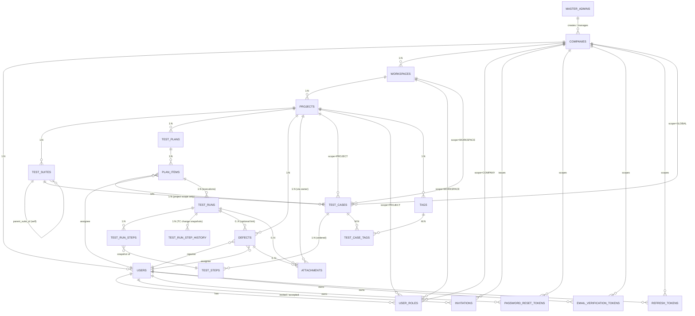

# TMS ERD 정본 (Entity-Relationship Diagram, MVP v1.0)

| 항목 | 내용 |
| --- | --- |
| 문서명 | TMS ERD 정본 (MVP 12 feature 물리 스키마) |
| 문서 버전 | v1.0 |
| 최초 작성일 | 2026-06-08 |
| 작성 주체 | DBA 에이전트 |
| 문서 등급 | 정본 — 물리 스키마 단일 진실 원 |
| 적용 범위 | Backend (`docs/standards/backend-coding-standard.md` §7.6 ERD 정본 갱신 대상) / PM(OpenAPI) / QA |
| 상위 문서 | L0 [`development-standard.md`](../standards/development-standard.md) · L1 [`backend-coding-standard.md`](../standards/backend-coding-standard.md) |
| 부모 정본 | [`srs.md`](../srs.md) §4 (개요 ERD) · [`glossary.md`](../glossary.md) (용어) · [`permissions.md`](../permissions.md) (격리 매칭) · [`features/_lock-review.md`](../features/_lock-review.md) (락 v2.3 도메인 범위) |

> 본 문서는 **MVP 12 feature** (F-COMPANY · F-WS · F-AUTH · F-USER · F-PROJ · F-TS · F-TC · F-PLAN · F-RUN · F-DEF · F-ATTACH · F-REPORT) + 2 UX(`_ux-role-matrix`, `_ux-user-detail`) 도메인의 **PostgreSQL 17 물리 스키마**를 정의한다. SRS §4.2 Mermaid를 확장한 정본이며, **Backend §7.6의 "ERD 정본"은 본 파일로 갱신**된다.
>
> **중복 금지 원칙**(`.claude/dba/CLAUDE.md`): 명명 규칙·ORM 매핑·애플리케이션 쿼리는 **Backend-standard 정본**이며, 본 문서는 **참조만** 하고 재정의하지 않는다. L0 충돌 시 L0가 우선한다.
>
> **충돌 처리**: 본 문서가 SRS §4.3과 다른 부분은 feature 락 v2.3 (`_lock-review.md`)을 우선하여 작성하고, 본 문서 §7 검증 체크리스트에 해당 항목을 명시한다.

---

## 1. 명명 규칙 (Naming Convention) — 참조 전용

본 ERD가 사용하는 식별자 규칙은 모두 **Backend-standard §1.7** 정본을 따른다 (재정의 금지).

| 영역 | 규칙 출처 | 비고 |
| --- | --- | --- |
| 테이블/컬럼/PK/FK/인덱스/UNIQUE 명명 | backend §1.7 | snake_case, 테이블 복수형 |
| 공통 컬럼(`workspace_id`/감사/`is_deleted` 등) | backend §1.7 + SRS §4.1 | 본 문서 §3 적용 |
| 워크스페이스 격리 (자동 필터·복합 인덱스 선두) | backend §7.5 | 격리키 선두 원칙 |
| 영속성 모델(BaseEntity·낙관락·soft delete) | backend §7.3 | |
| ERD 동기화(스키마-ERD 단일 PR) | backend §7.6 | |

> 본 문서의 테이블·컬럼명은 backend §1.7 / glossary 용어와 1:1로 매핑된다 (§7 검증 체크리스트).

---

## 2. 다이어그램 (Mermaid ER)

SRS §4.2를 확장한 **MVP 12 feature 정본**. 인증/Master/조직/테스트 자산/결함/첨부/리포트(집계 뷰는 별도 객체 없음)·토큰 도메인 전부 포함.

> 다이어그램이 표현하지 못하는 격리키 (`company_id`/`workspace_id`/`project_id`)는 §3 적용 범위 정책 + §4 테이블 정의표에서 컬럼·인덱스·복합 UNIQUE로 강제한다.

---

## 3. 공통 컬럼 정책 + 격리키 적용 범위

SRS §4.1 + backend §7.3 정합. **모든 도메인 테이블**은 다음 공통 컬럼을 가진다.

| 컬럼 | 타입(PG17) | NULL | 기본값 | 설명 |
| --- | --- | --- | --- | --- |
| `id` | `bigint` | NOT NULL | identity / sequence | PK, surrogate key |
| `company_id` | `bigint` | NOT NULL | - | 테넌트 격리 최상위 (Company 자체 PK인 `companies` 제외) |
| `workspace_id` | `bigint` | NOT NULL/NULL | - | WS 종속 도메인 NOT NULL. Global Scope TC·전역 테이블 NULL 가능 |
| `project_id` | `bigint` | NOT NULL/NULL | - | Project 종속 도메인 NOT NULL. WS/Global Scope TC·상위 도메인은 NULL |
| `created_at` | `timestamptz` | NOT NULL | `now()` | JPA Auditing |
| `updated_at` | `timestamptz` | NOT NULL | `now()` | JPA Auditing |
| `created_by` | `bigint` | NULL | - | `users.id` 의미적 FK(감사). Master 액션은 NULL 허용 |
| `updated_by` | `bigint` | NULL | - | 동일 |
| `is_deleted` | `boolean` | NOT NULL | `false` | 논리 삭제 (물리 삭제 금지, backend §7.3) |

**격리키 적용 범위 (SRS §4.1 정합)**

| Scope 범위 | 적용 테이블 | 비고 |
| --- | --- | --- |
| 전역 (격리키 없음) | `master_admins`, `companies` | Company는 본인 PK |
| `company_id` only | `users`, `user_roles`, `invitations`, `password_reset_tokens`, `email_verification_tokens`, `refresh_tokens`, `test_cases (scope=GLOBAL)` | |
| `company_id` + `workspace_id` | `workspaces`, `test_cases (scope=WORKSPACE)` | |
| `company_id` + `workspace_id` + `project_id` | `projects`, `test_suites`, `test_cases (scope=PROJECT)`, `test_steps`, `test_plans`, `plan_items`, `test_runs`, `test_run_steps`, `test_run_step_history`, `defects`, `attachments`, `tags`, `test_case_tags` | 3종 격리키 전부 보유 |

**격리키 인덱스 원칙 (backend §7.5)**: 모든 격리키는 NOT NULL + 단일 인덱스 필수. 검색·정렬 인덱스는 격리키를 **선두**로 복합화한다 (예: `ix_test_cases_project_id_updated_at`).

**TestCase 격리 분기 (F-TC v2.3 Lock — Rule 3)**

| Scope enum | `company_id` | `workspace_id` | `project_id` | `suite_id` |
| --- | --- | --- | --- | --- |
| `GLOBAL` | NOT NULL | NULL | NULL | NULL |
| `WORKSPACE` | NOT NULL | NOT NULL | NULL | NULL |
| `PROJECT` | NOT NULL | NOT NULL | NOT NULL | NOT NULL |

> 이 분기는 SRS §4.3 "workspace_id는 WS/PROJECT Scope, project_id는 PROJECT Scope만 NOT NULL" 메모와 정합. 부분 NULL/부분 NOT NULL은 CHECK 제약으로 강제(§4.8).

---

## 4. 테이블 정의표

표기 약속:
- 타입은 PostgreSQL 17 기준.
- PK는 단일 surrogate `id bigint` (backend §1.7 / §7.3) — 별도 명시 없으면 동일.
- ON DELETE/UPDATE 정책: **모든 FK는 `ON UPDATE NO ACTION`** + **`ON DELETE NO ACTION`** (참조 무결성 + soft delete 원칙). 자기참조 트리(`test_suites.parent_suite_id`)도 동일.
- 인덱스 명명은 backend §1.7 (`ix_<table>_<col>[_<col>]`, `ux_<table>_<col>`, `fk_<table>_<ref>`, `pk_<table>`).
- 공통 컬럼은 §3 적용. 표에 별도 표기 생략 시 §3 정책 그대로 적용.

---

### 4.1 `master_admins` — 시스템 전역 관리자 (F-COMPANY / F-AUTH)

| 컬럼 | 타입 | NULL | 기본값 | 설명 |
| --- | --- | --- | --- | --- |
| `id` | `bigint` | NOT NULL | identity | PK |
| `email` | `text` | NOT NULL | - | 시스템 전역 unique |
| `name` | `text` | NOT NULL | - | 표시명 |
| `password_hash` | `text` | NOT NULL | - | BCrypt (backend §8.3) |
| `is_active` | `boolean` | NOT NULL | `true` | 시드 후 회수 시 false |
| `created_at` | `timestamptz` | NOT NULL | `now()` | |
| `updated_at` | `timestamptz` | NOT NULL | `now()` | |

- **PK**: `pk_master_admins` on `id`
- **UNIQUE**: `ux_master_admins_email` on `email`
- **격리키 적용**: 없음 (전역 테이블)
- **공통 컬럼 예외**: `is_deleted`/`created_by`/`updated_by` 없음 (시스템 시드, F-AUTH §11)
- **비고**: 시스템 최초 부팅 시 시드 1명 (F-AUTH §11 오픈이슈)

---

### 4.2 `companies` — 테넌트(고객사) (F-COMPANY)

| 컬럼 | 타입 | NULL | 기본값 | 설명 |
| --- | --- | --- | --- | --- |
| `id` | `bigint` | NOT NULL | identity | PK |
| `name` | `text` | NOT NULL | - | 1~100자 |
| `slug` | `text` | NOT NULL | - | kebab-case, 시스템 unique, 3~50자, **불변** |
| `is_active` | `boolean` | NOT NULL | `true` | 비활성 시 모든 하위 액션 차단(`COMPANY_INACTIVE`) |
| `owner_user_id` | `bigint` | NULL | - | 주 CO. `users.id` 참조 (지연 FK, 셀프 가입 시 부트스트랩 순환 해소) |
| `created_at` | `timestamptz` | NOT NULL | `now()` | |
| `updated_at` | `timestamptz` | NOT NULL | `now()` | |
| `created_by` | `bigint` | NULL | - | Master 액션 시 NULL 가능 |
| `updated_by` | `bigint` | NULL | - | |
| `is_deleted` | `boolean` | NOT NULL | `false` | 물리 삭제 금지 |

- **PK**: `pk_companies` on `id`
- **UNIQUE**: `ux_companies_slug` on `slug`
- **FK**: `fk_companies_owner_user` (`owner_user_id` → `users.id`, NO ACTION) — 셀프 가입 부트스트랩 위해 NULL 허용 + DEFERRABLE INITIALLY DEFERRED 권장
- **인덱스**: `ix_companies_owner_user_id`, `ix_companies_is_active`
- **격리키 적용**: 본인 PK (전역 테이블)

---

### 4.3 `users` — 사용자 (F-USER / F-AUTH)

| 컬럼 | 타입 | NULL | 기본값 | 설명 |
| --- | --- | --- | --- | --- |
| `id` | `bigint` | NOT NULL | identity | PK |
| `company_id` | `bigint` | NOT NULL | - | 격리키 |
| `email` | `text` | NOT NULL | - | 회사 내 unique |
| `name` | `text` | NOT NULL | - | 1~50자 |
| `password_hash` | `text` | NOT NULL | - | BCrypt |
| `is_email_verified` | `boolean` | NOT NULL | `false` | 셀프 가입(B)·초대(C) 분기 |
| `is_active` | `boolean` | NOT NULL | `true` | 비활성 시 로그인 차단 |
| `must_change_password` | `boolean` | NOT NULL | `false` | Master 등록(A) 임시비번 강제 변경 |
| `last_login_at` | `timestamptz` | NULL | - | F-USER 목록 표시용 |
| `created_at` | `timestamptz` | NOT NULL | `now()` | |
| `updated_at` | `timestamptz` | NOT NULL | `now()` | |
| `created_by` | `bigint` | NULL | - | |
| `updated_by` | `bigint` | NULL | - | |
| `is_deleted` | `boolean` | NOT NULL | `false` | 탈퇴 soft |

- **PK**: `pk_users` on `id`
- **UNIQUE**: `ux_users_company_id_email` on `(company_id, email)` — F-USER §7
- **FK**: `fk_users_company` (`company_id` → `companies.id`)
- **인덱스**: `ix_users_company_id`, `ix_users_company_id_is_active`, `ix_users_email` (전역 검색 보조)
- **격리키 적용**: `company_id`
- **비고**: `password_hash` 응답 직렬화 금지 (F-USER REQ-USER-009, backend §6.4)

---

### 4.4 `user_roles` — (User × Scope × Role) 다중 부여 (F-USER / permissions)

| 컬럼 | 타입 | NULL | 기본값 | 설명 |
| --- | --- | --- | --- | --- |
| `id` | `bigint` | NOT NULL | identity | PK |
| `company_id` | `bigint` | NOT NULL | - | 격리키 |
| `user_id` | `bigint` | NOT NULL | - | 사용자 |
| `scope_type` | `text` | NOT NULL | - | enum: `COMPANY`/`WORKSPACE`/`PROJECT` (§5) |
| `scope_id` | `bigint` | NOT NULL | - | scope_type별 식별자 (companies.id / workspaces.id / projects.id) — 다형성 |
| `role` | `text` | NOT NULL | - | enum: `CO`/`WO`/`PO`/`MEMBER`/`VIEWER` (§5) |
| `granted_by_user_id` | `bigint` | NULL | - | 부여자(감사). Master 시드는 NULL |
| `granted_at` | `timestamptz` | NOT NULL | `now()` | |
| `created_at` | `timestamptz` | NOT NULL | `now()` | |
| `updated_at` | `timestamptz` | NOT NULL | `now()` | |
| `created_by` | `bigint` | NULL | - | |
| `updated_by` | `bigint` | NULL | - | |
| `is_deleted` | `boolean` | NOT NULL | `false` | 회수 시 hard delete 또는 soft (MVP: hard, F-USER §7 sync 트랜잭션) |

- **PK**: `pk_user_roles` on `id`
- **UNIQUE**: `ux_user_roles_user_scope` on `(user_id, scope_type, scope_id)` — **한 Scope 당 단일 Role** (라디오 모델, _ux-role-matrix §3.2). 승격은 행 UPDATE. 초대는 `INSERT ON CONFLICT (user_id, scope_type, scope_id) DO NOTHING` (★20 정합).
- **FK**: `fk_user_roles_company` (`company_id` → `companies.id`), `fk_user_roles_user` (`user_id` → `users.id`), `fk_user_roles_granted_by` (`granted_by_user_id` → `users.id`)
- **인덱스**:
  - `ix_user_roles_user_scope` on `(user_id, scope_type, scope_id)` — 권한 매칭 핫패스 (UNIQUE 겸용)
  - `ix_user_roles_scope_role` on `(scope_type, scope_id, role)` — Scope 단위 멤버/Role 검색
  - `ix_user_roles_company_id`
- **CHECK 제약** `ck_user_roles_scope_role_match` (permissions.md §3 정합 — Member/Viewer는 WS+Project 양쪽 허용):
  - `(scope_type='COMPANY' AND role='CO')` OR
  - `(scope_type='WORKSPACE' AND role IN ('WO','MEMBER','VIEWER'))` OR
  - `(scope_type='PROJECT' AND role IN ('PO','MEMBER','VIEWER'))`
  > F-USER §7 Role-Scope 정합성 (`USER_INVALID_ROLE_SCOPE`)
- **격리키 적용**: `company_id`
- **비고**: scope_id는 다형성 외래키 — 물리 FK 없음(scope_type별 분기 검증은 서비스). 격리 무결성은 backend §7.5 자동 필터에서 보강

---

### 4.5 `workspaces` — Workspace (F-WS)

| 컬럼 | 타입 | NULL | 기본값 | 설명 |
| --- | --- | --- | --- | --- |
| `id` | `bigint` | NOT NULL | identity | PK |
| `company_id` | `bigint` | NOT NULL | - | 격리키 |
| `name` | `text` | NOT NULL | - | 1~100자 |
| `description` | `text` | NULL | - | 0~500자 |
| `owner_user_id` | `bigint` | NOT NULL | - | 주 WO |
| `is_active` | `boolean` | NOT NULL | `true` | 비활성 시 하위 차단(`WS_INACTIVE`) |
| `created_at` | `timestamptz` | NOT NULL | `now()` | |
| `updated_at` | `timestamptz` | NOT NULL | `now()` | |
| `created_by` | `bigint` | NULL | - | |
| `updated_by` | `bigint` | NULL | - | |
| `is_deleted` | `boolean` | NOT NULL | `false` | |

- **PK**: `pk_workspaces` on `id`
- **FK**: `fk_workspaces_company` (`company_id` → `companies.id`), `fk_workspaces_owner_user` (`owner_user_id` → `users.id`)
- **인덱스**: `ix_workspaces_company_id`, `ix_workspaces_company_id_is_active`, `ix_workspaces_owner_user_id`
- **UNIQUE 권장 (옵션)**: `ux_workspaces_company_id_name` on `(company_id, name)` — F-WS §11 권장 unique
- **격리키 적용**: `company_id`

---

### 4.6 `projects` — Project (F-PROJ)

| 컬럼 | 타입 | NULL | 기본값 | 설명 |
| --- | --- | --- | --- | --- |
| `id` | `bigint` | NOT NULL | identity | PK |
| `company_id` | `bigint` | NOT NULL | - | 격리키 |
| `workspace_id` | `bigint` | NOT NULL | - | 격리키 |
| `name` | `text` | NOT NULL | - | 1~100자 |
| `code` | `text` | NOT NULL | - | `^[A-Z][A-Z0-9]{1,9}$`, Company 내 unique, **불변** |
| `description` | `text` | NULL | - | 0~1000자 |
| `owner_user_id` | `bigint` | NULL | - | 주 PO. Member 생성 시 NULL 가능 (F-PROJ §5.1) |
| `is_active` | `boolean` | NOT NULL | `true` | |
| `created_at` | `timestamptz` | NOT NULL | `now()` | |
| `updated_at` | `timestamptz` | NOT NULL | `now()` | |
| `created_by` | `bigint` | NULL | - | |
| `updated_by` | `bigint` | NULL | - | |
| `is_deleted` | `boolean` | NOT NULL | `false` | |

- **PK**: `pk_projects` on `id`
- **UNIQUE**: `ux_projects_company_id_code` on `(company_id, code)` — F-PROJ §7 (`PROJ_CODE_DUPLICATE`)
- **FK**: `fk_projects_company` (`company_id` → `companies.id`), `fk_projects_workspace` (`workspace_id` → `workspaces.id`), `fk_projects_owner_user` (`owner_user_id` → `users.id`)
- **인덱스**: `ix_projects_company_id_workspace_id`, `ix_projects_workspace_id_is_active`, `ix_projects_owner_user_id`
- **CHECK 제약** `ck_projects_code_format`: `code ~ '^[A-Z][A-Z0-9]{1,9}$'`
- **격리키 적용**: `company_id` + `workspace_id`

---

### 4.7 `test_suites` — Suite 트리 (F-TS)

| 컬럼 | 타입 | NULL | 기본값 | 설명 |
| --- | --- | --- | --- | --- |
| `id` | `bigint` | NOT NULL | identity | PK |
| `company_id` | `bigint` | NOT NULL | - | 격리키 |
| `workspace_id` | `bigint` | NOT NULL | - | 격리키 |
| `project_id` | `bigint` | NOT NULL | - | 격리키 |
| `parent_suite_id` | `bigint` | NULL | - | 자기 참조. NULL=루트 |
| `name` | `text` | NOT NULL | - | 1~100자 |
| `sort_order` | `integer` | NOT NULL | `0` | 같은 부모 내 0-based 연속 |
| `created_at` | `timestamptz` | NOT NULL | `now()` | |
| `updated_at` | `timestamptz` | NOT NULL | `now()` | |
| `created_by` | `bigint` | NULL | - | ★16 삭제 권한 근거 |
| `updated_by` | `bigint` | NULL | - | |
| `is_deleted` | `boolean` | NOT NULL | `false` | |

- **PK**: `pk_test_suites` on `id`
- **FK**: `fk_test_suites_project` (`project_id` → `projects.id`), `fk_test_suites_parent` (`parent_suite_id` → `test_suites.id`, NO ACTION — 순환 방지는 서비스에서)
- **인덱스**: `ix_test_suites_project_id_parent` on `(project_id, parent_suite_id, sort_order)`, `ix_test_suites_company_id`, `ix_test_suites_workspace_id`
- **격리키 적용**: `company_id` + `workspace_id` + `project_id`

---

### 4.8 `test_cases` — TestCase (F-TC) — Scope 3종

| 컬럼 | 타입 | NULL | 기본값 | 설명 |
| --- | --- | --- | --- | --- |
| `id` | `bigint` | NOT NULL | identity | PK |
| `company_id` | `bigint` | NOT NULL | - | 격리키(모든 Scope 필수) |
| `workspace_id` | `bigint` | NULL | - | Scope=WORKSPACE/PROJECT일 때 NOT NULL (CHECK) |
| `project_id` | `bigint` | NULL | - | Scope=PROJECT일 때 NOT NULL (CHECK) |
| `scope_type` | `text` | NOT NULL | - | enum: `GLOBAL`/`WORKSPACE`/`PROJECT` (§5), **불변** |
| `suite_id` | `bigint` | NULL | - | Project Scope만 NOT NULL (CHECK) |
| `code` | `text` | NOT NULL | - | 자동 발급. Scope별 prefix (`TC-<proj.code>-N`/`TC-WS<wsId>-N`/`TC-GBL-N`) |
| `title` | `text` | NOT NULL | - | 1~200자 |
| `priority` | `text` | NOT NULL | `'Medium'` | enum: `Urgent`/`High`/`Medium`/`Low` (§5) |
| `precondition` | `text` | NULL | - | 0~2000자 |
| `expected_result` | `text` | NULL | - | 0~2000자 |
| `created_at` | `timestamptz` | NOT NULL | `now()` | |
| `updated_at` | `timestamptz` | NOT NULL | `now()` | |
| `created_by` | `bigint` | NULL | - | ★16 |
| `updated_by` | `bigint` | NULL | - | F-TC 변경 트리거(Rule 4·5) |
| `is_deleted` | `boolean` | NOT NULL | `false` | |

- **PK**: `pk_test_cases` on `id`
- **UNIQUE**: `ux_test_cases_company_id_code` on `(company_id, code)` — Scope 전반 unique (prefix가 Scope 식별)
- **FK**: `fk_test_cases_company`, `fk_test_cases_workspace` (NULL 허용), `fk_test_cases_project` (NULL 허용), `fk_test_cases_suite` (`suite_id` → `test_suites.id`, NULL 허용)
- **인덱스**:
  - Project: `ix_test_cases_project_id_suite_id` on `(project_id, suite_id, updated_at DESC)`
  - Workspace: `ix_test_cases_workspace_id_scope` on `(workspace_id, scope_type, updated_at DESC)`
  - Global/검색: `ix_test_cases_company_id_scope` on `(company_id, scope_type, updated_at DESC)`
  - 검색 보조: `ix_test_cases_company_id_priority`, `ix_test_cases_created_by`
- **CHECK 제약**:
  - `ck_test_cases_scope_keys`:
    - `(scope_type='GLOBAL' AND workspace_id IS NULL AND project_id IS NULL AND suite_id IS NULL)` OR
    - `(scope_type='WORKSPACE' AND workspace_id IS NOT NULL AND project_id IS NULL AND suite_id IS NULL)` OR
    - `(scope_type='PROJECT' AND workspace_id IS NOT NULL AND project_id IS NOT NULL AND suite_id IS NOT NULL)`
  - `ck_test_cases_priority`: `priority IN ('Urgent','High','Medium','Low')`
- **격리키 적용**: Scope별 분기 (§3 표 참조)
- **비고**: scope_type 변경 금지 (`TC_SCOPE_IMMUTABLE`) — DB 트리거 또는 서비스 보강

---

### 4.9 `test_steps` — TestStep (F-TC §7 / F-RUN §5.7 스냅샷 원본)

| 컬럼 | 타입 | NULL | 기본값 | 설명 |
| --- | --- | --- | --- | --- |
| `id` | `bigint` | NOT NULL | identity | PK |
| `company_id` | `bigint` | NOT NULL | - | TC와 동일 |
| `workspace_id` | `bigint` | NULL | - | TC와 동일 (Scope 따름) |
| `project_id` | `bigint` | NULL | - | TC와 동일 (Scope 따름) |
| `test_case_id` | `bigint` | NOT NULL | - | 상위 TC |
| `step_order` | `integer` | NOT NULL | - | 1-based |
| `action` | `text` | NOT NULL | - | 수행 동작 |
| `expected_result` | `text` | NULL | - | 단계별 기대 결과 |
| `created_at` | `timestamptz` | NOT NULL | `now()` | |
| `updated_at` | `timestamptz` | NOT NULL | `now()` | |
| `created_by` | `bigint` | NULL | - | |
| `updated_by` | `bigint` | NULL | - | |
| `is_deleted` | `boolean` | NOT NULL | `false` | step 삭제(F-RUN §5.7) |

- **PK**: `pk_test_steps` on `id`
- **UNIQUE**: `ux_test_steps_test_case_id_step_order` on `(test_case_id, step_order)` (활성 행만 — partial index `WHERE is_deleted=false`)
- **FK**: `fk_test_steps_test_case` (`test_case_id` → `test_cases.id`)
- **인덱스**: `ix_test_steps_test_case_id`, `ix_test_steps_company_id`
- **격리키 적용**: 상위 TC의 Scope 그대로 (Scope별 NULL 분기 동일)

---

### 4.10 `tags` — 자유 키워드 (F-TC)

| 컬럼 | 타입 | NULL | 기본값 | 설명 |
| --- | --- | --- | --- | --- |
| `id` | `bigint` | NOT NULL | identity | PK |
| `company_id` | `bigint` | NOT NULL | - | 격리키 |
| `workspace_id` | `bigint` | NOT NULL | - | 격리키 |
| `project_id` | `bigint` | NOT NULL | - | 격리키. MVP는 Project 단위 unique (F-TC §5.7) |
| `name` | `text` | NOT NULL | - | 1~30자 |
| `created_at` | `timestamptz` | NOT NULL | `now()` | |
| `updated_at` | `timestamptz` | NOT NULL | `now()` | |
| `created_by` | `bigint` | NULL | - | |
| `updated_by` | `bigint` | NULL | - | |
| `is_deleted` | `boolean` | NOT NULL | `false` | |

- **PK**: `pk_tags` on `id`
- **UNIQUE**: `ux_tags_project_id_name` on `(project_id, name)` — Project 내 unique upsert
- **FK**: `fk_tags_project` (`project_id` → `projects.id`)
- **인덱스**: `ix_tags_project_id`, `ix_tags_company_id`
- **격리키 적용**: `company_id` + `workspace_id` + `project_id`
- **비고**: WS/Global Scope TC 태그 운용은 Phase 2 (F-TC §11). MVP는 Project Scope TC 한정 정합

---

### 4.11 `test_case_tags` — TC ↔ Tag M:N (F-TC)

| 컬럼 | 타입 | NULL | 기본값 | 설명 |
| --- | --- | --- | --- | --- |
| `id` | `bigint` | NOT NULL | identity | PK |
| `company_id` | `bigint` | NOT NULL | - | TC와 동일 |
| `workspace_id` | `bigint` | NULL | - | TC와 동일 |
| `project_id` | `bigint` | NULL | - | TC와 동일 |
| `test_case_id` | `bigint` | NOT NULL | - | |
| `tag_id` | `bigint` | NOT NULL | - | |
| `created_at` | `timestamptz` | NOT NULL | `now()` | |

- **PK**: `pk_test_case_tags` on `id`
- **UNIQUE**: `ux_test_case_tags_tc_tag` on `(test_case_id, tag_id)` — 중복 부여 차단
- **FK**: `fk_test_case_tags_test_case` (`test_case_id` → `test_cases.id`), `fk_test_case_tags_tag` (`tag_id` → `tags.id`)
- **인덱스**: `ix_test_case_tags_tag_id` (역방향 조회), `ix_test_case_tags_company_id`
- **격리키 적용**: 상위 TC 따름
- **공통 컬럼 예외**: 단순 관계 테이블 — `updated_at`/`updated_by`/`is_deleted` 생략 (삭제 시 hard delete OK)

---

### 4.12 `test_plans` — TestPlan (F-PLAN)

| 컬럼 | 타입 | NULL | 기본값 | 설명 |
| --- | --- | --- | --- | --- |
| `id` | `bigint` | NOT NULL | identity | PK |
| `company_id` | `bigint` | NOT NULL | - | 격리키 |
| `workspace_id` | `bigint` | NOT NULL | - | 격리키 |
| `project_id` | `bigint` | NOT NULL | - | 격리키 |
| `name` | `text` | NOT NULL | - | 1~100자 |
| `milestone` | `text` | NULL | - | 자유 텍스트 0~100자 |
| `status` | `text` | NOT NULL | `'DRAFT'` | enum: `DRAFT`/`IN_PROGRESS`/`CLOSED` (§5) |
| `planned_start_at` | `timestamptz` | NULL | - | |
| `planned_end_at` | `timestamptz` | NULL | - | |
| `created_at` | `timestamptz` | NOT NULL | `now()` | |
| `updated_at` | `timestamptz` | NOT NULL | `now()` | |
| `created_by` | `bigint` | NULL | - | ★16 |
| `updated_by` | `bigint` | NULL | - | |
| `is_deleted` | `boolean` | NOT NULL | `false` | |

- **PK**: `pk_test_plans` on `id`
- **FK**: `fk_test_plans_project` (`project_id` → `projects.id`)
- **인덱스**: `ix_test_plans_project_id_status` on `(project_id, status, updated_at DESC)`, `ix_test_plans_company_id_workspace_id`, `ix_test_plans_created_by`
- **CHECK 제약** `ck_test_plans_status`: `status IN ('DRAFT','IN_PROGRESS','CLOSED')`
- **격리키 적용**: `company_id` + `workspace_id` + `project_id`

---

### 4.13 `plan_items` — Plan ↔ TC + 담당자 (F-PLAN)

| 컬럼 | 타입 | NULL | 기본값 | 설명 |
| --- | --- | --- | --- | --- |
| `id` | `bigint` | NOT NULL | identity | PK |
| `company_id` | `bigint` | NOT NULL | - | 격리키 |
| `workspace_id` | `bigint` | NOT NULL | - | 격리키 |
| `project_id` | `bigint` | NOT NULL | - | 격리키 |
| `plan_id` | `bigint` | NOT NULL | - | |
| `test_case_id` | `bigint` | NOT NULL | - | |
| `assignee_user_id` | `bigint` | NULL | - | NULL=미할당 |
| `created_at` | `timestamptz` | NOT NULL | `now()` | |
| `updated_at` | `timestamptz` | NOT NULL | `now()` | |
| `created_by` | `bigint` | NULL | - | |
| `updated_by` | `bigint` | NULL | - | |
| `is_deleted` | `boolean` | NOT NULL | `false` | |

- **PK**: `pk_plan_items` on `id`
- **UNIQUE**: `ux_plan_items_plan_id_test_case_id` on `(plan_id, test_case_id)` — F-PLAN §5.3 idempotent
- **FK**: `fk_plan_items_plan` (`plan_id` → `test_plans.id`), `fk_plan_items_test_case` (`test_case_id` → `test_cases.id`), `fk_plan_items_assignee` (`assignee_user_id` → `users.id`)
- **인덱스**: `ix_plan_items_plan_id`, `ix_plan_items_test_case_id` (TC 변경 트리거 역참조), `ix_plan_items_assignee_user_id`, `ix_plan_items_project_id`
- **격리키 적용**: `company_id` + `workspace_id` + `project_id`

---

### 4.14 `test_runs` — TestRun 헤더 (F-RUN)

| 컬럼 | 타입 | NULL | 기본값 | 설명 |
| --- | --- | --- | --- | --- |
| `id` | `bigint` | NOT NULL | identity | PK |
| `company_id` | `bigint` | NOT NULL | - | 격리키 |
| `workspace_id` | `bigint` | NOT NULL | - | 격리키 |
| `project_id` | `bigint` | NOT NULL | - | 격리키 |
| `plan_item_id` | `bigint` | NOT NULL | - | |
| `executed_by_user_id` | `bigint` | NOT NULL | - | 실행자 = created_by와 동일 의미. ★16 근거 |
| `started_at` | `timestamptz` | NOT NULL | `now()` | Run 시작 시각 |
| `completed_at` | `timestamptz` | NULL | - | 자동 종료 시각 |
| `duration_ms` | `bigint` | NOT NULL | `0` | F-RUN Rule 2 — TC 변경 시 보존 |
| `status` | `text` | NOT NULL | `'IN_PROGRESS'` | enum: `IN_PROGRESS`/`COMPLETED` (§5) |
| `result` | `text` | NULL | - | 집계 enum: `PASS`/`FAIL`/`BLOCKED`/`SKIPPED`/`UNTESTED` 또는 NULL(IN_PROGRESS) |
| `environment` | `text` | NULL | - | 자유 텍스트 0~200자 |
| `created_at` | `timestamptz` | NOT NULL | `now()` | |
| `updated_at` | `timestamptz` | NOT NULL | `now()` | |
| `created_by` | `bigint` | NULL | - | |
| `updated_by` | `bigint` | NULL | - | |
| `is_deleted` | `boolean` | NOT NULL | `false` | 작성자 한정 soft delete |

- **PK**: `pk_test_runs` on `id`
- **FK**: `fk_test_runs_plan_item` (`plan_item_id` → `plan_items.id`), `fk_test_runs_executed_by` (`executed_by_user_id` → `users.id`)
- **인덱스**:
  - `ix_test_runs_plan_item_id_started_at` on `(plan_item_id, started_at DESC)` — 최신 Run 검색(F-PLAN 진척률)
  - `ix_test_runs_project_id_status` on `(project_id, status, started_at DESC)`
  - `ix_test_runs_executed_by_user_id`
  - `ix_test_runs_company_id`
- **CHECK 제약**:
  - `ck_test_runs_status`: `status IN ('IN_PROGRESS','COMPLETED')`
  - `ck_test_runs_result`: `result IS NULL OR result IN ('PASS','FAIL','BLOCKED','SKIPPED','UNTESTED')`
  - `ck_test_runs_completion`: `(status='IN_PROGRESS' AND completed_at IS NULL AND result IS NULL) OR (status='COMPLETED' AND completed_at IS NOT NULL AND result IS NOT NULL)`
- **격리키 적용**: `company_id` + `workspace_id` + `project_id`

---

### 4.15 `test_run_steps` — TestRun 단계별 결과 (F-RUN)

| 컬럼 | 타입 | NULL | 기본값 | 설명 |
| --- | --- | --- | --- | --- |
| `id` | `bigint` | NOT NULL | identity | PK |
| `company_id` | `bigint` | NOT NULL | - | |
| `workspace_id` | `bigint` | NOT NULL | - | |
| `project_id` | `bigint` | NOT NULL | - | |
| `test_run_id` | `bigint` | NOT NULL | - | |
| `test_step_id` | `bigint` | NOT NULL | - | 시작 시점 TC step 스냅샷 ref |
| `step_order` | `integer` | NOT NULL | - | 표시 순서 (TC step과 정합) |
| `action_snapshot` | `text` | NOT NULL | - | 시작 시점 TC action 스냅샷 |
| `expected_result_snapshot` | `text` | NULL | - | 시작 시점 TC expectedResult 스냅샷 |
| `result` | `text` | NOT NULL | `'UNTESTED'` | enum 5종 (§5) |
| `actual_result` | `text` | NULL | - | 0~5000자 |
| `created_at` | `timestamptz` | NOT NULL | `now()` | |
| `updated_at` | `timestamptz` | NOT NULL | `now()` | F-RUN duration_ms 계산 기준 |
| `created_by` | `bigint` | NULL | - | |
| `updated_by` | `bigint` | NULL | - | 결과 입력자 |
| `is_deleted` | `boolean` | NOT NULL | `false` | TC step 삭제 트리거(F-RUN §5.7) |

- **PK**: `pk_test_run_steps` on `id`
- **UNIQUE**: `ux_test_run_steps_run_id_step_id` on `(test_run_id, test_step_id)` (활성 행만 — partial index `WHERE is_deleted=false`)
- **FK**: `fk_test_run_steps_run` (`test_run_id` → `test_runs.id`), `fk_test_run_steps_step` (`test_step_id` → `test_steps.id`)
- **인덱스**: `ix_test_run_steps_run_id_step_order` on `(test_run_id, step_order)`, `ix_test_run_steps_test_step_id`, `ix_test_run_steps_company_id_workspace_id_project_id`
- **CHECK 제약** `ck_test_run_steps_result`: `result IN ('PASS','FAIL','BLOCKED','SKIPPED','UNTESTED')`
- **격리키 적용**: `company_id` + `workspace_id` + `project_id`

---

### 4.16 `test_run_step_history` — TC 변경 이력 (F-RUN Rule 4·5)

| 컬럼 | 타입 | NULL | 기본값 | 설명 |
| --- | --- | --- | --- | --- |
| `id` | `bigint` | NOT NULL | identity | PK |
| `company_id` | `bigint` | NOT NULL | - | |
| `workspace_id` | `bigint` | NOT NULL | - | |
| `project_id` | `bigint` | NOT NULL | - | |
| `test_run_id` | `bigint` | NOT NULL | - | |
| `test_step_id` | `bigint` | NOT NULL | - | 영향 step |
| `snapshot_action` | `text` | NOT NULL | - | 변경 전 action |
| `snapshot_expected_result` | `text` | NULL | - | 변경 전 expectedResult |
| `changed_at` | `timestamptz` | NOT NULL | `now()` | |
| `changed_by_user_id` | `bigint` | NULL | - | TC 수정자 |
| `reason` | `text` | NOT NULL | - | 'TC_UPDATED'/'TC_STEP_ADDED'/'TC_STEP_DELETED' 등 |
| `created_at` | `timestamptz` | NOT NULL | `now()` | |

- **PK**: `pk_test_run_step_history` on `id`
- **FK**: `fk_test_run_step_history_run` (`test_run_id` → `test_runs.id`), `fk_test_run_step_history_step` (`test_step_id` → `test_steps.id`)
- **인덱스**: `ix_test_run_step_history_run_id_changed_at` on `(test_run_id, changed_at DESC)`, `ix_test_run_step_history_company_id`
- **격리키 적용**: `company_id` + `workspace_id` + `project_id`
- **공통 컬럼 예외**: append-only — `updated_at`/`is_deleted`/`updated_by` 없음

---

### 4.17 `defects` — 결함 (F-DEF)

| 컬럼 | 타입 | NULL | 기본값 | 설명 |
| --- | --- | --- | --- | --- |
| `id` | `bigint` | NOT NULL | identity | PK |
| `company_id` | `bigint` | NOT NULL | - | 격리키 |
| `workspace_id` | `bigint` | NOT NULL | - | 격리키 |
| `project_id` | `bigint` | NOT NULL | - | 격리키 |
| `code` | `text` | NOT NULL | - | `DEF-<project.code>-<seq>` |
| `test_run_id` | `bigint` | NULL | - | 연결 또는 독립 등록 |
| `title` | `text` | NOT NULL | - | 1~200자 |
| `description` | `text` | NULL | - | 0~5000자 |
| `reproduction_steps` | `text` | NULL | - | 0~5000자 |
| `status` | `text` | NOT NULL | `'OPEN'` | enum MVP 4종 (§5) |
| `severity` | `text` | NOT NULL | `'Major'` | enum 4종 (§5) |
| `priority` | `text` | NOT NULL | `'Medium'` | enum 4종 (§5) |
| `reporter_user_id` | `bigint` | NOT NULL | - | 등록자 = created_by 의미. ★16 근거 |
| `assignee_user_id` | `bigint` | NULL | - | 미할당 가능 |
| `created_at` | `timestamptz` | NOT NULL | `now()` | |
| `updated_at` | `timestamptz` | NOT NULL | `now()` | |
| `created_by` | `bigint` | NULL | - | |
| `updated_by` | `bigint` | NULL | - | |
| `is_deleted` | `boolean` | NOT NULL | `false` | |

- **PK**: `pk_defects` on `id`
- **UNIQUE**: `ux_defects_company_id_code` on `(company_id, code)`
- **FK**: `fk_defects_project` (`project_id` → `projects.id`), `fk_defects_test_run` (`test_run_id` → `test_runs.id`, NULL 허용), `fk_defects_reporter` (`reporter_user_id` → `users.id`), `fk_defects_assignee` (`assignee_user_id` → `users.id`)
- **인덱스**:
  - `ix_defects_project_id_status` on `(project_id, status, updated_at DESC)` — F-REPORT defectStatusCount
  - `ix_defects_test_run_id` — F-RUN 역참조
  - `ix_defects_reporter_user_id`, `ix_defects_assignee_user_id`
  - `ix_defects_project_id_severity`, `ix_defects_project_id_priority`
- **CHECK 제약**:
  - `ck_defects_status`: `status IN ('OPEN','IN_PROGRESS','RESOLVED','CLOSED')`
  - `ck_defects_severity`: `severity IN ('Critical','Major','Minor','Trivial')`
  - `ck_defects_priority`: `priority IN ('Urgent','High','Medium','Low')`
- **격리키 적용**: `company_id` + `workspace_id` + `project_id`

---

### 4.18 `attachments` — 첨부 (F-ATTACH)

| 컬럼 | 타입 | NULL | 기본값 | 설명 |
| --- | --- | --- | --- | --- |
| `id` | `bigint` | NOT NULL | identity | PK |
| `company_id` | `bigint` | NOT NULL | - | 격리키 |
| `workspace_id` | `bigint` | NOT NULL | - | 격리키 |
| `project_id` | `bigint` | NOT NULL | - | 격리키 |
| `owner_type` | `text` | NOT NULL | - | enum: `TEST_RUN`/`DEFECT` (§5) |
| `owner_id` | `bigint` | NOT NULL | - | 다형성 ref |
| `file_name` | `text` | NOT NULL | - | 원본명 |
| `mime_type` | `text` | NOT NULL | - | 화이트리스트 검증 |
| `size_bytes` | `bigint` | NOT NULL | - | ≤ 10MB |
| `storage_path` | `text` | NOT NULL | - | **응답 직렬화 금지** (F-ATTACH §7) |
| `created_at` | `timestamptz` | NOT NULL | `now()` | |
| `updated_at` | `timestamptz` | NOT NULL | `now()` | |
| `created_by` | `bigint` | NULL | - | 업로드자. ★16 근거 |
| `updated_by` | `bigint` | NULL | - | |
| `is_deleted` | `boolean` | NOT NULL | `false` | 메타 soft, 실파일 보존 |

- **PK**: `pk_attachments` on `id`
- **FK**: `fk_attachments_project` (`project_id` → `projects.id`) — `owner_id`는 다형성 (서비스에서 owner_type별 분기)
- **인덱스**:
  - `ix_attachments_owner` on `(project_id, owner_type, owner_id)` — F-ATTACH §5.2 목록 핫패스
  - `ix_attachments_company_id_workspace_id`
  - `ix_attachments_created_by`
- **CHECK 제약**:
  - `ck_attachments_owner_type`: `owner_type IN ('TEST_RUN','DEFECT')`
  - `ck_attachments_size`: `size_bytes <= 10485760` (10MB)
- **격리키 적용**: `company_id` + `workspace_id` + `project_id`

---

### 4.19 `invitations` — 초대 토큰 (F-USER / F-AUTH)

| 컬럼 | 타입 | NULL | 기본값 | 설명 |
| --- | --- | --- | --- | --- |
| `id` | `bigint` | NOT NULL | identity | PK |
| `company_id` | `bigint` | NOT NULL | - | 격리키 |
| `token_hash` | `text` | NOT NULL | - | 해시 저장 (원본 미보관) |
| `email` | `text` | NOT NULL | - | 초대 대상 |
| `name` | `text` | NULL | - | 선택 |
| `scope_type` | `text` | NOT NULL | - | enum: `COMPANY`/`WORKSPACE`/`PROJECT` |
| `scope_id` | `bigint` | NOT NULL | - | 다형성 |
| `role` | `text` | NULL | - | 사전 부여 옵션. NULL=수락 후 별도 매트릭스 |
| `preassigned_roles_json` | `jsonb` | NULL | - | 다중 사전 부여 옵션 (F-USER §5.1 preassignedRoles[]) |
| `invited_by_user_id` | `bigint` | NULL | - | 발급자 |
| `accepted_by_user_id` | `bigint` | NULL | - | 수락 사용자 |
| `expires_at` | `timestamptz` | NOT NULL | - | now()+24h |
| `accepted_at` | `timestamptz` | NULL | - | 사용 시점 |
| `cancelled_at` | `timestamptz` | NULL | - | 취소 시점 (UX user-detail §4.3) |
| `created_at` | `timestamptz` | NOT NULL | `now()` | |
| `updated_at` | `timestamptz` | NOT NULL | `now()` | |
| `created_by` | `bigint` | NULL | - | |
| `updated_by` | `bigint` | NULL | - | |
| `is_deleted` | `boolean` | NOT NULL | `false` | |

- **PK**: `pk_invitations` on `id`
- **UNIQUE**: `ux_invitations_token_hash` on `token_hash` — 시스템 전역 unique
- **FK**: `fk_invitations_company` (`company_id` → `companies.id`), `fk_invitations_invited_by` (`invited_by_user_id` → `users.id`), `fk_invitations_accepted_by` (`accepted_by_user_id` → `users.id`)
- **인덱스**:
  - `ix_invitations_company_id_email` on `(company_id, email)` — 활성 초대 중복 검출 (F-USER §5.1 USER_INVITE_PENDING)
  - `ix_invitations_expires_at` — 만료 배치
- **CHECK 제약** `ck_invitations_scope_type`: `scope_type IN ('COMPANY','WORKSPACE','PROJECT')`
- **격리키 적용**: `company_id`

---

### 4.20 `password_reset_tokens` — 비번 리셋 토큰 (F-AUTH)

| 컬럼 | 타입 | NULL | 기본값 | 설명 |
| --- | --- | --- | --- | --- |
| `id` | `bigint` | NOT NULL | identity | PK |
| `company_id` | `bigint` | NOT NULL | - | 격리키 |
| `user_id` | `bigint` | NOT NULL | - | 대상 |
| `token_hash` | `text` | NOT NULL | - | 해시 |
| `expires_at` | `timestamptz` | NOT NULL | - | now()+24h |
| `used_at` | `timestamptz` | NULL | - | 1회용 사용 시각 |
| `created_at` | `timestamptz` | NOT NULL | `now()` | |
| `updated_at` | `timestamptz` | NOT NULL | `now()` | |

- **PK**: `pk_password_reset_tokens` on `id`
- **UNIQUE**: `ux_password_reset_tokens_token_hash` on `token_hash`
- **FK**: `fk_password_reset_tokens_user` (`user_id` → `users.id`), `fk_password_reset_tokens_company` (`company_id` → `companies.id`)
- **인덱스**: `ix_password_reset_tokens_user_id`, `ix_password_reset_tokens_expires_at`
- **격리키 적용**: `company_id`
- **공통 컬럼 예외**: 보안 토큰 — `is_deleted`/`created_by`/`updated_by` 없음 (사용 후 used_at만 기록)

---

### 4.21 `email_verification_tokens` — 이메일 인증 토큰 (F-AUTH 셀프 가입)

| 컬럼 | 타입 | NULL | 기본값 | 설명 |
| --- | --- | --- | --- | --- |
| `id` | `bigint` | NOT NULL | identity | PK |
| `company_id` | `bigint` | NOT NULL | - | 격리키 |
| `user_id` | `bigint` | NOT NULL | - | 대상 |
| `token_hash` | `text` | NOT NULL | - | 해시 |
| `expires_at` | `timestamptz` | NOT NULL | - | now()+24h |
| `used_at` | `timestamptz` | NULL | - | 1회용 |
| `created_at` | `timestamptz` | NOT NULL | `now()` | |
| `updated_at` | `timestamptz` | NOT NULL | `now()` | |

- **PK**: `pk_email_verification_tokens` on `id`
- **UNIQUE**: `ux_email_verification_tokens_token_hash` on `token_hash`
- **FK**: `fk_email_verification_tokens_user` (`user_id` → `users.id`), `fk_email_verification_tokens_company` (`company_id` → `companies.id`)
- **인덱스**: `ix_email_verification_tokens_user_id`, `ix_email_verification_tokens_expires_at`
- **격리키 적용**: `company_id`
- **공통 컬럼 예외**: 동일 (보안 토큰)

---

### 4.22 `refresh_tokens` — Refresh Token (F-AUTH — RDB 백업 옵션)

> SRS §4.3: "Refresh Token (Redis 권장, RDB 백업 선택)". MVP는 Redis 1차 + RDB 백업 정합성용으로 본 테이블을 둔다.

| 컬럼 | 타입 | NULL | 기본값 | 설명 |
| --- | --- | --- | --- | --- |
| `id` | `bigint` | NOT NULL | identity | PK |
| `company_id` | `bigint` | NULL | - | Master는 NULL (companyId 없음 — F-AUTH §7) |
| `user_id` | `bigint` | NULL | - | users.id 또는 master_admins.id 중 하나 |
| `master_admin_id` | `bigint` | NULL | - | Master 토큰일 때만 |
| `token_hash` | `text` | NOT NULL | - | 해시 |
| `expires_at` | `timestamptz` | NOT NULL | - | now()+30d (자동 로그인 정책) |
| `revoked_at` | `timestamptz` | NULL | - | rotate/로그아웃/비번 변경 시 |
| `created_at` | `timestamptz` | NOT NULL | `now()` | |
| `updated_at` | `timestamptz` | NOT NULL | `now()` | |

- **PK**: `pk_refresh_tokens` on `id`
- **UNIQUE**: `ux_refresh_tokens_token_hash` on `token_hash`
- **FK**: `fk_refresh_tokens_user` (`user_id` → `users.id`, NULL 허용), `fk_refresh_tokens_master_admin` (`master_admin_id` → `master_admins.id`, NULL 허용)
- **인덱스**: `ix_refresh_tokens_user_id`, `ix_refresh_tokens_master_admin_id`, `ix_refresh_tokens_expires_at`
- **CHECK 제약** `ck_refresh_tokens_owner`: `(user_id IS NOT NULL AND master_admin_id IS NULL) OR (user_id IS NULL AND master_admin_id IS NOT NULL)`
- **격리키 적용**: `company_id` (Master는 NULL 허용 예외)

---

## 5. Enum 사전 (Enum Dictionary) — Soft Enum 정책 (락 v2.4)

> **정책 변경 (락 v2.4)**: 본 ERD의 모든 enum 컬럼은 **외부 metadata-service**를 진실원으로 한다. 정본 정의 + 운영 절차는 [`docs/integration/codes.md`](../integration/codes.md). 본 절은 **초기 시드 카탈로그 + ERD 컬럼 매핑** 참조용 스냅샷.
>
> - **DB 제약**: enum CHECK 제약 **제거**. 컬럼 타입 `varchar(50)`. 정합은 BE validator + CI contract test가 보장.
> - **운영**: 운영자가 Admin UI(metadata-service `admin-ui`)에서 코드 등록/수정/미사용(soft delete) 즉시 적용. 마이그레이션 불요.
> - **신규 그룹/그룹 자체 변경**: RFC 절차 (codes.md §8.4).
> - **표시 메타**(색상·아이콘·라벨 i18n): metadata-service `Code.data` JSON + `labels` JSON. 디자인 토큰 정합은 `docs/design/00_design_system_v3.md` §1·5 + codes.md §3.

### 5.1 초기 시드 카탈로그 (MVP)

| CodeGroup | 적용 컬럼 | 초기 활성 코드 | 비활성/Phase 2 후보 |
| --- | --- | --- | --- |
| `tms.execution_result` | `test_run_steps.result`, `test_runs.result` | `PASS`, `FAIL`, `BLOCKED`, `SKIPPED`, `UNTESTED`, **`PENDING`** | `RETEST` (Phase 2) |
| `tms.test_run_status` | `test_runs.status` | `IN_PROGRESS`, `COMPLETED` | - |
| `tms.tc_scope` | `test_cases.scope_type` | `GLOBAL`, `WORKSPACE`, `PROJECT` | - |
| `tms.priority` | `test_cases.priority`, `defects.priority` | **`HIGH`, `MEDIUM`, `LOW`** (옵션 A: 3종) | `URGENT` (운영 결정으로 추가 가능) |
| `tms.defect_severity` | `defects.severity` | `CRITICAL`, `MAJOR`, `MINOR`, `TRIVIAL` | - |
| `tms.defect_status` | `defects.status` | `OPEN`, `IN_PROGRESS`, `RESOLVED`, `CLOSED` | `REOPENED`, `WONT_FIX` (Phase 2) |
| `tms.test_plan_status` | `test_plans.status` | `DRAFT`, `IN_PROGRESS`, `CLOSED` | - |
| `tms.scope` | `user_roles.scope_type`, `invitations.scope_type` | `COMPANY`, `WORKSPACE`, `PROJECT` (`SYSTEM`은 `master_admins`로 표현) | - |
| `tms.role` | `user_roles.role` | `CO`, `WO`, `PO`, `MEMBER`, `VIEWER` (`Master`는 `master_admins`로 표현) | - |
| `tms.attachment_owner_type` | `attachments.owner_type` | `TEST_RUN`, `DEFECT` | `TESTCASE`, `COMMENT` (Phase 2) |
| `tms.step_history_reason` | `test_run_step_history.reason` | `TC_UPDATED`, `TC_STEP_ADDED`, `TC_STEP_DELETED`, `TC_STEP_REORDERED` | - |
| `tms.invite_status` (derived) | (`invitations.expires_at`/`accepted_at`/`cancelled_at` 조합) | `PENDING`, `ACTIVE`, `WITHDRAWN`, `EXPIRED` | - |

### 5.2 변경 사항 (락 v2.4 시점)

| 변경 | 이전 (v2.3) | 신규 (v2.4) | 사유 |
| --- | --- | --- | --- |
| ExecutionResult | 5종 (PASS/FAIL/BLOCKED/SKIPPED/UNTESTED) | **6종** (+ PENDING) | 디자이너 §5 정합 (실행 진행 중 표시) |
| Priority | 4종 (Urgent/High/Medium/Low) | **3종** (High/Medium/Low) | 디자이너 §5 정합 (옵션 A) — Urgent는 운영 추가 가능 |
| 저장 방식 | `text + CHECK` enum | **`varchar(50)` + metadata 참조** | Soft Enum 정책. 운영 자율 추가/수정/미사용 |
| 정본 | 본 ERD | **`docs/integration/codes.md` + metadata-service** | 단일 진실 원 외부 분리 |
| 변경 절차 | RFC + 마이그레이션 | RFC (그룹) / Admin UI 즉시 (코드 항목) | 운영 민첩성 확보 |
| 글로서리 분기 | Retest Phase 2 / DefectStatus 8 → 4 축약 | 동일 — 초기 활성만 시드 | 변경 없음 |

> **하위 호환**: 락 v2.3 작성 데이터(예: `URGENT` priority) 잔존 시 표시는 가능(metadata에서 `deletedAt` 처리). 신규 입력만 차단.

---

## 6. 마이그레이션 순서 (Table Creation Order)

FK 의존성을 따라 다음 순서로 생성 (Flyway/Liquibase, backend §7.3 운영 sql `ddl-auto=update` 금지).

| 단계 | 테이블 | 의존성 |
| --- | --- | --- |
| 1 | `master_admins` | 전역, 의존 없음 |
| 2 | `companies` | `owner_user_id` FK는 NULL 허용 + DEFERRABLE — 초기 생성은 NULL |
| 3 | `users` | `companies` |
| 4 | `companies` FK 연결 갱신 | step 2 NULL FK를 `users`로 연결 |
| 5 | `user_roles` | `companies`, `users` |
| 6 | `workspaces` | `companies`, `users` (owner) |
| 7 | `projects` | `companies`, `workspaces`, `users` (owner) |
| 8 | `test_suites` | `projects` (self-ref) |
| 9 | `test_cases` | `companies`, `workspaces`, `projects`, `test_suites` |
| 10 | `test_steps` | `test_cases` |
| 11 | `tags` | `projects` |
| 12 | `test_case_tags` | `test_cases`, `tags` |
| 13 | `test_plans` | `projects` |
| 14 | `plan_items` | `test_plans`, `test_cases`, `users` (assignee) |
| 15 | `test_runs` | `plan_items`, `users` (executed_by) |
| 16 | `test_run_steps` | `test_runs`, `test_steps` |
| 17 | `test_run_step_history` | `test_runs`, `test_steps`, `users` |
| 18 | `defects` | `projects`, `test_runs` (nullable), `users` |
| 19 | `attachments` | `projects` (owner_id는 다형성, 물리 FK 없음) |
| 20 | `invitations` | `companies`, `users` |
| 21 | `password_reset_tokens` | `companies`, `users` |
| 22 | `email_verification_tokens` | `companies`, `users` |
| 23 | `refresh_tokens` | `companies` (nullable), `users` (nullable), `master_admins` (nullable) |

> 시드: step 1 직후 Master 1명 시드(F-AUTH §11). Company는 운영 시 Master 등록 경로 또는 셀프 가입(B) 흐름에서 생성.

---

## 7. 검증 체크리스트 (Validation Checklist)

DBA 산출물 요구사항(`.claude/dba/CLAUDE.md` P1 §검증 체크리스트) 정합 확인.

### 7.1 격리키 인덱스 — 모든 테이블

| 테이블 | 격리키 인덱스 | 확인 |
| --- | --- | --- |
| `master_admins` | (전역) | N/A |
| `companies` | (본인 PK) | N/A |
| `users` | `ix_users_company_id`, `ix_users_company_id_is_active` | OK |
| `user_roles` | `ix_user_roles_company_id` + 복합 `(user_id, scope_type, scope_id)` 선두 | OK |
| `workspaces` | `ix_workspaces_company_id` (+ is_active 복합) | OK |
| `projects` | `ix_projects_company_id_workspace_id` (격리키 복합 선두) | OK |
| `test_suites` | `ix_test_suites_company_id` + `(project_id, parent_suite_id, sort_order)` | OK |
| `test_cases` | `ix_test_cases_company_id_scope`, `ix_test_cases_workspace_id_scope`, `ix_test_cases_project_id_suite_id` | OK |
| `test_steps` | `ix_test_steps_company_id`, `ix_test_steps_test_case_id` | OK |
| `tags` | `ix_tags_project_id`, `ix_tags_company_id` | OK |
| `test_case_tags` | `ix_test_case_tags_company_id` | OK |
| `test_plans` | `ix_test_plans_company_id_workspace_id`, `ix_test_plans_project_id_status` | OK |
| `plan_items` | `ix_plan_items_project_id`, `ix_plan_items_plan_id` | OK |
| `test_runs` | `ix_test_runs_company_id`, `ix_test_runs_project_id_status` | OK |
| `test_run_steps` | `ix_test_run_steps_company_id_workspace_id_project_id` | OK |
| `test_run_step_history` | `ix_test_run_step_history_company_id` | OK |
| `defects` | `ix_defects_project_id_status` (+ severity/priority) | OK |
| `attachments` | `ix_attachments_company_id_workspace_id`, `ix_attachments_owner` (project_id 선두) | OK |
| `invitations`/`*_tokens` | `ix_*_company_id_*` 또는 `user_id` 선두 | OK |

### 7.2 FK 컬럼 인덱스

모든 FK 보유 컬럼은 단일 또는 격리키 복합 인덱스 선두로 커버 (backend §7.5 N+1 방지 + 외래키 조인 성능).

- `companies.owner_user_id` → `ix_companies_owner_user_id`
- `workspaces.owner_user_id` → `ix_workspaces_owner_user_id`
- `projects.owner_user_id` → `ix_projects_owner_user_id`
- `test_suites.parent_suite_id` → 복합 `(project_id, parent_suite_id, sort_order)` 포함
- `test_cases.suite_id` → 복합 `(project_id, suite_id, updated_at)` 포함
- `test_steps.test_case_id` → `ix_test_steps_test_case_id`
- `test_case_tags.tag_id` → `ix_test_case_tags_tag_id`
- `plan_items.plan_id`/`test_case_id`/`assignee_user_id` → 개별 인덱스
- `test_runs.plan_item_id` → 복합 `(plan_item_id, started_at DESC)`
- `test_runs.executed_by_user_id` → `ix_test_runs_executed_by_user_id`
- `test_run_steps.test_step_id` → `ix_test_run_steps_test_step_id`
- `test_run_step_history.test_run_id`/`test_step_id` → 복합 + 단일
- `defects.test_run_id`/`reporter_user_id`/`assignee_user_id` → 개별 인덱스
- `user_roles.granted_by_user_id` → (선택, 감사 조회 빈도 낮음, MVP 생략 가능)
- `invitations.invited_by_user_id`/`accepted_by_user_id` → (선택, MVP 생략 가능)

> 감사 컬럼(`created_by`/`updated_by`)은 모든 테이블에 인덱스 강제하지 않음. 필요한 검색 경로(`defects.reporter_user_id`, `test_cases.created_by` 등 ★16 검증)만 보강.

### 7.3 락 v2.3 도메인 커버

| 락 v2.3 도메인 (`_lock-review.md`) | 적용 테이블 |
| --- | --- |
| **R1 — Org/Auth** | |
| F-COMPANY | `companies`, `master_admins` |
| F-WS | `workspaces` |
| F-AUTH | `users` (`is_email_verified`/`must_change_password`), `password_reset_tokens`, `email_verification_tokens`, `refresh_tokens` |
| F-USER | `users`, `user_roles`, `invitations` |
| UX-USER / UX-ROLE | `user_roles.preassigned_roles_json` (invitations) + `user_roles` 다행 매트릭스 |
| **R2 — Project/Test** | |
| F-PROJ | `projects` (+ `code` 불변, Company unique) |
| F-TS | `test_suites` |
| F-TC | `test_cases` (Scope 3종 + CHECK), `test_steps`, `tags`, `test_case_tags` |
| F-PLAN | `test_plans`, `plan_items` |
| F-RUN | `test_runs` (status/result/duration_ms/started_at/completed_at), `test_run_steps`, `test_run_step_history` |
| F-DEF | `defects` |
| **R3 — Common** | |
| F-ATTACH | `attachments` |
| F-REPORT | (별도 테이블 없음 — `test_runs` + `plan_items` + `defects` 집계 쿼리) |

### 7.4 Glossary 용어 정합

- 도메인 용어 (`TestCase`/`TestSuite`/`TestRun`/`Defect`/`Workspace`/`Company`/`Master`/`User`/`Role`/`PlanItem`/`Attachment`) → snake_case 복수형 테이블 변환 (`test_cases` 등). 모두 glossary v1.2 정본 + backend §1.7 매핑 정합
- enum 값 — glossary §3.1/§4.1/§4.2/§4.3/§6.1 정본 (MVP 축약은 §5 enum 사전에 명시 + 락 v2.3 메모)
- 컬럼명 — `created_by`/`updated_by`/`workspace_id`/`company_id`/`project_id` 등 backend §1.7 공통 컬럼 정합

### 7.5 SRS §4 ↔ 본 ERD 분기 메모 (`_lock-review.md` 락 v2.3 우선 처리)

| SRS §4.3 메모 | 본 ERD 처리 | 사유 |
| --- | --- | --- |
| `ExecutionResult` MVP 5종 (`Retest` Phase 2) | enum CHECK 5종 (§4.14·§4.15) | 락 v2.3 R2 정합 |
| `TestRun` status 신규 enum (`IN_PROGRESS`/`COMPLETED`) | `test_runs.status` 컬럼 추가 (§4.14) | 락 v2.3 R2 정합 |
| `DefectStatus` MVP 4종 (8종 중 축약) | enum CHECK 4종 (§4.17) | 락 v2.3 R3 정합 |
| `Refresh Token` Redis 권장 + RDB 백업 선택 | `refresh_tokens` 테이블 정의 (§4.22) | RDB 백업 옵션을 정본화 — 운영 시 Redis 단독 가능 |
| TC Scope 3종 + 격리키 부분 NULL | `test_cases` CHECK 제약 + 격리키 분기 (§3, §4.8) | 락 v2.3 R2 Rule 3 정합 |
| TC 변경 시 영향 Run UNTESTED + step 이력 + duration 보존 | `test_run_step_history` 테이블 + `test_runs.duration_ms` 보존 정책 (§4.14·§4.16) | 락 v2.3 R2 Rule 4·5 정합 |
| 삭제 작성자 한정 ★16 | `created_by` 컬럼 모든 도메인 테이블 + 서비스 권한 분기 | 락 v2.3 R2 Rule 1 정합 |
| Role 6단 + (User×Scope) 다중 부여 | `user_roles` 테이블 다행 + CHECK Scope-Role 매핑 (§4.4) | permissions.md §3 정합 |

---

## 8. 변경 이력

| 버전 | 일자 | 변경 내용 | 작성자 |
| --- | --- | --- | --- |
| v1.0 | 2026-06-08 | 최초 작성. MVP 12 feature + 2 UX 도메인 22개 테이블 정의. Mermaid ER 다이어그램 + 테이블 정의표 + enum 사전 11종 + 마이그레이션 순서 23단 + 검증 체크리스트. 락 v2.3 정합 (TestRun status / ExecutionResult 5종 / DefectStatus 4종 / TC Scope 3종 / `created_by` ★16). | DBA 에이전트 |
| v1.1 | 2026-06-08 | **락 v2.4 — Soft Enum 정책 도입**. 모든 enum 컬럼을 `varchar(50)` + metadata-service 외부 참조로 전환 (CHECK 제약 제거). 정본 = `docs/integration/codes.md`. ExecutionResult 5종 → **6종** (PENDING 추가). Priority 4종 → **3종** (Urgent 제거, 옵션 A). 디자이너 정본 (`docs/design/00_design_system_v3.md`) §5 색상 매핑 정합. §4 테이블 정의표의 enum 표시는 `varchar(50)`로 읽으며, 컬럼 ↔ CodeGroup 매핑은 `codes.md` §5.1. 마이그레이션은 `codes.md` §5.3. 운영자 Admin UI에서 코드 등록/수정/미사용 즉시 적용. | PM (정책) / DBA (반영) |
| v1.2 | 2026-06-09 | **user_roles 초대 정책 정합** (permissions.md §1·★20 / 02-workspace.md §7 / 05-project.md §5.6 갱신 반영). (1) CHECK `ck_user_roles_scope_role_match` 확장 — Member/Viewer가 `WORKSPACE` Scope에도 허용. (2) UNIQUE를 `(user_id, scope_type, scope_id, role)` → `(user_id, scope_type, scope_id)`로 강화 (한 Scope 당 단일 Role 라디오 모델). (3) WS·Project 멤버 초대는 `INSERT ON CONFLICT (user_id, scope_type, scope_id) DO NOTHING` — CO 사전 부여 Role 보존. CO 승격은 행 UPDATE. | DBA (반영) |
