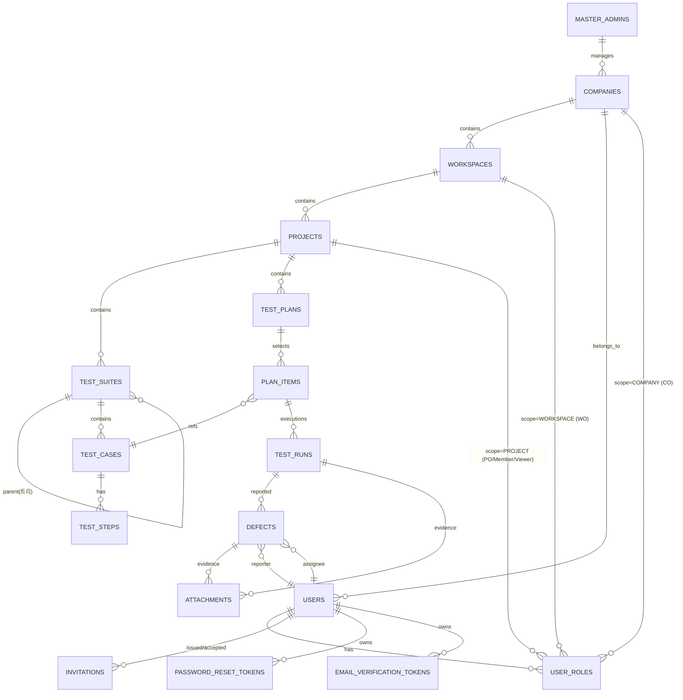

# TMS 시스템 요구사항 명세서 (SRS, Mini)

| 항목 | 내용 |
| --- | --- |
| 문서명 | TMS 시스템 요구사항 명세서 (Mini SRS) |
| 문서 버전 | v0.3 (PM 락 v2.8 반영 — 온프레미스 표현 통일) |
| 최초 작성일 | 2026-06-05 |
| 최종 개정일 | 2026-06-09 |
| 작성 주체 | PM (Project Manager) |
| 문서 등급 | 정본(正本) — 시스템 전역 요구사항(NFR·데이터모델 개요·IA·공통패턴)의 단일 출처 |
| 적용 범위 | Backend / Frontend / DBA / QA 전 영역 |
| 관련 문서 | [`glossary.md`](glossary.md) · [`standards/`](standards/README.md) · [`features/`](features/README.md) · [`permissions.md`](permissions.md) (권한 매트릭스 부록) |

> 본 문서는 풀 IEEE 830 SRS가 아닌 **MVP 한정 미니 SRS**다. 기능 명세(`docs/features/*`)에 반복되는 횡단 관심사(NFR·공통 데이터 모델·IA·공통 UX 패턴)를 한곳에 모아 **명세 중복·드리프트를 막는다.**
> 본 문서와 기능 명세가 충돌하면 **본 문서가 횡단 규칙에 한해 우선**한다. 기능별 규칙은 각 기능 명세가 우선한다.

---

## 1. 시스템 개요

### 1.1 목적
TMS(Test Management System) — **온프레미스 배포** 멀티 Company 멀티테넌트 테스트 관리 도구.
- 엑셀 기반 TC 관리 대체.
- 경량 결함 트래킹 (Jira 대체 최소 깊이).
- **3-tier 조직 격리(Company → Workspace → Project)** 와 **Role 6단(Master/CO/WO/PO/Member/Viewer)** 기반 멀티테넌트 권한 모델.
- **배포 형태**: 고객사 자체 인프라(Docker Compose 단일 호스트). 멀티 Company는 데이터 격리 모델이며 외부 SaaS 서비스가 아니다.

### 1.2 범위
- **MVP (12기능)**: F-COMPANY, F-WS, F-AUTH, F-USER, F-PROJ, F-TS, F-TC, F-PLAN, F-RUN, F-DEF, F-ATTACH, F-REPORT
- **제외(Phase 2)**: F-TC-VER, F-RELEASE, F-SCN, F-TRACE, F-COMMON, F-IMPORT, F-NOTIFY, F-AUDIT, F-SEARCH, F-AUTOMATION, F-DEFECT-LINK, F-BILLING, F-CO-DASHBOARD
- 상세 백로그: [`features/README.md`](features/README.md)

### 1.3 액터 (Role 6단)

| 액터 | Scope | 핵심 권한 |
| --- | --- | --- |
| Master | 시스템 전역 | Company 생성·비활성, 전역 조회, 시드 계정 |
| CO (Company Owner) | Company 1 | 사용자 초대·탈퇴·비번리셋·전체조회, WS 조회·비활성·소유자 이관, **사용자 Role 승격 권한(유일)** |
| WO (Workspace Owner) | Workspace N | WS 생성(무제한), 사용자를 WS에 초대, **본인 소유/멤버 WS 내 Project 생성·정보 수정·비활성** (컨테이너 한정, 내부 자산·멤버 초대는 별도 Role — `permissions.md` §4.3 ★15) |
| PO (Project Owner) | Project N | Project 멤버 초대, Project·TC·TestRun CRUD |
| Member | WS N + Project N | **WS·Project 초대 시 기본 Role** (락 v2.7). WS Scope = 진입·메뉴 가시·하위 Project 자동 가시(★23). Project Scope = TC·TestRun 생성 (Project 생성해도 Member 유지) |
| Viewer | WS N + Project N | read-only. **CO 강등 전용** (초대 기본 Role 아님). 해당 Scope 가시만 |

> Role 부여 모델 = **(User × Scope) 다중 부여**. 1 사용자가 여러 Scope에서 서로 다른 Role 보유 가능. 상세 매트릭스는 [`permissions.md`](permissions.md) 참조.

### 1.4 일정·인력
- **데드라인**: 2026-07-31 데모 시연 (오늘 2026-06-05 기준 ~8주)
- **인력**: BE 1, FE 1
- **추정 일정**: 풀 스코프 11~12주 ⚠️ **1~2주 이월 가능성 명시**. 명세 락 후 구현 일정 재산정.

---

## 2. 시스템 컨텍스트

### 2.1 외부 시스템
| 외부 시스템 | 용도 | 비고 |
| --- | --- | --- |
| SMTP | 이메일 인증·초대 토큰·임시비번·비번리셋 발송 | **필수 도입** (Mailtrap/Mailhog 데모, SendGrid 운영) |

> Jira·Slack·CI 등 그 외 연동은 Phase 2.

### 2.2 의존 인프라
| 구성요소 | 버전·선택 | 비고 |
| --- | --- | --- |
| Backend | Spring Boot 3.x / Java 21 (Corretto) | backend-standard §0 |
| Database | PostgreSQL 17 | 단일 인스턴스 |
| 캐시·세션 | **Redis** | F-AUTH Refresh Token 저장, 초대/리셋 토큰 1회용 키, Rate Limit 카운터 |
| Frontend | React + TypeScript | SPA |
| 첨부 저장소 | 로컬 디스크 (MVP) | S3는 Phase 2 |
| 배포 | Docker Compose 단일 호스트 | dev=demo 단일 환경 |
| SAST | Sparrow | backend §0/§10 |
| 메일 | SMTP(Mailtrap) | 데모용 캡처. 운영은 SendGrid/SES |

### 2.3 클라이언트 환경
| 항목 | 기준 |
| --- | --- |
| 브라우저 | Chrome 최신 1종 (데모 한정) |
| 화면 폭 | 1280px+ 데스크톱 (반응형 미지원) |
| 언어 | 한국어 단일 |

---

## 3. 비기능 요구사항 (NFR)

### 3.1 성능
| 항목 | 목표 |
| --- | --- |
| 동시 사용자 | 데모 최대 20명 (운영 확장 시 재산정) |
| API 응답(p95, 조회) | < 500ms (목록·상세) |
| API 응답(p95, 쓰기) | < 800ms |
| 첨부 업로드 | ≤ 10MB, 응답 < 3s |
| 이메일 발송 | 비동기, 응답에 영향 없음(큐/스레드) |
| 목록 페이지네이션 | 기본 size=20, max=100 |
| DB 인덱싱 | 격리키(`company_id`/`workspace_id`/`project_id`)·검색키·정렬키 필수 (dba-standard) |

### 3.2 보안
| 항목 | 정책 |
| --- | --- |
| 인증 | JWT **Access 30분 / Refresh 30일** (backend §8.2 풀스코프 복귀, 데모 자동 로그인 정책으로 7일 → 30일 연장) |
| 인가 | (User × Scope) 다중 Role 매칭. 요청 컨텍스트에서 현재 `companyId/workspaceId/projectId` 결정 후 권한 매트릭스 조회 ([`permissions.md`](permissions.md)) |
| 비밀번호 저장 | BCrypt 단방향 해시 (backend §8.3) |
| 비밀번호 정책 | 최소 8자, 영문+숫자+특수문자 1종 이상 |
| 전송 | TLS 권장 (사내 망 HTTP 허용, 운영 시 강제) |
| 민감정보 마스킹 | `passwordHash` 응답 직렬화 금지, 토큰 로그 마스킹 (backend §6.4) |
| 격리 (3-tier) | `company_id` → `workspace_id` → `project_id` 컬럼 보유 (각 테이블 범위는 §4.1). 교차 접근 차단(404 은닉) |
| 초대/리셋 토큰 | 1회용, 만료(24h), Redis 키 + 사용 시 즉시 삭제 |
| 이메일 인증 | 회원가입(셀프 경로 B) 시 필수. 미인증 계정 로그인 차단 |
| SAST | Sparrow 게이트 (backend §10) |
| 시크릿 | `.env` 파일 관리. SMTP 인증/JWT 시크릿 KMS는 Phase 2 |
| Rate Limit (로그인) | IP 기준 분당 10회 + 계정 기준 10회. 초과 시 429 |
| Rate Limit (메일 발송) | 동일 계정 5분당 3회 (재전송 남용 방지) |

### 3.3 가용성·백업
| 항목 | 정책 |
| --- | --- |
| 가용성 목표 | 데모 한정, SLA 없음 |
| 배포 토폴로지 | 단일 노드 (HA X) |
| DB 백업 | 데모 기간 일 1회 수동 `pg_dump` |
| 복구 목표 (RTO/RPO) | 비목표 (수동 복구) |
| 데이터 보존 | 데모 종료 시 일괄 삭제 가능 |

### 3.4 UX·접근성
| 항목 | 정책 |
| --- | --- |
| 디자인 시스템 | 기성 컴포넌트 1종 (FE 결정, W1 락) |
| 반응형 | 미지원 (데스크톱 1280+ 단일) |
| 접근성 | WCAG 미준수 (데모 한정) |
| 다국어 | 미지원 (한국어) |
| 다크모드 | 미지원 |
| 컨텍스트 스위처 | 헤더 좌측에 **Company / Workspace / Project 3단 셀렉터** (사용자가 속한 Scope만 표시) |

### 3.5 운영·배포
| 항목 | 정책 |
| --- | --- |
| 환경 | 단일 환경 (dev=demo) |
| 배포 방식 | Docker Compose (DB·Redis·SMTP·BE·FE) |
| 로깅 | 콘솔 + 파일 회전 (외부 수집 X), CorrelationId 포함 (backend §6.3) |
| 모니터링 | 없음 (데모) |
| CI/CD | 기본 빌드·테스트 파이프라인 1종 |
| 비동기 작업 | Spring `@Async` + 단일 스레드 풀 (이메일·집계). 큐 외부 도입은 Phase 2 |

---

## 4. 데이터 모델 개요

상세 스키마·인덱스는 `dba-standard.md`와 각 기능 명세를 따른다. 본 절은 **엔티티 관계 개요**, **공통 컬럼 정책**, **격리키 적용 범위**만 정의한다.

### 4.1 공통 컬럼 정책 + 격리키 적용 범위

| 컬럼 | 타입 | 정책 | 적용 |
| --- | --- | --- | --- |
| `id` | `bigint` | PK, sequence | 전 테이블 |
| `company_id` | `bigint` | NOT NULL, 인덱스 필수 | **Company를 제외한 모든 도메인 테이블** (Company는 본인 PK) |
| `workspace_id` | `bigint` | NOT NULL, 인덱스 필수 | Workspace 자체 + **Workspace 하위 도메인** (Project/Suite/TC/Plan/Run/Defect/Attachment) |
| `project_id` | `bigint` | NOT NULL, 인덱스 필수 | Project 자체 + **Project 하위 도메인** (Suite/TC/Plan/Run/Defect/Attachment) |
| `created_at` | `timestamp` | NOT NULL, JPA Auditing | 전 테이블 |
| `updated_at` | `timestamp` | NOT NULL, JPA Auditing | 전 테이블 |
| `created_by` | `bigint` | nullable, `users.id` 의미 FK | 전 테이블 |
| `updated_by` | `bigint` | nullable, `users.id` 의미 FK | 전 테이블 |
| `is_deleted` | `boolean` | DEFAULT FALSE, **물리삭제 금지/soft delete** (backend §7.3) | 전 도메인 테이블 |

> 전역 테이블 예외: `users`(자체 PK), `companies`(자체 PK), `master_admins`(시스템 시드) 등은 격리키 적용 X. backend §7.5 참조.
> `users.is_active`, `companies.is_active`, `workspaces.is_active`는 비활성화 플래그(별도 의미).
> 격리키 복합 인덱스 권장: `(company_id, workspace_id)`, `(workspace_id, project_id)`, 검색·정렬용 컬럼은 격리키 선두로 복합.

### 4.2 ERD 개요 (Mermaid)



### 4.3 엔티티 요약 (MVP)

| 엔티티 | 설명 | 본 SRS 키 필드(개요) | 격리키 |
| --- | --- | --- | --- |
| `master_admins` | 시스템 전역 관리자 (Master) | email, name, password_hash, is_active | 없음 |
| `companies` | 고객사(테넌트) | name, slug(unique), is_active, owner_user_id(주 CO, 이관 가능) | 본인 PK |
| `users` | 사용자 (Company에 1:N 소속) | company_id, email(`UNIQUE(company_id, email)`), name, password_hash, is_email_verified, is_active | company_id |
| `user_roles` | (User × Scope) Role 다중 부여 | user_id, scope_type(`COMPANY`/`WORKSPACE`/`PROJECT`), scope_id, role(`CO`/`WO`/`PO`/`MEMBER`/`VIEWER`), granted_by_user_id | company_id |
| `workspaces` | 워크스페이스 | name, owner_user_id(주 WO), is_active | company_id |
| `projects` | 프로젝트 | name, description, owner_user_id(주 PO), is_active | company_id, workspace_id |
| `test_suites` | 스위트 트리 | project_id, parent_suite_id, name, sort_order | company_id, workspace_id, project_id |
| `test_cases` | TC | **scope_type(`GLOBAL`/`WORKSPACE`/`PROJECT`)**, suite_id(Project Scope 전용·nullable), code(자동/수동), title, priority, precondition, expected_result | company_id 필수. workspace_id는 WS/PROJECT Scope, project_id는 PROJECT Scope만 NOT NULL |
| `test_steps` | TC 스텝 | test_case_id, step_order, action, expected_result | test_cases와 동일 격리 (상위 TC의 scope 따름) |
| `test_plans` | 테스트 계획 | project_id, name, milestone, status | company_id, workspace_id, project_id |
| `plan_items` | 플랜 ↔ TC | plan_id, test_case_id, assignee_user_id | company_id, workspace_id, project_id |
| `test_runs` | 실행 헤더 | plan_item_id, executed_by_user_id, **started_at**, **completed_at**(nullable), **duration_ms**, **status(`IN_PROGRESS`/`COMPLETED`)**, **result(집계 enum)**, environment | company_id, workspace_id, project_id |
| `test_run_steps` | 실행 단계별 결과 | run_id, test_step_id, result(`PASS`/`FAIL`/`BLOCKED`/`SKIPPED`/`UNTESTED`), actual_result, updated_at, updated_by_user_id | test_runs와 동일 격리 |
| `test_run_step_history` | TC 변경 이력 (Rule 4·5) | run_id, test_step_id, snapshot_action, snapshot_expected_result, changed_at, changed_by_user_id, reason | test_runs와 동일 격리 |
| `defects` | 결함 | test_run_id(nullable), project_id, title, description, status(enum), severity, priority, reporter_user_id, assignee_user_id | company_id, workspace_id, project_id |
| `attachments` | 첨부 | owner_type(`TEST_RUN`/`DEFECT`), owner_id, file_name, mime_type, size, storage_path | company_id, workspace_id, project_id |
| `invitations` | 초대 토큰 (CO/WO/PO 발급) | token(hash), email, scope_type, scope_id, role, expires_at, accepted_at | company_id |
| `password_reset_tokens` | 비번 리셋 토큰 | user_id, token(hash), expires_at, used_at | company_id |
| `email_verification_tokens` | 이메일 인증 토큰 (셀프 가입) | user_id, token(hash), expires_at, used_at | company_id |
| `refresh_tokens` | Refresh Token (Redis 권장, RDB 백업 선택) | user_id, token(hash), expires_at, revoked_at | company_id |

> `user_roles` 인덱스: `(user_id, scope_type, scope_id)`, `(scope_type, scope_id, role)`. 권한 매칭 핵심 경로.
> Enum 축약 (MVP):
> - `ExecutionResult` (glossary §3.1) 6종 중 MVP는 **5종**(`PASS/FAIL/BLOCKED/SKIPPED/UNTESTED`) — `UNTESTED`는 단계 미입력 초기 상태 + TestCase 변경 시 자동 재설정 상태. (`Retest` Phase 2)
> - **TestRun 자체 상태(집계) enum 신규**: `IN_PROGRESS`(모든 step 결과 미완) / `COMPLETED`(모든 step 결과 입력 완료, 자동 종료 시 `completed_at` 기록 — F-RUN 정본)
> - `DefectStatus` (glossary §4.3) 8종 중 MVP는 4종(`OPEN/IN_PROGRESS/RESOLVED/CLOSED`)
> - 위 축약은 각 기능 명세 §11 오픈이슈에 명시

### 4.4 격리 매칭 규칙

요청 처리 시 격리 검증 순서:

1. JWT 인증 → `userId` 확정
2. 요청 컨텍스트의 `companyId/workspaceId/projectId` 추출 (Path·헤더·세션)
3. `users.company_id == 요청 companyId` 검증 (불일치 시 404 은닉)
4. `user_roles` 조회로 해당 Scope의 Role 결정 (없으면 403)
5. 권한 매트릭스([`permissions.md`](permissions.md))로 액션 허용 여부 판정
6. 도메인 데이터는 격리키 자동 필터링(backend §7.5)

---

## 5. 정보 아키텍처 (IA)

### 5.0 디자인 정본 (Figma)
- **마스터 파일**: https://www.figma.com/design/5G8kNWGjSSPaG3OepCfU55/TMS?node-id=0-1&p=f&m=dev
- 각 기능 명세 §1 메타 표의 **Figma** 행에 frame node-id로 깊은 링크 추가(작업 진행 시).
- 디자인과 명세가 충돌 시 **명세가 권한·격리·에러·AC에 한해 우선**, **Figma는 시각·인터랙션·레이아웃에 한해 우선**.

### 5.1 사이트맵

```
공개(미인증)
├─ /login                          (F-AUTH 로그인)
├─ /signup                         (F-AUTH 셀프 가입: 회사명·이메일·비번)
├─ /verify-email?token=...         (F-AUTH 이메일 인증)
├─ /accept-invite?token=...        (F-AUTH 초대 수락: 비번 설정)
├─ /forgot-password                (F-AUTH 비번 리셋 요청)
└─ /reset-password?token=...       (F-AUTH 새 비번 설정)

Master 전용
└─ /master
   ├─ /companies                   (F-COMPANY 목록·생성·비활성)
   └─ /companies/:companyId        (F-COMPANY 상세)

인증 후 (Company 컨텍스트)
├─ /                               (대시보드 — Workspace 리스트)
├─ /workspaces                     (F-WS 목록·생성[WO])
│  └─ /workspaces/:workspaceId
│     ├─ /projects                 (F-PROJ 목록·생성[PO])
│     │  └─ /projects/:projectId
│     │     ├─ /suites             (F-TS 트리)
│     │     ├─ /test-cases         (F-TC 목록)
│     │     │  └─ /test-cases/:id  (F-TC 상세·편집)
│     │     ├─ /plans              (F-PLAN 목록)
│     │     │  └─ /plans/:planId   (F-PLAN 상세)
│     │     │     └─ /runs/:runId  (F-RUN 실행)
│     │     ├─ /defects            (F-DEF 목록·등록)
│     │     │  └─ /defects/:id     (F-DEF 상세)
│     │     ├─ /report             (F-REPORT)
│     │     └─ /members            (F-USER Project 멤버·Role 부여[PO])
│     └─ /members                  (F-USER Workspace 멤버 초대[WO])
├─ /company
│  ├─ /users                       (F-USER Company 사용자 목록 [CO])
│  │  └─ /users/:userId            (F-USER 사용자 상세 + Scope×Role 매트릭스 부여[CO])
│  └─ /settings                    (F-COMPANY 회사 정보, 소유자 이관[CO])
└─ /me                             (F-USER 본인 프로필·비번 변경)
```

### 5.2 화면 ↔ 기능 매핑

| 화면 | 주요 기능 | 접근 Role |
| --- | --- | --- |
| /login, /signup, /verify-email, /accept-invite, /forgot-password, /reset-password | F-AUTH | 미인증 |
| /master/companies | F-COMPANY | Master |
| / (대시보드) | F-WS(요약) + F-REPORT(요약) | 인증 모든 Role |
| /workspaces | F-WS | CO(목록·비활성), WO(생성) |
| /workspaces/:id/members | F-USER (WS 멤버 초대) | WO |
| /workspaces/:id/projects | F-PROJ | WO·PO(생성), 그 외(목록) |
| /projects/:id/suites | F-TS | PO/Member(편집), Viewer(read) |
| /projects/:id/test-cases | F-TC | PO/Member(편집), Viewer(read) |
| /projects/:id/plans | F-PLAN | PO(생성·할당), Member(생성), Viewer(read) |
| /projects/:id/runs/:runId | F-RUN, F-ATTACH | PO/Member(기록), Viewer(read) |
| /projects/:id/defects | F-DEF, F-ATTACH | PO/Member(등록·수정), Viewer(read) |
| /projects/:id/report | F-REPORT | 인증 모든 Role |
| /projects/:id/members | F-USER (Project 멤버 Role) | PO |
| /company/users | F-USER (Company 사용자 + Scope×Role 매트릭스) | CO |
| /company/settings | F-COMPANY (소유자 이관, 회사 정보) | CO |
| /me | F-USER (본인 프로필·비번) | 인증된 모든 Role |

### 5.3 네비게이션
- **전역 헤더**: 좌측 **Company / Workspace / Project 3단 셀렉터** (사용자가 멤버인 Scope만 노출). 우측 알림·사용자 메뉴(프로필/로그아웃, CO는 /company/users 진입, Master는 /master 진입)
- **좌측 사이드바(프로젝트 컨텍스트)**: Suites / TestCases / Plans / Defects / Report / Members
- **브레드크럼**: Company > Workspace > Project > 영역 > 상세
- **컨텍스트 강제 전환**: URL 직접 진입 시 헤더 셀렉터 자동 동기화

---

## 6. 공통 패턴 (Cross-cutting Patterns)

### 6.1 API 공통
| 항목 | 규칙 |
| --- | --- |
| HTTP 메서드 | **GET / POST 전용** (backend §4.2) |
| URI 명명 | kebab-case 복수형, `/api/v1/{resource}` (backend §1.8) |
| Scope 표현 | Path에 Scope 포함 권장: `/api/v1/workspaces/{wsId}/projects/{projId}/test-cases` |
| 응답 래퍼 | `success/code/message/data` (backend §4.5) |
| 에러 코드 | `{DOMAIN}_{상황}` UPPER_SNAKE_CASE (backend §5.2) |
| 페이지네이션 | `?page=0&size=20&sort=field,asc\|desc` (size max 100) |
| 검색 | `?q=keyword` (부분일치, 대상 필드는 기능별 명시) |
| 필터 | `?status=X&role=Y` (필드명=값, 다중은 콤마) |
| 날짜 | ISO 8601 + `Asia/Seoul` |

### 6.2 인증·인가 헤더
| 항목 | 규칙 |
| --- | --- |
| Authorization | `Bearer <AccessToken>` |
| 토큰 컨텍스트 | JWT 클레임에 `userId`, `companyId`, 그리고 컨텍스트 캐시(다중 Scope Role) 미포함. 서버가 매 요청 `user_roles` 조회 |
| 컨텍스트 전환 | 클라이언트가 명시적 Path/Query로 전달(`workspaceId`·`projectId`). 토큰 변경 없음 |
| Refresh | `POST /api/v1/auth/refresh` (Refresh Token) |

### 6.3 UI 공통
| 패턴 | 정책 |
| --- | --- |
| 에러 표시 | (1) 토스트(단순 메시지) (2) 인라인 필드 에러(검증 실패) |
| 로딩 | 영역별 스피너(전역 차단형 X) |
| 빈 상태 | 안내 텍스트 + 1차 CTA |
| 확인 다이얼로그 | 삭제·비활성화·리셋·실행 종료·소유자 이관 시 필수 |
| 폼 검증 | 클라이언트 즉시 검증 + 서버 검증 결과 인라인 매핑 |
| 날짜 표시 | `YYYY-MM-DD HH:mm` (Asia/Seoul) |
| 텍스트 길이 | 긴 텍스트는 말줄임 + 상세에서 전체 |
| 권한 미보유 화면 | 메뉴 자체 숨김 + URL 직접 진입 시 403 토스트 + 안전한 상위로 리다이렉트 |
| 초대 흐름 | 초대 발송 → "초대 메일 발송됨" 토스트. 초대 목록에서 재발송·취소 가능 |

#### 6.3.1 UI 표현 패턴 (Presentation Pattern, MVP 정본)

| 액션 | 표현 방식 | 적용 기능(예) |
| --- | --- | --- |
| 일반 CRUD (생성·상세·수정) | **모달 팝업** | F-COMPANY/WS/PROJ/PLAN/TC/DEF 등 |
| 테스트 실행 화면의 TC 상세·수정 | **사이드바(Drawer, 우측 슬라이드인)** | F-RUN |
| 회원가입 / 비밀번호 찾기·재설정 / 초대 수락 / 이메일 인증 | **새 화면(전체 페이지 라우팅)** | F-AUTH (`/signup`·`/forgot-password`·`/reset-password`·`/accept-invite`·`/verify-email`) |
| 회원관리(CO) — 회원 상세·수정·권한 매트릭스 | **사이드바(Drawer)** | F-USER (`_ux-role-matrix.md` 매트릭스 탭은 사이드바 내부에서 탭 전환) |
| 알림(알람) 내역 조회 | **사이드바(Drawer)** | (Phase 2 F-NOTIFY 도입 전 데모는 placeholder 사이드바) |

추가 룰:
- 모달 닫기 시 **변경 손실 경고** (편집 모드인 경우)
- 사이드바 폭 480~640px. 본문 dimming 없음(컨텍스트 유지)
- 모달·사이드바 **동시 열림 금지** (새 모달 열리면 기존 닫힘)
- 키보드 접근성: `Esc` 닫기, 포커스 트랩
- URL 직접 진입 호환: 모달 `?modal=...`, 사이드바 `?drawer=...&id=...` (새로고침 시 복원)
- 본 규칙과 충돌하는 기능 명세는 본 SRS 규칙이 우선. 충돌 발견 시 명세 갱신.

### 6.4 이메일 발송 패턴
| 항목 | 정책 |
| --- | --- |
| 발송 방식 | Spring `@Async` 비동기. 응답에 영향 없음 |
| 템플릿 | 단순 HTML 텍스트. 로고·이미지 없음(MVP) |
| 발신 주소 | `no-reply@<domain>` (데모 더미) |
| 재전송 | 사용자 액션 기반 (자동 재시도 X). Rate Limit 적용 |
| 데모 캡처 | Mailtrap/Mailhog로 캡처해 시연 |

### 6.5 검증·에러 매핑
- 입력 검증: 클라이언트(즉시) + 서버(권위) **이중**
- 서버 검증 실패 → 400 `COMMON_INVALID_INPUT` + 필드 오류 배열 → 클라이언트가 필드별 인라인 표시
- 도메인 규칙 위반(상태 전이·중복·잠금 방지 등) → 4xx + 기능별 `{DOMAIN}_*` 코드
- 권한 거부 → 403 `AUTH_FORBIDDEN` 또는 도메인 특화 코드(`USER_LAST_OWNER_FORBIDDEN` 등)

---

## 7. 추적성 (Traceability)

### 7.1 ID 명명
| 종류 | 형식 | 예 |
| --- | --- | --- |
| Requirement ID | `REQ-{DOMAIN}-NNN` | `REQ-USER-001` |
| Feature ID | `F-{DOMAIN}` | `F-USER` |
| Error Code | `{DOMAIN}_{상황}` | `USER_INVITE_TOKEN_EXPIRED` |
| Test Case ID | (QA 정의, test-standard) | — |

DOMAIN 표준값(MVP): `MASTER`, `COMPANY`, `WS`, `AUTH`, `USER`, `PROJ`, `TS`, `TC`, `PLAN`, `RUN`, `DEF`, `ATTACH`, `REPORT`. 공통은 `COMMON`.

### 7.2 추적 매트릭스
- 각 기능 명세 §10 "추적성" 표가 `REQ-*` ↔ 화면/API ↔ TestCase 1차 매핑
- QA가 `test-standard`에 따라 AC를 TestCase로 전환하며 ID를 채움
- 결함은 발견 시 TestRun을 통해 TestCase로 거꾸로 연결 (`Defects → TestRuns → PlanItems → TestCases`)

---

## 8. 가정·제약·리스크

### 8.1 가정
- 회원가입 경로 2종(Master 등록 / CO 셀프) 동시 운영. CO 셀프 가입 시 신규 Company 자동 생성, 본인이 첫 CO
- 1 Company - N CO 가능. 기존 CO가 다른 사용자 CO 승격 가능
- 1 사용자 - N Workspace 멤버 가능. WS·Project마다 서로 다른 Role 보유 가능
- Member가 Project 생성해도 Member 유지 (PO 자동 승격 X)
- SMTP 발송 인프라 가용 (데모: Mailtrap/Mailhog)

### 8.2 제약
- 8주 일정 + 인력 2명 → 풀스코프 추정 **11~12주**. 1~2주 이월 가능성
- 상용 디자인 시스템 사용 (자체 디자인 X). W1 1종 락
- 데모용 SMTP는 캡처 도구 사용. 운영 SMTP는 Phase 2

### 8.3 리스크
| 리스크 | 영향 | 대응 |
| --- | --- | --- |
| 인프라 셋업 지연(DB/Redis/SMTP) | 일정 전체 지연 | Docker Compose 템플릿 W1 내 락 |
| FE 컴포넌트 라이브러리 결정 지연 | UI 일관성·속도 저하 | W1 내 1종 확정 |
| 권한 매트릭스 누락·오류 | 전 기능에 보안/회귀 위험 | [`permissions.md`](permissions.md) 락 후 변경 시 매트릭스 우선 갱신 |
| 셀프 가입 시 회사명 충돌 | UX 혼란/스팸 가입 | `companies.slug` UNIQUE + 이메일 인증 게이트 |
| 토큰 보안(초대·리셋) 누수 | 계정 탈취 | 1회용·만료·해시 저장·Redis 즉시 폐기 |
| 일정 이월 | 데모 시점 위험 | 명세 락 후 구현 일정 재산정, 컷 후보 사전 합의 |

### 8.4 컷 후보 (일정 압박 시)
- F-REPORT를 정적 차트 2종으로 컷
- F-ATTACH를 1파일 1KB 제한 + 이미지만으로 컷
- F-DEF 상태 4종 유지(이미 컷)
- TC import/export 미도입 유지
- 권한 매트릭스 UI는 CO 단일 화면 1개로 컷(다중 화면 X)

---

## 9. 변경 이력

| 버전 | 일자 | 변경 내용 | 작성자 |
| --- | --- | --- | --- |
| v0.1 | 2026-06-05 | 최초 초안. 단일 조직/Admin·Tester 2단/Workspace Phase 2 | PM 에이전트 |
| v0.2 | 2026-06-05 | **PM 락 v2 반영**. ① 3-tier 격리(Company→WS→Project) 도입 ② Role 6단(Master/CO/WO/PO/Member/Viewer)·(User×Scope) 다중 부여 모델 ③ 회원가입 2경로(Master 등록 / CO 셀프) + SMTP 인증 인프라 ④ 인증 풀스코프(JWT Access/Refresh + Redis + 초대·리셋·이메일 인증 토큰) ⑤ 공통 컬럼·격리키 (`company_id`/`workspace_id`/`project_id`) ⑥ ERD 확장(users/user_roles/companies/workspaces/invitations/*_tokens 추가) ⑦ IA 갱신(컨텍스트 스위처·Master/공개 화면) ⑧ DOMAIN 표준값에 `MASTER`/`COMPANY`/`WS` 추가 ⑨ 일정 추정 11~12주, 1~2주 이월 가능성 명시 ⑩ MVP 12기능으로 갱신 | PM 에이전트 |
